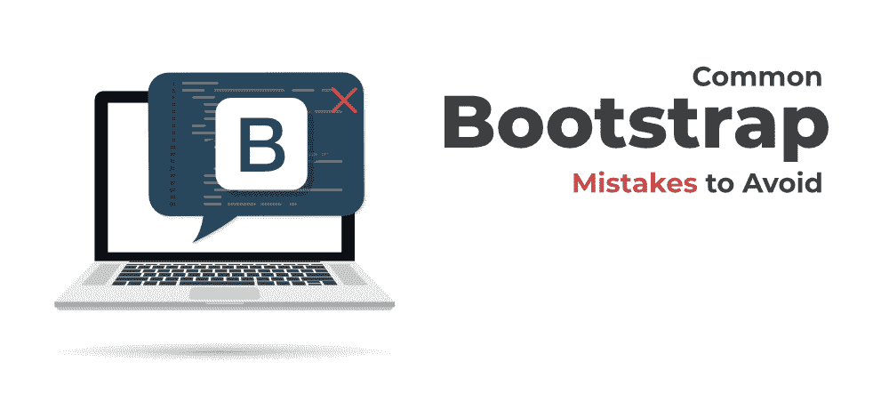

# 网页开发中最常避免的 6 个引导错误

> 原文:[https://www . geeksforgeeks . org/6-最常见-引导-网络开发中要避免的错误/](https://www.geeksforgeeks.org/6-most-common-bootstrap-mistakes-to-avoid-in-web-development/)

> 。BG-初级
> 。BG-危险
> 面包屑
> 警报-成功
> 下拉菜单
> 数据-toggle=“崩溃”
> col-md-4

***以上这些词你不都很熟悉吗？？**T3】*

***如果是。那么你肯定在你的应用程序中使用了*** [***自举***](https://www.geeksforgeeks.org/bootstrap-tutorials/) ***(或者你可能已经使用了)，这篇文章值得一读(让我们继续……)***

如果我们问.. ***。如何开始应用程序的前端部分，你的答案是什么？？**T3】*

先学习[HTML](https://www.geeksforgeeks.org/html-tutorials/)[CSS](https://www.geeksforgeeks.org/css-tutorials/)。(每个 web 或前端开发人员向新手开发人员建议的最常见答案…)



你学会了它，你理解了所有的概念，你很兴奋地创建了你的第一个网站，你开始在一些网页上工作，你在你的页面上添加了图像、按钮、教科书、表格和许多其他东西。您可以在页面上设置高度、宽度、边距、填充、对齐和其他各种内容。简而言之……你付出了努力，花了很多时间，最后，你在浏览器中运行了你的第一个网页。

***你看到了什么？？**T3】*

有吸引力吗？….它有反应吗？

您是否面临图像、布局、按钮、对齐或网页中任何其他元素的问题？

当然…你正面临很多问题，你的网页在所有屏幕尺寸上看起来都不太好。

很多新手开发人员都面临这个问题，他们会感到失望，但是如果你是一个充满激情的开发人员，那么你很快就会发现解决方案，你会转向 [Bootstrap](https://www.geeksforgeeks.org/bootstrap-tutorials/) 。(*你知道最新版本的 bootstrap 吗？….在谷歌上搜索。于 2020 年 12 月 7 日* *发布。*

Bootstrap 是最流行的前端框架之一，它解决了这类问题。

作为一名 web 开发人员，您可能在网页上使用了很多引导元素。排版、表单、按钮、表格、导航、模式、图像转盘、折叠、工具提示、网格以及您可能在网页中使用的许多元素。Bootstrap 不仅让你的工作更容易，而且有助于用更少的时间做更多的事情。

对于大多数开发人员来说，bootstrap 很容易使用，在构建应用程序时利用这个框架并不难。引导文档给人留下了深刻的印象。借助于大量的 HTML、CSS 和 JavaScript 代码片段，您可以很容易地从那里学习这个框架。

在文档中，您可以找到许多解决各种前端相关问题的方法。引导功能允许您更快地构建应用程序。由于简单和易于适应的特性，开发人员涌入这个框架，并在使用这个框架时犯了非常肤浅和模糊的错误。

让我们来看看开发人员在使用这个框架时应该避免的一些常见错误。

### 1.忽略这个框架的基础

这是开发人员在使用这个框架时犯的最大错误之一。他们没有仔细阅读文档，并且自己也没有什么概念。这导致在他们的应用程序中产生错误。开发人员发现应用程序没有给出预期的结果，他们开始责怪框架。

记住，自举既不庞大也不庞大。它附带了许多现成的 HTML 和 CSS 模板。这些模板提供了简单构建应用程序的基本用户界面部分。分页、标签、徽章、提醒、折叠、进度条和许多内置组件都可用。根据需求，您可以选择它们，并根据它们的默认配置使用它们。

Bootstrap 帮助您为应用程序构建一个有吸引力的用户界面。它可以以一种很好的格式处理多种浏览器、设备和分辨率。您可以专注于开发和改进部分，而不用担心应用程序的结构。

Bootstrap 现在已经足够可扩展了(最初没有，而且有局限性)。您可以根据需要定制。我们建议您先了解这个框架的基本原理，并在使用这个框架实现任何东西之前仔细阅读文档。

### 2.利用 Bootstrap 提供的一切

Bootstrap 提供了许多功能。它提供了许多用户界面组件、用 HTML 和 CSS 创建的设计模板。很多 JavaScript 插件也可以在引导中使用。作为一名开发人员，你会惊讶地看到所有的功能，你可能也想利用所有的功能，但朋友们阻止自己，并在这里有选择性。

不要用 bootstrap 提供的每一个特性把事情复杂化。不要利用 bootstrap 提供的每个组件。这对插件尤其有效。只挑选那些你在申请中真正需要的。仅仅因为好看又酷就挑很多组件只会让你的网站夸张。

您可以遵循一个简单的方法，其中开头完全排除 bootstrap.js 文件。只使用 HTML 和 CSS 创建用户界面。然后为特定的工作或任务逐个添加段。

### 3.不需要学习 CSS，也不需要设计师的头脑

这是开发人员对这个框架的另一个误解。Bootstrap 提供了易用的类和组件，帮助开发人员在他们的用户界面中使用它。这就是大多数开发人员认为他们不需要学习 CSS 的原因。

您在 bootstrap 中处理复杂的 CSS，节省了大量时间。您不使用 CSS，而是利用内置组件，而不用担心组件或类中实际发生了什么。此外，您不需要了解媒体查询，但请记住，您需要了解响应设计在应用程序中是如何工作的。

要做到最好，你还需要设计师的头脑……***为什么？**T3】*

很多人抱怨说，所有建立在 Bootstrap 上的网站看起来都很相似，很容易出现一个与其他 Bootstrap 网站没有太大区别的网站。

对于你的网站的变化，你需要得到一个设计师的帮助，他可以帮助你，或者你可以根据自己对 HTML 和 CSS 以及这个框架的理解来构建它。

### 4.更改引导 CSS 文件

您正在处理一个应用程序，并且想要更改网页上某个元素的样式。您可以在 Chrome 开发工具中查看它，您会看到样式是从引导 CSS 文件继承而来的。您打开引导 CSS 文件，并在该文件的一个类中做了一些更改。您进行了更改，但是您是否注意到，无论在哪里使用特定的样式，这些更改都会反映在所有页面中。

犯这个错误会在你的代码中造成很多混乱。覆盖您的引导 CSS 文件可能会破坏应用程序的整个设计。你不会让事情变得更好，反而会让事情变得复杂。稍后，要么您必须手动修复这些问题，要么您必须从头开始构建应用程序。在这两种情况下，你只会浪费你宝贵的时间。

如果你想覆盖默认的引导样式，那么在你自己的 CSS 文件中进行。不要对原始引导 CSS 文件进行任何更改。在前一点中，我们已经提到了解 CSS 是强制性的，在这种情况下这是适用的。您应该了解 CSS，以便在自己的 CSS 文档中覆盖默认的引导样式。

创建您自己的 CSS 选择器或类，在您的 HTML 标签中使用它，只要您在引导样式之后提到您的 CSS 类，您自己的样式定义将覆盖引导默认样式。

### 5.用 JavaScript 过度复杂

当一个新手开发者投身于网络开发时，他们使用 HTML、CSS 和 Bootstrap 为应用程序创建网页。在最初的编码之旅中，开发人员没有经验。他们很容易落入误用 JavaScript 的陷阱。JavaScript 的误用会在你的应用程序中造成混乱，你会让你的应用程序变得更加复杂。

引导模块可以通过标记应用编程接口使用。您不需要用 JavaScript 编写一行代码。在应用程序中使用模块时，这应该是您的首要考虑。

让我们以应用程序中的模态对话框为例。要触发模态对话框，请在按钮或锚点等控制器组件上设置**数据-切换=“模态”**，然后使用**数据-** 属性传递额外的参数。

> <button type="”button”" data-toggle="”modal”" data-target="”#myModal”" data-backdrop="”static”" data-keyboard="”false”">打开我的模态</button>

*   ID #myModal 用于定位 HTML 代码。
*   data-background = " static "指定当用户在模式外单击时，模式不会关闭
*   data-keyboard="false "禁用关闭模式的转义键事件。

### 6.IE8 和旧版本浏览器的不兼容性问题

引导程序在最新的浏览器和桌面中正常运行。旧程序和浏览器的有用性可以很好地工作，但是它们不能产生合法的风格。在这些浏览器中，您会发现组件和元素的不同样式。Internet Explorer 8 和 9 不支持 HTML5 和 CSS3 的某些属性。

在 HTML 头部的元标签中，你必须正确描述 IE 没有在兼容模式下运行。这看起来像下面这样。

```
<head>
 ...
 <meta http-equiv="X-UA-Compatible" content="IE=edge">
 <!--[if lt IE 9]>
   <script src="https://oss.maxcdn.com/html5shiv/3.7.2/html5shiv.min.js"></script>
   <script src="https://oss.maxcdn.com/respond/1.4.2/respond.min.js"></script>
 <![endif]-->
</head>
```

### 最终想法

我们已经提到了 6 个基本错误，但是开发人员在使用 Bootstrap 时还会犯更多的错误。由于截止日期或其他一些原因，他们忽略了使用最佳实践，他们也忽略了使用一些使开发更容易的可用工具(其中之一是 [Bootlint](https://github.com/twbs/bootlint) )，他们还误用了模态提示。

这些错误不限于此。作为一名开发人员，请确保避免这些常见错误，并消除对该框架的误解。Bootstrap 并不适合所有项目。根据问题或要求选择此框架。我们强烈建议您在开始使用任何框架之前仔细阅读文档。如果你的概念清晰，并且花了一些时间阅读文档，你会在工作中做得更好。