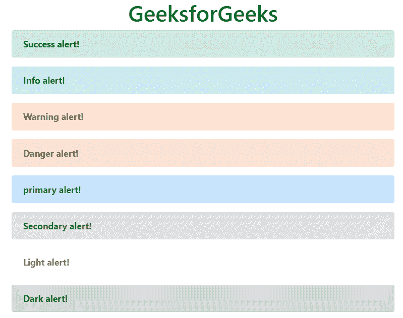
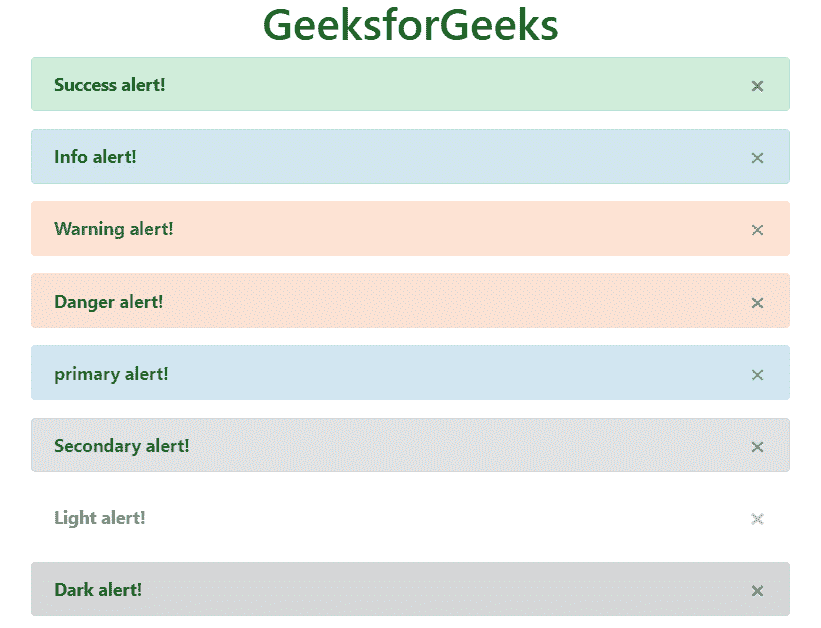

# 引导 4 |警报

> 原文:[https://www.geeksforgeeks.org/bootstrap-4-alerts/](https://www.geeksforgeeks.org/bootstrap-4-alerts/)

我们经常在一些网站上看到在完成一个动作之前或之后的某些提醒。这些警报消息是突出显示的文本，在执行流程时需要考虑这些文本。Bootstrap 允许使用预定义的类在网站上显示这些警报消息。
*。警报*类后跟上下文类用于在网站上显示警报消息。预警类别为:*。警戒-成功*、*。警报信息*、*。警报-警告*、*。警戒-危险*，*。警报-主要*、*。警报-二级*、*。警示灯*和。警惕-黑暗。
**语法:**

```html
<div class="alert> Contents... <div>
```

**例:**

## 超文本标记语言

```html
<!DOCTYPE html>
<html lang="en">
<head>
    <title>Bootstrap Alerts</title>

    <meta charset="utf-8">
    <meta name="viewport" content="width=device-width, initial-scale=1">

    <link rel="stylesheet" href=
"https://maxcdn.bootstrapcdn.com/bootstrap/4.3.1/css/bootstrap.min.css">

    <script src=
"https://ajax.googleapis.com/ajax/libs/jquery/3.3.1/jquery.min.js">
    </script>

    <script src=
"https://cdnjs.cloudflare.com/ajax/libs/popper.js/1.14.7/umd/popper.min.js">
    </script>

    <script src=
"https://maxcdn.bootstrapcdn.com/bootstrap/4.3.1/js/bootstrap.min.js">
    </script>
</head>

<body>
    <h1 style="color:green;text-align:center;">
        GeeksforGeeks
    </h1>

    <div class="container">       
        <div class="alert alert-success">
            <strong>Success alert!</strong>
        </div>

        <div class="alert alert-info">
            <strong>Info alert!</strong>
        </div>

        <div class="alert alert-warning">
            <strong>Warning alert!</strong>
        </div>

        <div class="alert alert-danger">
            <strong>Danger alert!</strong>
        </div>

        <div class="alert alert-primary">
            <strong>primary alert!</strong>
        </div>

        <div class="alert alert-secondary">
            <strong>Secondary alert!</strong>
        </div>

        <div class="alert alert-light">
            <strong>Light alert!</strong>
        </div>

        <div class="alert alert-dark">
            <strong>Dark alert!</strong>
        </div>
    </div>
</body>

</html>                       
```

**输出:**



**关闭警报:***。*中使用了可解除警戒的*等级。容器*类关闭报警消息。然后使用 **class="close"** 和**data-discover = " alert "**链接一个按钮元素。
**语法:**

```html
<div class="alert alert_type alert-dismissible">
    <button type="button" class="close" data-dismiss="alert">x</button>
    Alert message
<div>
```

**例:**

## 超文本标记语言

```html
<!DOCTYPE html>
<html lang="en">
<head>
    <title>Bootstrap Alerts</title>

    <meta charset="utf-8">
    <meta name="viewport" content="width=device-width, initial-scale=1">

    <link rel="stylesheet" href=
"https://maxcdn.bootstrapcdn.com/bootstrap/4.3.1/css/bootstrap.min.css">

    <script src=
"https://ajax.googleapis.com/ajax/libs/jquery/3.3.1/jquery.min.js">
    </script>

    <script src=
"https://cdnjs.cloudflare.com/ajax/libs/popper.js/1.14.7/umd/popper.min.js">
    </script>

    <script src=
"https://maxcdn.bootstrapcdn.com/bootstrap/4.3.1/js/bootstrap.min.js">
    </script>
</head>

<body>
    <h1 style="color:green;text-align:center;">
        GeeksforGeeks
    </h1>

    <div class="container">       
        <div class="alert alert-success alert-dismissible">
            <strong>Success alert!</strong>
            <button type="button" class="close" data-dismiss="alert">
                  ×
            </button>
        </div>

        <div class="alert alert-info alert-dismissible">
            <strong>Info alert!</strong>
            <button type="button" class="close" data-dismiss="alert">
                  ×
            </button>
        </div>

        <div class="alert alert-warning alert-dismissible">
            <strong>Warning alert!</strong>
            <button type="button" class="close" data-dismiss="alert">
                  ×
            </button>
        </div>

        <div class="alert alert-danger alert-dismissible">
            <strong>Danger alert!</strong>
            <button type="button" class="close" data-dismiss="alert">
                  ×
            </button>
        </div>

        <div class="alert alert-primary alert-dismissible">
            <strong>primary alert!</strong>
            <button type="button" class="close" data-dismiss="alert">
                  ×
            </button>
        </div>

        <div class="alert alert-secondary alert-dismissible">
            <strong>Secondary alert!</strong>
            <button type="button" class="close" data-dismiss="alert">
                  ×
            </button>
        </div>

        <div class="alert alert-light alert-dismissible">
            <strong>Light alert!</strong>
            <button type="button" class="close" data-dismiss="alert">
                  ×
            </button>
        </div>

        <div class="alert alert-dark alert-dismissible">
            <strong>Dark alert!</strong>
            <button type="button" class="close" data-dismiss="alert">
                  ×
            </button>
        </div>
    </div>
</body>

</html>                   
```

**输出:**



**动画提醒:***。淡化*和*。show* 类用于在关闭提醒消息时添加动画的淡入淡出效果。
**语法:**

```html
<div class="alert alert_type alert-dismissible fade show">
    <button type="button" class="close" data-dismiss="alert">x</button>
    Alert message
<div>
```

**例:**

## 超文本标记语言

```html
<!DOCTYPE html>
<html lang="en">
<head>
    <title>Bootstrap Alerts</title>

    <meta charset="utf-8">
    <meta name="viewport" content="width=device-width, initial-scale=1">

    <link rel="stylesheet" href=
"https://maxcdn.bootstrapcdn.com/bootstrap/4.3.1/css/bootstrap.min.css">

    <script src=
"https://ajax.googleapis.com/ajax/libs/jquery/3.3.1/jquery.min.js">
    </script>

    <script src=
"https://cdnjs.cloudflare.com/ajax/libs/popper.js/1.14.7/umd/popper.min.js">
    </script>

    <script src=
"https://maxcdn.bootstrapcdn.com/bootstrap/4.3.1/js/bootstrap.min.js">
    </script>
</head>

<body>
    <h1 style="color:green;text-align:center;">
        GeeksforGeeks
    </h1>

    <div class="container">       
        <div class="alert alert-success alert-dismissible fade show">
            <strong>Success alert!</strong>
            <button type="button" class="close" data-dismiss="alert">
                  ×
            </button>
        </div>

        <div class="alert alert-info alert-dismissible fade show">
            <strong>Info alert!</strong>
            <button type="button" class="close" data-dismiss="alert">
                  ×
            </button>
        </div>

        <div class="alert alert-warning alert-dismissible fade show">
            <strong>Warning alert!</strong>
            <button type="button" class="close" data-dismiss="alert">
                  ×
            </button>
        </div>

        <div class="alert alert-danger alert-dismissible fade show">
            <strong>Danger alert!</strong>
            <button type="button" class="close" data-dismiss="alert">
                  ×
            </button>
        </div>

        <div class="alert alert-primary alert-dismissible fade show">
            <strong>primary alert!</strong>
            <button type="button" class="close" data-dismiss="alert">
                  ×
            </button>
        </div>

        <div class="alert alert-secondary alert-dismissible fade show">
            <strong>Secondary alert!</strong>
            <button type="button" class="close" data-dismiss="alert">
                  ×
            </button>
        </div>

        <div class="alert alert-light alert-dismissible fade show">
            <strong>Light alert!</strong>
            <button type="button" class="close" data-dismiss="alert">
                  ×
            </button>
        </div>

        <div class="alert alert-dark alert-dismissible fade show">
            <strong>Dark alert!</strong>
            <button type="button" class="close" data-dismiss="alert">
                  ×
            </button>
        </div>
    </div>
</body>

</html>                   
```

**输出:**


**支持的浏览器:**

*   谷歌 Chrome
*   微软公司出品的 web 浏览器
*   火狐浏览器
*   歌剧
*   旅行队