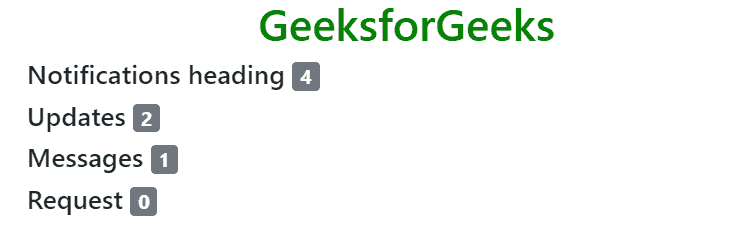
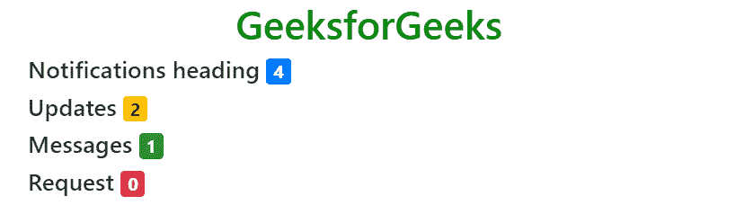
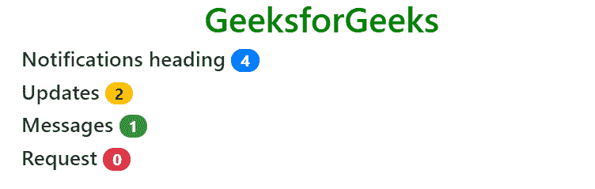
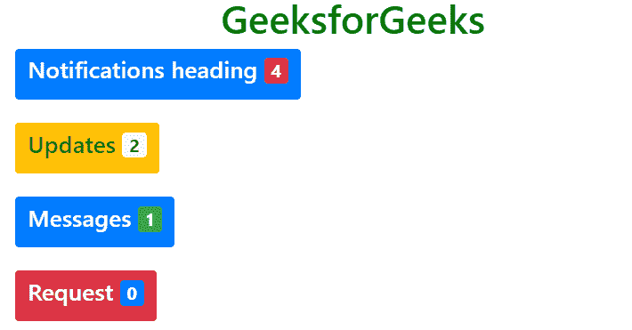

# 自举 4 |徽章

> 原文:[https://www.geeksforgeeks.org/bootstrap-4-badges/](https://www.geeksforgeeks.org/bootstrap-4-badges/)

*。徽章*类用于给内容添加附加信息。例如，一些网站将一些通知与链接相关联。当登录到一个特定的网站时，会看到通知号码，该网站通过单击它来告知要查看的新闻或通知的号码。
**例:**

## 超文本标记语言

```
<!DOCTYPE html>
<html lang="en">
<head>
    <title>Bootstrap Badges</title>

    <meta charset="utf-8">
    <meta name="viewport" content="width=device-width, initial-scale=1">

    <link rel="stylesheet" href=
"https://maxcdn.bootstrapcdn.com/bootstrap/4.3.1/css/bootstrap.min.css">

    <script src=
"https://ajax.googleapis.com/ajax/libs/jquery/3.3.1/jquery.min.js">
    </script>

    <script src=
"https://cdnjs.cloudflare.com/ajax/libs/popper.js/1.14.7/umd/popper.min.js">
    </script>

    <script src=
"https://maxcdn.bootstrapcdn.com/bootstrap/4.3.1/js/bootstrap.min.js">
    </script>
</head>

<body>
    <h1 style="color:green;text-align:center;">
        GeeksforGeeks
    </h1>

    <div class="container">
        <h4>Notifications heading
            <span class="badge badge-secondary">4</span>
        </h4>

        <h4>Updates
            <span class="badge badge-secondary">2</span>
        </h4>

        <h4>Messages
            <span class="badge badge-secondary">1</span>
        </h4>
        <h4>Request
            <span class="badge badge-secondary">0</span>
        </h4>
    </div>
</body>

</html>                   
```

**输出:**



**上下文徽章:**上下文类(*)。徽章-** )用于改变徽章的颜色。徽章可以作为链接或按钮的一部分来提供一个计数器。根据他们的使用方式，徽章一定会让用户感到困惑。为此，使用不同颜色的变体，以便用户不会混淆。
**例:**

## 超文本标记语言

```
<!DOCTYPE html>
<html lang="en">
<head>
    <title>Bootstrap Badges</title>

    <meta charset="utf-8">
    <meta name="viewport" content="width=device-width, initial-scale=1">

    <link rel="stylesheet" href=
"https://maxcdn.bootstrapcdn.com/bootstrap/4.3.1/css/bootstrap.min.css">

    <script src=
"https://ajax.googleapis.com/ajax/libs/jquery/3.3.1/jquery.min.js">
    </script>

    <script src=
"https://cdnjs.cloudflare.com/ajax/libs/popper.js/1.14.7/umd/popper.min.js">
    </script>

    <script src=
"https://maxcdn.bootstrapcdn.com/bootstrap/4.3.1/js/bootstrap.min.js">
    </script>
</head>

<body>
    <h1 style="color:green;text-align:center;">
        GeeksforGeeks
    </h1>

    <div class="container">
        <h4>Notifications heading
            <span class="badge badge-primary">4</span>
        </h4>

        <h4>Updates
            <span class="badge badge-warning">2</span>
        </h4>

        <h4>Messages
            <span class="badge badge-success">1</span>
        </h4>
        <h4>Request
            <span class="badge badge-danger">0</span>
        </h4>
    </div>
</body>

</html>                   
```

**输出:**



**药丸徽章:***。徽章-药丸*类用来让徽章的边角更加圆润。
**例:**

## 超文本标记语言

```
<!DOCTYPE html>
<html lang="en">
<head>
    <title>Bootstrap Badges</title>

    <meta charset="utf-8">
    <meta name="viewport" content="width=device-width, initial-scale=1">

    <link rel="stylesheet" href=
"https://maxcdn.bootstrapcdn.com/bootstrap/4.3.1/css/bootstrap.min.css">

    <script src=
"https://ajax.googleapis.com/ajax/libs/jquery/3.3.1/jquery.min.js">
    </script>

    <script src=
"https://cdnjs.cloudflare.com/ajax/libs/popper.js/1.14.7/umd/popper.min.js">
    </script>

    <script src=
"https://maxcdn.bootstrapcdn.com/bootstrap/4.3.1/js/bootstrap.min.js">
    </script>
</head>

<body>
    <h1 style="color:green;text-align:center;">
        GeeksforGeeks
    </h1>

    <div class="container">
        <h4>Notifications heading
            <span class="badge badge-primary badge-pill">4</span>
        </h4>

        <h4>Updates
            <span class="badge badge-warning badge-pill">2</span>
        </h4>

        <h4>Messages
            <span class="badge badge-success badge-pill">1</span>
        </h4>
        <h4>Request
            <span class="badge badge-danger badge-pill">0</span>
        </h4>
    </div>
</body>

</html>                   
```

**输出:**



**元素内部的徽章:**可以在元素内部创建徽章。
**例:**

## 超文本标记语言

```
<!DOCTYPE html>
<html lang="en">
<head>
    <title>Bootstrap Badges</title>

    <meta charset="utf-8">
    <meta name="viewport" content="width=device-width, initial-scale=1">

    <link rel="stylesheet" href=
"https://maxcdn.bootstrapcdn.com/bootstrap/4.3.1/css/bootstrap.min.css">

    <script src=
"https://ajax.googleapis.com/ajax/libs/jquery/3.3.1/jquery.min.js">
    </script>

    <script src=
"https://cdnjs.cloudflare.com/ajax/libs/popper.js/1.14.7/umd/popper.min.js">
    </script>

    <script src=
"https://maxcdn.bootstrapcdn.com/bootstrap/4.3.1/js/bootstrap.min.js">
    </script>
</head>

<body>
    <h1 style="color:green;text-align:center;">
        GeeksforGeeks
    </h1>

    <div class="container">
        <button type="button" class="btn btn-primary">
            <h4>Notifications heading
                <span class="badge badge-primary badge-danger">4</span>
            </h4>
        </button><br><br>

        <button type="button" class="btn btn-warning">
            <h4>Updates
                <span class="badge badge-light">2</span>
            </h4>
        </button><br><br>

        <button type="button" class="btn btn-primary">
            <h4>Messages
                <span class="badge badge-success">1</span>
            </h4>
        </button><br><br>

        <button type="button" class="btn btn-danger">
            <h4>Request
                <span class="badge badge-primary">0</span>
            </h4>
        </button>
    </div>
</body>

</html>                   
```

**输出:**



**支持的浏览器:**

*   谷歌 Chrome
*   微软公司出品的 web 浏览器
*   火狐浏览器
*   歌剧
*   旅行队