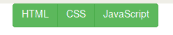
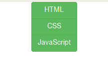
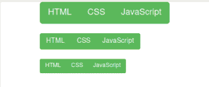
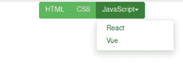
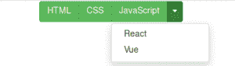
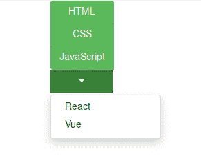

# 引导 4 |按钮组

> 原文:[https://www.geeksforgeeks.org/bootstrap-4-button-groups/](https://www.geeksforgeeks.org/bootstrap-4-button-groups/)

Bootstrap 提供的类允许沿着同一条线，水平或垂直分组按钮。要分组的按钮嵌套在类为*的*

*元素中。btn-group 。
**水平排列按钮组:***。btn-group* 类用于创建水平排列的按钮组。
**例:*** 

## 超文本标记语言

```html
<!DOCTYPE html>
<html lang="en"> 
<head> 
    <title>Bootstrap Button Groups</title> 

    <meta charset="utf-8">
    <meta name="viewport" content="width=device-width, initial-scale=1">

    <link rel="stylesheet" href=
"https://maxcdn.bootstrapcdn.com/bootstrap/4.3.1/css/bootstrap.min.css">

    <script src=
"https://ajax.googleapis.com/ajax/libs/jquery/3.3.1/jquery.min.js">
    </script>

    <script src=
"https://cdnjs.cloudflare.com/ajax/libs/popper.js/1.14.7/umd/popper.min.js">
    </script>

    <script src=
"https://maxcdn.bootstrapcdn.com/bootstrap/4.3.1/js/bootstrap.min.js">
    </script>
</head> 

<body>
    <div class="container">
        <div class="btn-group">
            <button type="button" class="btn btn-success">
                HTML
            </button>

          <button type="button" class="btn btn-success">
              CSS
          </button>

          <button type="button" class="btn btn-success">
              JavaScript
          </button>
        </div>
    </div>
</body>

</html>
```

**输出:**



**垂直排列的按钮组:***。btn-group-vertical* 类在父 div 中用于创建垂直按钮组。
**例:**

## 超文本标记语言

```html
<!DOCTYPE html>
<html lang="en"> 
<head> 
    <title>Bootstrap Button Groups</title> 

    <meta charset="utf-8">
    <meta name="viewport" content="width=device-width, initial-scale=1">

    <link rel="stylesheet" href=
"https://maxcdn.bootstrapcdn.com/bootstrap/4.3.1/css/bootstrap.min.css">

    <script src=
"https://ajax.googleapis.com/ajax/libs/jquery/3.3.1/jquery.min.js">
    </script>

    <script src=
"https://cdnjs.cloudflare.com/ajax/libs/popper.js/1.14.7/umd/popper.min.js">
    </script>

    <script src=
"https://maxcdn.bootstrapcdn.com/bootstrap/4.3.1/js/bootstrap.min.js">
    </script>
</head> 

<body>
    <div class="container">
        <div class="btn-group-vertical">
            <button type="button" class="btn btn-success">
                HTML
            </button>

            <button type="button" class="btn btn-success">
                CSS
            </button>

            <button type="button" class="btn btn-success">
                JavaScript
            </button>
        </div>
    </div>
</body>

</html>
```

**输出:**



**按钮组尺寸:**通过将类别 *btn-group-** (*可以是 sm、md 或 lg)包含在*中，可以给整个按钮组相同的尺寸。btn-group* 父元素，而不是在每个按钮中包含尺寸类。
**例:**

## 超文本标记语言

```html
<!DOCTYPE html>
<html lang="en"> 
<head> 
    <title>Bootstrap Button Groups</title> 

    <meta charset="utf-8">
    <meta name="viewport" content="width=device-width, initial-scale=1">

    <link rel="stylesheet" href=
"https://maxcdn.bootstrapcdn.com/bootstrap/4.3.1/css/bootstrap.min.css">

    <script src=
"https://ajax.googleapis.com/ajax/libs/jquery/3.3.1/jquery.min.js">
    </script>

    <script src=
"https://cdnjs.cloudflare.com/ajax/libs/popper.js/1.14.7/umd/popper.min.js">
    </script>

    <script src=
"https://maxcdn.bootstrapcdn.com/bootstrap/4.3.1/js/bootstrap.min.js">
    </script>
</head> 

<body>
    <div class="container">
        <div class="btn-group btn-group-lg">
            <button type="button" class="btn btn-success">
                HTML
            </button>

            <button type="button" class="btn btn-success">
                CSS
            </button>

            <button type="button" class="btn btn-success">
                JavaScript
            </button>
        </div>

        <br><br>

        <div class="btn-group btn-group-md">
            <button type="button" class="btn btn-success">
                HTML
            </button>

            <button type="button" class="btn btn-success">
                CSS
            </button>

            <button type="button" class="btn btn-success">
                JavaScript
            </button>
        </div>

        <br><br>

        <div class="btn-group btn-group-sm">
            <button type="button" class="btn btn-success">
                HTML
            </button>

            <button type="button" class="btn btn-success">
                CSS
            </button>

            <button type="button" class="btn btn-success">
                JavaScript
            </button>
        </div>
    </div> 
</body>

</html>
```

**输出:**



**嵌套按钮组和制作下拉菜单:**一个按钮组可以嵌套在另一个按钮组中，这样就可以创建下拉菜单。

1.  **单按钮下拉:**
    **示例:**

## 超文本标记语言

```html
<!DOCTYPE html>
<html lang="en"> 
<head> 
    <title>Bootstrap Button Groups</title> 

    <meta charset="utf-8">
    <meta name="viewport" content="width=device-width, initial-scale=1">

    <link rel="stylesheet" href=
"https://maxcdn.bootstrapcdn.com/bootstrap/4.3.1/css/bootstrap.min.css">

    <script src=
"https://ajax.googleapis.com/ajax/libs/jquery/3.3.1/jquery.min.js">
    </script>

    <script src=
"https://cdnjs.cloudflare.com/ajax/libs/popper.js/1.14.7/umd/popper.min.js">
    </script>

    <script src=
"https://maxcdn.bootstrapcdn.com/bootstrap/4.3.1/js/bootstrap.min.js">
    </script>
</head> 

<body>
    <div class="container">
        <div class="btn-group">
            <button type="button" class="btn btn-success">
                HTML
            </button>

            <button type="button" class="btn btn-success btn-group">
                CSS
            </button>

            <div class="btn-group">
                <button type="button"
                    class="btn btn-success dropdown-toggle"
                    data-toggle="dropdown">
                    JavaScript<span class="caret"></span>
                </button>

                <ul class="dropdown-menu" role="menu">
                    <li><a href="#">React</a></li>
                    <li><a href="#">Vue</a></li>
                </ul>
            </div>
        </div>
    </div>
</body>

</html>
```

1.  **输出:**



2.  **拆分按钮下拉:**
    **示例:**

## 超文本标记语言

```html
<!DOCTYPE html>
<html lang="en"> 
<head> 
    <title>Bootstrap Button Groups</title> 

    <meta charset="utf-8">
    <meta name="viewport" content="width=device-width, initial-scale=1">

    <link rel="stylesheet" href=
"https://maxcdn.bootstrapcdn.com/bootstrap/4.3.1/css/bootstrap.min.css">

    <script src=
"https://ajax.googleapis.com/ajax/libs/jquery/3.3.1/jquery.min.js">
    </script>

    <script src=
"https://cdnjs.cloudflare.com/ajax/libs/popper.js/1.14.7/umd/popper.min.js">
    </script>

    <script src=
"https://maxcdn.bootstrapcdn.com/bootstrap/4.3.1/js/bootstrap.min.js">
    </script>
</head> 

<body>
    <div class="container">
        <div class="btn-group">
            <button type="button" class="btn btn-success">
                HTML
            </button>

            <button type="button" class="btn btn-success btn-group">
                CSS
            </button>

            <div class="btn-group">
                <button type="button" class="btn btn-success">
                    JavaScript
                </button>

                <button type="button"
                    class="btn btn-success dropdown-toggle"
                    data-toggle="dropdown">
                    <span class="caret"></span>
                </button>

                <ul class="dropdown-menu" role="menu">
                    <li><a href="#">React</a></li>
                    <li><a href="#">Vue</a></li>
                </ul>
            </div>
        </div>
    </div>
</body>

</html>
```

1.  **输出:**



1.  但是，当按钮嵌套在**下时，拆分按钮下拉菜单不会像预期的那样工作。BTN-组-垂直**类。
    **例:**

## 超文本标记语言

```html
<!DOCTYPE html>
<html lang="en"> 
<head> 
    <title>Bootstrap Button Groups</title> 

    <meta charset="utf-8">
    <meta name="viewport" content="width=device-width, initial-scale=1">

    <link rel="stylesheet" href=
"https://maxcdn.bootstrapcdn.com/bootstrap/4.3.1/css/bootstrap.min.css">

    <script src=
"https://ajax.googleapis.com/ajax/libs/jquery/3.3.1/jquery.min.js">
    </script>

    <script src=
"https://cdnjs.cloudflare.com/ajax/libs/popper.js/1.14.7/umd/popper.min.js">
    </script>

    <script src=
"https://maxcdn.bootstrapcdn.com/bootstrap/4.3.1/js/bootstrap.min.js">
    </script>
</head> 

<body>
    <div class="container">
        <div class="btn-group-vertical">
            <button type="button" class="btn btn-success">
                HTML
            </button>

            <button type="button" class="btn btn-success">
                CSS
            </button>

            <div class="btn-group">
                <button type="button" class="btn btn-success dropdown-toggle"
                        data-toggle="dropdown">
                    JavaScript
                </button>

                <ul class="dropdown-menu" role="menu">
                    <li><a href="#">React</a></li>
                    <li><a href="#">Vue</a></li>
                </ul>
            </div>
        </div>
    </div>
</body>

</html>
```

1.  **输出:**



**支持的浏览器:**

*   谷歌 Chrome
*   微软公司出品的 web 浏览器
*   火狐浏览器
*   歌剧
*   狩猎