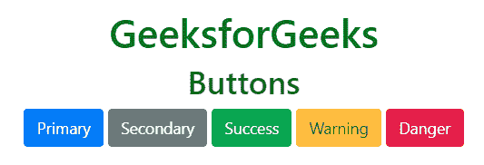
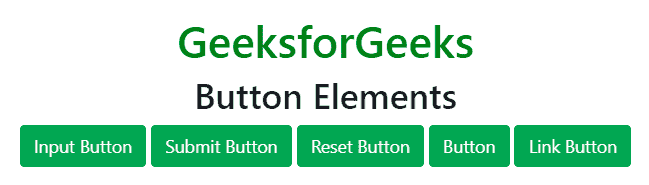
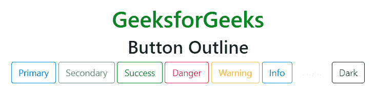
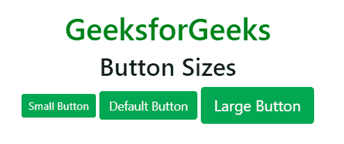
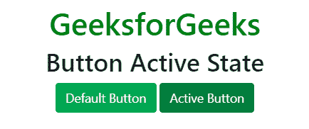
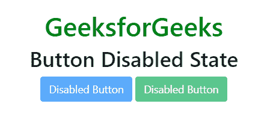
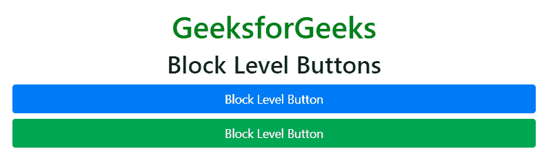
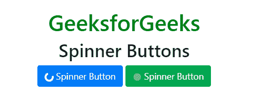

# 自举 4 |按钮

> 原文:[https://www.geeksforgeeks.org/bootstrap-4-buttons/](https://www.geeksforgeeks.org/bootstrap-4-buttons/)

Bootstrap 提供了不同的类，可以使用不同的标签，如<button>、</button> 

**例:**

## 超文本标记语言

```html
<!DOCTYPE html>
<html lang="en">
<head>
    <title>Bootstrap Buttons</title>

    <meta charset="utf-8">
    <meta name="viewport" content="width=device-width, initial-scale=1">

    <link rel="stylesheet" href=
"https://maxcdn.bootstrapcdn.com/bootstrap/4.3.1/css/bootstrap.min.css">

    <script src=
"https://ajax.googleapis.com/ajax/libs/jquery/3.3.1/jquery.min.js">
    </script>

    <script src=
"https://cdnjs.cloudflare.com/ajax/libs/popper.js/1.14.7/umd/popper.min.js">
    </script>

    <script src=
"https://maxcdn.bootstrapcdn.com/bootstrap/4.3.1/js/bootstrap.min.js">
    </script>
</head>

<body style="text-align:center;">
    <div class="container mt-3">

        <h1 style="color:green;">
            GeeksforGeeks
        </h1>

        <h2>Buttons</h2>

        <button type="button" class="btn btn-primary">Primary</button>
        <button type="button" class="btn btn-secondary">Secondary</button>
        <button type="button" class="btn btn-success">Success</button>
        <button type="button" class="btn btn-warning">Warning</button>
        <button type="button" class="btn btn-danger">Danger</button>
    </div>
</body>

</html>                   
```

**输出:**



**注意:**<a>、<按钮>和<输入>元素用于保存按钮类别。
**例:**

## 超文本标记语言

```html
<!DOCTYPE html>
<html lang="en">
<head>
    <title>Bootstrap Buttons</title>

    <meta charset="utf-8">
    <meta name="viewport" content="width=device-width, initial-scale=1">

    <link rel="stylesheet" href=
"https://maxcdn.bootstrapcdn.com/bootstrap/4.3.1/css/bootstrap.min.css">

    <script src=
"https://ajax.googleapis.com/ajax/libs/jquery/3.3.1/jquery.min.js">
    </script>

    <script src=
"https://cdnjs.cloudflare.com/ajax/libs/popper.js/1.14.7/umd/popper.min.js">
    </script>

    <script src=
"https://maxcdn.bootstrapcdn.com/bootstrap/4.3.1/js/bootstrap.min.js">
    </script>
</head>

<body style="text-align:center;">
    <div class="container mt-3">

        <h1 style="color:green;">
            GeeksforGeeks
        </h1>

        <h2>Button Elements</h2>

        <input class="btn btn-success" type="button" value="Input Button">
        <input class="btn btn-success" type="submit" value="Submit Button">
        <input class="btn btn-success" type="reset" value="Reset Button">
        <button class="btn btn-success" type="button">Button</button>
        <a href="#" class="btn btn-success" role="button">Link Button</a>
    </div>
</body>

</html>                   
```

**输出:**



**按钮轮廓:** Bootstrap 提供了一系列类，当我们在项目中需要使用轮廓样式的按钮时，即没有背景颜色的按钮时，可以使用这些类。大纲按钮类删除应用于按钮的任何背景颜色或背景图像样式。这些课程如下所示:

**例:**

## 超文本标记语言

```html
<!DOCTYPE html>
<html lang="en">
<head>
    <title>Bootstrap Buttons</title>

    <meta charset="utf-8">
    <meta name="viewport" content="width=device-width, initial-scale=1">

    <link rel="stylesheet" href=
"https://maxcdn.bootstrapcdn.com/bootstrap/4.3.1/css/bootstrap.min.css">

    <script src=
"https://ajax.googleapis.com/ajax/libs/jquery/3.3.1/jquery.min.js">
    </script>

    <script src=
"https://cdnjs.cloudflare.com/ajax/libs/popper.js/1.14.7/umd/popper.min.js">
    </script>

    <script src=
"https://maxcdn.bootstrapcdn.com/bootstrap/4.3.1/js/bootstrap.min.js">
    </script>
</head>

<body style="text-align:center;">
    <div class="container mt-3">

        <h1 style="color:green;">
            GeeksforGeeks
        </h1>

        <h2>Button Outline</h2>

        <button type="button" class="btn btn-outline-primary">
            Primary
        </button>

        <button type="button" class="btn btn-outline-secondary">
            Secondary
        </button>

        <button type="button" class="btn btn-outline-success">
            Success
        </button>

        <button type="button" class="btn btn-outline-danger">
            Danger
        </button>

        <button type="button" class="btn btn-outline-warning">
            Warning
        </button>

        <button type="button" class="btn btn-outline-info">
            Info
        </button>

        <button type="button" class="btn btn-outline-light">
            Light
        </button>
        <button type="button" class="btn btn-outline-dark">
            Dark
        </button>
    </div>
</body>

</html>                   
```

**输出:**



**按钮尺寸:** Bootstrap 提供不同的类，允许改变按钮的尺寸。*。btn-lg* 和*。btn-sm* 类用于大小按钮。
**例:**

## 超文本标记语言

```html
<!DOCTYPE html>
<html lang="en">
<head>
    <title>Bootstrap Buttons</title>

    <meta charset="utf-8">
    <meta name="viewport" content="width=device-width, initial-scale=1">

    <link rel="stylesheet" href=
"https://maxcdn.bootstrapcdn.com/bootstrap/4.3.1/css/bootstrap.min.css">

    <script src=
"https://ajax.googleapis.com/ajax/libs/jquery/3.3.1/jquery.min.js">
    </script>

    <script src=
"https://cdnjs.cloudflare.com/ajax/libs/popper.js/1.14.7/umd/popper.min.js">
    </script>

    <script src=
"https://maxcdn.bootstrapcdn.com/bootstrap/4.3.1/js/bootstrap.min.js">
    </script>
</head>

<body style="text-align:center;">
    <div class="container mt-3">

        <h1 style="color:green;">
            GeeksforGeeks
        </h1>

        <h2>Button Sizes</h2>

        <button type="button" class="btn btn-success btn-sm">
            Small Button
        </button>

        <button type="button" class="btn btn-success">
            Default Button
        </button>

        <button type="button" class="btn btn-success btn-lg">
            Large Button
        </button>
    </div>
</body>

</html>                   
```

**输出:**



**活动状态按钮:***。激活*类用于使按钮和链接进入激活状态。
**例:**

## 超文本标记语言

```html
<!DOCTYPE html>
<html lang="en">
<head>
    <title>Bootstrap Buttons</title>

    <meta charset="utf-8">
    <meta name="viewport" content="width=device-width, initial-scale=1">

    <link rel="stylesheet" href=
"https://maxcdn.bootstrapcdn.com/bootstrap/4.3.1/css/bootstrap.min.css">

    <script src=
"https://ajax.googleapis.com/ajax/libs/jquery/3.3.1/jquery.min.js">
    </script>

    <script src=
"https://cdnjs.cloudflare.com/ajax/libs/popper.js/1.14.7/umd/popper.min.js">
    </script>

    <script src=
"https://maxcdn.bootstrapcdn.com/bootstrap/4.3.1/js/bootstrap.min.js">
    </script>
</head>

<body style="text-align:center;">
    <div class="container mt-3">

        <h1 style="color:green;">
            GeeksforGeeks
        </h1>

        <h2>Button Active State</h2>

        <button type="button" class="btn btn-success">
            Default Button
        </button>

        <button type="button" class="btn btn-success active">
            Active Button
        </button>
    </div>
</body>

</html>                   
```

**输出:**



**禁用状态按钮:**禁用属性与<按钮>元素一起用于设置按钮的禁用状态。
**例:**

## 超文本标记语言

```html
<!DOCTYPE html>
<html lang="en">
<head>
    <title>Bootstrap Buttons</title>

    <meta charset="utf-8">
    <meta name="viewport" content="width=device-width, initial-scale=1">

    <link rel="stylesheet" href=
"https://maxcdn.bootstrapcdn.com/bootstrap/4.3.1/css/bootstrap.min.css">

    <script src=
"https://ajax.googleapis.com/ajax/libs/jquery/3.3.1/jquery.min.js">
    </script>

    <script src=
"https://cdnjs.cloudflare.com/ajax/libs/popper.js/1.14.7/umd/popper.min.js">
    </script>

    <script src=
"https://maxcdn.bootstrapcdn.com/bootstrap/4.3.1/js/bootstrap.min.js">
    </script>
</head>

<body style="text-align:center;">
    <div class="container mt-3">

        <h1 style="color:green;">
            GeeksforGeeks
        </h1>

        <h2>Button Disabled State</h2>

        <button type="button" class="btn btn-primary" disabled>
            Disabled Button
        </button>

        <button type="button" class="btn btn-success" disabled>
            Disabled Button
        </button>
    </div>
</body>

</html>                   
```

**输出:**



**块级按钮:**的。btn-block 类用于创建块级按钮，该按钮占据父元素的所有宽度。
**例:**

## 超文本标记语言

```html
<!DOCTYPE html>
<html lang="en">
<head>
    <title>Bootstrap Buttons</title>

    <meta charset="utf-8">
    <meta name="viewport" content="width=device-width, initial-scale=1">

    <link rel="stylesheet" href=
"https://maxcdn.bootstrapcdn.com/bootstrap/4.3.1/css/bootstrap.min.css">

    <script src=
"https://ajax.googleapis.com/ajax/libs/jquery/3.3.1/jquery.min.js">
    </script>

    <script src=
"https://cdnjs.cloudflare.com/ajax/libs/popper.js/1.14.7/umd/popper.min.js">
    </script>

    <script src=
"https://maxcdn.bootstrapcdn.com/bootstrap/4.3.1/js/bootstrap.min.js">
    </script>
</head>

<body style="text-align:center;">
    <div class="container mt-3">

        <h1 style="color:green;">
            GeeksforGeeks
        </h1>

        <h2>Block Level Buttons</h2>

        <button type="button" class="btn btn-block btn-primary">
            Block Level Button
        </button>

        <button type="button" class="btn btn-block btn-success">
            Block Level Button
        </button>
    </div>
</body>

</html>                   
```

**输出:**



**微调按钮:**微调器-*类用于向按钮添加微调器。

## 超文本标记语言

```html
<!DOCTYPE html>
<html lang="en">
<head>
    <title>Bootstrap Buttons</title>

    <meta charset="utf-8">
    <meta name="viewport" content="width=device-width, initial-scale=1">

    <link rel="stylesheet" href=
"https://maxcdn.bootstrapcdn.com/bootstrap/4.3.1/css/bootstrap.min.css">

    <script src=
"https://ajax.googleapis.com/ajax/libs/jquery/3.3.1/jquery.min.js">
    </script>

    <script src=
"https://cdnjs.cloudflare.com/ajax/libs/popper.js/1.14.7/umd/popper.min.js">
    </script>

    <script src=
"https://maxcdn.bootstrapcdn.com/bootstrap/4.3.1/js/bootstrap.min.js">
    </script>
</head>

<body style="text-align:center;">
    <div class="container mt-3">

        <h1 style="color:green;">
            GeeksforGeeks
        </h1>

        <h2>Spinner Buttons</h2>

        <button type="button" class="btn btn-primary">
            <span class="spinner-border spinner-border-sm"></span>
            Spinner Button
        </button>

        <button type="button" class="btn btn-success">
            <span class="spinner-grow spinner-grow-sm"></span>
            Spinner Button
        </button>
    </div>
</body>

</html>                   
```

**输出:**



**支持的浏览器:**

*   谷歌 Chrome
*   微软公司出品的 web 浏览器
*   火狐浏览器
*   歌剧
*   旅行队