# 自举 4 |卡片

> 原文:[https://www.geeksforgeeks.org/bootstrap-4-cards/](https://www.geeksforgeeks.org/bootstrap-4-cards/)

引导卡是一个灵活的盒子，包含一些内容周围的填充。它包括页眉和页脚选项、颜色、内容和强大的显示选项。它取代了面板、井和缩略图的使用。它可以在一个名为 card 的容器中使用。


**基础卡:***。卡*和*。卡体*类用于创建基础卡。*。卡体*类用于*内部。卡片*类。
**例:**

## 超文本标记语言

```html
<!DOCTYPE html>
<html lang="en">
<head>
    <title>Bootstrap Cards</title>

    <meta charset="utf-8">
    <meta name="viewport" content="width=device-width, initial-scale=1">

    <link rel="stylesheet" href=
"https://maxcdn.bootstrapcdn.com/bootstrap/4.3.1/css/bootstrap.min.css">

    <script src=
"https://ajax.googleapis.com/ajax/libs/jquery/3.3.1/jquery.min.js">
    </script>

    <script src=
"https://cdnjs.cloudflare.com/ajax/libs/popper.js/1.14.7/umd/popper.min.js">
    </script>

    <script src=
"https://maxcdn.bootstrapcdn.com/bootstrap/4.3.1/js/bootstrap.min.js">
    </script>
</head>

<body>
    <h1 style="color:green;text-align:center;">
        GeeksforGeeks
    </h1>

    <div class="container">
        <div class="card">
            <div class="card-body">card-body</div>
        </div>
    </div>
</body>

</html>                   
```

**输出:**

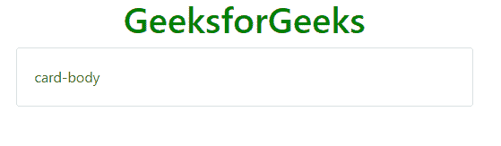

**页眉和页脚:***。卡片标题*类为卡片和*提供标题。卡片页脚*类为卡片提供页脚。
**例:**

## 超文本标记语言

```html
<!DOCTYPE html>
<html lang="en">
<head>
    <title>Bootstrap Cards</title>

    <meta charset="utf-8">
    <meta name="viewport" content="width=device-width, initial-scale=1">

    <link rel="stylesheet" href=
"https://maxcdn.bootstrapcdn.com/bootstrap/4.3.1/css/bootstrap.min.css">

    <script src=
"https://ajax.googleapis.com/ajax/libs/jquery/3.3.1/jquery.min.js">
    </script>

    <script src=
"https://cdnjs.cloudflare.com/ajax/libs/popper.js/1.14.7/umd/popper.min.js">
    </script>

    <script src=
"https://maxcdn.bootstrapcdn.com/bootstrap/4.3.1/js/bootstrap.min.js">
    </script>
</head>

<body>
    <h1 style="color:green;text-align:center;">
        GeeksforGeeks
    </h1>

    <div class="container">
        <div class="card">
            <div class="card-header">Card Header</div>
            <div class="card-body">Card Body</div>
            <div class="card-footer">Card Footer</div>
        </div>
    </div>
</body>

</html>                   
```

**输出:**

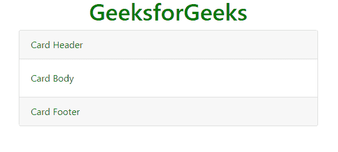

**卡片标题和链接:***。卡片标题*类用于设置卡片和*的标题。卡片链接*类用于在需要时设置卡片的链接。
**例:**

## 超文本标记语言

```html
<!DOCTYPE html>
<html lang="en">
<head>
    <title>Bootstrap Cards</title>

    <meta charset="utf-8">
    <meta name="viewport" content="width=device-width, initial-scale=1">

    <link rel="stylesheet" href=
"https://maxcdn.bootstrapcdn.com/bootstrap/4.3.1/css/bootstrap.min.css">

    <script src=
"https://ajax.googleapis.com/ajax/libs/jquery/3.3.1/jquery.min.js">
    </script>

    <script src=
"https://cdnjs.cloudflare.com/ajax/libs/popper.js/1.14.7/umd/popper.min.js">
    </script>

    <script src=
"https://maxcdn.bootstrapcdn.com/bootstrap/4.3.1/js/bootstrap.min.js">
    </script>
</head>

<body>
    <h1 style="color:green;text-align:center;">
        GeeksforGeeks
    </h1>

    <div class="container">
        <div class="card">
            <div class="card-title">Card Title</div>
            <p class="card-text">Card Text.</p>

            <a href="#" class="card-link">Click Me!</div>
        </div>
    </div>
</body>

</html>                   
```

**输出:**

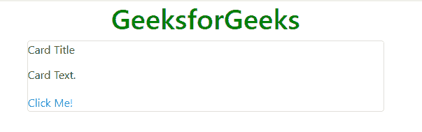

**卡片样式:**可以通过使用卡片的颜色来设置卡片样式，以便用户可以容易地理解特定卡片代表什么。它由警报中使用的颜色组成。
**例:**

## 超文本标记语言

```html
<!DOCTYPE html>
<html lang="en">
<head>
    <title>Bootstrap Cards</title>

    <meta charset="utf-8">
    <meta name="viewport" content="width=device-width, initial-scale=1">

    <link rel="stylesheet" href=
"https://maxcdn.bootstrapcdn.com/bootstrap/4.3.1/css/bootstrap.min.css">

    <script src=
"https://ajax.googleapis.com/ajax/libs/jquery/3.3.1/jquery.min.js">
    </script>

    <script src=
"https://cdnjs.cloudflare.com/ajax/libs/popper.js/1.14.7/umd/popper.min.js">
    </script>

    <script src=
"https://maxcdn.bootstrapcdn.com/bootstrap/4.3.1/js/bootstrap.min.js">
    </script>
</head>

<body>
    <h1 style="color:green;text-align:center;">
        GeeksforGeeks
    </h1>

    <div class="container">
        <div class="card text-white bg-primary">
            <div class="card-header">Primary</div>
            <h4 class="card-title">Title.</h4>
        </div>
        <br>
        <div class="card text-white bg-danger">
            <div class="card-header">Danger</div>
            <h4 class="card-title">Title.</h4>
        </div>
        <br>
        <div class="card text-white bg-warning">
            <div class="card-header">Warning</div>
            <h4 class="card-title">Title.</h4>
        </div>
        <br>
        <div class="card text-white bg-info">
            <div class="card-header">Info</div>
            <h4 class="card-title">Title.</h4>
        </div>
    </div>
</body>

</html>                   
```

**输出:**

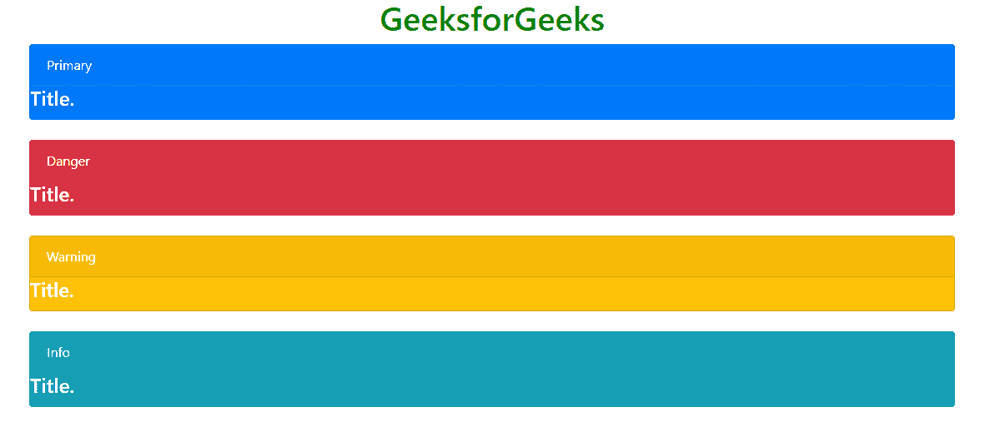

**卡牌图像:***。卡-img-top* 或*。卡片-img-bottom* 类用于将图像放置在卡片内部的顶部或底部。
**例 1:**

## 超文本标记语言

```html
<!DOCTYPE html>
<html lang="en">
<head>
    <title>Bootstrap Cards</title>

    <meta charset="utf-8">
    <meta name="viewport" content="width=device-width, initial-scale=1">

    <link rel="stylesheet" href=
"https://maxcdn.bootstrapcdn.com/bootstrap/4.3.1/css/bootstrap.min.css">

    <script src=
"https://ajax.googleapis.com/ajax/libs/jquery/3.3.1/jquery.min.js">
    </script>

    <script src=
"https://cdnjs.cloudflare.com/ajax/libs/popper.js/1.14.7/umd/popper.min.js">
    </script>

    <script src=
"https://maxcdn.bootstrapcdn.com/bootstrap/4.3.1/js/bootstrap.min.js">
    </script>
</head>

<body>
    <h1 style="color:green;text-align:center;">
        GeeksforGeeks
    </h1>

<div class="container">
    <div class="card" style="width: 18rem;">
        
        <div class="card-body">
            <h5 class="card-title">Author Name</h5>
            <p class="card-text">Passionate about programming.</p>

            <a href="#" class="btn btn-primary">See Profile</a>
        </div>
    </div>
</div>
</body>

</html>                   
```

**输出:**

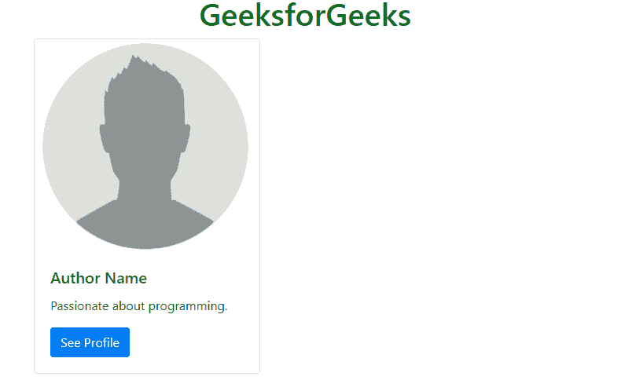

**例 2:**

## 超文本标记语言

```html
<!DOCTYPE html>
<html lang="en">
<head>
    <title>Bootstrap Cards</title>

    <meta charset="utf-8">
    <meta name="viewport" content="width=device-width, initial-scale=1">

    <link rel="stylesheet" href=
"https://maxcdn.bootstrapcdn.com/bootstrap/4.3.1/css/bootstrap.min.css">

    <script src=
"https://ajax.googleapis.com/ajax/libs/jquery/3.3.1/jquery.min.js">
    </script>

    <script src=
"https://cdnjs.cloudflare.com/ajax/libs/popper.js/1.14.7/umd/popper.min.js">
    </script>

    <script src=
"https://maxcdn.bootstrapcdn.com/bootstrap/4.3.1/js/bootstrap.min.js">
    </script>
</head>

<body>
    <h1 style="color:green;text-align:center;">
        GeeksforGeeks
    </h1>

    <div class="container">
        <div class="card" style="width: 18rem;">
            <div class="card-body">
                <h5 class="card-title">Author Name</h5>
                <p class="card-text">Passionate about programming.</p>

                <a href="#" class="btn btn-primary">See Profile</a>
                
            </div>
        </div>
    </div>
</body>

</html>                   
```

**输出:**

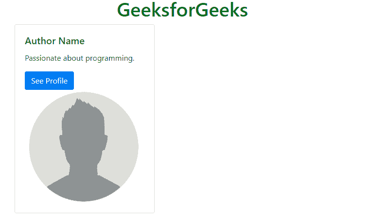

**卡片图像叠加:***。card-img-overlay* 类用于在图像顶部添加文字。
**例:**

## 超文本标记语言

```html
<!DOCTYPE html>
<html lang="en">
<head>
    <title>Bootstrap Cards</title>

    <meta charset="utf-8">
    <meta name="viewport" content="width=device-width, initial-scale=1">

    <link rel="stylesheet" href=
"https://maxcdn.bootstrapcdn.com/bootstrap/4.3.1/css/bootstrap.min.css">

    <script src=
"https://ajax.googleapis.com/ajax/libs/jquery/3.3.1/jquery.min.js">
    </script>

    <script src=
"https://cdnjs.cloudflare.com/ajax/libs/popper.js/1.14.7/umd/popper.min.js">
    </script>

    <script src=
"https://maxcdn.bootstrapcdn.com/bootstrap/4.3.1/js/bootstrap.min.js">
    </script>
</head>

<body>
    <h1 style="color:green;text-align:center;">
        GeeksforGeeks
    </h1>

    <div class="container">
        <div class="card" style="width: 18rem;">
            

            <div class="card-img-overlay">
                <div class="card-body">
                    <h5 class="card-title">Author Name</h5>
                    <p class="card-text">Passionate about programming.</p>

                    <a href="#" class="btn btn-primary">See Profile</a>
                </div>
            </div>
        </div>
    </div>
</body>

</html>                   
```

**输出:**

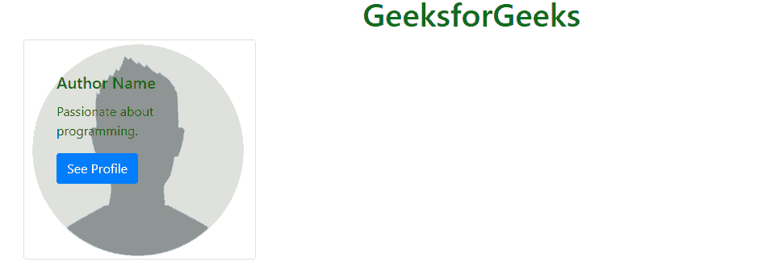

**扑克牌:***。卡片组*类用于创建高度和宽度相等的卡片网格。
**例:**

## 超文本标记语言

```html
<!DOCTYPE html>
<html lang="en">
<head>
    <title>Bootstrap Cards</title>

    <meta charset="utf-8">
    <meta name="viewport" content="width=device-width, initial-scale=1">

    <link rel="stylesheet" href=
"https://maxcdn.bootstrapcdn.com/bootstrap/4.3.1/css/bootstrap.min.css">

    <script src=
"https://ajax.googleapis.com/ajax/libs/jquery/3.3.1/jquery.min.js">
    </script>

    <script src=
"https://cdnjs.cloudflare.com/ajax/libs/popper.js/1.14.7/umd/popper.min.js">
    </script>

    <script src=
"https://maxcdn.bootstrapcdn.com/bootstrap/4.3.1/js/bootstrap.min.js">
    </script>
</head>

<body>
    <h1 style="color:green;text-align:center;">
        GeeksforGeeks
    </h1>

    <div class="container">
        <div class="card-deck">
            <div class="card text-white bg-primary">
                <div class="card-body">
                    <h4 class="card-title">Primary</h4>
                </div>
            </div>

            <div class="card text-white bg-danger">
                <div class="card-body">
                    <h4 class="card-title">Danger</h4>
                </div>
            </div>

            <div class="card text-white bg-warning">
                <div class="card-body">
                    <h4 class="card-title">Warning</h4>
                </div>
            </div>

            <div class="card text-white bg-info">
                <div class="card-body">
                    <h4 class="card-title">Info</h4>
                </div>
            </div>
        </div>
    </div>
</body>

</html>                   
```

**输出:**


**卡组:***。卡片组*类用于创建等高等宽的卡片网格，去除卡片之间的左右边距。
**例:**

## 超文本标记语言

```html
<!DOCTYPE html>
<html lang="en">
<head>
    <title>Bootstrap Cards</title>

    <meta charset="utf-8">
    <meta name="viewport" content="width=device-width, initial-scale=1">

    <link rel="stylesheet" href=
"https://maxcdn.bootstrapcdn.com/bootstrap/4.3.1/css/bootstrap.min.css">

    <script src=
"https://ajax.googleapis.com/ajax/libs/jquery/3.3.1/jquery.min.js">
    </script>

    <script src=
"https://cdnjs.cloudflare.com/ajax/libs/popper.js/1.14.7/umd/popper.min.js">
    </script>

    <script src=
"https://maxcdn.bootstrapcdn.com/bootstrap/4.3.1/js/bootstrap.min.js">
    </script>
</head>

<body>
    <h1 style="color:green;text-align:center;">
        GeeksforGeeks
    </h1>

    <div class="container">
        <div class="card-group">
            <div class="card text-white bg-primary">
                <div class="card-body">
                    <h4 class="card-title">Primary</h4>
                </div>
            </div>

            <div class="card text-white bg-danger">
                <div class="card-body">
                    <h4 class="card-title">Danger</h4>
                </div>
            </div>

            <div class="card text-white bg-warning">
                <div class="card-body">
                    <h4 class="card-title">Warning</h4>
                </div>
            </div>

            <div class="card text-white bg-info">
                <div class="card-body">
                    <h4 class="card-title">Info</h4>
                </div>
            </div>
        </div>
    </div>
</body>

</html>                                      
```

**输出:**

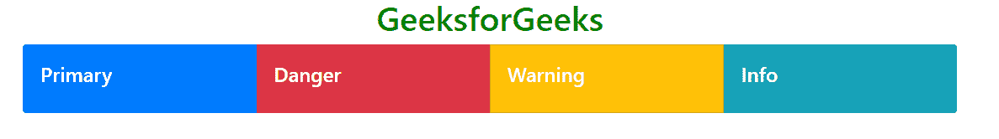

**列表组:***。列表-组*和*。列表-组-刷新*类用于创建卡片中的内容列表。
**例:**

## 超文本标记语言

```html
<!DOCTYPE html>
<html lang="en">
<head>
    <title>Bootstrap Cards</title>

    <meta charset="utf-8">
    <meta name="viewport" content="width=device-width, initial-scale=1">

    <link rel="stylesheet" href=
"https://maxcdn.bootstrapcdn.com/bootstrap/4.3.1/css/bootstrap.min.css">

    <script src=
"https://ajax.googleapis.com/ajax/libs/jquery/3.3.1/jquery.min.js">
    </script>

    <script src=
"https://cdnjs.cloudflare.com/ajax/libs/popper.js/1.14.7/umd/popper.min.js">
    </script>

    <script src=
"https://maxcdn.bootstrapcdn.com/bootstrap/4.3.1/js/bootstrap.min.js">
    </script>
</head>

<body>
    <h1 style="color:green;text-align:center;">
        GeeksforGeeks
    </h1>

    <div class="container">
        <div class="card">
            <ul class="list-group list-group-flush">
                <li class="list-group-item">List Item 1</li>
                <li class="list-group-item">List Item 2</li>
                <li class="list-group-item">List Item 3</li>
            </ul>
        </div>
    </div>
</body>

</html>                             
```

**输出:**

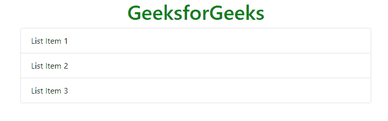

**厨房水槽:**它是由里面的所有东西组成的卡片类型的名称。它混合并匹配多种内容来制作所需的卡片。
**例:**

## 超文本标记语言

```html
<!DOCTYPE html>
<html lang="en">
<head>
    <title>Bootstrap Cards</title>

    <meta charset="utf-8">
    <meta name="viewport" content="width=device-width, initial-scale=1">

    <link rel="stylesheet" href=
"https://maxcdn.bootstrapcdn.com/bootstrap/4.3.1/css/bootstrap.min.css">

    <script src=
"https://ajax.googleapis.com/ajax/libs/jquery/3.3.1/jquery.min.js">
    </script>

    <script src=
"https://cdnjs.cloudflare.com/ajax/libs/popper.js/1.14.7/umd/popper.min.js">
    </script>

    <script src=
"https://maxcdn.bootstrapcdn.com/bootstrap/4.3.1/js/bootstrap.min.js">
    </script>
</head>

<body>
    <h1 style="color:green;text-align:center;">
        GeeksforGeeks
    </h1>

    <div class="container">
        <div class="card" style="width:12rem;">
            
            <div class="card-block">
                <h4 class="card-title">Languages</h4>
            </div>

            <ul class="list-group list-group-flush">
                <li class="list-group-item">C</li>
                <li class="list-group-item">C++</li>
                <li class="list-group-item">JavaScript</li>
            </ul>

            <div class="card-body">
                <a href="#" class="card-link">Add New</a>
                <a href="#" class="card-link">More..</a>
            </div>
        </div>
    </div>
</body>

</html>                                    
```

**输出:**

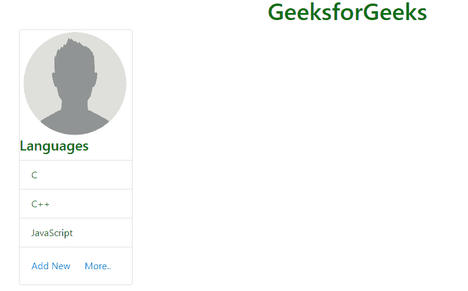

**导航:**在卡片表头增加导航菜单。
**例:**

## 超文本标记语言

```html
<!DOCTYPE html>
<html lang="en">
<head>
    <title>Bootstrap Cards</title>

    <meta charset="utf-8">
    <meta name="viewport" content="width=device-width, initial-scale=1">

    <link rel="stylesheet" href=
"https://maxcdn.bootstrapcdn.com/bootstrap/4.3.1/css/bootstrap.min.css">

    <script src=
"https://ajax.googleapis.com/ajax/libs/jquery/3.3.1/jquery.min.js">
    </script>

    <script src=
"https://cdnjs.cloudflare.com/ajax/libs/popper.js/1.14.7/umd/popper.min.js">
    </script>

    <script src=
"https://maxcdn.bootstrapcdn.com/bootstrap/4.3.1/js/bootstrap.min.js">
    </script>
</head>

<body>
    <h1 style="color:green;text-align:center;">
        GeeksforGeeks
    </h1>

    <div class="card text-center">
        <div class="card-header">
            <ul class="nav nav-tabs card-header-tabs">
                <li class="nav-item">
                    <a class="nav-link active" href="#">JavaStript</a>
                </li>
                <li class="nav-item">
                    <a class="nav-link" href="#">BootStrap</a>
                </li>
                <li class="nav-item">
                    <a class="nav-link disabled" href="#">Python</a>
                </li>
            </ul>
        </div>

        <div class="card-body">
            <h5 class="card-title">Card Title</h5>
            <p class="card-text">Add more language tutorials.</p>

            <a href="#" class="btn btn-primary">Add Language</a>
        </div>
    </div>
</body>

</html>                                  
```

**输出:**

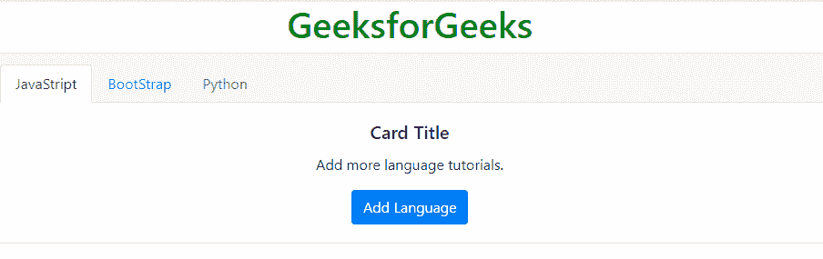

**药丸形式的导航菜单:**将药丸形式的导航菜单添加到卡片表头。
**例:**

## 超文本标记语言

```html
<!DOCTYPE html>
<html lang="en">
<head>
    <title>Bootstrap Cards</title>

    <meta charset="utf-8">
    <meta name="viewport" content="width=device-width, initial-scale=1">

    <link rel="stylesheet" href=
"https://maxcdn.bootstrapcdn.com/bootstrap/4.3.1/css/bootstrap.min.css">

    <script src=
"https://ajax.googleapis.com/ajax/libs/jquery/3.3.1/jquery.min.js">
    </script>

    <script src=
"https://cdnjs.cloudflare.com/ajax/libs/popper.js/1.14.7/umd/popper.min.js">
    </script>

    <script src=
"https://maxcdn.bootstrapcdn.com/bootstrap/4.3.1/js/bootstrap.min.js">
    </script>
</head>

<body>
    <h1 style="color:green;text-align:center;">
        GeeksforGeeks
    </h1>

    <div class="card text-center">
        <div class="card-header">
            <ul class="nav nav-pills card-header-pills">
                <li class="nav-item">
                    <a class="nav-link active" href="#">JavaStript</a>
                </li>
                <li class="nav-item">
                    <a class="nav-link" href="#">BootStrap</a>
                </li>
                <li class="nav-item">
                    <a class="nav-link disabled" href="#">Python</a>
                </li>
            </ul>
        </div>

        <div class="card-body">
            <h5 class="card-title">Card Title</h5>
            <p class="card-text">Add more language tutorials.</p>

            <a href="#" class="btn btn-primary">Add Language</a>
        </div>
    </div>
</body>

</html>                           
```

**输出:**

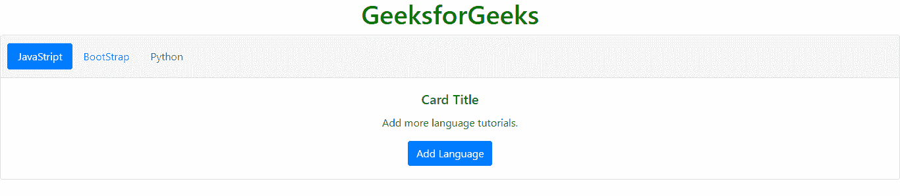

**支持的浏览器:**

*   谷歌 Chrome
*   微软公司出品的 web 浏览器
*   火狐浏览器
*   歌剧
*   旅行队