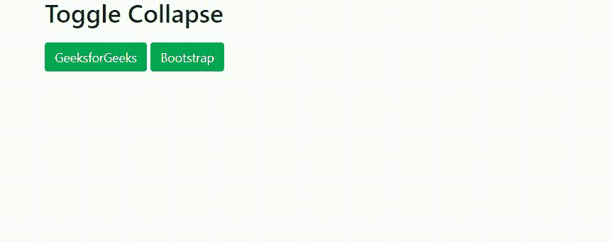
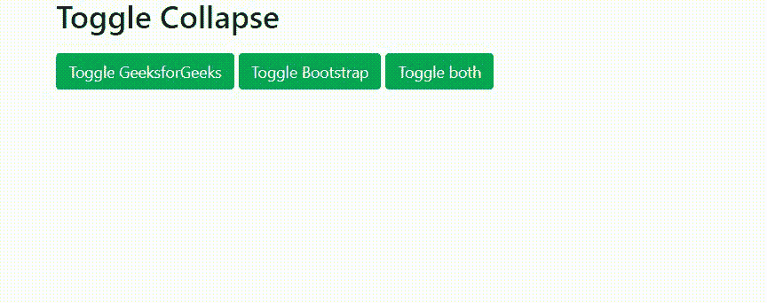
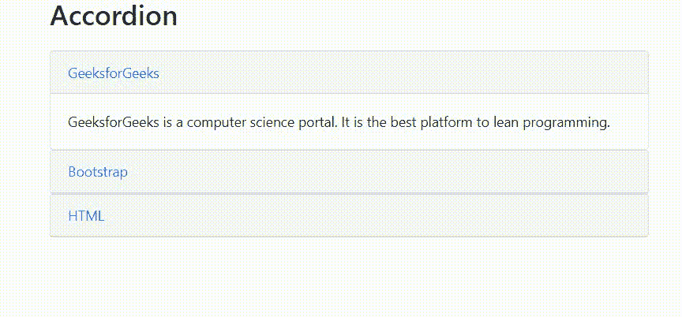

# 自举 4 |折叠

> 原文:[https://www.geeksforgeeks.org/bootstrap-4-collapse/](https://www.geeksforgeeks.org/bootstrap-4-collapse/)

Bootstrap 4 为创建可折叠元素提供了不同的类。可折叠元素用于隐藏或显示大量内容。当单击一个以可折叠元素为目标的按钮时，类转换如下进行:

*   **。折叠:**隐藏内容。
*   **。折叠:**在过渡期间应用。
*   **.collapse.show:** 显示内容。

**基本可折叠:***。折叠*类表示一个可折叠的元素，即点击按钮将显示或隐藏的内容。要控制(显示/隐藏)可折叠内容，请向锚点或按钮元素添加**数据-切换=“折叠”**属性。然后添加**data-target =“# collapse example”**属性，将按钮与可折叠内容连接起来。

**示例:**

```
<!DOCTYPE html>  
<html lang="en">  
<head>  
    <title>Bootstrap Collapse Demonstration</title>  

    <meta charset="utf-8"> 
    <meta name="viewport" content="width=device-width, initial-scale=1"> 

    <link rel="stylesheet" href= 
"https://maxcdn.bootstrapcdn.com/bootstrap/4.3.1/css/bootstrap.min.css"> 

    <script src= 
"https://ajax.googleapis.com/ajax/libs/jquery/3.3.1/jquery.min.js"> 
    </script> 

    <script src= 
"https://cdnjs.cloudflare.com/ajax/libs/popper.js/1.14.7/umd/popper.min.js"> 
    </script> 

    <script src= 
"https://maxcdn.bootstrapcdn.com/bootstrap/4.3.1/js/bootstrap.min.js"> 
    </script> 

<head>

<body>
    <div class="container">

        <!-- Button trigger modal -->
        <h2 class="mb-1" style="padding-bottom: 15px;">
            Toggle Collapse
        </h2>

        <p>
            <a class="btn btn-success" data-toggle="collapse"
                    href="#example_1" role="button" 
                    aria-expanded="false" aria-controls="example_1">
                GeeksforGeeks
            </a>

            <button class="btn btn-success" type="button" 
                    data-toggle="collapse" data-target="#example_2"
                    aria-expanded="false" aria-controls="example_2">
                Bootstrap
            </button>
        </p>
        <div class="collapse" id="example_1">
            <div class="card card-body">
                GeeksforGeeks is a computer science portal. It is the
                best platform to lean programming. 
            </div>
        </div>

        <div class="collapse" id="example_2">
            <div class="card card-body">
                Bootstrap is a free and open-source collection of
                tools for creating websites and web applications.
                It is the most popular HTML, CSS, and JavaScript 
                framework for developing responsive, mobile-first
                web sites.
            </div>
        </div>
     </div>
</body>
</html>
```

**输出:**


**多切换可折叠:**按钮或锚点标签可以通过在其 href 或数据目标属性中使用 JQuery 选择器引用多个元素来显示或隐藏它们。如果多个按钮或定位标记可以用它们的 href 或数据目标属性引用一个元素，那么它们可以显示和隐藏该元素。

**示例:**

```
<!DOCTYPE html>  
<html lang="en">  
<head>  
    <title>Bootstrap Collapse Demonstration</title>  

    <meta charset="utf-8"> 
    <meta name="viewport" content="width=device-width, initial-scale=1"> 

    <link rel="stylesheet" href= 
"https://maxcdn.bootstrapcdn.com/bootstrap/4.3.1/css/bootstrap.min.css"> 

    <script src= 
"https://ajax.googleapis.com/ajax/libs/jquery/3.3.1/jquery.min.js"> 
    </script> 

    <script src= 
"https://cdnjs.cloudflare.com/ajax/libs/popper.js/1.14.7/umd/popper.min.js"> 
    </script> 

    <script src= 
"https://maxcdn.bootstrapcdn.com/bootstrap/4.3.1/js/bootstrap.min.js"> 
    </script> 

<head>

<body>
    <div class="container">

        <h2 class="mb-1" style="padding-bottom: 15px;">
            Toggle Collapse
        </h2>

        <p>
            <a class="btn btn-success" data-toggle="collapse" 
                    href="#collapse1" role="button" aria-expanded="false"
                    aria-controls="collapse1">
                Toggle GeeksforGeeks
            </a>

            <button class="btn btn-success" type="button" 
                    data-toggle="collapse" data-target="#collapse2"
                    aria-expanded="false" aria-controls="collapse2">
                Toggle Bootstrap
            </button>

            <button class="btn btn-success" type="button" 
                    data-toggle="collapse" data-target=".multi-collapse"
                    aria-expanded="false" aria-controls="collapse1 collapse2">
                Toggle both
            </button>
        </p>

        <div class="collapse multi-collapse" id="collapse1">
            <div class="card card-body">
                GeeksforGeeks is a computer science portal. It is the
                best platform to lean programming. 
            </div>
        </div>

        <div class="collapse multi-collapse" id="collapse2">
            <div class="card card-body">
                Bootstrap is a free and open-source collection of
                tools for creating websites and web applications.
                It is the most popular HTML, CSS, and JavaScript 
                framework for developing responsive, mobile-first
                web sites.
            </div>
        </div>
    </div>
</body>

</html>
```



**手风琴:**以下示例通过扩展面板组件展示了一个简单的手风琴。使用**数据父项**属性确保当显示一个可折叠项目时，指定父项下的所有可折叠元素都将关闭。

**示例:**

```
<!DOCTYPE html>  
<html lang="en">  
<head>  
    <title>Bootstrap Collapse Demonstration</title>  

    <meta charset="utf-8"> 
    <meta name="viewport" content="width=device-width, initial-scale=1"> 

    <link rel="stylesheet" href= 
"https://maxcdn.bootstrapcdn.com/bootstrap/4.3.1/css/bootstrap.min.css"> 

    <script src= 
"https://ajax.googleapis.com/ajax/libs/jquery/3.3.1/jquery.min.js"> 
    </script> 

    <script src= 
"https://cdnjs.cloudflare.com/ajax/libs/popper.js/1.14.7/umd/popper.min.js"> 
    </script> 

    <script src= 
"https://maxcdn.bootstrapcdn.com/bootstrap/4.3.1/js/bootstrap.min.js"> 
    </script> 

<head>

<body>
    <div class="container">

        <h2 style="padding-bottom: 15px;">
            Accordion
        </h2>

        <div id="accordion">
            <div class = "card">
                <div class = "card-header">
                    <a class = "card-link" data-toggle = "collapse"
                            href = "#description1">
                        GeeksforGeeks
                    </a>
                </div>

            <div id = "description1" class = "collapse show"
                data-parent = "#accordion">
                    <div class = "card-body">
                        GeeksforGeeks is a computer science portal. It
                        is the best platform to lean programming.    
                    </div>
                </div>
            </div>

            <div class = "card">
               <div class = "card-header">
                  <a class = "collapsed card-link" data-toggle = "collapse" 
                        href = "#description2">
                     Bootstrap
                  </a>
               </div>
               <div id = "description2" class = "collapse"
                        data-parent = "#accordion">
                    <div class = "card-body">
                        Bootstrap is a free and open-source collection of
                        tools for creating websites and web applications.
                        It is the most popular HTML, CSS, and JavaScript 
                        framework for developing responsive, mobile-first
                        web sites.  
                    </div>
               </div>
            </div>

            <div class = "card">
                <div class = "card-header">
                    <a class = "collapsed card-link" data-toggle = "collapse" 
                            href = "#description3">
                        HTML
                  </a>
                </div>
                <div id = "description3" class = "collapse"
                        data-parent = "#accordion">
                    <div class = "card-body">
                        HTML stands for Hyper Text Markup Language. It
                        is used to design web pages using markup
                        language. HTML is the combination of Hypertext
                        and Markup language. Hypertext defines the link
                        between the web pages. Markup language is used
                        to define the text document within tag which
                        defines the structure of web pages.
                    </div>
               </div>
            </div>
        </div>
    </div>
</body>

</html>
```

**输出:**
