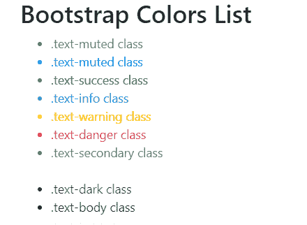
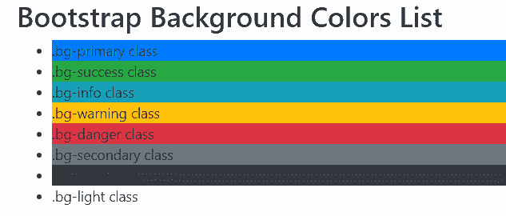

# 自举 4 |颜色

> 原文:[https://www.geeksforgeeks.org/bootstrap-4-colors/](https://www.geeksforgeeks.org/bootstrap-4-colors/)

**文本颜色:** Bootstrap 提供了很多类来设置元素的文本颜色。以下列出了所有类别的文本颜色:

**示例:**本示例使用文本颜色类设置文本内容的颜色。

## 超文本标记语言

```html
<!DOCTYPE html>
<html lang="en">

<head>
    <title>Bootstrap Color Example</title>

    <meta charset="utf-8">

    <meta name="viewport" content="width=device-width, initial-scale=1">

    <link rel="stylesheet" href=
"https://maxcdn.bootstrapcdn.com/bootstrap/4.3.1/css/bootstrap.min.css">

    <script src=
"https://ajax.googleapis.com/ajax/libs/jquery/3.3.1/jquery.min.js">
    </script>

    <script src=
"https://cdnjs.cloudflare.com/ajax/libs/popper.js/1.14.7/umd/popper.min.js">
    </script>

    <script src=
"https://maxcdn.bootstrapcdn.com/bootstrap/4.3.1/js/bootstrap.min.js">
    </script>
</head>

<body>
    <div class="container">
        <h2>Bootstrap Colors List</h2>
        <ul>
            <li class="text-muted">.text-muted class</li>
            <li class="text-primary">.text-muted class</li>
            <li class="text-success">.text-success class</li>
            <li class="text-info">.text-info class</li>
            <li class="text-warning">.text-warning class</li>
            <li class="text-danger">.text-danger class</li>
            <li class="text-secondary">.text-secondary class</li>
            <li class="text-white">.text-white class</li>
            <li class="text-dark">.text-dark class</li>
            <li class="text-body">.text-body class</li>
            <li class="text-light">.text-light class</li>
        </ul>
    </div>
</body>

</html>
```

**输出:**



**背景颜色:** Bootstrap 提供了很多类来设置元素的背景颜色。下面列出了所有类别的背景颜色:

**示例:**本示例使用背景色类设置内容的背景色。

## 超文本标记语言

```html
<!DOCTYPE html>
<html lang="en">

<head>
    <title>Bootstrap Background Color Example</title>

    <meta charset="utf-8">

    <meta name="viewport" content="width=device-width, initial-scale=1">

    <link rel="stylesheet" href=
"https://maxcdn.bootstrapcdn.com/bootstrap/4.3.1/css/bootstrap.min.css">

    <script src=
"https://ajax.googleapis.com/ajax/libs/jquery/3.3.1/jquery.min.js">
    </script>

    <script src=
"https://cdnjs.cloudflare.com/ajax/libs/popper.js/1.14.7/umd/popper.min.js">
    </script>

    <script src=
"https://maxcdn.bootstrapcdn.com/bootstrap/4.3.1/js/bootstrap.min.js">
    </script>
</head>

<body>
    <div class="container">
        <h2>Bootstrap Background Colors List</h2>
        <ul>
            <li class="bg-primary">.bg-primary class</li>
            <li class="bg-success">.bg-success class</li>
            <li class="bg-info">.bg-info class</li>
            <li class="bg-warning">.bg-warning class</li>
            <li class="bg-danger">.bg-danger class</li>
            <li class="bg-secondary">.bg-secondary class</li>
            <li class="bg-dark">.bg-dark class</li>
            <li class="bg-light">.bg-light class</li>
        </ul>
    </div>
</body>

</html>
```

**输出:**



**支持的浏览器:**

*   谷歌 Chrome
*   微软公司出品的 web 浏览器
*   火狐浏览器
*   歌剧
*   旅行队