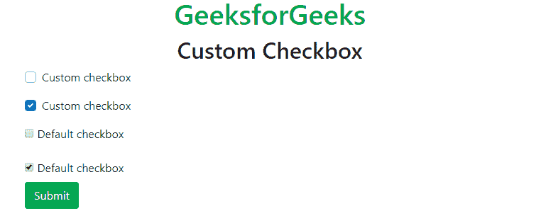
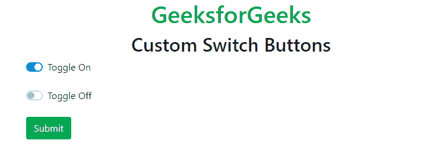
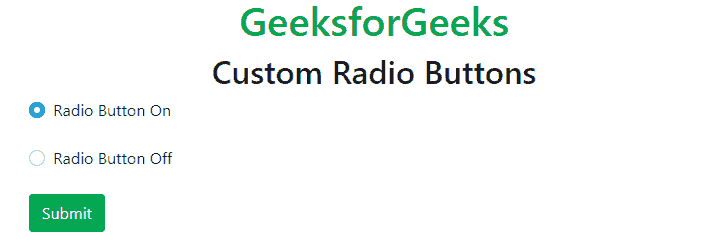
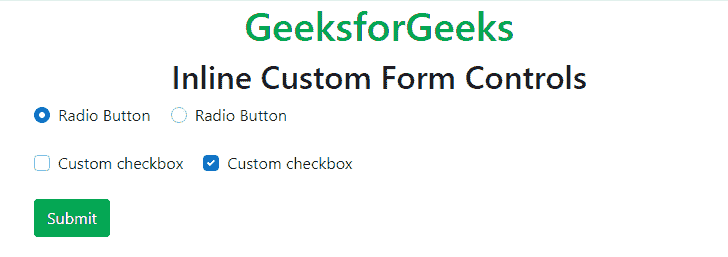
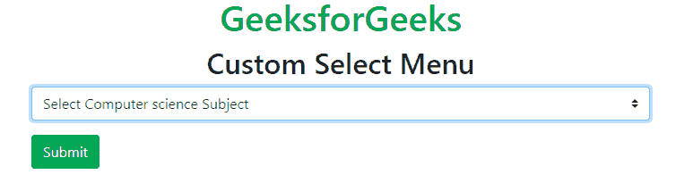
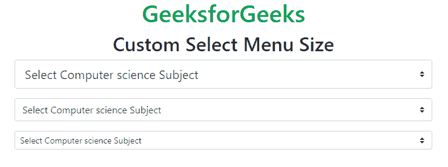
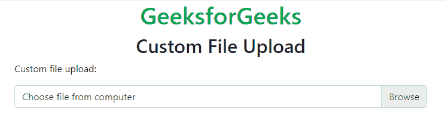
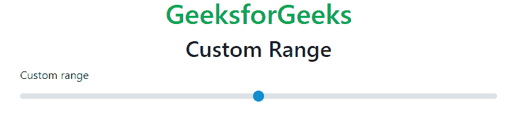

# 引导程序 4 |自定义表单

> 原文:[https://www.geeksforgeeks.org/bootstrap-4-custom-forms/](https://www.geeksforgeeks.org/bootstrap-4-custom-forms/)

Bootstrap 4 支持自定义浏览器的默认表单和控件布局。可以使用 Bootstrap 4 创建自定义表单，如复选框、单选按钮、文件输入等。Bootstrap 以多种形式简化了网页的对齐和样式化过程，如标签、输入、字段、文本区域、按钮、复选框等。
**自定义复选框:***。自定义控制*和*。自定义复选框*类在< div >元素中用于包装容器元素。*。自定义控件输入*类与 input type="checkbox "一起使用来创建自定义输入文本框。
**例:**

## 超文本标记语言

```
<!DOCTYPE html>
<html lang="en">

<head>
    <title>
        Bootstrap Custom forms
    </title>

    <meta charset="utf-8">

    <meta name="viewport"
        content="width=device-width, initial-scale=1">

    <link rel="stylesheet" href=
"https://maxcdn.bootstrapcdn.com/bootstrap/4.3.1/css/bootstrap.min.css">
    <script src=
"https://ajax.googleapis.com/ajax/libs/jquery/3.3.1/jquery.min.js">
    </script>
    <script src=
"https://cdnjs.cloudflare.com/ajax/libs/popper.js/1.14.7/umd/popper.min.js">
    </script>
    <script src=
"https://maxcdn.bootstrapcdn.com/bootstrap/4.3.1/js/bootstrap.min.js">
    </script>
</head>

<body>
    <div class="container">
        <h1 class="text-center text-success">GeeksforGeeks</h1>
        <h2 class="text-center">Custom Checkbox</h2>

        <form action="#">
            <div class="custom-control custom-checkbox mb-3">
                <input type="checkbox" class="custom-control-input"
                    id="customCheckBox" name="checkbox1">
                <label class="custom-control-label" for="customCheckBox">
                    Custom checkbox
                </label>
            </div>

            <div class="custom-control custom-checkbox mb-3">
                <input type="checkbox" class="custom-control-input"
                    id="customCheckBox" name="checkbox1" checked>
                <label class="custom-control-label" for="customCheckBox">
                    Custom checkbox
                </label>
            </div>

            <div class="mb-3">
                <input type="checkbox" id="defaultCheckBox" name="checkbox2">
                <label for="defaultCheckBox">Default checkbox</label>
            </div>

            <input type="checkbox" id="defaultCheckBox" name="checkbox2"
                    checked>
            <label for="defaultCheckBox">Default checkbox</label>
            <br>
            <button type="submit" class="btn btn-success">Submit</button>
        </form>
    </div>
</body>
</html>
```

**输出:**



**自定义开关:***。自定义控制*和*。自定义开关*类用于包装输入复选框。*。自定义-控制-输入*类与标签标签一起使用。引导开关/切换开关是一个简单的组件，用于激活两个预定义选项之一。通常用作开/关按钮。切换按钮允许用户在两种状态之间更改设置。
**例:**

## 超文本标记语言

```
<!DOCTYPE html>
<html lang="en">

<head>
    <title>
        Bootstrap Custom forms
    </title>

    <meta charset="utf-8">

    <meta name="viewport"
        content="width=device-width, initial-scale=1">

    <link rel="stylesheet" href=
"https://maxcdn.bootstrapcdn.com/bootstrap/4.3.1/css/bootstrap.min.css">
    <script src=
"https://ajax.googleapis.com/ajax/libs/jquery/3.3.1/jquery.min.js">
    </script>
    <script src=
"https://cdnjs.cloudflare.com/ajax/libs/popper.js/1.14.7/umd/popper.min.js">
    </script>
    <script src=
"https://maxcdn.bootstrapcdn.com/bootstrap/4.3.1/js/bootstrap.min.js">
    </script>
</head>

<body>
    <div class="container">
        <h1 class="text-center text-success">GeeksforGeeks</h1>
        <h2 class="text-center">Custom Switch Buttons</h2>

        <form action="#">
            <div class="custom-control custom-switch">
                <input type="checkbox" class="custom-control-input"
                    id="customSwitch" name="switch" checked>
                <label class="custom-control-label" for="customSwitch">
                    Toggle On
                </label>
            </div>
            <br>
            <div class="custom-control custom-switch">
                <input type="checkbox" class="custom-control-input"
                    id="customSwitch" name="switch">
                <label class="custom-control-label" for="customSwitch">
                    Toggle Off
                </label>
            </div>
            <br>
            <button type="submit" class="btn btn-success">Submit</button>
        </form>
    </div>
</body>
</html>
```

**输出:**



**自定义单选按钮:**与复选框相同。它使用*。定制收音机*而不是*。标签标签上的自定义输入*。复选框和单选按钮用于支持基于 HTML 的表单验证，并给出简短友好的标签。
**例:**

## 超文本标记语言

```
<!DOCTYPE html>
<html lang="en">

<head>
    <title>
        Bootstrap Custom forms
    </title>

    <meta charset="utf-8">

    <meta name="viewport"
        content="width=device-width, initial-scale=1">

    <link rel="stylesheet" href=
"https://maxcdn.bootstrapcdn.com/bootstrap/4.3.1/css/bootstrap.min.css">
    <script src=
"https://ajax.googleapis.com/ajax/libs/jquery/3.3.1/jquery.min.js">
    </script>
    <script src=
"https://cdnjs.cloudflare.com/ajax/libs/popper.js/1.14.7/umd/popper.min.js">
    </script>
    <script src=
"https://maxcdn.bootstrapcdn.com/bootstrap/4.3.1/js/bootstrap.min.js">
    </script>
</head>

<body>
    <div class="container">
        <h1 class="text-center text-success">GeeksforGeeks</h1>
        <h2 class="text-center">Custom Radio Buttons</h2>

        <form action="#">
            <div class="custom-control custom-radio">
                <input type="radio" class="custom-control-input"
                    id="customRadio" name="radioButton" checked>
                <label class="custom-control-label" for="customRadio">
                    Radio Button On
                </label>
            </div>
            <br>
            <div class="custom-control custom-radio">
                <input type="radio" class="custom-control-input"
                    id="customRadio" name="radioButton">
                <label class="custom-control-label" for="customRadio">
                    Radio Button Off
                </label>
            </div>
            <br>
            <button type="submit" class="btn btn-success">Submit</button>
        </form>
    </div>
</body>
</html>
```

**输出:**



**自定义内联表单控件:**自定义复选框和单选按钮用作默认使用内联控件，通过使用*内联显示它们。自定义-控制-内联*类。通过添加*，将复选框或单选按钮分组在同一水平行上。表格-检查-内联*至*。表单检查*类。
**例:**

## 超文本标记语言

```
<!DOCTYPE html>
<html lang="en">

<head>
    <title>
        Bootstrap Custom forms
    </title>

    <meta charset="utf-8">

    <meta name="viewport"
        content="width=device-width, initial-scale=1">

    <link rel="stylesheet" href=
"https://maxcdn.bootstrapcdn.com/bootstrap/4.3.1/css/bootstrap.min.css">
    <script src=
"https://ajax.googleapis.com/ajax/libs/jquery/3.3.1/jquery.min.js">
    </script>
    <script src=
"https://cdnjs.cloudflare.com/ajax/libs/popper.js/1.14.7/umd/popper.min.js">
    </script>
    <script src=
"https://maxcdn.bootstrapcdn.com/bootstrap/4.3.1/js/bootstrap.min.js">
    </script>
</head>

<body>
    <div class="container">
        <h1 class="text-center text-success">GeeksforGeeks</h1>
        <h2 class="text-center">Inline Custom Form Controls</h2>

        <form action="#">
            <div class="custom-control custom-radio custom-control-inline">
                <input type="radio" class="custom-control-input"
                    id="customRadio" name="radioButton" checked>
                <label class="custom-control-label" for="customRadio">
                    Radio Button
                </label>
            </div>
            <div class="custom-control custom-radio custom-control-inline">
                <input type="radio" class="custom-control-input"
                    id="customRadio" name="radioButton">
                <label class="custom-control-label" for="customRadio">
                    Radio Button
                </label>
            </div>
            <br><br>
            <div class="custom-control custom-checkbox custom-control-inline">
                <input type="checkbox" class="custom-control-input"
                    id="customCheckBox" name="checkbox1">
                <label class="custom-control-label" for="customCheckBox">
                    Custom checkbox
                </label>
            </div>
            <div class="custom-control custom-checkbox custom-control-inline">
                <input type="checkbox" class="custom-control-input"
                    id="customCheckBox" name="checkbox1" checked>
                <label class="custom-control-label" for="customCheckBox">
                    Custom checkbox
                </label>
            </div>
            <br><br>
            <button type="submit" class="btn btn-success">Submit</button>
        </form>
    </div>
</body>
</html>
```

**输出:**



**自定义选择菜单:**用于选择任意特定的属性值，并根据用户需要进行自定义。*。自定义选择*类用于在<选择>元素内创建自定义菜单。使用<选择>和<选项>标签进行定制。在选项标签中，它会给出值，并在运行程序时显示在下拉列表中。
**例:**

## 超文本标记语言

```
<!DOCTYPE html>
<html lang="en">

<head>
    <title>
        Bootstrap Custom forms
    </title>

    <meta charset="utf-8">

    <meta name="viewport"
        content="width=device-width, initial-scale=1">

    <link rel="stylesheet" href=
"https://maxcdn.bootstrapcdn.com/bootstrap/4.3.1/css/bootstrap.min.css">
    <script src=
"https://ajax.googleapis.com/ajax/libs/jquery/3.3.1/jquery.min.js">
    </script>
    <script src=
"https://cdnjs.cloudflare.com/ajax/libs/popper.js/1.14.7/umd/popper.min.js">
    </script>
    <script src=
"https://maxcdn.bootstrapcdn.com/bootstrap/4.3.1/js/bootstrap.min.js">
    </script>
</head>

<body>
    <div class="container">
        <h1 class="text-center text-success">GeeksforGeeks</h1>
        <h2 class="text-center">Custom Select Menu</h2>

        <form action="#">
            <select name="sub" class="custom-select mb-3">
                <option selected>Select Computer science Subject</option>
                <option value="DS">Data Structure</option>
                <option value="Algo">Algorithm</option>
                <option value="CN">Computer Networks</option>
                <option value="OS">Operating System</option>
            </select>

            <button type="submit" class="btn btn-success">Submit</button>
        </form>
    </div>
</body>
</html>
```

**输出:**



**自定义选择菜单尺寸:***。自定义-选择-sm* 类用于创建小和*。自定义-选择-lg* 类用于创建大型选择菜单。
**例:**

## 超文本标记语言

```
<!DOCTYPE html>
<html lang="en">

<head>
    <title>
        Bootstrap Custom forms
    </title>

    <meta charset="utf-8">

    <meta name="viewport"
        content="width=device-width, initial-scale=1">

    <link rel="stylesheet" href=
"https://maxcdn.bootstrapcdn.com/bootstrap/4.3.1/css/bootstrap.min.css">
    <script src=
"https://ajax.googleapis.com/ajax/libs/jquery/3.3.1/jquery.min.js">
    </script>
    <script src=
"https://cdnjs.cloudflare.com/ajax/libs/popper.js/1.14.7/umd/popper.min.js">
    </script>
    <script src=
"https://maxcdn.bootstrapcdn.com/bootstrap/4.3.1/js/bootstrap.min.js">
    </script>
</head>

<body>
    <div class="container">
        <h1 class="text-center text-success">GeeksforGeeks</h1>
        <h2 class="text-center">Custom Select Menu Size</h2>

        <form action="#">
            <select name="sub" class="custom-select custom-select-lg mb-3">
                <option selected>Select Computer science Subject</option>
                <option value="DS">Data Structure</option>
                <option value="Algo">Algorithm</option>
                <option value="CN">Computer Networks</option>
                <option value="OS">Operating System</option>
            </select>

            <select name="sub" class="custom-select custom-select mb-3">
                <option selected>Select Computer science Subject</option>
                <option value="DS">Data Structure</option>
                <option value="Algo">Algorithm</option>
                <option value="CN">Computer Networks</option>
                <option value="OS">Operating System</option>
            </select>

            <select name="sub" class="custom-select custom-select-sm mb-3">
                <option selected>Select Computer science Subject</option>
                <option value="DS">Data Structure</option>
                <option value="Algo">Algorithm</option>
                <option value="CN">Computer Networks</option>
                <option value="OS">Operating System</option>
            </select>
        </form>
    </div>
</body>
</html>
```



**自定义文件上传:**要制作自定义文件控件，请将标签包装在使用的 div 标签中。自定义文件类。文件上传器组件从早期就一直是 HTML 规范的一部分。然而最近，它经常隐藏在支持文件拖放和图像预览的更好的用户界面后面。一些基本的重新设计经典输入框的按钮，统一所有浏览器的渲染是可能的。
用于标签标签。自定义控件标签类。
为其使用的输入标签。自定义控件输入类。
**例:**

## 超文本标记语言

```
<!DOCTYPE html>
<html lang="en">

<head>
    <title>
        Bootstrap Custom forms
    </title>

    <meta charset="utf-8">

    <meta name="viewport"
        content="width=device-width, initial-scale=1">

    <link rel="stylesheet" href=
"https://maxcdn.bootstrapcdn.com/bootstrap/4.3.1/css/bootstrap.min.css">
    <script src=
"https://ajax.googleapis.com/ajax/libs/jquery/3.3.1/jquery.min.js">
    </script>
    <script src=
"https://cdnjs.cloudflare.com/ajax/libs/popper.js/1.14.7/umd/popper.min.js">
    </script>
    <script src=
"https://maxcdn.bootstrapcdn.com/bootstrap/4.3.1/js/bootstrap.min.js">
    </script>
</head>

<body>
    <div class="container">
        <h1 class="text-center text-success">GeeksforGeeks</h1>
        <h2 class="text-center">Custom File Upload</h2>

        <form action="#">

<p>Custom file upload:</p>

            <div class="custom-file">
                <input type="file" class="custom-file-input"
                        id="fileUpload" name="file_name">
                <label class="custom-file-label" for="fileUpload">
                    Choose file from computer
                </label>
            </div>
        </form>
    </div>

    <!-- Script to appear file name in select box -->
    <script>
        $(".custom-file-input").on("change", function() {
            var file_name = $(this).val().split("\\").pop();
            $(this).siblings(".custom-file-label")
                    .addClass("selected").html(file_name);
        });
</script>

</body>
</html>
```

**输出:**



**定制范围:***。自定义范围*类用于在<范围>元素内创建自定义范围菜单。
**例:**

## 超文本标记语言

```
<!DOCTYPE html>
<html lang="en">

<head>
    <title>
        Bootstrap Custom forms
    </title>

    <meta charset="utf-8">

    <meta name="viewport"
        content="width=device-width, initial-scale=1">

    <link rel="stylesheet" href=
"https://maxcdn.bootstrapcdn.com/bootstrap/4.3.1/css/bootstrap.min.css">
    <script src=
"https://ajax.googleapis.com/ajax/libs/jquery/3.3.1/jquery.min.js">
    </script>
    <script src=
"https://cdnjs.cloudflare.com/ajax/libs/popper.js/1.14.7/umd/popper.min.js">
    </script>
    <script src=
"https://maxcdn.bootstrapcdn.com/bootstrap/4.3.1/js/bootstrap.min.js">
    </script>
</head>

<body>
    <div class="container">
        <h1 class="text-center text-success">GeeksforGeeks</h1>
        <h2 class="text-center">Custom Range</h2>

        <form action="#">
            <label for="cus_range">Custom range</label>

            <input type="range" class="custom-range"
                    id="cus_range" name="range">
        </form>
    </div>
</body>
</html>
```



**支持的浏览器:**

*   谷歌 Chrome
*   微软公司出品的 web 浏览器
*   火狐浏览器
*   歌剧
*   旅行队