# 引导 4 |下拉

> 原文:[https://www.geeksforgeeks.org/bootstrap-4-dropdowns/](https://www.geeksforgeeks.org/bootstrap-4-dropdowns/)

下拉菜单是交互式网站最重要的部分之一。下拉菜单是菜单项的集合，允许用户从列表中选择一个值。*。下拉*类用于设计下拉菜单。

**示例:**

## 超文本标记语言

```html
<!DOCTYPE html>
<html lang="en">
<head>
    <title>Dropdowns</title>

    <meta charset="utf-8">
    <meta name="viewport" content="width=device-width, initial-scale=1">

    <link rel="stylesheet" href=
"https://maxcdn.bootstrapcdn.com/bootstrap/4.3.1/css/bootstrap.min.css">

    <script src=
"https://ajax.googleapis.com/ajax/libs/jquery/3.3.1/jquery.min.js">
    </script>

    <script src=
"https://cdnjs.cloudflare.com/ajax/libs/popper.js/1.14.7/umd/popper.min.js">
    </script>

    <script src=
"https://maxcdn.bootstrapcdn.com/bootstrap/4.3.1/js/bootstrap.min.js">
    </script>
</head>

<body style="text-align:center;">

    <div class="container">

        <h1 style="color:green;">
            GeeksforGeeks
        </h1>

        <h2>Dropdown List</h2>

        <div class="dropdown">

            <button type="button" class="btn btn-success dropdown-toggle"
                        data-toggle="dropdown">
                Select CS Subjects
            </button>

            <div class="dropdown-menu">
                <a class="dropdown-item" href="#">Data Structure</a>
                <a class="dropdown-item" href="#">Algorithm</a>
                <a class="dropdown-item" href="#">Operating System</a>
                <a class="dropdown-item" href="#">Computer Networks</a>
            </div>
        </div>
    </div>
</body>

</html>                   
```

**输出:**

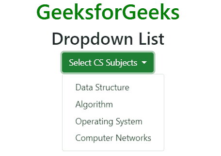

**下拉分隔线:***。下拉分隔线*类用于用细横线分割下拉菜单列表。
**例:**

## 超文本标记语言

```html
<!DOCTYPE html>
<html lang="en">
<head>
    <title>Dropdowns</title>

    <meta charset="utf-8">
    <meta name="viewport" content="width=device-width, initial-scale=1">

    <link rel="stylesheet" href=
"https://maxcdn.bootstrapcdn.com/bootstrap/4.3.1/css/bootstrap.min.css">

    <script src=
"https://ajax.googleapis.com/ajax/libs/jquery/3.3.1/jquery.min.js">
    </script>

    <script src=
"https://cdnjs.cloudflare.com/ajax/libs/popper.js/1.14.7/umd/popper.min.js">
    </script>

    <script src=
"https://maxcdn.bootstrapcdn.com/bootstrap/4.3.1/js/bootstrap.min.js">
    </script>
</head>

<body style="text-align:center;">

    <div class="container">

        <h1 style="color:green;">
            GeeksforGeeks
        </h1>

        <h2>Dropdown Divider List</h2>

        <div class="dropdown">

            <button type="button" class="btn btn-success dropdown-toggle"
                        data-toggle="dropdown">
                Select Subjects
            </button>

            <div class="dropdown-menu">
                <a class="dropdown-item" href="#">Data Structure</a>
                <a class="dropdown-item" href="#">Algorithm</a>
                <a class="dropdown-item" href="#">Operating System</a>
                <a class="dropdown-item" href="#">Computer Networks</a>

                <div class="dropdown-divider"></div>
                <a class="dropdown-item" href="#">Physics</a>
                <a class="dropdown-item" href="#">Mathematics</a>
                <a class="dropdown-item" href="#">Chemistry</a>
            </div>
        </div>
    </div>
</body>

</html>                   
```

**输出:**

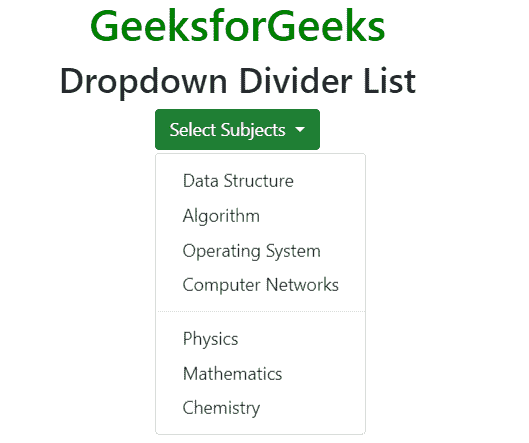

**下拉标题:***。下拉标题*类用于在下拉列表中添加标题部分。
**例:**

## 超文本标记语言

```html
<!DOCTYPE html>
<html lang="en">
<head>
    <title>Dropdowns List</title>

    <meta charset="utf-8">
    <meta name="viewport" content="width=device-width, initial-scale=1">

    <link rel="stylesheet" href=
"https://maxcdn.bootstrapcdn.com/bootstrap/4.3.1/css/bootstrap.min.css">

    <script src=
"https://ajax.googleapis.com/ajax/libs/jquery/3.3.1/jquery.min.js">
    </script>

    <script src=
"https://cdnjs.cloudflare.com/ajax/libs/popper.js/1.14.7/umd/popper.min.js">
    </script>

    <script src=
"https://maxcdn.bootstrapcdn.com/bootstrap/4.3.1/js/bootstrap.min.js">
    </script>
</head>

<body style="text-align:center;">

    <div class="container">

        <h1 style="color:green;">
            GeeksforGeeks
        </h1>

        <h2>Dropdown Header List</h2>

        <div class="dropdown">

            <button type="button" class="btn btn-success dropdown-toggle"
                        data-toggle="dropdown">
                Select Subjects
            </button>

            <div class="dropdown-menu">
                <strong class="dropdown-header">CS Subjects</strong>
                <a class="dropdown-item" href="#">Data Structure</a>
                <a class="dropdown-item" href="#">Algorithm</a>
                <a class="dropdown-item" href="#">Operating System</a>
                <a class="dropdown-item" href="#">Computer Networks</a>

                <div class="dropdown-divider"></div>
                <strong class="dropdown-header">Other Subjects</strong>
                <a class="dropdown-item" href="#">Physics</a>
                <a class="dropdown-item" href="#">Mathematics</a>
                <a class="dropdown-item" href="#">Chemistry</a>
            </div>
        </div>
    </div>
</body>

</html>                   
```

**输出:**

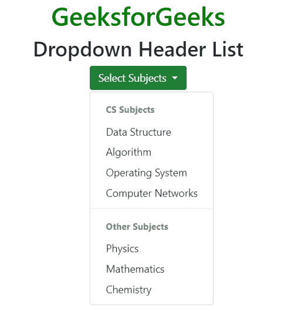

**禁用和激活项目:***。激活*类用于添加高亮显示的列表项。*。禁用*类用于禁用物品列表。
**例:**

## 超文本标记语言

```html
<!DOCTYPE html>
<html lang="en">
<head>
    <title>Dropdowns List</title>

    <meta charset="utf-8">
    <meta name="viewport" content="width=device-width, initial-scale=1">

    <link rel="stylesheet" href=
"https://maxcdn.bootstrapcdn.com/bootstrap/4.3.1/css/bootstrap.min.css">

    <script src=
"https://ajax.googleapis.com/ajax/libs/jquery/3.3.1/jquery.min.js">
    </script>

    <script src=
"https://cdnjs.cloudflare.com/ajax/libs/popper.js/1.14.7/umd/popper.min.js">
    </script>

    <script src=
"https://maxcdn.bootstrapcdn.com/bootstrap/4.3.1/js/bootstrap.min.js">
    </script>
</head>

<body style="text-align:center;">

    <div class="container">

        <h1 style="color:green;">
            GeeksforGeeks
        </h1>

        <h3>Dropdown Disable and Active items List</h3>

        <div class="dropdown">

            <button type="button" class="btn btn-success dropdown-toggle"
                        data-toggle="dropdown">
                Select Subjects
            </button>

            <div class="dropdown-menu">
                <a class="dropdown-item active" href="#">Data Structure</a>
                <a class="dropdown-item disabled" href="#">Algorithm</a>
                <a class="dropdown-item active" href="#">Operating System</a>
                <a class="dropdown-item" href="#">Computer Networks</a>
            </div>
        </div>
    </div>
</body>

</html>                   
```

**输出:**

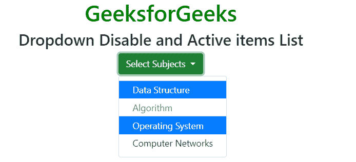

**下拉位置:***。右移*和*。dropleft* 类用于设置下拉列表在左右两侧的位置。
**例 1:**

## 超文本标记语言

```html
<!DOCTYPE html>
<html lang="en">
<head>
    <title>Dropdowns List</title>

    <meta charset="utf-8">
    <meta name="viewport" content="width=device-width, initial-scale=1">

    <link rel="stylesheet" href=
"https://maxcdn.bootstrapcdn.com/bootstrap/4.3.1/css/bootstrap.min.css">

    <script src=
"https://ajax.googleapis.com/ajax/libs/jquery/3.3.1/jquery.min.js">
    </script>

    <script src=
"https://cdnjs.cloudflare.com/ajax/libs/popper.js/1.14.7/umd/popper.min.js">
    </script>

    <script src=
"https://maxcdn.bootstrapcdn.com/bootstrap/4.3.1/js/bootstrap.min.js">
    </script>
</head>

<body style="text-align:center;">

    <div class="container">

        <h1 style="color:green;">
            GeeksforGeeks
        </h1>

        <h3>Dropdown Right items List</h3>

        <div class="dropdown dropright">

            <button type="button" class="btn btn-success dropdown-toggle"
                        data-toggle="dropdown">
                Select Subjects
            </button>

            <div class="dropdown-menu">
                <a class="dropdown-item" href="#">Data Structure</a>
                <a class="dropdown-item" href="#">Algorithm</a>
                <a class="dropdown-item" href="#">Operating System</a>
                <a class="dropdown-item" href="#">Computer Networks</a>
            </div>
        </div>
    </div>
</body>

</html>                   
```

**输出:**

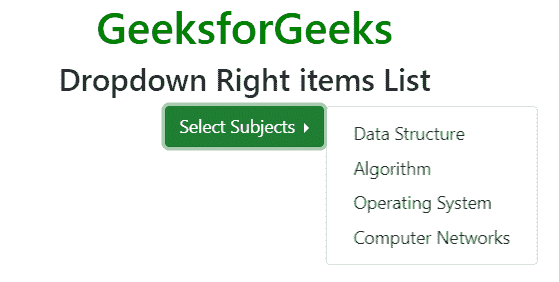

**例 2:**

## 超文本标记语言

```html
<!DOCTYPE html>
<html lang="en">
<head>
    <title>Dropdowns List</title>

    <meta charset="utf-8">
    <meta name="viewport" content="width=device-width, initial-scale=1">

    <link rel="stylesheet" href=
"https://maxcdn.bootstrapcdn.com/bootstrap/4.3.1/css/bootstrap.min.css">

    <script src=
"https://ajax.googleapis.com/ajax/libs/jquery/3.3.1/jquery.min.js">
    </script>

    <script src=
"https://cdnjs.cloudflare.com/ajax/libs/popper.js/1.14.7/umd/popper.min.js">
    </script>

    <script src=
"https://maxcdn.bootstrapcdn.com/bootstrap/4.3.1/js/bootstrap.min.js">
    </script>
</head>

<body style="text-align:center;">

    <div class="container">

        <h1 style="color:green;">
            GeeksforGeeks
        </h1>

        <h3>Dropdown Left items List</h3>

        <div class="dropdown dropleft">

            <button type="button" class="btn btn-success dropdown-toggle"
                        data-toggle="dropdown">
                Select Subjects
            </button>

            <div class="dropdown-menu">
                <a class="dropdown-item" href="#">Data Structure</a>
                <a class="dropdown-item" href="#">Algorithm</a>
                <a class="dropdown-item" href="#">Operating System</a>
                <a class="dropdown-item" href="#">Computer Networks</a>
            </div>
        </div>
    </div>
</body>

</html>                   
```

**输出:**

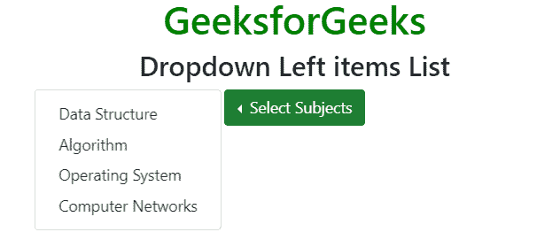

**下拉菜单右对齐:***。下拉菜单-右*类用于设置下拉菜单的右对齐。
**例:**

## 超文本标记语言

```html
<!DOCTYPE html>
<html lang="en">
<head>
    <title>Dropdowns List</title>

    <meta charset="utf-8">
    <meta name="viewport" content="width=device-width, initial-scale=1">

    <link rel="stylesheet" href=
"https://maxcdn.bootstrapcdn.com/bootstrap/4.3.1/css/bootstrap.min.css">

    <script src=
"https://ajax.googleapis.com/ajax/libs/jquery/3.3.1/jquery.min.js">
    </script>

    <script src=
"https://cdnjs.cloudflare.com/ajax/libs/popper.js/1.14.7/umd/popper.min.js">
    </script>

    <script src=
"https://maxcdn.bootstrapcdn.com/bootstrap/4.3.1/js/bootstrap.min.js">
    </script>
</head>

<body style="text-align:center;">

    <div class="container">

        <h1 style="color:green;">
            GeeksforGeeks
        </h1>

        <h3>Dropdown Menu Right Aligned</h3>

        <div class="dropdown">

            <button type="button" class="btn btn-success dropdown-toggle"
                        data-toggle="dropdown">
                Select Computer Science Subject from List
            </button>

            <div class="dropdown-menu dropdown-menu-right">
                <a class="dropdown-item" href="#">Data Structure</a>
                <a class="dropdown-item" href="#">Algorithm</a>
                <a class="dropdown-item" href="#">Operating System</a>
                <a class="dropdown-item" href="#">Computer Networks</a>
            </div>
        </div>
    </div>
</body>

</html>                   
```

**输出:**

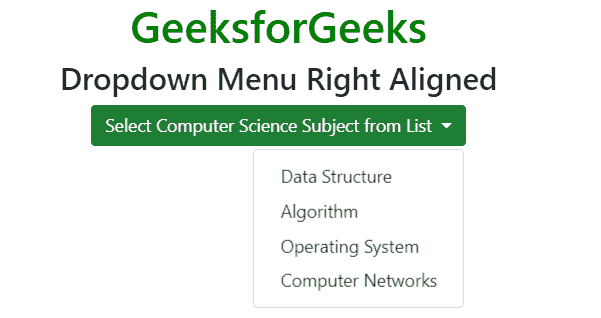

**下降:**T2。使用 dropup 类代替*。下拉*类以 upwords 展开菜单列表。
**例:**

## 超文本标记语言

```html
<!DOCTYPE html>
<html lang="en">
<head>
    <title>Dropdowns List</title>

    <meta charset="utf-8">
    <meta name="viewport" content="width=device-width, initial-scale=1">

    <link rel="stylesheet" href=
"https://maxcdn.bootstrapcdn.com/bootstrap/4.3.1/css/bootstrap.min.css">

    <script src=
"https://ajax.googleapis.com/ajax/libs/jquery/3.3.1/jquery.min.js">
    </script>

    <script src=
"https://cdnjs.cloudflare.com/ajax/libs/popper.js/1.14.7/umd/popper.min.js">
    </script>

    <script src=
"https://maxcdn.bootstrapcdn.com/bootstrap/4.3.1/js/bootstrap.min.js">
    </script>
</head>

<body style="text-align:center;">

    <br><br><br><br>

    <div class="container">

        <h1 style="color:green;">
            GeeksforGeeks
        </h1>

        <h3>Dropup List</h3>

        <div class="dropup">

            <button type="button" class="btn btn-success dropdown-toggle"
                        data-toggle="dropdown">
                Select Subject
            </button>

            <div class="dropdown-menu">
                <a class="dropdown-item" href="#">Data Structure</a>
                <a class="dropdown-item" href="#">Algorithm</a>
                <a class="dropdown-item" href="#">Operating System</a>
                <a class="dropdown-item" href="#">Computer Networks</a>
            </div>
        </div>
    </div>
</body>

</html>                   
```

**输出:**

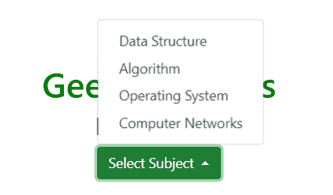

**下拉文本:***。下拉-项目-文本*类用于在下拉菜单列表中添加纯文本。
**例:**

## 超文本标记语言

```html
<!DOCTYPE html>
<html lang="en">
<head>
    <title>Dropdowns List</title>

    <meta charset="utf-8">
    <meta name="viewport" content="width=device-width, initial-scale=1">

    <link rel="stylesheet" href=
"https://maxcdn.bootstrapcdn.com/bootstrap/4.3.1/css/bootstrap.min.css">

    <script src=
"https://ajax.googleapis.com/ajax/libs/jquery/3.3.1/jquery.min.js">
    </script>

    <script src=
"https://cdnjs.cloudflare.com/ajax/libs/popper.js/1.14.7/umd/popper.min.js">
    </script>

    <script src=
"https://maxcdn.bootstrapcdn.com/bootstrap/4.3.1/js/bootstrap.min.js">
    </script>
</head>

<body style="text-align:center;">

    <div class="container">

        <h1 style="color:green;">
            GeeksforGeeks
        </h1>

        <h3>Dropdown Text</h3>

        <div class="dropdown">

            <button type="button" class="btn btn-success dropdown-toggle"
                        data-toggle="dropdown">
                Select Subject
            </button>

            <div class="dropdown-menu">
                <div class="dropdown-item-text">Data Structure</div>
                <div class="dropdown-item-text">Algorithm</div>
                <div class="dropdown-item-text">Operating System</div>
                <div class="dropdown-item-text">Computer Networks</div>
            </div>
        </div>
    </div>
</body>

</html>                   
```

**输出:**

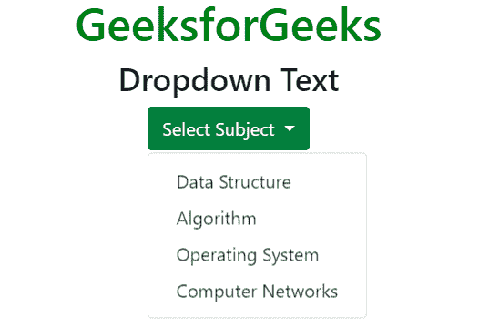

**下拉分组按钮:***。btn-group* 类用于创建一组按钮和*。下拉菜单*类用于创建下拉列表。
**例:**

## 超文本标记语言

```html
<!DOCTYPE html>
<html lang="en">
<head>
    <title>Dropdowns List</title>

    <meta charset="utf-8">
    <meta name="viewport" content="width=device-width, initial-scale=1">

    <link rel="stylesheet" href=
"https://maxcdn.bootstrapcdn.com/bootstrap/4.3.1/css/bootstrap.min.css">

    <script src=
"https://ajax.googleapis.com/ajax/libs/jquery/3.3.1/jquery.min.js">
    </script>

    <script src=
"https://cdnjs.cloudflare.com/ajax/libs/popper.js/1.14.7/umd/popper.min.js">
    </script>

    <script src=
"https://maxcdn.bootstrapcdn.com/bootstrap/4.3.1/js/bootstrap.min.js">
    </script>
</head>

<body style="text-align:center;">

    <div class="container">

        <h1 style="color:green;">
            GeeksforGeeks
        </h1>

        <h3>Grouped Buttons with a Dropdown</h3>

        <div class="btn-group">

            <button type="button" class="btn btn-success btn-primary">
                Programming
            </button>

            <button type="button" class="btn btn-success btn-primary">
                Theory
            </button>

            <div class="btn-group">

                <button type="button" class="btn btn-success dropdown-toggle"
                            data-toggle="dropdown">
                    Select Subject
                </button>

                <div class="dropdown-menu">
                    <div class="dropdown-item-text">Data Structure</div>
                    <div class="dropdown-item-text">Algorithm</div>
                    <div class="dropdown-item-text">Operating System</div>
                    <div class="dropdown-item-text">Computer Networks</div>
                </div>
            </div>
        </div>
    </div>
</body>

</html>                   
```

**输出:**

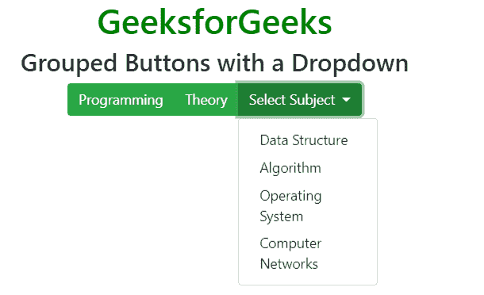

**分离按钮下拉菜单:***。下拉-切换-拆分*类用于拆分下拉按钮。
**例:**

## 超文本标记语言

```html
<!DOCTYPE html>
<html lang="en">
<head>
    <title>Dropdowns List</title>

    <meta charset="utf-8">
    <meta name="viewport" content="width=device-width, initial-scale=1">

    <link rel="stylesheet" href=
"https://maxcdn.bootstrapcdn.com/bootstrap/4.3.1/css/bootstrap.min.css">

    <script src=
"https://ajax.googleapis.com/ajax/libs/jquery/3.3.1/jquery.min.js">
    </script>

    <script src=
"https://cdnjs.cloudflare.com/ajax/libs/popper.js/1.14.7/umd/popper.min.js">
    </script>

    <script src=
"https://maxcdn.bootstrapcdn.com/bootstrap/4.3.1/js/bootstrap.min.js">
    </script>
</head>

<body style="text-align:center;">

    <div class="container">

        <h1 style="color:green;">
            GeeksforGeeks
        </h1>

        <h3>Split Button Dropdown List</h3>

        <div class="btn-group">

            <button type="button" class="btn btn-success btn-primary">
                Programming
            </button>
            <button type="button" class="btn btn-success dropdown-toggle
                    dropdown-toggle-split" data-toggle="dropdown">
            </button>

            <div class="dropdown-menu">
                <a class="dropdown-item" href="#">C Programming</a>
                <a class="dropdown-item" href="#">C++ Programming</a>
                <a class="dropdown-item" href="#">Java Programming</a>
            </div>
        </div>

        <div class="btn-group">
            <button type="button" class="btn btn-success btn-primary">
                Theory
            </button>

            <button type="button" class="btn btn-success dropdown-toggle
                    dropdown-toggle-split" data-toggle="dropdown">
            </button>

            <div class="dropdown-menu">
                <a class="dropdown-item" href="#">Operating System</a>
                <a class="dropdown-item" href="#">Computer Networks</a>
            </div>
        </div>

        <div class="btn-group">
            <button type="button" class="btn btn-success btn-primary">
                Select Subject
            </button>

            <button type="button" class="btn btn-success dropdown-toggle
                    dropdown-toggle-split" data-toggle="dropdown">
            </button>

            <div class="dropdown-menu">
                <div class="dropdown-item">Data Structure</div>
                <div class="dropdown-item">Algorithm</div>
                <div class="dropdown-item">Operating System</div>
                <div class="dropdown-item">Computer Networks</div>
            </div>
        </div>
    </div>
</body>

</html>                   
```

**输出:**

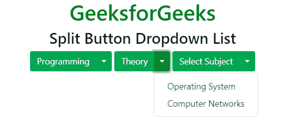

**垂直按钮组下拉列表:***。btn-group-vertical* 类用于创建带有 fropdown 列表的垂直按钮组。
**例:**

## 超文本标记语言

```html
<!DOCTYPE html>
<html lang="en">
<head>
    <title>Dropdowns List</title>

    <meta charset="utf-8">
    <meta name="viewport" content="width=device-width, initial-scale=1">

    <link rel="stylesheet" href=
"https://maxcdn.bootstrapcdn.com/bootstrap/4.3.1/css/bootstrap.min.css">

    <script src=
"https://ajax.googleapis.com/ajax/libs/jquery/3.3.1/jquery.min.js">
    </script>

    <script src=
"https://cdnjs.cloudflare.com/ajax/libs/popper.js/1.14.7/umd/popper.min.js">
    </script>

    <script src=
"https://maxcdn.bootstrapcdn.com/bootstrap/4.3.1/js/bootstrap.min.js">
    </script>
</head>

<body style="text-align:center;">

    <div class="container">

        <h1 style="color:green;">
            GeeksforGeeks
        </h1>

        <h3>Vertical Button Group Dropdown List</h3>

        <div class="btn-group-vertical">
            <div class="btn-group dropright">

                <button type="button" class="btn btn-success btn-primary">
                    Programming
                </button>
                <button type="button" class="btn btn-success dropdown-toggle
                        dropdown-toggle-split" data-toggle="dropdown">
                </button>

                <div class="dropdown-menu">
                    <a class="dropdown-item" href="#">C Programming</a>
                    <a class="dropdown-item" href="#">C++ Programming</a>
                    <a class="dropdown-item" href="#">Java Programming</a>
                </div>
            </div>

            <div class="btn-group dropright">
                <button type="button" class="btn btn-success btn-primary">
                    Theory
                </button>

                <button type="button" class="btn btn-success dropdown-toggle
                        dropdown-toggle-split" data-toggle="dropdown">
                </button>

                <div class="dropdown-menu">
                    <a class="dropdown-item" href="#">Operating System</a>
                    <a class="dropdown-item" href="#">Computer Networks</a>
                </div>
            </div>
        </div>
    </div>
</body>

</html>                   
```

**输出:**

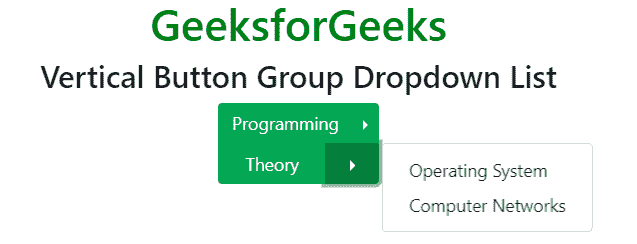

**支持的浏览器:**

*   谷歌 Chrome
*   微软公司出品的 web 浏览器
*   火狐浏览器
*   歌剧
*   旅行队