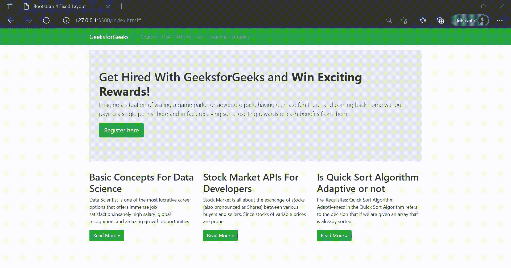

# 自举 4 固定布局

> 原文:[https://www.geeksforgeeks.org/bootstrap-4-fixed-layout/](https://www.geeksforgeeks.org/bootstrap-4-fixed-layout/)

[**【Bootstrap】**](https://www.geeksforgeeks.org/bootstrap-tutorials/)**是一个免费的开源工具集合，用于创建[响应网站](https://www.geeksforgeeks.org/short-note-on-responsive-web-design/)和 web 应用。这是目前最流行的 [HTML](https://www.geeksforgeeks.org/html-tutorials/) 、 [CSS](https://www.geeksforgeeks.org/css-tutorials/) 、 [JavaScript](https://www.geeksforgeeks.org/javascript-tutorial/) 开发响应式网站的框架。它解决了跨浏览器兼容性问题。**

**下面的类在每个响应断点处设置最大宽度。**

****语法:****

```
.container
```

****boost trap 固定布局:**这种布局使网站页面设计依赖于适当的像素数量，容器宽度根据视口宽度而不同，并且格式是响应性的。创建固定布局的最常见方式始于“*”。集装箱*”类。你可以和“*”吵一架。划*”类来包装段位的偶数聚会。将在*中插入行。容器*”(固定宽度)用于合法排列和填充。**

****示例:**以下示例说明了使用 [Bootstrap 4](https://www.geeksforgeeks.org/bootstrap-4-introduction/) 的固定布局。**

## **超文本标记语言**

```
<!DOCTYPE html>
<html lang="en">
<head>
   <meta charset="utf-8">
   <meta name="viewport" 
         content="width=device-width, 
                  initial-scale=1, 
                  shrink-to-fit=no">
   <title>Bootstrap 4 Fixed Layout</title>
   <link rel="stylesheet" 
         href=
"https://stackpath.bootstrapcdn.com/bootstrap/4.5.2/css/bootstrap.min.css">
   <link rel="stylesheet" 
         href=
"https://maxcdn.bootstrapcdn.com/font-awesome/4.7.0/css/font-awesome.min.css">
   <script src=
"https://code.jquery.com/jquery-3.5.1.min.js">
    </script>
    <script src=
"https://cdn.jsdelivr.net/npm/popper.js@1.16.1/dist/umd/popper.min.js">
    </script>
    <script src=
"https://stackpath.bootstrapcdn.com/bootstrap/4.5.2/js/bootstrap.min.js">
    </script>
</head>
<body>
    <nav class="navbar navbar-expand-md
                navbar-dark bg-success mb-3">
      <div class="container">
          <a href="#" class="navbar-brand mr-3">GeeksforGeeks</a>
          <button type="button" 
                  class="navbar-toggler" 
                  data-toggle="collapse" 
                  data-target="#navbarCollapse">
            <span class="navbar-toggler-icon"></span>
          </button>
        <div class="collapse navbar-collapse"
             id="navbarCollapse">
          <div class="navbar-nav">
            <a href="#" class="nav-item nav-link active"></a>
            <a href="#" class="nav-item nav-link">Courses</a>
            <a href="#" class="nav-item nav-link">DSA</a>
            <a href="#" class="nav-item nav-link">Articles</a>
            <a href="#" class="nav-item nav-link">Jobs</a>
            <a href="#" class="nav-item nav-link">Student</a>
            <a href="#" class="nav-item nav-link">Tutorials</a>
          </div>
        </div>
      </div>   
    </nav>
    <div class="container">
      <div class="jumbotron">
         <h1>Get Hired With GeeksforGeeks and 
           <strong>Win Exciting Rewards!</strong>
         </h1>
        <p class="lead">
          Imagine a situation of visiting a game parlor
          or adventure park, having ultimate fun there,
          and coming back home without paying a single 
          penny there and in fact, receiving some exciting
          rewards or cash benefits from them.  
        </p>

        <p><a href="#" 
              target="_blank" 
              class="btn btn-success btn-lg">
          Register here</a>
        </p>

      </div>
      <div class="row">
        <div class="col-md-4">
          <h2>Basic Concepts For Data Science</h2>
          <p>
            Data Scientist is one of the most lucrative 
            career options that offers immense 
            job satisfaction,insanely high salary, 
            global recognition, and amazing growth 
            opportunities
          </p>

          <p><a href="#" 
                class="btn btn-success">
            Read More »</a>
          </p>

        </div>
        <div class="col-md-4">
          <h2>Stock Market APIs For Developers</h2>
          <p>
            Stock Market is all about the exchange of
            stocks (also pronounced as Shares)
             between various buyers and sellers.
             Since stocks of variable prices are prone
          </p>

          <p><a href="#" 
                class="btn btn-success">
            Read More »</a>
          </p>
        </div>
        <div class="col-md-4">
          <h2>Is Quick Sort Algorithm Adaptive or not</h2>
          <p>
            Pre-Requisites: Quick Sort Algorithm Adaptiveness
            in the Quick Sort Algorithm refers to the decision
            that if we are given an array that is already 
            sorted
          </p>

          <p><a href="#" 
                class="btn btn-success">
            Read More »</a>
          </p>
        </div>
      </div>
    </div>
</body>
</html>
```

****输出:****

****