# 自举 4 |伸缩

> 原文:[https://www.geeksforgeeks.org/bootstrap-4-flex/](https://www.geeksforgeeks.org/bootstrap-4-flex/)

flex 类用于控制 flexbox 组件的布局。
**例:**

## 超文本标记语言

```
<!DOCTYPE html>
<html lang="en">
<head>
    <title>Flex</title>

    <meta charset="utf-8">
    <meta name="viewport" content="width=device-width, initial-scale=1">

    <link rel="stylesheet" href=
"https://maxcdn.bootstrapcdn.com/bootstrap/4.3.1/css/bootstrap.min.css">

    <script src=
"https://ajax.googleapis.com/ajax/libs/jquery/3.3.1/jquery.min.js">
    </script>

    <script src=
"https://cdnjs.cloudflare.com/ajax/libs/popper.js/1.14.7/umd/popper.min.js">
    </script>

    <script src=
"https://maxcdn.bootstrapcdn.com/bootstrap/4.3.1/js/bootstrap.min.js">
    </script>
</head>

<body>
    <div class="container mt-3">

        <h1 style="color:green; text-align:center;">
            GeeksforGeeks
        </h1>

        <h2 style="text-align:center;">Flex</h2>

        <div class="d-flex bg-success p-3 text-white">
            <div class="p-2 bg-primary">Flexbox 1</div>
            <div class="p-2 bg-secondary ">Flexbox 2</div>
            <div class="p-2 bg-info">Flexbox 3</div>
        </div>
    </div>
</body>

</html>                   
```

**输出:**

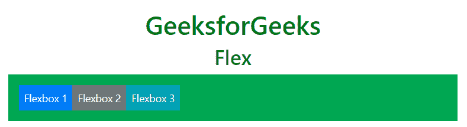

**直列式弹性箱集装箱:***。d-inline-flex* 类用于创建一个 inline flexbox 容器。
**例:**

## 超文本标记语言

```
<!DOCTYPE html>
<html lang="en">
<head>
    <title>Flex</title>

    <meta charset="utf-8">
    <meta name="viewport" content="width=device-width, initial-scale=1">

    <link rel="stylesheet" href=
"https://maxcdn.bootstrapcdn.com/bootstrap/4.3.1/css/bootstrap.min.css">

    <script src=
"https://ajax.googleapis.com/ajax/libs/jquery/3.3.1/jquery.min.js">
    </script>

    <script src=
"https://cdnjs.cloudflare.com/ajax/libs/popper.js/1.14.7/umd/popper.min.js">
    </script>

    <script src=
"https://maxcdn.bootstrapcdn.com/bootstrap/4.3.1/js/bootstrap.min.js">
    </script>
</head>

<body>
    <div class="container mt-3">

        <h1 style="color:green; text-align:center;">
            GeeksforGeeks
        </h1>

        <h2 style="text-align:center;">Inline Flexbox</h2>

        <div class="d-inline-flex bg-success p-3 text-white">
            <div class="p-2 bg-primary">Flexbox 1</div>
            <div class="p-2 bg-secondary ">Flexbox 2</div>
            <div class="p-2 bg-info">Flexbox 3</div>
        </div>
    </div>
</body>

</html>                   
```

**输出:**

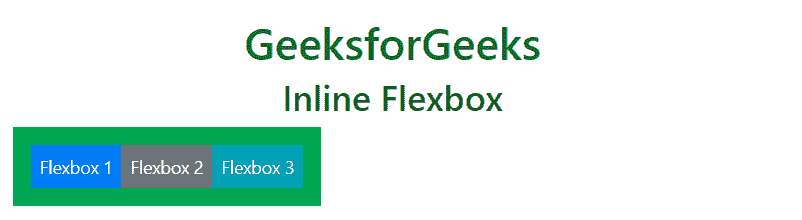

**水平方向:***。flex-row* 类用于水平显示 flex 项目。默认情况下，flexbox 水平放置。*。flex-row-reverse* 类用于反转 flexbox 的对齐方式(右对齐 flexbox)。
**例:**

## 超文本标记语言

```
<!DOCTYPE html>
<html lang="en">
<head>
    <title>Flex</title>

    <meta charset="utf-8">
    <meta name="viewport" content="width=device-width, initial-scale=1">

    <link rel="stylesheet" href=
"https://maxcdn.bootstrapcdn.com/bootstrap/4.3.1/css/bootstrap.min.css">

    <script src=
"https://ajax.googleapis.com/ajax/libs/jquery/3.3.1/jquery.min.js">
    </script>

    <script src=
"https://cdnjs.cloudflare.com/ajax/libs/popper.js/1.14.7/umd/popper.min.js">
    </script>

    <script src=
"https://maxcdn.bootstrapcdn.com/bootstrap/4.3.1/js/bootstrap.min.js">
    </script>
</head>

<body>
    <div class="container mt-3">

        <h1 style="color:green; text-align:center;">
            GeeksforGeeks
        </h1>

        <h2 style="text-align:center;">Horizontal Flexbox</h2>

        <h3>flex-row class</h3>
        <div class="d-flex flex-row bg-success mb-3 text-white">
            <div class="p-2 bg-primary">Flexbox 1</div>
            <div class="p-2 bg-secondary ">Flexbox 2</div>
            <div class="p-2 bg-info">Flexbox 3</div>
        </div> <br>

        <h3>flex-row-reverse class</h3>
        <div class="d-flex flex-row-reverse bg-success mb-3 text-white">
            <div class="p-2 bg-primary">Flexbox 1</div>
            <div class="p-2 bg-secondary ">Flexbox 2</div>
            <div class="p-2 bg-info">Flexbox 3</div>
        </div>
    </div>
</body>

</html>                   
```

**输出:**

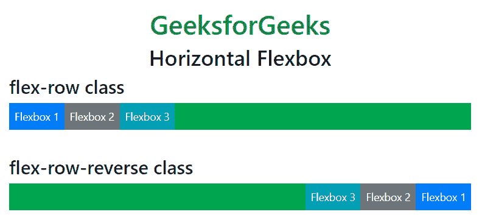

**垂直方向:**该。flex-column 类用于垂直显示 flexbox(相互堆叠)。*。flex-column-reverse* 类用于反向垂直放置 flexbox。
**例:**

## 超文本标记语言

```
<!DOCTYPE html>
<html lang="en">
<head>
    <title>Flex</title>

    <meta charset="utf-8">
    <meta name="viewport" content="width=device-width, initial-scale=1">

    <link rel="stylesheet" href=
"https://maxcdn.bootstrapcdn.com/bootstrap/4.3.1/css/bootstrap.min.css">

    <script src=
"https://ajax.googleapis.com/ajax/libs/jquery/3.3.1/jquery.min.js">
    </script>

    <script src=
"https://cdnjs.cloudflare.com/ajax/libs/popper.js/1.14.7/umd/popper.min.js">
    </script>

    <script src=
"https://maxcdn.bootstrapcdn.com/bootstrap/4.3.1/js/bootstrap.min.js">
    </script>
</head>

<body>
    <div class="container mt-3">

        <h1 style="color:green; text-align:center;">
            GeeksforGeeks
        </h1>

        <h2 style="text-align:center;">Vertical Flexbox</h2>

        <h3>flex-column class</h3>
        <div class="d-flex flex-column text-white">
            <div class="p-2 bg-primary">Flexbox 1</div>
            <div class="p-2 bg-secondary ">Flexbox 2</div>
            <div class="p-2 bg-info">Flexbox 3</div>
        </div> <br>

        <h3>flex-column-reverse class</h3>
        <div class="d-flex flex-column-reverse text-white">
            <div class="p-2 bg-primary">Flexbox 1</div>
            <div class="p-2 bg-secondary ">Flexbox 2</div>
            <div class="p-2 bg-info">Flexbox 3</div>
        </div>
    </div>
</body>

</html>                   
```

**输出:**

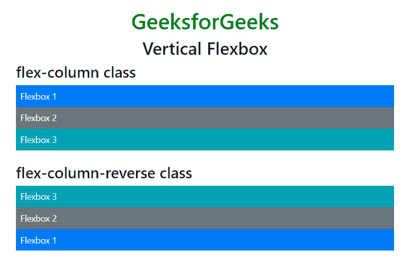

**证明内容:***。调整-内容-** 类用于更改 flexbox 的对齐方式。flexbox 的对齐方式可以是起点、终点、中心、中间和周围。
**例:**

## 超文本标记语言

```
<!DOCTYPE html>
<html lang="en">
<head>
    <title>Flex</title>

    <meta charset="utf-8">
    <meta name="viewport" content="width=device-width, initial-scale=1">

    <link rel="stylesheet" href=
"https://maxcdn.bootstrapcdn.com/bootstrap/4.3.1/css/bootstrap.min.css">

    <script src=
"https://ajax.googleapis.com/ajax/libs/jquery/3.3.1/jquery.min.js">
    </script>

    <script src=
"https://cdnjs.cloudflare.com/ajax/libs/popper.js/1.14.7/umd/popper.min.js">
    </script>

    <script src=
"https://maxcdn.bootstrapcdn.com/bootstrap/4.3.1/js/bootstrap.min.js">
    </script>
</head>

<body>
    <div class="container mt-3">

        <h1 style="color:green; text-align:center;">
            GeeksforGeeks
        </h1>

        <h2 style="text-align:center;">Justify Content Flexbox</h2>

        <h5>justify-content-start class</h5>
        <div class=
              "d-flex justify-content-start bg-success mb-3 text-white">
            <div class="p-2 bg-primary">Flexbox 1</div>
            <div class="p-2 bg-secondary ">Flexbox 2</div>
            <div class="p-2 bg-info">Flexbox 3</div>
        </div>

        <h5>justify-content-center class</h5>
        <div class=
              "d-flex justify-content-center bg-success mb-3 text-white">
            <div class="p-2 bg-primary">Flexbox 1</div>
            <div class="p-2 bg-secondary ">Flexbox 2</div>
            <div class="p-2 bg-info">Flexbox 3</div>
        </div>

        <h5>justify-content-end class</h5>
        <div class=
              "d-flex justify-content-end bg-success mb-3 text-white">
            <div class="p-2 bg-primary">Flexbox 1</div>
            <div class="p-2 bg-secondary ">Flexbox 2</div>
            <div class="p-2 bg-info">Flexbox 3</div>
        </div>

        <h5>justify-content-between class</h5>
        <div class=
              "d-flex justify-content-between bg-success mb-3 text-white">
            <div class="p-2 bg-primary">Flexbox 1</div>
            <div class="p-2 bg-secondary ">Flexbox 2</div>
            <div class="p-2 bg-info">Flexbox 3</div>
        </div>

        <h5>justify-content-around class</h5>
        <div class=
              "d-flex justify-content-around bg-success mb-3 text-white">
            <div class="p-2 bg-primary">Flexbox 1</div>
            <div class="p-2 bg-secondary ">Flexbox 2</div>
            <div class="p-2 bg-info">Flexbox 3</div>
        </div>
    </div>
</body>

</html>                   
```

**输出:**

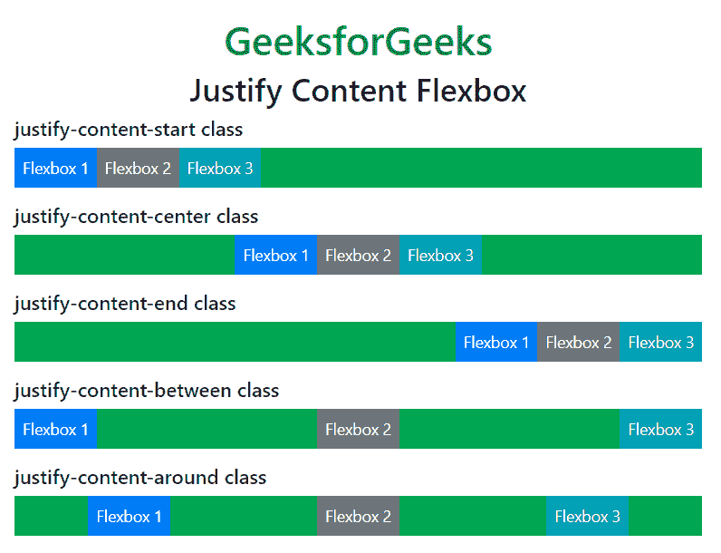

**填充/等宽:**T2。flex-fill 类用于强制伸缩项的宽度相等。
**例:**

## 超文本标记语言

```
<!DOCTYPE html>
<html lang="en">
<head>
    <title>Flex</title>

    <meta charset="utf-8">
    <meta name="viewport" content="width=device-width, initial-scale=1">

    <link rel="stylesheet" href=
"https://maxcdn.bootstrapcdn.com/bootstrap/4.3.1/css/bootstrap.min.css">

    <script src=
"https://ajax.googleapis.com/ajax/libs/jquery/3.3.1/jquery.min.js">
    </script>

    <script src=
"https://cdnjs.cloudflare.com/ajax/libs/popper.js/1.14.7/umd/popper.min.js">
    </script>

    <script src=
"https://maxcdn.bootstrapcdn.com/bootstrap/4.3.1/js/bootstrap.min.js">
    </script>
</head>

<body>
    <div class="container mt-3">

        <h1 style="color:green; text-align:center;">
            GeeksforGeeks
        </h1>

        <h2 style="text-align:center;">
            Fill/Equal Width Flexbox
        </h2>

        <div class="d-flex mb-3">
            <div class="p-2 bg-primary flex-fill">Flexbox 1</div>
            <div class="p-2 bg-secondary flex-fill">Flexbox 2</div>
            <div class="p-2 bg-info flex-fill">Flexbox 3</div>
        </div>
    </div>
</body>

</html>                   
```

**输出:**

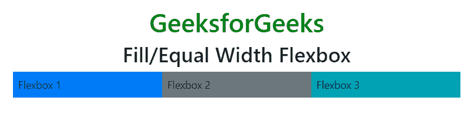

**成长:***。flex-grow-1* 类在 flexbox 上使用，占据剩余空间。
**例:**

## 超文本标记语言

```
<!DOCTYPE html>
<html lang="en">
<head>
    <title>Flex</title>

    <meta charset="utf-8">
    <meta name="viewport" content="width=device-width, initial-scale=1">

    <link rel="stylesheet" href=
"https://maxcdn.bootstrapcdn.com/bootstrap/4.3.1/css/bootstrap.min.css">

    <script src=
"https://ajax.googleapis.com/ajax/libs/jquery/3.3.1/jquery.min.js">
    </script>

    <script src=
"https://cdnjs.cloudflare.com/ajax/libs/popper.js/1.14.7/umd/popper.min.js">
    </script>

    <script src=
"https://maxcdn.bootstrapcdn.com/bootstrap/4.3.1/js/bootstrap.min.js">
    </script>
</head>

<body>
    <div class="container mt-3">

        <h1 style="color:green; text-align:center;">
            GeeksforGeeks
        </h1>

        <h2 style="text-align:center;">Grow Flexbox</h2>

        <div class="d-flex mb-3">
            <div class="p-2 bg-primary">Flexbox 1</div>
            <div class="p-2 flex-grow-1 bg-secondary">Flexbox 2</div>
            <div class="p-2 bg-success">Flexbox 3</div>
        </div>
    </div>
</body>

</html>                   
```

**输出:**

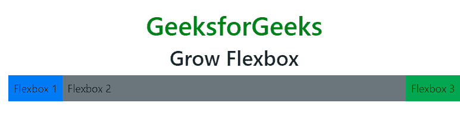

**秩序:***。订单*类用于更改 flexbox 的订单。
的有效订单类别是从 0 到 12。
**例:**

## 超文本标记语言

```
<!DOCTYPE html>
<html lang="en">
<head>
    <title>Flex</title>

    <meta charset="utf-8">
    <meta name="viewport" content="width=device-width, initial-scale=1">

    <link rel="stylesheet" href=
"https://maxcdn.bootstrapcdn.com/bootstrap/4.3.1/css/bootstrap.min.css">

    <script src=
"https://ajax.googleapis.com/ajax/libs/jquery/3.3.1/jquery.min.js">
    </script>

    <script src=
"https://cdnjs.cloudflare.com/ajax/libs/popper.js/1.14.7/umd/popper.min.js">
    </script>

    <script src=
"https://maxcdn.bootstrapcdn.com/bootstrap/4.3.1/js/bootstrap.min.js">
    </script>
</head>

<body>
    <div class="container mt-3">

        <h1 style="color:green; text-align:center;">
            GeeksforGeeks
        </h1>

        <h2 style="text-align:center;">Order Flexbox</h2>

        <div class="d-flex mb-3">
            <div class="p-2 bg-primary order-3">
                Flexbox 1
            </div>
            <div class="p-2 bg-secondary order-1">
                Flexbox 2
            </div>
            <div class="p-2 bg-success order-2">
                Flexbox 3
            </div>
        </div>
    </div>
</body>

</html>                   
```

**输出:**

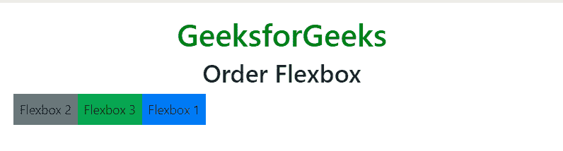

**汽车利润率:***。mr-auto* 和*。ml-auto* 类用于为项目添加边距。*。mr-auto* 类将项目推向右侧并*。ml-auto* 类向左推送项目。
**例:**

## 超文本标记语言

```
<!DOCTYPE html>
<html lang="en">
<head>
    <title>Flex</title>

    <meta charset="utf-8">
    <meta name="viewport" content="width=device-width, initial-scale=1">

    <link rel="stylesheet" href=
"https://maxcdn.bootstrapcdn.com/bootstrap/4.3.1/css/bootstrap.min.css">

    <script src=
"https://ajax.googleapis.com/ajax/libs/jquery/3.3.1/jquery.min.js">
    </script>

    <script src=
"https://cdnjs.cloudflare.com/ajax/libs/popper.js/1.14.7/umd/popper.min.js">
    </script>

    <script src=
"https://maxcdn.bootstrapcdn.com/bootstrap/4.3.1/js/bootstrap.min.js">
    </script>
</head>

<body>
    <div class="container mt-3">

        <h1 style="color:green; text-align:center;">
            GeeksforGeeks
        </h1>

        <h2 style="text-align:center;">Auto Margins</h2>

        <div class="d-flex bg-success mb-3 text-white">
            <div class="p-2 bg-primary">
                Flexbox 1
            </div>
            <div class="p-2 mr-auto bg-secondary ">
                Flexbox 2
            </div>
            <div class="p-2 mr-auto bg-info">
                Flexbox 3
            </div>
        </div>

        <div class="d-flex bg-success mb-3 text-white">
            <div class="p-2 bg-primary">
                Flexbox 1
            </div>
            <div class="p-2 ml-auto bg-secondary ">
                Flexbox 2
            </div>
            <div class="p-2 bg-info">
                Flexbox 3
            </div>
        </div>
    </div>
</body>

</html>                   
```

**输出:**

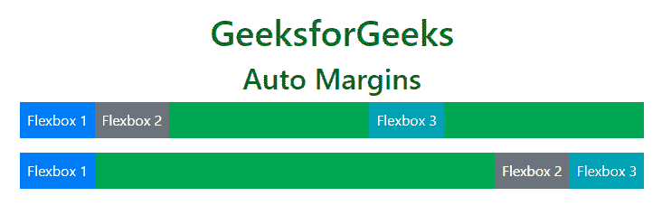

**包装:***。flex-nowrap* (默认)，*。软包*或*。flex-wrap-reverse* 类用于控制 flex 项目的包装。
**例:**

## 超文本标记语言

```
<!DOCTYPE html>
<html lang="en">
<head>
    <title>Flex</title>

    <meta charset="utf-8">
    <meta name="viewport" content="width=device-width, initial-scale=1">

    <link rel="stylesheet" href=
"https://maxcdn.bootstrapcdn.com/bootstrap/4.3.1/css/bootstrap.min.css">

    <script src=
"https://ajax.googleapis.com/ajax/libs/jquery/3.3.1/jquery.min.js">
    </script>

    <script src=
"https://cdnjs.cloudflare.com/ajax/libs/popper.js/1.14.7/umd/popper.min.js">
    </script>

    <script src=
"https://maxcdn.bootstrapcdn.com/bootstrap/4.3.1/js/bootstrap.min.js">
    </script>
</head>

<body>
    <div class="container mt-3">

        <h1 style="color:green; text-align:center;">
            GeeksforGeeks
        </h1>

        <h2 style="text-align:center;">Flex Wrap</h2>

        <h4>flex-nowrap class</h4>
        <div class="d-flex flex-nowrap bg-success">
            <div class="p-2 border">
                Welcome to GeeksforGeeks 1
            </div>
            <div class="p-2 border">
                Welcome to GeeksforGeeks 2
            </div>
            <div class="p-2 border">
                Welcome to GeeksforGeeks 3
            </div>
            <div class="p-2 border">
                Welcome to GeeksforGeeks 4
            </div>
            <div class="p-2 border">
                Welcome to GeeksforGeeks 5
            </div>
            <div class="p-2 border">
                Welcome to GeeksforGeeks 6
            </div>
            <div class="p-2 border">
                Welcome to GeeksforGeeks 7
            </div>
        </div>

        <br><br>

        <h4>flex-wrap class</h4>
        <div class="d-flex flex-wrap bg-success">
            <div class="p-2 border">
                Welcome to GeeksforGeeks 1
            </div>
            <div class="p-2 border">
                Welcome to GeeksforGeeks 2
            </div>
            <div class="p-2 border">
                Welcome to GeeksforGeeks 3
            </div>
            <div class="p-2 border">
                Welcome to GeeksforGeeks 4
            </div>
            <div class="p-2 border">
                Welcome to GeeksforGeeks 5
            </div>
            <div class="p-2 border">
                Welcome to GeeksforGeeks 6
            </div>
            <div class="p-2 border">
                Welcome to GeeksforGeeks 7
            </div>
        </div>

        <br><br>

        <h4>flex-wrap-reverse class</h4>
        <div class="d-flex flex-wrap-reverse bg-success">
            <div class="p-2 border">
                Welcome to GeeksforGeeks 1
            </div>
            <div class="p-2 border">
                Welcome to GeeksforGeeks 2
            </div>
            <div class="p-2 border">
                Welcome to GeeksforGeeks 3
            </div>
            <div class="p-2 border">
                Welcome to GeeksforGeeks 4
            </div>
            <div class="p-2 border">
                Welcome to GeeksforGeeks 5
            </div>
            <div class="p-2 border">
                Welcome to GeeksforGeeks 6
            </div>
            <div class="p-2 border">
                Welcome to GeeksforGeeks 7
            </div>
        </div>
    </div>
</body>

</html>                   
```

**输出:**

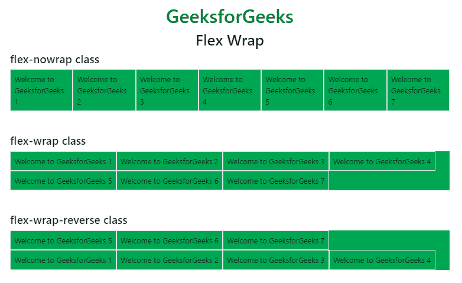

**对齐内容:***。align-content-** 类用于设置伸缩项的垂直对齐方式。所有班级的名单是:*。对齐-内容-开始*(默认)、*。对齐-内容-结束*、*。对齐资源中心*、*。*、*之间对齐内容。围绕*和*对齐内容。对齐-内容-拉伸*。
**注意:**对齐内容适用于一行以上的伸缩项。
**例:**

## 超文本标记语言

```
<!DOCTYPE html>
<html lang="en">
<head>
    <title>Flex</title>

    <meta charset="utf-8">
    <meta name="viewport" content="width=device-width, initial-scale=1">

    <link rel="stylesheet" href=
"https://maxcdn.bootstrapcdn.com/bootstrap/4.3.1/css/bootstrap.min.css">

    <script src=
"https://ajax.googleapis.com/ajax/libs/jquery/3.3.1/jquery.min.js">
    </script>

    <script src=
"https://cdnjs.cloudflare.com/ajax/libs/popper.js/1.14.7/umd/popper.min.js">
    </script>

    <script src=
"https://maxcdn.bootstrapcdn.com/bootstrap/4.3.1/js/bootstrap.min.js">
    </script>
</head>

<body>
    <div class="container mt-3">

        <h1 style="color:green; text-align:center;">
            GeeksforGeeks
        </h1>

        <h2 style="text-align:center;">Align Content</h2>

        <h4>align-content-start class</h4>
        <div class="d-flex flex-wrap align-content-start border"
                style="height:250px">
            <div class="p-2 border">
                Welcome to GeeksforGeeks 1
            </div>
            <div class="p-2 border">
                Welcome to GeeksforGeeks 2
            </div>
            <div class="p-2 border">
                Welcome to GeeksforGeeks 3
            </div>
            <div class="p-2 border">
                Welcome to GeeksforGeeks 4
            </div>
            <div class="p-2 border">
                Welcome to GeeksforGeeks 5
            </div>
            <div class="p-2 border">
                Welcome to GeeksforGeeks 6
            </div>
            <div class="p-2 border">
                Welcome to GeeksforGeeks 7
            </div>
        </div>
        <br>

        <h4>align-content-around class</h4>
        <div class="d-flex flex-wrap align-content-around border"
                style="height:250px">
            <div class="p-2 border">
                Welcome to GeeksforGeeks 1
            </div>
            <div class="p-2 border">
                Welcome to GeeksforGeeks 2
            </div>
            <div class="p-2 border">
                Welcome to GeeksforGeeks 3
            </div>
            <div class="p-2 border">
                Welcome to GeeksforGeeks 4
            </div>
            <div class="p-2 border">
                Welcome to GeeksforGeeks 5
            </div>
            <div class="p-2 border">
                Welcome to GeeksforGeeks 6
            </div>
            <div class="p-2 border">
                Welcome to GeeksforGeeks 7
            </div>
        </div>
        <br>

        <h4>align-content-stretch class</h4>
        <div class="d-flex flex-wrap align-content-stretch border"
                style="height:250px">
            <div class="p-2 border">
                Welcome to GeeksforGeeks 1
            </div>
            <div class="p-2 border">
                Welcome to GeeksforGeeks 2
            </div>
            <div class="p-2 border">
                Welcome to GeeksforGeeks 3
            </div>
            <div class="p-2 border">
                Welcome to GeeksforGeeks 4
            </div>
            <div class="p-2 border">
                Welcome to GeeksforGeeks 5
            </div>
            <div class="p-2 border">
                Welcome to GeeksforGeeks 6
            </div>
            <div class="p-2 border">
                Welcome to GeeksforGeeks 7
            </div>
        </div>
    </div>
</body>

</html>                   
```

**输出:**

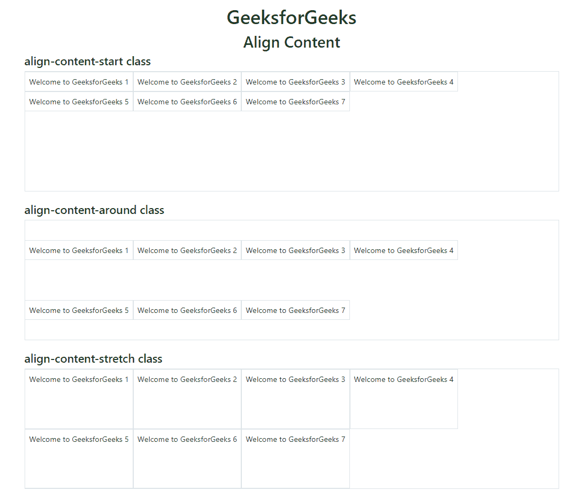

**对齐项目:***。align-items-** 类用于控制伸缩项的垂直对齐。所有班级的名单是:*。对齐-项目-开始*、*。对齐-项目-结束*、*。对齐-项目-中心*，*。对齐-项目-基线*和*。对齐-项目-拉伸*(默认)。
**例:**

## 超文本标记语言

```
<!DOCTYPE html>
<html lang="en">
<head>
    <title>Flex</title>

    <meta charset="utf-8">
    <meta name="viewport" content="width=device-width, initial-scale=1">

    <link rel="stylesheet" href=
"https://maxcdn.bootstrapcdn.com/bootstrap/4.3.1/css/bootstrap.min.css">

    <script src=
"https://ajax.googleapis.com/ajax/libs/jquery/3.3.1/jquery.min.js">
    </script>

    <script src=
"https://cdnjs.cloudflare.com/ajax/libs/popper.js/1.14.7/umd/popper.min.js">
    </script>

    <script src=
"https://maxcdn.bootstrapcdn.com/bootstrap/4.3.1/js/bootstrap.min.js">
    </script>
</head>

<body>
    <div class="container mt-3">

        <h1 style="color:green; text-align:center;">
            GeeksforGeeks
        </h1>

        <h2 style="text-align:center;">Align Items</h2>

        <h4>align-items-end class</h4>
        <div class="d-flex align-items-end border"
                style="height:150px">
            <div class="p-2 border">
                Welcome to GeeksforGeeks 1
            </div>
            <div class="p-2 border">
                Welcome to GeeksforGeeks 2
            </div>
            <div class="p-2 border">
                Welcome to GeeksforGeeks 3
            </div>
            <div class="p-2 border">
                Welcome to GeeksforGeeks 4
            </div>
            <div class="p-2 border">
                Welcome to GeeksforGeeks 5
            </div>
            <div class="p-2 border">
                Welcome to GeeksforGeeks 6
            </div>
            <div class="p-2 border">
                Welcome to GeeksforGeeks 7
            </div>
        </div>
        <br>

        <h4>align-items-baseline class</h4>
        <div class="d-flex align-items-baseline border"
                style="height:150px">
            <div class="p-2 border">
                Welcome to GeeksforGeeks 1
            </div>
            <div class="p-2 border">
                Welcome to GeeksforGeeks 2
            </div>
            <div class="p-2 border">
                Welcome to GeeksforGeeks 3
            </div>
            <div class="p-2 border">
                Welcome to GeeksforGeeks 4
            </div>
            <div class="p-2 border">
                Welcome to GeeksforGeeks 5
            </div>
            <div class="p-2 border">
                Welcome to GeeksforGeeks 6
            </div>
            <div class="p-2 border">
                Welcome to GeeksforGeeks 7
            </div>
        </div>
        <br>

        <h4>align-items-stretch class</h4>
        <div class="d-flex align-items-stretch border"
                style="height:150px">
            <div class="p-2 border">
                Welcome to GeeksforGeeks 1
            </div>
            <div class="p-2 border">
                Welcome to GeeksforGeeks 2
            </div>
            <div class="p-2 border">
                Welcome to GeeksforGeeks 3
            </div>
            <div class="p-2 border">
                Welcome to GeeksforGeeks 4
            </div>
            <div class="p-2 border">
                Welcome to GeeksforGeeks 5
            </div>
            <div class="p-2 border">
                Welcome to GeeksforGeeks 6
            </div>
            <div class="p-2 border">
                Welcome to GeeksforGeeks 7
            </div>
        </div>
    </div>
</body>

</html>                   
```

**输出:**

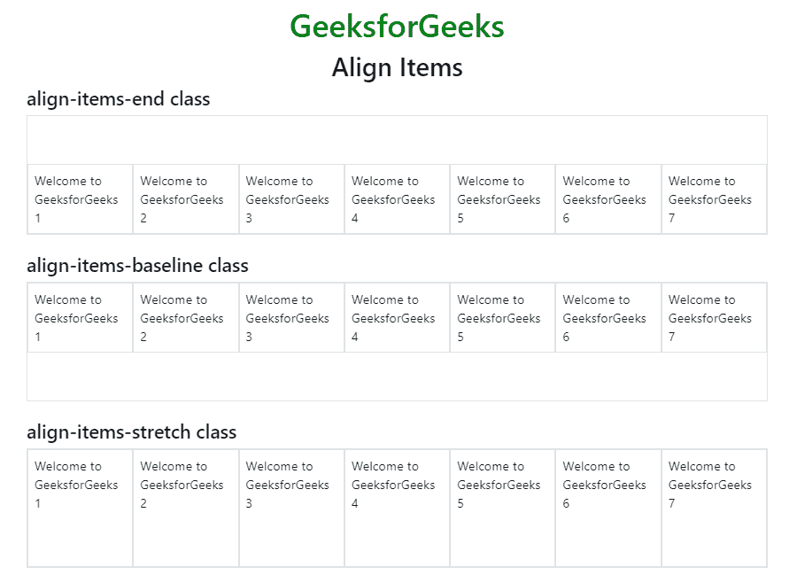

**调整自我:***。align-self-** 类用于控制伸缩项的垂直对齐。所有班级的名单是:*。对齐-自启动*、*。对齐-自端*、*。对齐-自动居中*、*。对齐-自基线*和*。对齐-自拉伸*(默认)。
**例:**

## 超文本标记语言

```
<!DOCTYPE html>
<html lang="en">
<head>
    <title>Flex</title>

    <meta charset="utf-8">
    <meta name="viewport" content="width=device-width, initial-scale=1">

    <link rel="stylesheet" href=
"https://maxcdn.bootstrapcdn.com/bootstrap/4.3.1/css/bootstrap.min.css">

    <script src=
"https://ajax.googleapis.com/ajax/libs/jquery/3.3.1/jquery.min.js">
    </script>

    <script src=
"https://cdnjs.cloudflare.com/ajax/libs/popper.js/1.14.7/umd/popper.min.js">
    </script>

    <script src=
"https://maxcdn.bootstrapcdn.com/bootstrap/4.3.1/js/bootstrap.min.js">
    </script>
</head>

<body>
    <div class="container mt-3">

        <h1 style="color:green; text-align:center;">
            GeeksforGeeks
        </h1>

        <h2 style="text-align:center;">Align Self</h2>

        <h4>align-items-end class</h4>
        <div class="d-flex" style="height:250px">
            <div class="p-2 border align-self-start">
                Welcome to GeeksforGeeks 1
            </div>
            <div class="p-2 border align-self-center">
                Welcome to GeeksforGeeks 2
            </div>
            <div class="p-2 border align-self-end">
                Welcome to GeeksforGeeks 3
            </div>
            <div class="p-2 border align-self-baseline">
                Welcome to GeeksforGeeks 1
            </div>
            <div class="p-2 border align-self-stretch">
                Welcome to GeeksforGeeks 2
            </div>
        </div>
    </div>
</body>

</html>                   
```

**输出:**

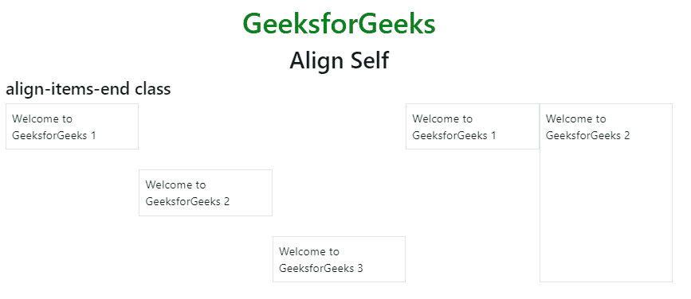

**支持的浏览器:**

*   谷歌 Chrome
*   微软公司出品的 web 浏览器
*   火狐浏览器
*   歌剧
*   旅行队