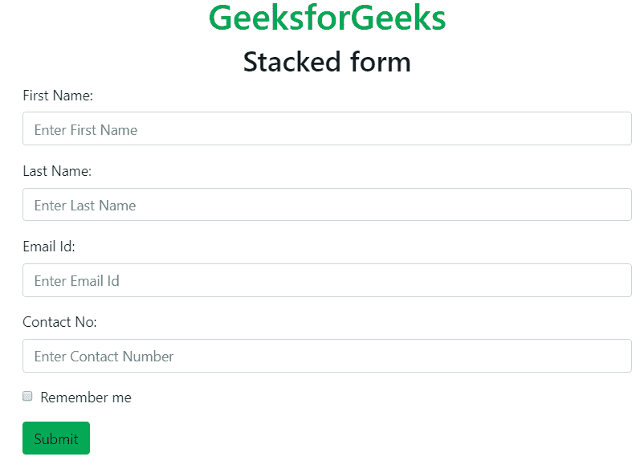
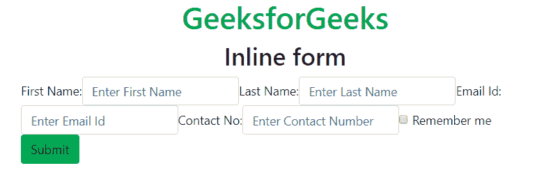
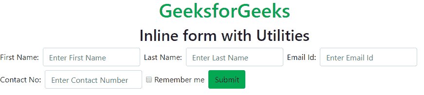
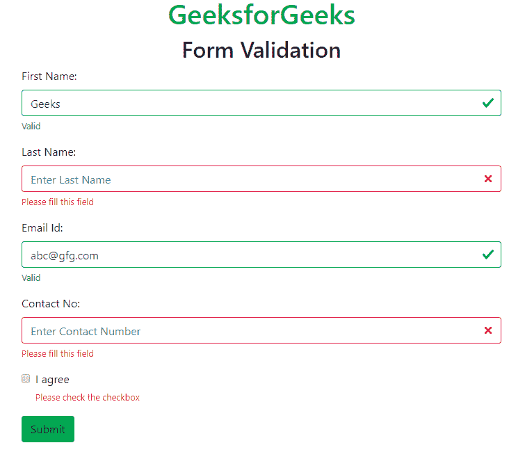

# 自举 4 |表格

> 原文:[https://www.geeksforgeeks.org/bootstrap-4-forms/](https://www.geeksforgeeks.org/bootstrap-4-forms/)

**表单布局:** Bootstrap 提供两种表单布局，如下所示:

*   堆叠形式
*   内嵌表单

**堆叠表单:**堆叠表单以堆叠格式创建输入字段和提交按钮。
**例:**

## 超文本标记语言

```html
<!DOCTYPE html>
<html lang="en">
<head>
    <title>Bootstrap Form</title>

    <meta charset="utf-8">
    <meta name="viewport" content="width=device-width, initial-scale=1">

    <link rel="stylesheet" href=
"https://maxcdn.bootstrapcdn.com/bootstrap/4.3.1/css/bootstrap.min.css">

    <script src=
"https://ajax.googleapis.com/ajax/libs/jquery/3.3.1/jquery.min.js">
    </script>

    <script src=
"https://cdnjs.cloudflare.com/ajax/libs/popper.js/1.14.7/umd/popper.min.js">
    </script>

    <script src=
"https://maxcdn.bootstrapcdn.com/bootstrap/4.3.1/js/bootstrap.min.js">
    </script>
</head>

<body>
    <h1 class="text-success text-center">
        GeeksforGeeks
    </h1>

    <h2 class="text-center">Stacked form</h2>

    <div class="container">
        <form action="#">
            <div class="form-group">
                <label for="fname">First Name:</label>
                <input type="text" class="form-control"
                       id="fname" placeholder="Enter First Name"
                       name="fname">
            </div>

            <div class="form-group">
                <label for="lname">Last Name:</label>
                <input type="text" class="form-control" id="lname"
                    placeholder="Enter Last Name" name="lname">
            </div>

            <div class="form-group">
                <label for="email">Email Id:</label>
                <input type="email" class="form-control" id="email"
                    placeholder="Enter Email Id" name="email">
            </div>

            <div class="form-group">
                <label for="contact">Contact No:</label>
                <input type="text" class="form-control" id="contact"
                    placeholder="Enter Contact Number" name="contact">
            </div>

            <div class="form-group form-check">
                <label class="form-check-label">
                    <input class="form-check-input" type="checkbox"
                        name="remember"> Remember me
                </label>
            </div>

            <button type="submit" class="btn bg-success">
                Submit
            </button>
        </form>
    </div>
</body>

</html>                   
```

**输出:**



**直列形式:***。表单-内联*类与<表单>元素一起使用来创建内联表单。内联表单包含左对齐和内联的元素。当视口宽度至少为 576px 时，内联属性适用。如果屏幕尺寸小于 576px，则表单元素将垂直堆叠。
**例:**

## 超文本标记语言

```html
<!DOCTYPE html>
<html lang="en">
<head>
    <title>Bootstrap Form</title>

    <meta charset="utf-8">
    <meta name="viewport" content="width=device-width, initial-scale=1">

    <link rel="stylesheet" href=
"https://maxcdn.bootstrapcdn.com/bootstrap/4.3.1/css/bootstrap.min.css">

    <script src=
"https://ajax.googleapis.com/ajax/libs/jquery/3.3.1/jquery.min.js">
    </script>

    <script src=
"https://cdnjs.cloudflare.com/ajax/libs/popper.js/1.14.7/umd/popper.min.js">
    </script>

    <script src=
"https://maxcdn.bootstrapcdn.com/bootstrap/4.3.1/js/bootstrap.min.js">
    </script>
</head>

<body>
    <h1 class="text-success text-center">
        GeeksforGeeks
    </h1>

    <h2 class="text-center">Inline form</h2>

    <div class="container">
        <form class="form-inline" action="#">

            <label for="fname">First Name:</label>
            <input type="text" class="form-control"
                   id="fname" placeholder="Enter First Name"
                   name="fname">

            <label for="lname">Last Name:</label>
            <input type="text" class="form-control"
                   id="lname" placeholder="Enter Last Name"
                   name="lname">

            <label for="email">Email Id:</label>
            <input type="email" class="form-control"
                   id="email" placeholder="Enter Email Id"
                   name="email">

            <label for="contact">Contact No:</label>
            <input type="text" class="form-control"
                   id="contact"
                   placeholder="Enter Contact Number"
                   name="contact">

            <div class="form-group form-check">
                <label class="form-check-label">
                    <input class="form-check-input"
                           type="checkbox"
                        name="remember"> Remember me
                </label>
            </div>

            <button type="submit"
                    class="btn bg-success">
                                Submit
            </button>
        </form>
    </div>
</body>

</html>                   
```

**输出:**



**带实用程序的内嵌表单:**引导间距实用程序用于添加空间，以使内嵌表单看起来更好。*。mr-sm-2* 类用于在所有设备(小型及以上)和*上为每个输入添加右边距。mb-2* 类在底部增加了一个边距。
**例:**

## 超文本标记语言

```html
<!DOCTYPE html>
<html lang="en">
<head>
    <title>Bootstrap Form</title>

    <meta charset="utf-8">
    <meta name="viewport" content="width=device-width, initial-scale=1">

    <link rel="stylesheet" href=
"https://maxcdn.bootstrapcdn.com/bootstrap/4.3.1/css/bootstrap.min.css">

    <script src=
"https://ajax.googleapis.com/ajax/libs/jquery/3.3.1/jquery.min.js">
    </script>

    <script src=
"https://cdnjs.cloudflare.com/ajax/libs/popper.js/1.14.7/umd/popper.min.js">
    </script>

    <script src=
"https://maxcdn.bootstrapcdn.com/bootstrap/4.3.1/js/bootstrap.min.js">
    </script>
</head>

<body>
    <h1 class="text-success text-center">
          GeeksforGeeks
    </h1>

    <h2 class="text-center">Inline form with Utilities</h2>

    <div class="container-fluit">
        <form class="form-inline" action="#">

            <label for="fname" class="mb-2 mr-sm-2">
                   First Name:
            </label>
            <input type="text" class="form-control mb-2 mr-sm-2"
                   id="fname" placeholder="Enter First Name"
                   name="fname">

            <label for="lname" class="mb-2 mr-sm-2">
                   Last Name:
            </label>
            <input type="text" class="form-control mb-2 mr-sm-2"
                   id="lname" placeholder="Enter Last Name"
                   name="lname">

            <label for="email" class="mb-2 mr-sm-2">
                   Email Id:
            </label>
            <input type="email" class="form-control mb-2 mr-sm-2"
                   id="email" placeholder="Enter Email Id"
                   name="email">

            <label for="contact" class="mb-2 mr-sm-2">
                   Contact No:
            </label>
            <input type="text" class="form-control mb-2 mr-sm-2"
                   id="contact" placeholder="Enter Contact Number"
                   name="contact">

            <div class="form-check mb-2 mr-sm-2">
                <label class="form-check-label">
                    <input class="form-check-input"
                        type="checkbox"
                        name="remember"> Remember me
                </label>
            </div>

            <button type="submit" class="btn bg-success mb-2">
                Submit
            </button>
        </form>
    </div>
</body>

</html>                   
```

**输出:**



**表单验证:***。已经过验证的*或*。需求-验证<表单>元素中的*类用于在提交表单之前或之后提供验证。带有绿色边框的输入字段表示有效，红色边框表示无效的表单内容。*。有效反馈*或*。无效反馈*用于在提交表单前向用户显示通知消息。
**例:**

## 超文本标记语言

```html
<!DOCTYPE html>
<html lang="en">
<head>
    <title>Bootstrap Form</title>

    <meta charset="utf-8">
    <meta name="viewport" content="width=device-width, initial-scale=1">

    <link rel="stylesheet" href=
"https://maxcdn.bootstrapcdn.com/bootstrap/4.3.1/css/bootstrap.min.css">

    <script src=
"https://ajax.googleapis.com/ajax/libs/jquery/3.3.1/jquery.min.js">
    </script>

    <script src=
"https://cdnjs.cloudflare.com/ajax/libs/popper.js/1.14.7/umd/popper.min.js">
    </script>

    <script src=
"https://maxcdn.bootstrapcdn.com/bootstrap/4.3.1/js/bootstrap.min.js">
    </script>
</head>

<body>
    <h1 class="text-success text-center">GeeksforGeeks</h1>

    <h2 class="text-center">Form Validation</h2>

    <div class="container">
        <form action="#" class="was-validated">
            <div class="form-group">
                <label for="fname">First Name:</label>
                <input type="text" class="form-control" id="fname"
                    placeholder="Enter First Name" name="fname" required>
                <div class="valid-feedback">Valid</div>
                <div class="invalid-feedback">
                    Please fill this field
                </div>
            </div>

            <div class="form-group">
                <label for="lname">Last Name:</label>
                <input type="text" class="form-control" id="lname"
                    placeholder="Enter Last Name" name="lname" required>
                <div class="valid-feedback">Valid</div>
                <div class="invalid-feedback">
                    Please fill this field
                </div>
            </div>

            <div class="form-group">
                <label for="email">Email Id:</label>
                <input type="email" class="form-control" id="email"
                    placeholder="Enter Email Id" name="email" required>
                <div class="valid-feedback">Valid</div>
                <div class="invalid-feedback">
                    Please fill this field
                </div>
            </div>

            <div class="form-group">
                <label for="contact">Contact No:</label>
                <input type="text" class="form-control" id="contact"
                    placeholder="Enter Contact Number" name="contact"
                    required>
                <div class="valid-feedback">Valid</div>
                <div class="invalid-feedback">
                    Please fill this field
                </div>
            </div>

            <div class="form-group form-check">
                <label class="form-check-label">
                    <input class="form-check-input" type="checkbox"
                        name="remember" required> I agree
                    <div class="valid-feedback">Valid</div>
                    <div class="invalid-feedback">
                        Please check the checkbox
                    </div>
                </label>
            </div>

            <button type="submit" class="btn bg-success">Submit</button>
        </form>
    </div>
</body>

</html>                   
```

**输出:**



**支持的浏览器:**

*   谷歌 Chrome
*   微软公司出品的 web 浏览器
*   火狐浏览器
*   歌剧
*   旅行队