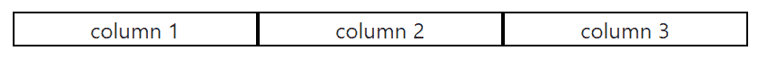
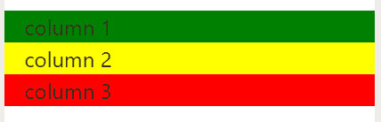
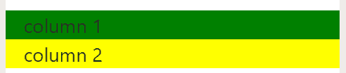

# 自举 4 |电网系统

> 原文:[https://www.geeksforgeeks.org/bootstrap-4-grid-system/](https://www.geeksforgeeks.org/bootstrap-4-grid-system/)

引导网格系统允许页面中最多有 12 列。您可以单独使用它们中的每一个，也可以将它们合并在一起用于更宽的列。可以使用总和为 12 的所有值组合。


**网格类:** Bootstrap 网格系统包含以下五类:

*   **。col-** 用于超小屏幕设备(屏幕宽度小于 576px)。
*   **。col-sm-** 用于小屏设备(屏幕宽度大于等于 576px)。
*   **。col-md-** 用于中等屏幕尺寸的设备(屏幕宽度大于或等于 768px)。
*   **。col-lg-** 用于大屏幕尺寸设备(屏幕宽度大于等于 992px)。
*   **。col-xl-** 用于 xl 大屏幕尺寸设备(屏幕宽度等于或大于 1200px)。

**电网系统组成:**

*   **容器:** Bootstrap 需要一个包含元素来包装网格系统中的站点内容。单词**容器**用于包含行元素和包含列元素的行元素。
*   **排:**排必须放置在**容器**或**容器-流体**内，以便正确对齐和填充。行用于创建水平的列组。
*   **列:**网格列是通过指定您希望跨越的十二个可用列的数量来创建的。例如，三个相等的列将使用三个列 lg-4。

**示例 1:** 本示例使用 bootstrap 在所有设备和屏幕宽度上创建等宽的列网格。

## 超文本标记语言

```html
<!DOCTYPE html>
<html lang="en">

<head>
    <title>Bootstrap Grid System</title>
    <meta charset="utf-8">
    <meta name="viewport"
            content="width=device-width, initial-scale=1">
    <link rel="stylesheet" href=
"https://maxcdn.bootstrapcdn.com/bootstrap/4.3.1/css/bootstrap.min.css">
    <script src=
"https://ajax.googleapis.com/ajax/libs/jquery/3.3.1/jquery.min.js">
    </script>
    <script src=
"https://cdnjs.cloudflare.com/ajax/libs/popper.js/1.14.7/umd/popper.min.js">
    </script>
    <script src=
"https://maxcdn.bootstrapcdn.com/bootstrap/4.3.1/js/bootstrap.min.js">
    </script>

    <style>
        .col {
            text-align:center;
            border:1px solid black;
        }
    </style>
</head>

<body>
    <div class="container">
        <div class="row">
            <div class="col">
                column 1
            </div>
            <div class="col">
                column 2
            </div>
            <div class="col">
                column 3
            </div>
        </div>
    </div>
</body>
</html>
```

**输出:**



**示例 2:** 本示例使用 bootstrap 创建等宽响应列网格。当屏幕尺寸小于 576px 时，各列自动相互堆叠。

## 超文本标记语言

```html
<!DOCTYPE html>
<html lang="en">

<head>
    <title>Bootstrap Grid System</title>
    <meta charset="utf-8">
    <meta name="viewport"
            content="width=device-width, initial-scale=1">
    <link rel="stylesheet" href=
"https://maxcdn.bootstrapcdn.com/bootstrap/4.3.1/css/bootstrap.min.css">
    <script src=
"https://ajax.googleapis.com/ajax/libs/jquery/3.3.1/jquery.min.js">
    </script>
    <script src=
"https://cdnjs.cloudflare.com/ajax/libs/popper.js/1.14.7/umd/popper.min.js">
    </script>
    <script src=
"https://maxcdn.bootstrapcdn.com/bootstrap/4.3.1/js/bootstrap.min.js">
    </script>
</head>

<body>
    <div class="container"><br>
        <div class="row">
            <div class="col-sm-4" style="background-color:green;">
                column 1
            </div>
            <div class="col-sm-4" style="background-color:yellow;">
                column 2
            </div>
            <div class="col-sm-4" style="background-color:red;">
                column 3
            </div>
        </div>
    </div>
</body>
</html>
```

**输出:**

*   **在大屏幕(桌面、平板)上运行:**


*   **在小屏幕(手机)上运行:**



**示例 3:** 本示例使用 bootstrap 创建不等宽响应列网格。当屏幕尺寸小于 576px 时，各列自动相互堆叠。

## 超文本标记语言

```html
<!DOCTYPE html>
<html lang="en">

<head>
    <title>Bootstrap Grid System</title>
    <meta charset="utf-8">
    <meta name="viewport"
            content="width=device-width, initial-scale=1">
    <link rel="stylesheet" href=
"https://maxcdn.bootstrapcdn.com/bootstrap/4.3.1/css/bootstrap.min.css">
    <script src=
"https://ajax.googleapis.com/ajax/libs/jquery/3.3.1/jquery.min.js">
    </script>
    <script src=
"https://cdnjs.cloudflare.com/ajax/libs/popper.js/1.14.7/umd/popper.min.js">
    </script>
    <script src=
"https://maxcdn.bootstrapcdn.com/bootstrap/4.3.1/js/bootstrap.min.js">
    </script>
</head>

<body>
    <div class="container"><br>
        <div class="row">
            <div class="col-sm-4" style="background-color:green;">
                column 1
            </div>
            <div class="col-sm-8" style="background-color:yellow;">
                column 2
            </div>
        </div>
    </div>
</body>
</html>
```

**输出:**

*   **在大屏幕(桌面、平板)上运行:**


*   **在小屏幕(手机)上运行:**



**支持的浏览器:**

*   谷歌 Chrome
*   微软公司出品的 web 浏览器
*   火狐浏览器
*   歌剧
*   旅行队