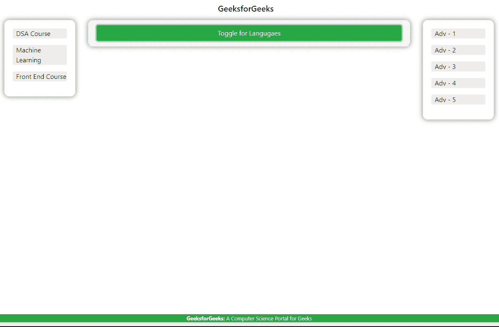
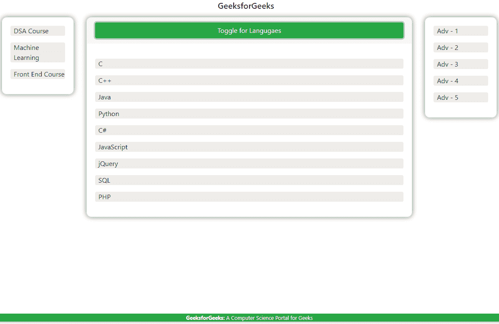

# 自举 4 |圣杯布局

> 原文:[https://www . geesforgeks . org/bootstrap-4-圣杯-布局/](https://www.geeksforgeeks.org/bootstrap-4-holy-grail-layout/)

圣杯布局是网页开发中一个经典的 CSS 问题。尽管在 HTML 和 CSS 中开发了许多创造性的解决方案，但面临的问题是，它涉及牺牲，因为丰富一个特性往往会以牺牲其他特性为代价。像 Bootstrap 4 这样的现代框架为轻松实现这种布局提供了实用工具。
本设计布局中的一些要求是:

1.  具有页眉、页脚和三个响应流畅的列的页面。
2.  中间一栏包含主要内容。
3.  左右栏包含广告/导航内容。
4.  它们应该要求最低限度的加价。
5.  当内容很少时，页脚应该“贴”在页面底部。

**方法:**我们将使用 Bootstrap 4 来实现相同的简单布局。我们将直接用于实现该设计的组件有:

*   **响应式导航条**
*   **流体网格系统** BS4 提供与所有设备兼容的响应布局系统。
*   **响应边距和填充实用程序类**像边距和填充这样的属性可以直接使用实用程序类来应用。
*   **响应页脚**(根据需要稍加调整)使用的 Flex CSS 属性可以在这里[阅读](https://www.geeksforgeeks.org/css-flex-property/)。

要了解 BS4，您可以阅读这里的文档。

**解决方案:**

```
<!-- Here, you are provided button 'Toggle' to hide & show content 
to help you understand how sticky footer with flex is working. -->

<!DOCTYPE html> 
<html lang="en"> 

<head> 
    <!-- meta adjustments -->
    <meta charset="utf-8"> 
    <meta name="viewport" content="width=device-width, initial-scale=1"> 

    <!-- Imported libraries using CDN -->
    <link rel="stylesheet" href= 
"https://maxcdn.bootstrapcdn.com/bootstrap/4.3.1/css/bootstrap.min.css"> 
    <script src= 
"https://ajax.googleapis.com/ajax/libs/jquery/3.3.1/jquery.min.js"> 
    </script> 
    <script src= 
"https://cdnjs.cloudflare.com/ajax/libs/popper.js/1.14.7/umd/popper.min.js"> 
    </script> 
    <script src= 
"https://maxcdn.bootstrapcdn.com/bootstrap/4.3.1/js/bootstrap.min.js"> 
    </script> 

    <!-- CSS configuration for the document -->
    <style> 
    .container
    {
        display: flex;
        justify-content: center;
        align-items: center;
        padding:0px;
    }
    .main
    {
    flex: 1 0 auto; 
    }
    h1{ color: white; }
    p
    {
        background-color: #efece9;
        border-radius:4px;
        padding-left:8px;
    }
    .card
    {
        border-radius:12px;
        -webkit-box-shadow: 0px 0px 12px 0px rgba(0, 0, 0, 0.5);
        -moz-box-shadow: 0px 0px 12px 0px rgba(0, 0, 0, 0.5);
        box-shadow: 0px 0px 12px 0px rgba(0, 0, 0, 0.5);
    }
    body
    {
        display: flex;
        min-height: 100vh;
        flex-direction: column;
    }
    .card-header:first-child
    {
        border-top-left-radius: 12px;
        border-top-right-radius: 12px;
        border-bottom: 1px solid floralwhite;
    }
    .card-body
    {
        min-height:160px;
    }
    .card-footer
    {
        padding-bottom: 0px;
    }
    footer
    {
        flex-shrink:none;
    }

    </style> 
</head> 

<body> 
<!-- Navbar -->
<nav class="navbar navbar-light justify-content-center">
<span class="navbar-brand mb-0 h1">GeeksforGeeks</span>
</nav>

<!-- Body Content -->

    <div class="container-fluid main">
        <div class="row">
        <!-- Navigation/Other Links -->
            <div class="col-sm-2">
                <div class="container">
            <div class="card w-100">
                <div class="card-body">
                <p>DSA Course</p>
                <p>Machine Learning</p>
                <p>Front End Course</p>
                </div>

            </div>
            </div>
            </div>

            <!-- Content Panel -->
            <div class="col-sm-8">
            <div class="container">
                <div class="card w-100">
                    <div class="card-header">
                    <button class="btn btn-success btn-block"> 
                                           Toggle for Langugaes
                                        </button>
                    </div>

                <!-- This is the content deciding the nature of the footer -->
                <div class="card-body content">
                    <p> </p>
                    <p> C </p>
                    <p> C++ </p>
                    <p> Java </p>
                    <p> Python </p>
                    <p> C# </p>
                    <p> JavaScript </p>
                    <p> jQuery </p>
                    <p> SQL </p>
                    <p> PHP </p>
                </div>

                </div>
                </div>
                    </div>

            <!-- Advertisement -->
            <div class="col-sm-2">
            <div class="container">
                <div class="card w-100">
                <div class="card-body">
                    <p>Adv - 1</p>
                    <p>Adv - 2</p>
                    <p>Adv - 3</p>
                    <p>Adv - 4</p>
                    <p>Adv - 5</p>

                </div> 
                </div>
                </div>
            </div>
            </div>
            </div>
    <br><br>

<!-- Footer ('flex-shrink' property applied here)-->
<footer class=" bg-success">
    <div class="container text-center" >
    <small style="color:white;"> 
    <b>GeeksforGeeks: </b>
    A Computer Science Portal for Geeks </small>
    </div>
</footer>

<!-- jQuery implementation for showing and hiding Content -->
    <script> 
        $(document).ready(function() { 
            $('button').click(function(){
                $('.content').toggle('slow');
            });
        }); 
    </script> 
</body> 
</html>                    
```

**输出:**

*   **内容隐藏时:**
    
*   **显示内容时:**
    