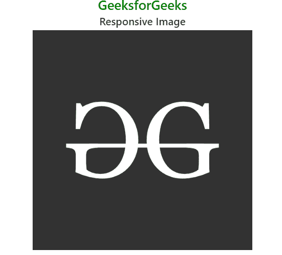
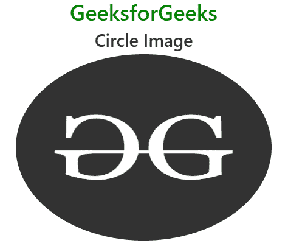
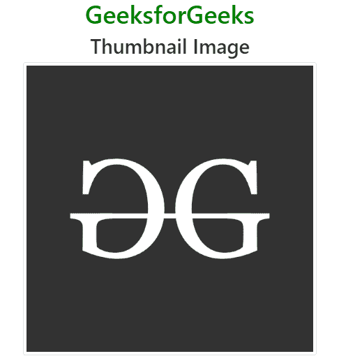
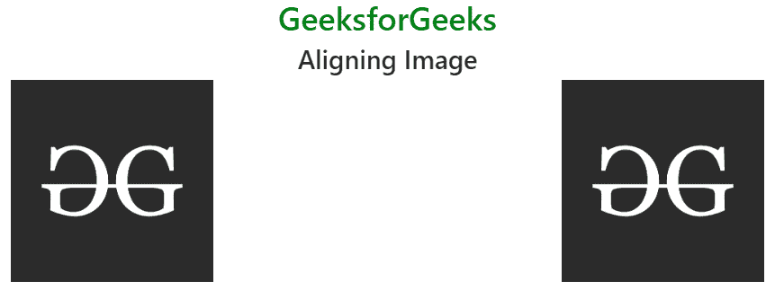

# 引导 4 |图像

> 原文:[https://www.geeksforgeeks.org/bootstrap-4-images/](https://www.geeksforgeeks.org/bootstrap-4-images/)

Bootstrap 为图像提供了不同的类别，以使它们的外观更好，并使它们更具响应性。使图像具有响应性意味着它应该根据其父元素进行缩放。也就是说，图像的大小不应溢出其父元素，并将根据其父元素大小的变化而增长和收缩，而不会失去其纵横比。
Bootstrap 中可用于映像的不同类别如下所述:
**响应映像:**T4。在< img >标签中使用 img-fluid 类来创建响应图像。响应图像用于将图像自动调整到指定的框中。
**语法:**

```html

```

**例:**

## 超文本标记语言

```html
<!DOCTYPE html>
<html lang="en">
<head>
    <title>Bootstrap Images</title>

    <meta charset="utf-8">
    <meta name="viewport" content="width=device-width, initial-scale=1">

    <link rel="stylesheet" href=
"https://maxcdn.bootstrapcdn.com/bootstrap/4.3.1/css/bootstrap.min.css">

    <script src=
"https://ajax.googleapis.com/ajax/libs/jquery/3.3.1/jquery.min.js">
    </script>

    <script src=
"https://cdnjs.cloudflare.com/ajax/libs/popper.js/1.14.7/umd/popper.min.js">
    </script>

    <script src=
"https://maxcdn.bootstrapcdn.com/bootstrap/4.3.1/js/bootstrap.min.js">
    </script>
</head>

<body style="text-align:center;">
    <div class="container">

        <h1 style="color:green;">
            GeeksforGeeks
        </h1>

        <h2>Responsive Image</h2>

        
    </div>
</body>

</html>                   
```

**输出:**



**圆角图像:***。圆角*类用于创建圆角图像。该类与< img >标签一起使用。
**语法:**

```html

```

**例:**

## 超文本标记语言

```html
<!DOCTYPE html>
<html lang="en">
<head>
    <title>Bootstrap Images</title>

    <meta charset="utf-8">
    <meta name="viewport" content="width=device-width, initial-scale=1">

    <link rel="stylesheet" href=
"https://maxcdn.bootstrapcdn.com/bootstrap/4.3.1/css/bootstrap.min.css">

    <script src=
"https://ajax.googleapis.com/ajax/libs/jquery/3.3.1/jquery.min.js">
    </script>

    <script src=
"https://cdnjs.cloudflare.com/ajax/libs/popper.js/1.14.7/umd/popper.min.js">
    </script>

    <script src=
"https://maxcdn.bootstrapcdn.com/bootstrap/4.3.1/js/bootstrap.min.js">
    </script>
</head>

<body style="text-align:center;">
    <div class="container">

        <h1 style="color:green;">
            GeeksforGeeks
        </h1>

        <h2>Rounded Corner Image</h2>

        
    </div>
</body>

</html>                   
```

**输出:**


**圆形图像:***。圆形*类用于创建圆形图像。
**语法:**

```html

```

**例:**

## 超文本标记语言

```html
<!DOCTYPE html>
<html lang="en">
<head>
    <title>Bootstrap Images</title>

    <meta charset="utf-8">
    <meta name="viewport" content="width=device-width, initial-scale=1">

    <link rel="stylesheet" href=
"https://maxcdn.bootstrapcdn.com/bootstrap/4.3.1/css/bootstrap.min.css">

    <script src=
"https://ajax.googleapis.com/ajax/libs/jquery/3.3.1/jquery.min.js">
    </script>

    <script src=
"https://cdnjs.cloudflare.com/ajax/libs/popper.js/1.14.7/umd/popper.min.js">
    </script>

    <script src=
"https://maxcdn.bootstrapcdn.com/bootstrap/4.3.1/js/bootstrap.min.js">
    </script>
</head>

<body style="text-align:center;">
    <div class="container">

        <h1 style="color:green;">
            GeeksforGeeks
        </h1>

        <h2>Circle Image</h2>

        
    </div>
</body>

</html>                   
```

**输出:**



**缩略图:**T2。img-thumbnail 类用于创建缩略图(带边框)图像。
**语法:**

```html

```

**例:**

## 超文本标记语言

```html
<!DOCTYPE html>
<html lang="en">
<head>
    <title>Bootstrap Images</title>

    <meta charset="utf-8">
    <meta name="viewport" content="width=device-width, initial-scale=1">

    <link rel="stylesheet" href=
"https://maxcdn.bootstrapcdn.com/bootstrap/4.3.1/css/bootstrap.min.css">

    <script src=
"https://ajax.googleapis.com/ajax/libs/jquery/3.3.1/jquery.min.js">
    </script>

    <script src=
"https://cdnjs.cloudflare.com/ajax/libs/popper.js/1.14.7/umd/popper.min.js">
    </script>

    <script src=
"https://maxcdn.bootstrapcdn.com/bootstrap/4.3.1/js/bootstrap.min.js">
    </script>
</head>

<body style="text-align:center;">
    <div class="container">

        <h1 style="color:green;">
            GeeksforGeeks
        </h1>

        <h2>Thumbnail Image</h2>

        
    </div>
</body>

</html>                   
```

**输出:**



**对齐图像:***。向左浮动*和*。浮动-右*类用于设置图像的左右对齐。
**语法:**

```html

```

**例:**

## 超文本标记语言

```html
<!DOCTYPE html>
<html lang="en">
<head>
    <title>Bootstrap Images</title>

    <meta charset="utf-8">
    <meta name="viewport" content="width=device-width, initial-scale=1">

    <link rel="stylesheet" href=
"https://maxcdn.bootstrapcdn.com/bootstrap/4.3.1/css/bootstrap.min.css">

    <script src=
"https://ajax.googleapis.com/ajax/libs/jquery/3.3.1/jquery.min.js">
    </script>

    <script src=
"https://cdnjs.cloudflare.com/ajax/libs/popper.js/1.14.7/umd/popper.min.js">
    </script>

    <script src=
"https://maxcdn.bootstrapcdn.com/bootstrap/4.3.1/js/bootstrap.min.js">
    </script>
</head>

<body style="text-align:center;">
    <div class="container">

        <h1 style="color:green;">
            GeeksforGeeks
        </h1>

        <h2>Aligning Image</h2>

        <!-- Bootstrap float-left class -->
        

        <!-- Bootstrap float-right class -->    
        
    </div>
</body>

</html>                   
```

**输出:**



**中心图像:***。mx-auto* (保证金:自动)和*。d-block* (显示:block)类用于将图像设置为居中。
**语法:**

```html

```

**例:**

## 超文本标记语言

```html
<!DOCTYPE html>
<html lang="en">
<head>
    <title>Bootstrap Images</title>

    <meta charset="utf-8">
    <meta name="viewport" content="width=device-width, initial-scale=1">

    <link rel="stylesheet" href=
"https://maxcdn.bootstrapcdn.com/bootstrap/4.3.1/css/bootstrap.min.css">

    <script src=
"https://ajax.googleapis.com/ajax/libs/jquery/3.3.1/jquery.min.js">
    </script>

    <script src=
"https://cdnjs.cloudflare.com/ajax/libs/popper.js/1.14.7/umd/popper.min.js">
    </script>

    <script src=
"https://maxcdn.bootstrapcdn.com/bootstrap/4.3.1/js/bootstrap.min.js">
    </script>
</head>

<body>
    <div class="container">

        <h1 style="color:green;text-align:center;">
            GeeksforGeeks
        </h1>

        <h2 style="text-align:center;">Centered Image</h2>

        
    </div>
</body>

</html>                   
```

**输出:**


**支持的浏览器:**

*   谷歌 Chrome
*   微软公司出品的 web 浏览器
*   火狐浏览器
*   歌剧
*   旅行队