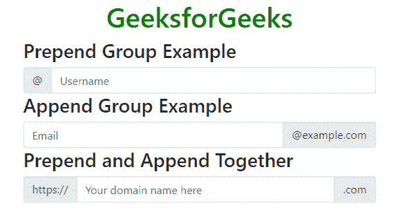
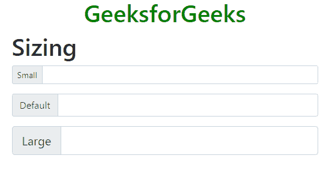
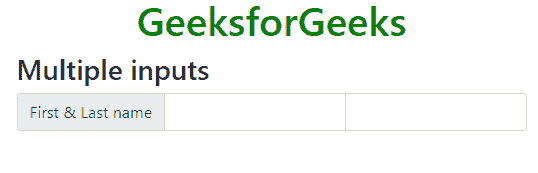
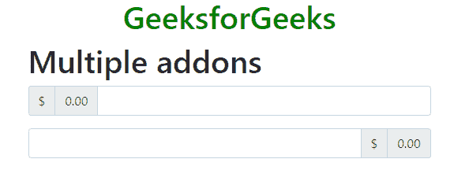
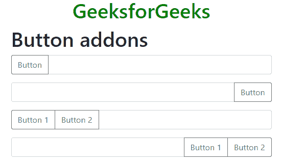
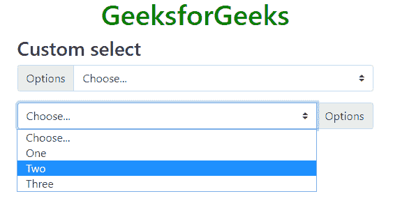
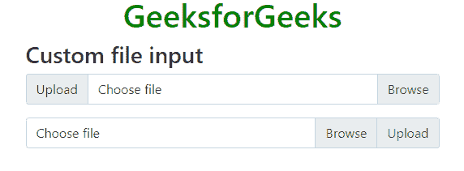

# 引导 4 |输入组

> 原文:[https://www.geeksforgeeks.org/bootstrap-4-input-groups/](https://www.geeksforgeeks.org/bootstrap-4-input-groups/)

Bootstrap 中的输入组用于通过在文本输入、自定义文件选择器或自定义输入的两侧添加文本或按钮来扩展默认表单控件。

**基本输入组:**以下类是用于将组添加到输入框两侧的基类。

*   *。input-group-prepend* 类用于将组添加到输入的前面。
*   *。输入-分组-追加*类用于将其添加到输入后面。
*   *。输入-组-文本*类用于设置组内显示的文本的样式。

**示例:**

## 超文本标记语言

```
<!DOCTYPE html>
<html lang="en">
<head>
    <title>Input Groups in Bootstrap</title>

    <meta charset="utf-8">
    <meta name="viewport" content="width=device-width, initial-scale=1">

    <link rel="stylesheet" href=
"https://maxcdn.bootstrapcdn.com/bootstrap/4.3.1/css/bootstrap.min.css">

    <script src=
"https://ajax.googleapis.com/ajax/libs/jquery/3.3.1/jquery.min.js">
    </script>

    <script src=
"https://cdnjs.cloudflare.com/ajax/libs/popper.js/1.14.7/umd/popper.min.js">
    </script>

    <script src=
"https://maxcdn.bootstrapcdn.com/bootstrap/4.3.1/js/bootstrap.min.js">
    </script>
</head>

<body>
    <h1 style="color:green;text-align:center;">
        GeeksforGeeks
    </h1>

    <div class="container">
        <h3>Prepend Group Example</h3>

        <!-- Declare an input group -->
        <div class="input-group">

            <!-- Prepend the following content to the input box -->
            <div class="input-group-prepend">

                <!-- Define the text content of the group -->
                <span class="input-group-text"
                id="username">
                    @
                    </span>
            </div>

            <!-- Declare an input box -->
            <input type="text"
                   class="form-control"
                   placeholder="Username">
        </div>

        <h3>Append Group Example</h3>

        <!-- Declare an input group -->
        <div class="input-group">

        <!-- Declare an input group -->
            <input type="text"
                   class="form-control"
                   placeholder="Email">

            <!-- Prepend the following content to the input box -->
            <div class="input-group-append">

                <!-- Define the text content of the group -->
                <span class="input-group-text"
                id="email">
                    @example.com
                    </span>
            </div>
        </div>

        <h3>Prepend and Append Together</h3>

        <!-- Declare an input group -->
        <div class="input-group">

            <!-- Prepend the following content to the input box -->
            <div class="input-group-prepend">

                <!-- Define the text content of the group -->
                <span class="input-group-text">
                    https://
                    </span>
            </div>

            <!-- Declare an input group -->
            <input type="text"
                   class="form-control"
                   placeholder="Your domain name here">

            <!-- Append the following content to the input box -->
            <div class="input-group-append">

                <!-- Define the text content of the group -->
                <span class="input-group-text">.com</span>
            </div>
        </div>
    </div>
</body>

</html>                   
```

**输出:**



**输入组的大小:**输入组可以通过使用额外的类来变大或变小。输入组有三种可能的大小。

*   *。输入组 sm* 类用于较小的尺寸。
*   *。输入组 lg* 类用于更大的尺寸。
*   *。输入组*类用作默认大小。

**注意:**当前不支持对单个输入组元素进行大小调整。

**示例:**

## 超文本标记语言

```
<!DOCTYPE html>
<html lang="en">
<head>
    <title>Input Groups in Bootstrap</title>

    <meta charset="utf-8">
    <meta name="viewport" content="width=device-width, initial-scale=1">

    <link rel="stylesheet" href=
"https://maxcdn.bootstrapcdn.com/bootstrap/4.3.1/css/bootstrap.min.css">

    <script src=
"https://ajax.googleapis.com/ajax/libs/jquery/3.3.1/jquery.min.js">
    </script>

    <script src=
"https://cdnjs.cloudflare.com/ajax/libs/popper.js/1.14.7/umd/popper.min.js">
    </script>

    <script src=
"https://maxcdn.bootstrapcdn.com/bootstrap/4.3.1/js/bootstrap.min.js">
    </script>
</head>

<body>
    <h1 style="color:green;text-align:center;">
        GeeksforGeeks
    </h1>

    <div class="container">
        <h1>Sizing</h1>

        <!-- Declare the small input group -->
        <div class="input-group input-group-sm mb-3">

            <!-- Prepend the following content to the input box -->
            <div class="input-group-prepend">

                <!-- Define the text content of the group -->
                <span class="input-group-text" id="small">Small</span>
            </div>

            <!-- Declare an input box -->
            <input type="text" class="form-control">
        </div>

        <!-- Declare the normal input group -->
        <div class="input-group mb-3">

            <!-- Prepend the following content to the input box -->
            <div class="input-group-prepend">

                <!-- Define the text content of the group -->
                <span class="input-group-text" id="medium">Default</span>
            </div>

            <!-- Declare an input box -->
            <input type="text" class="form-control">
        </div>

        <!-- Declare the large input group -->
        <div class="input-group input-group-lg">

            <!-- Prepend the following content to the input box -->
            <div class="input-group-prepend">

                <!-- Define the text content of the group -->
                <span class="input-group-text" id="large">Large</span>
            </div>

            <!-- Declare an input box -->
            <input type="text" class="form-control">
        </div>
    </div>
</body>

</html>                   
```

**输出:**



**使用多输入:**多输入可用于输入组。

**示例:**

## 超文本标记语言

```
<!DOCTYPE html>
<html lang="en">
<head>
    <title>Input Groups in Bootstrap</title>

    <meta charset="utf-8">
    <meta name="viewport" content="width=device-width, initial-scale=1">

    <link rel="stylesheet" href=
"https://maxcdn.bootstrapcdn.com/bootstrap/4.3.1/css/bootstrap.min.css">

    <script src=
"https://ajax.googleapis.com/ajax/libs/jquery/3.3.1/jquery.min.js">
    </script>

    <script src=
"https://cdnjs.cloudflare.com/ajax/libs/popper.js/1.14.7/umd/popper.min.js">
    </script>

    <script src=
"https://maxcdn.bootstrapcdn.com/bootstrap/4.3.1/js/bootstrap.min.js">
    </script>
</head>

<body>
    <h1 style="color:green;text-align:center;">
        GeeksforGeeks
    </h1>

    <div class="container">
        <h3>Multiple inputs</h3>

        <!-- Declare an input group -->
        <div class="input-group">

            <!-- Prepend the following content to the input box -->
            <div class="input-group-prepend">

                <!-- Define the text content of the group -->
                <span class="input-group-text" id="">First & Last name</span>
            </div>

            <!-- Declare two input boxes -->
            <input type="text" class="form-control">
            <input type="text" class="form-control">
        </div>
    </div>
</body>

</html>
```

**输出:**



**使用多个插件:**多个插件可以与其他类型堆叠或混合在一起，包括复选框和单选按钮。

**示例:**

## 超文本标记语言

```
<!DOCTYPE html>
<html lang="en">
<head>
    <title>Input Groups in Bootstrap</title>

    <meta charset="utf-8">
    <meta name="viewport" content="width=device-width, initial-scale=1">

    <link rel="stylesheet" href=
"https://maxcdn.bootstrapcdn.com/bootstrap/4.3.1/css/bootstrap.min.css">

    <script src=
"https://ajax.googleapis.com/ajax/libs/jquery/3.3.1/jquery.min.js">
    </script>

    <script src=
"https://cdnjs.cloudflare.com/ajax/libs/popper.js/1.14.7/umd/popper.min.js">
    </script>

    <script src=
"https://maxcdn.bootstrapcdn.com/bootstrap/4.3.1/js/bootstrap.min.js">
    </script>
</head>

<body>
    <h1 style="color:green;text-align:center;">
        GeeksforGeeks
    </h1>

    <div class="container">
        <h1>Multiple addons</h1>

        <!-- Declare an input group -->
        <div class="input-group mb-3">

            <!-- Prepend the following content to the input box -->
            <div class="input-group-prepend">

                <!-- Declare two input groups -->
                <span class="input-group-text">{content}lt;/span>
                <span class="input-group-text">0.00</span>

            </div>
            <!-- Declare an input box -->
            <input type="text" class="form-control">
        </div>

        <!-- Declare an input group -->
        <div class="input-group">

            <!-- Declare an input box -->
            <input type="text" class="form-control">

            <!-- Append the following content to the input box -->
            <div class="input-group-append">

                <!-- Declare two input texts -->
                <span class="input-group-text">{content}lt;/span>
                <span class="input-group-text">0.00</span>
            </div>
        </div>
    </div>
</body>

</html>
```

**输出:**



**使用按钮插件:**按钮也可以添加到输入框中。

**示例:**

## 超文本标记语言

```
<!DOCTYPE html>
<html lang="en">
<head>
    <title>Input Groups in Bootstrap</title>

    <meta charset="utf-8">
    <meta name="viewport" content="width=device-width, initial-scale=1">

    <link rel="stylesheet" href=
"https://maxcdn.bootstrapcdn.com/bootstrap/4.3.1/css/bootstrap.min.css">

    <script src=
"https://ajax.googleapis.com/ajax/libs/jquery/3.3.1/jquery.min.js">
    </script>

    <script src=
"https://cdnjs.cloudflare.com/ajax/libs/popper.js/1.14.7/umd/popper.min.js">
    </script>

    <script src=
"https://maxcdn.bootstrapcdn.com/bootstrap/4.3.1/js/bootstrap.min.js">
    </script>
</head>

<body>
    <h1 style="color:green;text-align:center;">
        GeeksforGeeks
    </h1>

    <div class="container">
        <h1>Button addons</h1>

        <!-- Declare an input group -->
        <div class="input-group mb-3">

            <!-- Prepend the following content to the input box -->
            <div class="input-group-prepend">

                <!-- Declare a button -->
                <button class="btn btn-outline-secondary" type="button">
                    Button
                    </button>
            </div>

            <!-- Declare an input box -->
            <input type="text" class="form-control">
        </div>

        <!-- Declare an input group -->
        <div class="input-group mb-3">

            <!-- Declare an input box -->           
            <input type="text" class="form-control">

            <!-- Append the following content to the input box -->
            <div class="input-group-append">

                <!-- Declare a button -->
                <button class="btn btn-outline-secondary" type="button">
                    Button
                    </button>
            </div>
        </div>

        <!-- Declare an input group -->       
        <div class="input-group mb-3">

            <!-- Prepend the following content to the input box -->           
            <div class="input-group-prepend">

                <!-- Declare two buttons -->
                <button class="btn btn-outline-secondary" type="button">
                    Button 1
                    </button>
                <button class="btn btn-outline-secondary" type="button">
                    Button 2
                    </button>
            </div>

            <!-- Declare an input box -->
            <input type="text" class="form-control">
        </div>

        <!-- Declare an input group -->            
        <div class="input-group mb-3">

            <!-- Declare an input box -->           
            <input type="text" class="form-control">

            <!-- Append the following content to the input box -->      
            <div class="input-group-append">

                <!-- Declare two buttons -->
                <button class="btn btn-outline-secondary" type="button">
                    Button 1
                    </button>
                <button class="btn btn-outline-secondary" type="button">
                    Button 2
                    </button>
            </div>
        </div>
    </div>
</body>

</html>
```

**输出:**



**使用自定义选择:**输入组可以与自定义选择元素一起使用。

**注意:**浏览器不支持自定义选择的默认版本。

**示例:**

## 超文本标记语言

```
<!DOCTYPE html>
<html lang="en">
<head>
    <title>Input Groups in Bootstrap</title>

    <meta charset="utf-8">
    <meta name="viewport" content="width=device-width, initial-scale=1">

    <link rel="stylesheet" href=
"https://maxcdn.bootstrapcdn.com/bootstrap/4.3.1/css/bootstrap.min.css">

    <script src=
"https://ajax.googleapis.com/ajax/libs/jquery/3.3.1/jquery.min.js">
    </script>

    <script src=
"https://cdnjs.cloudflare.com/ajax/libs/popper.js/1.14.7/umd/popper.min.js">
    </script>

    <script src=
"https://maxcdn.bootstrapcdn.com/bootstrap/4.3.1/js/bootstrap.min.js">
    </script>
</head>

<body>
    <h1 style="color:green;text-align:center;">
        GeeksforGeeks
    </h1>

    <div class="container">
        <h3>Custom select</h3>

        <div class="input-group mb-3">
            <div class="input-group-prepend">
                <label class="input-group-text" for="select01">Options</label>
            </div>
            <select class="custom-select" id="select01">
                <option selected>Choose...</option>
                <option value="1">One</option>
                <option value="2">Two</option>
                <option value="3">Three</option>
            </select>
        </div>

        <div class="input-group mb-3">
            <select class="custom-select" id="select02">
                <option selected>Choose...</option>
                <option value="1">One</option>
                <option value="2">Two</option>
                <option value="3">Three</option>
            </select>
            <div class="input-group-append">
                <label class="input-group-text" for="select02">Options</label>
            </div>
        </div>
    </div>
</body>

</html>
```

**输出:**



### 使用自定义文件输入:

输入组可以与自定义文件输入一起使用。

**注:**

不支持文件输入的浏览器默认版本。

**示例:**

## 超文本标记语言

```
<!DOCTYPE html>
<html lang="en">
<head>
    <title>Input Groups in Bootstrap</title>

    <meta charset="utf-8">
    <meta name="viewport" content="width=device-width, initial-scale=1">

    <link rel="stylesheet" href=
"https://maxcdn.bootstrapcdn.com/bootstrap/4.3.1/css/bootstrap.min.css">

    <script src=
"https://ajax.googleapis.com/ajax/libs/jquery/3.3.1/jquery.min.js">
    </script>

    <script src=
"https://cdnjs.cloudflare.com/ajax/libs/popper.js/1.14.7/umd/popper.min.js">
    </script>

    <script src=
"https://maxcdn.bootstrapcdn.com/bootstrap/4.3.1/js/bootstrap.min.js">
    </script>
</head>

<body>
    <h1 style="color:green;text-align:center;">
        GeeksforGeeks
    </h1>

    <div class="container">
        <h3>Custom file input</h3>
        <div class="input-group mb-3">
            <div class="input-group-prepend">
                <span class="input-group-text">Upload</span>
            </div>
            <div class="custom-file">
                <input type="file" class="custom-file-input" id="file01">
                <label class="custom-file-label" for="file01">Choose file</label>
            </div>
        </div>

        <div class="input-group mb-3">
            <div class="custom-file">
                <input type="file" class="custom-file-input" id="file02">
                <label class="custom-file-label" for="file02">Choose file</label>
            </div>
            <div class="input-group-append">
                <span class="input-group-text" id="">Upload</span>
            </div>
        </div>
    </div>
</body>

</html>                   
```

**输出:**

