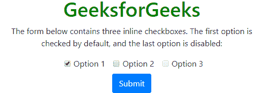

# 自举 4 |输入

> 原文:[https://www.geeksforgeeks.org/bootstrap-4-inputs/](https://www.geeksforgeeks.org/bootstrap-4-inputs/)

引导程序 4 中的表单控件列表。

1.  **输入**
2.  textarea
3.  **复选框**
4.  **内嵌复选框**
5.  **单选按钮**
6.  **选择列表**
7.  **形状控制尺寸**
8.  **纯文本表单控件**
9.  **表单控制文件和范围**

**1。输入类型:【Bootstrap 4 支持的输入类型有文本、密码、数字。datetime，datetime-local，date，month，time，week，email，url，search，tel 和 color 这意味着它支持所有的 HTML 5 输入类型。**

下面是所有输入类型的实现。

**文字、** **密码****和数字代码:**

## 超文本标记语言

```html
<!DOCTYPE html>
<html>
<head>
<title>Bootstrap Example</title>
<meta charset="utf-8">
<meta name="viewport"
content="width=device-width, initial-scale=1">
<link rel="stylesheet"
href="https://maxcdn.bootstrapcdn.com/bootstrap/4.3.1/css/bootstrap.min.css">
<script src=
"https://ajax.googleapis.com/ajax/libs/jquery/3.4.0/jquery.min.js"></script>
<script src=
"https://cdnjs.cloudflare.com/ajax/libs/popper.js/1.14.7/umd/popper.min.js">
</script>
<script src=
"https://maxcdn.bootstrapcdn.com/bootstrap/4.3.1/js/bootstrap.min.js">
</script>
</head>
<body>
<center>
<div class="container">
<h2 style="color:green;">GeeksforGeeks</h2>

<p>The form below contains type text and one
 of type password:</p>

<form>
    <div class="form-group">
    <label for="usr">Name:</label>
    <input type="text" class="form-control"
                                   id="usr" name="username">
    </div>
    <div class="form-group">
    <label for="pwd">Password:</label>
    <input type="password" class="form-control"
                                   id="pwd" name="password">
    </div>
    <div class="form-group" style="width:100px;">
    <label for="number">Number:</label>
    <input type="number" class="form-control" id="number">
    </div>
    <button type="submit" class="btn btn-primary">
                      Submit</button>
</form>
</div>
</center>
</body>
</html>                   
```

**输出:**


**时间、** **日期、日期和时间、周和月代码:**

## 超文本标记语言

```html
<!DOCTYPE html>
<html>

<head>
    <title>Bootstrap Example</title>
    <meta charset="utf-8">
    <meta name="viewport"
     content="width=device-width, initial-scale=1">
    <link rel="stylesheet"
     href="https://maxcdn.bootstrapcdn.com/bootstrap/4.3.1/css/bootstrap.min.css">
    <script src=
     "https://ajax.googleapis.com/ajax/libs/jquery/3.4.0/jquery.min.js">
    </script>
    <script src=
     "https://cdnjs.cloudflare.com/ajax/libs/popper.js/1.14.7/umd/popper.min.js">
    </script>
    <script src=
     "https://maxcdn.bootstrapcdn.com/bootstrap/4.3.1/js/bootstrap.min.js">
    </script>
    <style>
    .st_row{
        width:200px;
        float:left;
    }
    .nd_row{
        width:200px;
        float:right;
    }
    </style>
</head>

<body>
    <center>
        <div class="container">
            <h2 style="color:green;">GeeksforGeeks</h2>

<p>The form below contains Current time,Current date,
              Current date and time Current week and Current month:</p>

            <form>
                <div class="form-group">
                    <div class="st_row">
                    <label for="time">Current time:</label>
                    <input type="time" class="form-control" id="time">

                    <label for="dt">Current date:</label>
                    <input type="date" class="form-control" id="dt">
                    </div>
                    <div class="nd_row">
                    <label for="datetime-local">Current date and time:
                    </label>
                    <input type="datetime-local" class="form-control"
                    id="datetime-local">

                    <label for="week">Current week:</label>
                    <input type="week" class="form-control" id="week">
                    </div>
                    <div class="rd_row">
                    <label for="month">Current month :</label>
                    <input type="month" class="form-control" id="month">
                    </div>
                </div>
                <button type="submit" class="btn btn-primary">Submit</button>
            </form>
        </div>
    </center>
</body>

</html>
```

**输出:**


**网址、搜索、电话和颜色代码:**

## 超文本标记语言

```html
<!DOCTYPE html>
<html>

<head>
    <title>Bootstrap Example</title>
    <meta charset="utf-8">
    <meta name="viewport"
     content="width=device-width, initial-scale=1">
    <link rel="stylesheet"
     href="https://maxcdn.bootstrapcdn.com/bootstrap/4.3.1/css/bootstrap.min.css">
    <script src=
     "https://ajax.googleapis.com/ajax/libs/jquery/3.4.0/jquery.min.js">
    </script>
    <script src=
     "https://cdnjs.cloudflare.com/ajax/libs/popper.js/1.14.7/umd/popper.min.js">
    </script>
    <script src=
      "https://maxcdn.bootstrapcdn.com/bootstrap/4.3.1/js/bootstrap.min.js">
    </script>
    <style>
        .st_row {
            width: 250px;
            float: left;
            margin-bottom: 10px;
        }

        .nd_row {
            width: 250px;
            float: right;
            margin-bottom: 10px;
        }
    </style>
</head>

<body>
    <center>
        <div class="container">
            <h2 style="color:green;">GeeksforGeeks</h2>

<p>The form below contains url ,Search ,tel and color:</p>

            <form>
                <div class="form-group">
                    <div class="st_row">
                        <label for="url">url:</label>
                        <input type="url" class="form-control" id="url">

                        <label for="search">Search:</label>
                        <input type="search" class="form-control" id="search">
                    </div>
                    <div class="nd_row">
                        <label for="tel">tel:</label>
                        <input type="tel" class="form-control" id="tel">

                        <label for="color">color:</label>
                        <input type="color" class="form-control" id="color">
                    </div>
                </div>
                <button type="submit" class="btn btn-primary">Submit</button>
            </form>
        </div>
    </center>
</body>

</html>
```

**输出:**


**2。Textarea:** Textarea 主要用于反馈或评论区

**代码:**

## 超文本标记语言

```html
<!DOCTYPE html>
<html>

<head>
    <title>Bootstrap Example</title>
    <meta charset="utf-8">
    <meta name="viewport"
     content="width=device-width, initial-scale=1">
    <link rel="stylesheet"
     href="https://maxcdn.bootstrapcdn.com/bootstrap/4.3.1/css/bootstrap.min.css">
    <script src=
     "https://ajax.googleapis.com/ajax/libs/jquery/3.4.0/jquery.min.js">
    </script>
    <script src=
     "https://cdnjs.cloudflare.com/ajax/libs/popper.js/1.14.7/umd/popper.min.js">
    </script>
    <script src=
     "https://maxcdn.bootstrapcdn.com/bootstrap/4.3.1/js/bootstrap.min.js">
    </script>
</head>

<body>
    <center>
      <div class="container">
        <h1 style="color:green">GeeksforGeeks</h1>

<p>The form below contains a textarea for comments or feedbacks:</p>

        <form action="/action_page.php">
          <div class="form-group">
            <label for="comment">Comment | Feedback:</label>
              <textarea class="form-control" rows="6" id="comment" name="text">
              </textarea>
          </div>
          <button type="submit" class="btn btn-primary">Submit</button>
         </form>
      </div>
    </center>
</body>

</html>
```

**输出:**


**3。复选框:**用于从提供的列表中选择任何特定项目。在这里，我们将使用 class="form-check "来保持适当的边距，以标记元素。表格-检查-标签“以及我们将使用的复选框的样式”。表单-检查-输入”

**代码:**

## 超文本标记语言

```html
<!DOCTYPE html>
<html>

<head>
    <title>Bootstrap Example</title>
    <meta charset="utf-8">
    <meta name="viewport"
          content="width=device-width, initial-scale=1">
    <link rel="stylesheet"
     href="https://maxcdn.bootstrapcdn.com/bootstrap/4.3.1/css/bootstrap.min.css">
    <script src=
     "https://ajax.googleapis.com/ajax/libs/jquery/3.4.0/jquery.min.js">
    </script>
    <script src=
     "https://cdnjs.cloudflare.com/ajax/libs/popper.js/1.14.7/umd/popper.min.js">
    </script>
    <script src=
     "https://maxcdn.bootstrapcdn.com/bootstrap/4.3.1/js/bootstrap.min.js">
    </script>
</head>

<body>
    <center>
        <div class="container">
            <h1 style="color:green">GeeksforGeeks</h1>

<p>The form below contains three checkboxes.
              The first option is checked by default,
                and the second option is disabled:</p>

            <form action="/action_page.php">
                <div class="form-check">
                    <label class="form-check-label" for="check1">
                        <input type="checkbox" class="form-check-input"
                             id="check1" name="option1" value="something" checked>
                        Option 1
                    </label>
                </div>
                <div class="form-check">
                    <label class="form-check-label" for="check2">
                        <input type="checkbox" class="form-check-input" id="check2"
                               disabled>Option 2
                    </label>
                </div>
                <div class="form-check">
                    <label class="form-check-label">
                        <input type="checkbox" class="form-check-input" name="option2"
                               value="something">Option 3
                    </label>
                </div>
                <button type="submit" class="btn btn-primary">Submit</button>
            </form>
        </div>
        <center>
</body>

</html>
```

**输出:**


**4。内联复选框:**要使用内联复选框，只需将“表单-检查-标签”替换为“表单-检查-内联”，并在单个<分区>中包含所有选项

**代码:**

## 超文本标记语言

```html
<!DOCTYPE html>
<html>
<head>
  <title>Bootstrap Example</title>
  <meta charset="utf-8">
  <meta name="viewport" content="width=device-width, initial-scale=1">
  <link rel="stylesheet"
   href="https://maxcdn.bootstrapcdn.com/bootstrap/4.3.1/css/bootstrap.min.css">
  <script src=
  "https://ajax.googleapis.com/ajax/libs/jquery/3.4.0/jquery.min.js"></script>
  <script src=
  "https://cdnjs.cloudflare.com/ajax/libs/popper.js/1.14.7/umd/popper.min.js"></script>
  <script src=
  "https://maxcdn.bootstrapcdn.com/bootstrap/4.3.1/js/bootstrap.min.js"></script>
</head>
<body>
<center>
<div class="container">
  <h1 style="color:green">GeeksforGeeks</h1>

<p>The form below contains three inline checkboxes.
    The first option is checked by default,
     and the last option is disabled:</p>

  <form action="/action_page.php">
    <div class="form-check">
      <label class="form-check-inline" for="check1">
        <input type="checkbox" class="form-check-input" id="check1"
                    name="option1" value="something" checked>Option 1
      </label>
      <label class="form-check-inline" for="check2">
        <input type="checkbox" class="form-check-input" id="check2"
                           name="option2" value="something">Option 2
      </label>
      <label class="form-check-inline">
        <input type="checkbox" class="form-check-input" disabled>Option 3
      </label>
    </div>
    <button type="submit" class="btn btn-primary">Submit</button>
  </form>
</div>
<center>
</body>
</html>
```

**输出:**



**5。单选按钮:**单选按钮用于用户从多个选项中只选择一个选项。它类似于**复选框**只是从输入类型中删除“复选框”并放置“单选”，我们也可以使用该内嵌单选按钮。

**代码:**

## 超文本标记语言

```html
<!DOCTYPE html>
<html>
<head>
    <title>Bootstrap Example</title>
    <meta charset="utf-8">
    <meta name="viewport"
     content="width=device-width, initial-scale=1">
    <link rel="stylesheet"
     href="https://maxcdn.bootstrapcdn.com/bootstrap/4.3.1/css/bootstrap.min.css">
    <script src=
     "https://ajax.googleapis.com/ajax/libs/jquery/3.4.0/jquery.min.js">
    </script>
    <script src=
     "https://cdnjs.cloudflare.com/ajax/libs/popper.js/1.14.7/umd/popper.min.js">
    </script>
    <script src=
     "https://maxcdn.bootstrapcdn.com/bootstrap/4.3.1/js/bootstrap.min.js">
    </script>
</head>

<body>
    <center>
        <div class="container">
            <h1 style="color:green">GeeksforGeeks</h1>

<p>The form below contains three radio buttons.
              The first option is checked by default, and the
              last option is disabled:</p>

            <form action="/action_page.php">
                <div class="form-check">
                    <label class="form-check-label" for="radio1">
                        <input type="radio" class="form-check-input" id="radio1"
                               name="optradio" value="option1" checked>Option 1
                    </label>
                </div>
                <div class="form-check">
                    <label class="form-check-label" for="radio2">
                        <input type="radio" class="form-check-input" id="radio2"
                               name="optradio" value="option2">Option 2
                    </label>
                </div>
                <div class="form-check">
                    <label class="form-check-label">
                        <input type="radio" class="form-check-input" disabled>
                        Option 3
                    </label>
                </div>
                <button type="submit" class="btn btn-primary">Submit</button>
            </form>
        </div>
  </center>
</body>

</html>
```

**输出:**


**6。选择列表:**这里有两种选择列表:从列表中选择单个元素和从列表中选择两个或多个元素选择多个元素，只需按住 shift 键并逐个选择您的项目。

**代码:**

## 超文本标记语言

```html
<!DOCTYPE html>
<html>

<head>
    <title>Bootstrap Example</title>
    <meta charset="utf-8">
    <meta name="viewport"
     content="width=device-width, initial-scale=1">
    <link rel="stylesheet"
     href="https://maxcdn.bootstrapcdn.com/bootstrap/4.3.1/css/bootstrap.min.css">
    <script src=
     "https://ajax.googleapis.com/ajax/libs/jquery/3.4.0/jquery.min.js">
    </script>
    <script src=
     "https://cdnjs.cloudflare.com/ajax/libs/popper.js/1.14.7/umd/popper.min.js">
    </script>
    <script src=
     "https://maxcdn.bootstrapcdn.com/bootstrap/4.3.1/js/bootstrap.min.js">
    </script>
</head>

<body>
    <center>
        <div class="container">
            <h1 style="color:green">GeeksforGeeks</h1>

<p>The form below contains two dropdown menus (select lists):
            </p>

            <form action="/action_page.php">
                <div class="form-group">
                    <label for="geeks1">Select list (select one):</label>
                    <select class="form-control" id="sel1" name="sellist1">
                        <option>Python</option>
                        <option>C++</option>
                        <option>C#</option>
                        <option>Java</option>
                    </select>
                    <br>
                    <label for="geeks2">Multiple select list
                      (to select more than one old shift):</label>
                    <select multiple class="form-control" id="sel2" name="sellist2">
                        <option>Python</option>
                        <option>C++</option>
                        <option>C#</option>
                        <option>Java</option>
                        <option>MongoDB</option>
                    </select>
                </div>
                <button type="submit" class="btn btn-primary">Submit</button>
            </form>
        </div>
  </center>
</body>

</html>
```

**输出:**


**7。表单控件大小:**我们将使用。表单控件 sm 或。form-control-lg:更改窗体控件的大小。

**代码:**

## 超文本标记语言

```html
<!DOCTYPE html>
<html>

<head>
    <title>Bootstrap Example</title>
    <meta charset="utf-8">
    <meta name="viewport"
     content="width=device-width, initial-scale=1">
    <link rel="stylesheet"
     href="https://maxcdn.bootstrapcdn.com/bootstrap/4.3.1/css/bootstrap.min.css">
    <script src=
     "https://ajax.googleapis.com/ajax/libs/jquery/3.4.0/jquery.min.js">
    </script>
    <script src=
     "https://cdnjs.cloudflare.com/ajax/libs/popper.js/1.14.7/umd/popper.min.js">
    </script>
    <script src=
      "https://maxcdn.bootstrapcdn.com/bootstrap/4.3.1/js/bootstrap.min.js">
    </script>
</head>

<body>
    <center>
     <div class="container">
       <h1 style="color:green">GeeksforGeeks</h1>

<p>Change the size of the form control
            with .form-control-sm or .form-control-lg:</p>

         <form action="/action_page.php">
           <div class="form-group">
            <input type="text" class="form-control form-control-sm"
               placeholder="Small form control" name="text1">
           </div>
           <div class="form-group">
            <input type="text" class="form-control"
               placeholder="Default form control" name="text2">
           </div>
           <div class="form-group">
             <input type="text" class="form-control form-control-lg"
               placeholder="Large form control" name="text3">
           </div>
           <button type="submit" class="btn btn-primary">Submit</button>
         </form>
     </div>
   </center>
</body>
</html>
```

**输出:**


**8。带纯文本的表单控件:**如果您想将输入字段修改为纯文本，则可以使用”。表单-控件-明文”,而不是输入标记类中的“表单-控件表单-控件”。

**代码:**

## 超文本标记语言

```html
<!DOCTYPE html>
<html>
<head>
    <title>Bootstrap Example</title>
    <meta charset="utf-8">
    <meta name="viewport"
     content="width=device-width, initial-scale=1">
    <link rel="stylesheet"
     href="https://maxcdn.bootstrapcdn.com/bootstrap/4.3.1/css/bootstrap.min.css">
    <script src=
     "https://ajax.googleapis.com/ajax/libs/jquery/3.4.0/jquery.min.js">
    </script>
    <script src=
     "https://cdnjs.cloudflare.com/ajax/libs/popper.js/1.14.7/umd/popper.min.js">
    </script>
    <script src=
      "https://maxcdn.bootstrapcdn.com/bootstrap/4.3.1/js/bootstrap.min.js">
    </script>
</head>

<body>
    <center>
     <div class="container">
       <h1 style="color:green">GeeksforGeeks</h1>

<p>Change the size of the form control with
            form-control-plaintext: </p>

         <form action="/action_page.php">
           <div class="form-group">
            <input type="text" class="form-control-plaintext"
               placeholder="form-control-plaintext" name="text1"
                style="border:2px solid black;">
           </div>
           <button type="submit" class="btn btn-primary">Submit</button>
         </form>
     </div>
   </center>
</body>
</html>
```

**输出:**


**9。表单控制文件和范围:**可以添加。form-control-range 类转换为输入类型“range”或。表单-控件-文件输入类型“文件”,为范围控件或文件字段设置全角样式。

**代码:**

## 超文本标记语言

```html
<!DOCTYPE html>
<html>

<head>
    <title>Bootstrap Example</title>
    <meta charset="utf-8">
    <meta name="viewport"
    content="width=device-width, initial-scale=1">
    <link rel="stylesheet"
    href="https://maxcdn.bootstrapcdn.com/bootstrap/4.3.1/css/bootstrap.min.css">
    <script src=
    "https://ajax.googleapis.com/ajax/libs/jquery/3.4.0/jquery.min.js">
    </script>
    <script src=
    "https://cdnjs.cloudflare.com/ajax/libs/popper.js/1.14.7/umd/popper.min.js">
    </script>
    <script src=
     "https://maxcdn.bootstrapcdn.com/bootstrap/4.3.1/js/bootstrap.min.js">
    </script>
</head>

<body>
    <center>
        <div class="container">
            <h1 style="color:green">GeeksforGeeks</h1>

<p>.form-control-range class to input type"range"
              or .form-control-file to input type"file" to style a range control
              or a file field with full-width:</p>

            <form action="/action_page.php">
                <div class="form-group">
                    <input type="range" class="form-control-range" name="range">
                </div>
                <div class="form-group">
                    <input type="file" class="form-control-file border" name="file">
                </div>
                <button type="submit" class="btn btn-primary">Submit</button>
            </form>
        </div>
    </center>
</body>

</html>
```

**输出:**

