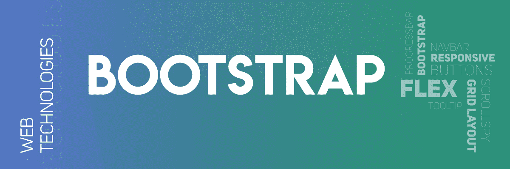

# Bootstrap 4 |简介

> 原文:[https://www.geeksforgeeks.org/bootstrap-4-introduction/](https://www.geeksforgeeks.org/bootstrap-4-introduction/)

Bootstrap 是一个免费的开源工具集合，用于创建响应性网站和网络应用程序。它是最流行的 HTML、CSS 和 JavaScript 框架，用于开发响应迅速、移动优先的网站。它解决了我们曾经遇到的许多问题，其中之一就是跨浏览器兼容性问题。如今，这些网站非常适合所有浏览器(IE、火狐和 Chrome)和所有大小的屏幕(台式机、平板电脑、平板电脑和手机)。这都要感谢 Bootstrap 的开发者——推特的马克·奥托和雅各布·桑顿，尽管后来它被宣布为开源项目。



**为什么自举？**

*   更快更容易的网络开发。
*   它创建独立于平台的网页。
*   它创建响应性网页。
*   它也是为响应移动设备而设计的。
*   它是免费的！可在 www.getbootstrap.com 获得

**如何在** **网页上使用 Bootstrap 4:**在网站上包含 Bootstrap 有两种方式。

*   包括来自 CDN 链接的引导。
*   从 getbootstrap.com 下载引导并使用它。

**来自 CDN 的 BootStrap 4:**这种安装 BootStrap 的方法很简单。强烈建议遵循此方法。

*   前往[www.getbootstrap.com](http://www.getbootstrap.com)，点击开始。向下滚动并复制 CSS、JS、Propper.js 和 jQuery 链接的引导 CDN。

**引导 CSS 库**

> < link rel= "样式表"
> 
> href="https://stackpath.bootstrapcdn.com/bootstrap/4.3.1/css/bootstrap.min.css"
> 
> 完整性= " sha 384-ggoyr 0 ixcbmqv 3 xipma 34 MD+DH/1 FQ 784/j6cy/ijquhcwr 7x9jvorxt 2 mzw1t " cross origin = " anonymous " >

**jQuery 库**

> < src = " https://code . jquery . com/jquery-3 . 3 . 1 . slim . min . js "脚本
> 
> 完整性= " sha 384-q8i/x+965 dz 0 rt 7 abk 41 jstqiaqvgrzbzgo 5 smxp4 yfrvh+8 杀了 1Pi6jizo "
> 
> crossorigin="anonymous " >

**JS 库**

> < src = " https://cdnjs . cloudflare . com/Ajax/libs/popper . js/1 . 14 . 7/UMD/popper . min . js "脚本
> 
> 完整性= " sha 384-UO2 和 0 cphqdsjq 6 hjty 5 kvphphzwj 9 wo 1 clhtmga 3 jdzwrnqq 4 SF 86 dihndz0 w1 "
> 
> crossorigin="anonymous " >

**最新编译的 JavaScript 库**

> < script src = " https://stack path . bootstrapcdn . com/bootstrap/4 . 3 . 1/js/bootstrap . min . js "
> 
> 完整性= " sha 384-jsmvgyd 0 P3 PB1 rridy 6 orq 6 vrjiaf/njgzxfdsf 4 x4 XIM+b07 jrm "
> 
> crossorigin="anonymous " >

*   复制链接并粘贴到 HTML 代码的头部。

**示例:**

## 超文本标记语言

```html
<!DOCTYPE html>
<html lang="en">

<head>
    <title>Bootstrap Example</title>

    <meta charset="utf-8">

    <meta name="viewport" content=
        "width=device-width, initial-scale=1">

    <!-- Bootstrap CSS library -->
    <link rel="stylesheet" href=
"https://stackpath.bootstrapcdn.com/bootstrap/4.3.1/css/bootstrap.min.css"
    integrity=
"sha384-ggOyR0iXCbMQv3Xipma34MD+dH/1fQ784/j6cY/iJTQUOhcWr7x9JvoRxT2MZw1T"
    crossorigin="anonymous">

    <!-- jQuery library -->
    <script src="https://code.jquery.com/jquery-3.3.1.slim.min.js"
    integrity=
"sha384-q8i/X+965DzO0rT7abK41JStQIAqVgRVzpbzo5smXKp4YfRvH+8abtTE1Pi6jizo"
    crossorigin="anonymous"></script>

    <!-- JS library -->
    <script src=
"https://cdnjs.cloudflare.com/ajax/libs/popper.js/1.14.7/umd/popper.min.js"
    integrity=
"sha384-UO2eT0CpHqdSJQ6hJty5KVphtPhzWj9WO1clHTMGa3JDZwrnQq4sF86dIHNDz0W1"
    crossorigin="anonymous"></script>

    <!-- Latest compiled JavaScript library -->
    <script src=
"https://stackpath.bootstrapcdn.com/bootstrap/4.3.1/js/bootstrap.min.js"
    integrity=
"sha384-JjSmVgyd0p3pXB1rRibZUAYoIIy6OrQ6VrjIEaFf/nJGzIxFDsf4x0xIM+B07jRM"
    crossorigin="anonymous"></script>
    </head>
<body>

<div class="container">
    <h1>GeeksforGeeks</h1>

<p>A computer science portal for geeks</p>

</div>

</body>
</html>                   
```

**输出:**


**下载 Bootstrap:** 这种安装 Bootstrap 的方法也很简单，但是它可以脱机工作(不需要互联网连接)，但可能不适用于某些浏览器。

*   前往 www.getbootstrap.com，然后单击“入门”。单击下载引导按钮。


*   会下载一个. zip 文件。提取它并进入分发文件夹。它包含两个名为 CSS 和 JS 的文件夹。

> <link rel="”stylesheet”" type="”text/css”" href="”css/bootstrap.min.css”">