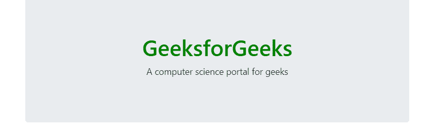
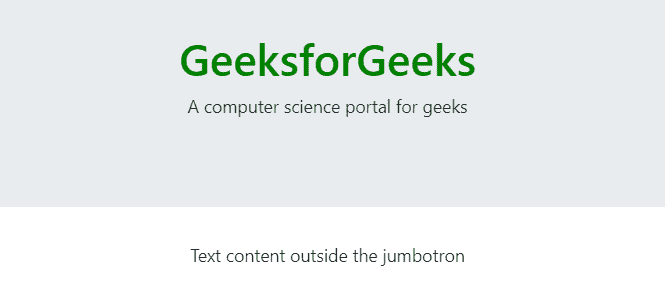

# 自举 4 |大屏幕

> 原文:[https://www.geeksforgeeks.org/bootstrap-4-jumbotron/](https://www.geeksforgeeks.org/bootstrap-4-jumbotron/)

大屏幕是一个灰色的大盒子，用来显示一些需要特别注意的文字。任何看起来重要的文本都可以写在一个大屏幕里，让它看起来大而引人注目。
**添加大屏幕的步骤:**

*   在 div 元素中使用一个 jumbotron 类。
*   在 div 标签中写入任何文本。
*   关闭 div 元素。

**语法:**

```
<div class="jumbtron"> Contents... <div>
```

**例:**

## 超文本标记语言

```
<!DOCTYPE html>
<html lang="en">
<head>
    <title>Bootstrap Jumbotron</title>

    <meta charset="utf-8">
    <meta name="viewport" content="width=device-width, initial-scale=1">

    <link rel="stylesheet" href=
"https://maxcdn.bootstrapcdn.com/bootstrap/4.3.1/css/bootstrap.min.css">

    <script src=
"https://ajax.googleapis.com/ajax/libs/jquery/3.3.1/jquery.min.js">
    </script>

    <script src=
"https://cdnjs.cloudflare.com/ajax/libs/popper.js/1.14.7/umd/popper.min.js">
    </script>

    <script src=
"https://maxcdn.bootstrapcdn.com/bootstrap/4.3.1/js/bootstrap.min.js">
    </script>
</head>

<body style="text-align:center;">
    <div class="container">
        <div class="jumbotron">
            <h1 style="color:green;">
                GeeksforGeeks
            </h1>

<p>A computer science portal for geeks</p>

        </div>
    </div>
</body>

</html>                   
```

**输出:**



**全宽大屏幕:***。混杂流体*和*。容器*或*。container-fluid* 类用于创建一个没有圆角边框的全幅大屏幕。
**语法:**

```
<div class="jumbotron jumbotron-fluid">
    <div class="container"> Contents... <div>
<div>
```

**例:**

## 超文本标记语言

```
<!DOCTYPE html>
<html lang="en">
<head>
    <title>Bootstrap Jumbotron</title>

    <meta charset="utf-8">
    <meta name="viewport" content="width=device-width, initial-scale=1">

    <link rel="stylesheet" href=
"https://maxcdn.bootstrapcdn.com/bootstrap/4.3.1/css/bootstrap.min.css">

    <script src=
"https://ajax.googleapis.com/ajax/libs/jquery/3.3.1/jquery.min.js">
    </script>

    <script src=
"https://cdnjs.cloudflare.com/ajax/libs/popper.js/1.14.7/umd/popper.min.js">
    </script>

    <script src=
"https://maxcdn.bootstrapcdn.com/bootstrap/4.3.1/js/bootstrap.min.js">
    </script>
</head>

<body style="text-align:center;">
    <div class="jumbotron jumbotron-fluid">
        <div class="container">
            <h1 style="color:green;">
                GeeksforGeeks
            </h1>

<p>A computer science portal for geeks</p>

        </div>
    </div>

<p>Text content outside the jumbotron</p>

</body>

</html>                   
```

**输出:**



**支持的浏览器:**

*   谷歌 Chrome
*   微软公司出品的 web 浏览器
*   火狐浏览器
*   歌剧
*   旅行队