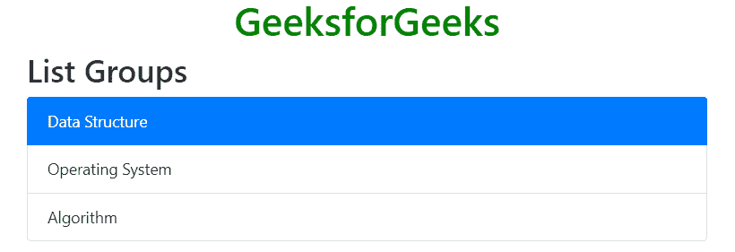

# 引导 4 |列表组

> 原文:[https://www.geeksforgeeks.org/bootstrap-4-list-groups/](https://www.geeksforgeeks.org/bootstrap-4-list-groups/)

列表组用于以有组织的方式显示一系列内容。使用*。列表组*和*。列表-组-项目*类创建项目列表。*。列表组*类与< ul >元素和*一起使用。列表-组-项目*与< li >元素一起使用。

**示例:**

## 超文本标记语言

```html
<!DOCTYPE html>
<html lang="en">
<head>
    <title>Bootstrap List Group</title>

    <meta charset="utf-8">
    <meta name="viewport" content="width=device-width, initial-scale=1">

    <link rel="stylesheet" href=
"https://maxcdn.bootstrapcdn.com/bootstrap/4.3.1/css/bootstrap.min.css">

    <script src=
"https://ajax.googleapis.com/ajax/libs/jquery/3.3.1/jquery.min.js">
    </script>

    <script src=
"https://cdnjs.cloudflare.com/ajax/libs/popper.js/1.14.7/umd/popper.min.js">
    </script>

    <script src=
"https://maxcdn.bootstrapcdn.com/bootstrap/4.3.1/js/bootstrap.min.js">
    </script>
</head>

<body>
    <h1 style="color:green;text-align:center;">
        GeeksforGeeks
    </h1>

    <div class="container">
        <h2>List Groups</h2>

        <ul class="list-group">
            <li class="list-group-item">Data Structure</li>
            <li class="list-group-item">Operating System</li>
            <li class="list-group-item">Algorithm</li>
        </ul>
    </div>
</body>

</html>                   
```

**输出:**


**活动列表项:***。激活*类用于高亮当前项目。
**例:**

## 超文本标记语言

```html
<!DOCTYPE html>
<html lang="en">
<head>
    <title>Bootstrap List Group</title>

    <meta charset="utf-8">
    <meta name="viewport" content="width=device-width, initial-scale=1">

    <link rel="stylesheet" href=
"https://maxcdn.bootstrapcdn.com/bootstrap/4.3.1/css/bootstrap.min.css">

    <script src=
"https://ajax.googleapis.com/ajax/libs/jquery/3.3.1/jquery.min.js">
    </script>

    <script src=
"https://cdnjs.cloudflare.com/ajax/libs/popper.js/1.14.7/umd/popper.min.js">
    </script>

    <script src=
"https://maxcdn.bootstrapcdn.com/bootstrap/4.3.1/js/bootstrap.min.js">
    </script>
</head>

<body>
    <h1 style="color:green;text-align:center;">
        GeeksforGeeks
    </h1>

    <div class="container">
        <h2>List Groups</h2>

        <ul class="list-group">
            <li class="list-group-item active">Data Structure</li>
            <li class="list-group-item">Operating System</li>
            <li class="list-group-item">Algorithm</li>
        </ul>
    </div>
</body>

</html>                   
```

**输出:**



**列出带有链接项目的组:**使用< div >和< a >标签代替< ul >和< li >创建带有链接项目的组列表。*。列表-组-项目-动作*类用于设置悬停效果将背景颜色改为灰色。
**例:**

## 超文本标记语言

```html
<!DOCTYPE html>
<html lang="en">
<head>
    <title>Bootstrap List Group</title>

    <meta charset="utf-8">
    <meta name="viewport" content="width=device-width, initial-scale=1">

    <link rel="stylesheet" href=
"https://maxcdn.bootstrapcdn.com/bootstrap/4.3.1/css/bootstrap.min.css">

    <script src=
"https://ajax.googleapis.com/ajax/libs/jquery/3.3.1/jquery.min.js">
    </script>

    <script src=
"https://cdnjs.cloudflare.com/ajax/libs/popper.js/1.14.7/umd/popper.min.js">
    </script>

    <script src=
"https://maxcdn.bootstrapcdn.com/bootstrap/4.3.1/js/bootstrap.min.js">
    </script>
</head>

<body>
    <h1 style="color:green;text-align:center;">
        GeeksforGeeks
    </h1>

    <div class="container">
        <h2>List Groups</h2>

        <div class="list-group">
            <a href="#" class="list-group-item list-group-item-action">
                Data Structure
            </a>

            <a href="#" class="list-group-item list-group-item-action">
                Operating System
            </a>

            <a href="#" class="list-group-item list-group-item-action">
                Algorithm
            </a>
        </div>
    </div>
</body>

</html>                   
```

**输出:**


**禁用项目:***。禁用*类用于禁用文本内容。这个类将文本颜色设置为浅色。当在链接上使用时，它将移除悬停效果。
**例:**

## 超文本标记语言

```html
<!DOCTYPE html>
<html lang="en">
<head>
    <title>Bootstrap List Group</title>

    <meta charset="utf-8">
    <meta name="viewport" content="width=device-width, initial-scale=1">

    <link rel="stylesheet" href=
"https://maxcdn.bootstrapcdn.com/bootstrap/4.3.1/css/bootstrap.min.css">

    <script src=
"https://ajax.googleapis.com/ajax/libs/jquery/3.3.1/jquery.min.js">
    </script>

    <script src=
"https://cdnjs.cloudflare.com/ajax/libs/popper.js/1.14.7/umd/popper.min.js">
    </script>

    <script src=
"https://maxcdn.bootstrapcdn.com/bootstrap/4.3.1/js/bootstrap.min.js">
    </script>
</head>

<body>
    <h1 style="color:green;text-align:center;">
        GeeksforGeeks
    </h1>

    <div class="container">
        <h2>List Groups</h2>

        <div class="list-group">
            <a href="#" class="list-group-item disabled">
                Data Structure
            </a>

            <a href="#" class="list-group-item">
                Operating System
            </a>

            <a href="#" class="list-group-item disabled">
                Algorithm
            </a>
        </div>
    </div>
</body>

</html>                   
```

**输出:**


**清除/移除边框:***。list-group-flush* 类用来去除一些边框和圆角。
**例:**

## 超文本标记语言

```html
<!DOCTYPE html>
<html lang="en">
<head>
    <title>Bootstrap List Group</title>

    <meta charset="utf-8">
    <meta name="viewport" content="width=device-width, initial-scale=1">

    <link rel="stylesheet" href=
"https://maxcdn.bootstrapcdn.com/bootstrap/4.3.1/css/bootstrap.min.css">

    <script src=
"https://ajax.googleapis.com/ajax/libs/jquery/3.3.1/jquery.min.js">
    </script>

    <script src=
"https://cdnjs.cloudflare.com/ajax/libs/popper.js/1.14.7/umd/popper.min.js">
    </script>

    <script src=
"https://maxcdn.bootstrapcdn.com/bootstrap/4.3.1/js/bootstrap.min.js">
    </script>
</head>

<body>
    <h1 style="color:green;text-align:center;">
        GeeksforGeeks
    </h1>

    <div class="container">
        <h2>List Groups</h2>

        <ul class="list-group list-group-flush">

            <li class="list-group-item">
                Data Structure
            </li>

            <li class="list-group-item">
                Operating System
            </li>

            <li class="list-group-item">
                Algorithm
            </li>
        </ul>
    </div>
</body>

</html>                   
```

**输出:**


**横向列表组:***。列表-组-水平*类用于水平显示项目列表，而不是垂直显示。
**例:**

## 超文本标记语言

```html
<!DOCTYPE html>
<html lang="en">
<head>
    <title>Bootstrap List Group</title>

    <meta charset="utf-8">
    <meta name="viewport" content="width=device-width, initial-scale=1">

    <link rel="stylesheet" href=
"https://maxcdn.bootstrapcdn.com/bootstrap/4.3.1/css/bootstrap.min.css">

    <script src=
"https://ajax.googleapis.com/ajax/libs/jquery/3.3.1/jquery.min.js">
    </script>

    <script src=
"https://cdnjs.cloudflare.com/ajax/libs/popper.js/1.14.7/umd/popper.min.js">
    </script>

    <script src=
"https://maxcdn.bootstrapcdn.com/bootstrap/4.3.1/js/bootstrap.min.js">
    </script>
</head>

<body>
    <h1 style="color:green;text-align:center;">
        GeeksforGeeks
    </h1>

    <div class="container">
        <h2>List Groups</h2>

        <ul class="list-group list-group-horizontal">

            <li class="list-group-item">
                Data Structure
            </li>

            <li class="list-group-item">
                Operating System
            </li>

            <li class="list-group-item">
                Algorithm
            </li>
        </ul>
    </div>
</body>

</html>                   
```

**输出:**


**上下文类:**用于设置项目列表的颜色。为列表项目着色的类别有:*。列表-组-项目-成功*、*。列表-组-项目-二级*、*。列表-组-项目-信息*、*。列表-组-项目-警告*，*。列表-组-项目-危险*、*。列表-组-项目-主要*、*。列表-组-项目-深色*和*。列表-组-项目-灯*。
**例:**

## 超文本标记语言

```html
<!DOCTYPE html>
<html lang="en">
<head>
    <title>Bootstrap List Group</title>

    <meta charset="utf-8">
    <meta name="viewport" content="width=device-width, initial-scale=1">

    <link rel="stylesheet" href=
"https://maxcdn.bootstrapcdn.com/bootstrap/4.3.1/css/bootstrap.min.css">

    <script src=
"https://ajax.googleapis.com/ajax/libs/jquery/3.3.1/jquery.min.js">
    </script>

    <script src=
"https://cdnjs.cloudflare.com/ajax/libs/popper.js/1.14.7/umd/popper.min.js">
    </script>

    <script src=
"https://maxcdn.bootstrapcdn.com/bootstrap/4.3.1/js/bootstrap.min.js">
    </script>
</head>

<body>
    <h1 style="color:green;text-align:center;">
        GeeksforGeeks
    </h1>

    <div class="container">
        <h2>List Groups</h2>

        <ul class="list-group">

            <li class="list-group-item list-group-item-primary">
                Data Structure
            </li>

            <li class="list-group-item list-group-item-secondary">
                Operating System
            </li>

            <li class="list-group-item list-group-item-success">
                Algorithm
            </li>

            <li class="list-group-item list-group-item-warning">
                DBMS
            </li>

            <li class="list-group-item list-group-item-danger">
                Web Technology
            </li>
        </ul>
    </div>
</body>

</html>                   
```

**输出:**


**用上下文类链接项目:**上下文类可以与项目列表一起使用。
**例:**

## 超文本标记语言

```html
<!DOCTYPE html>
<html lang="en">
<head>
    <title>Bootstrap List Group</title>

    <meta charset="utf-8">
    <meta name="viewport" content="width=device-width, initial-scale=1">

    <link rel="stylesheet" href=
"https://maxcdn.bootstrapcdn.com/bootstrap/4.3.1/css/bootstrap.min.css">

    <script src=
"https://ajax.googleapis.com/ajax/libs/jquery/3.3.1/jquery.min.js">
    </script>

    <script src=
"https://cdnjs.cloudflare.com/ajax/libs/popper.js/1.14.7/umd/popper.min.js">
    </script>

    <script src=
"https://maxcdn.bootstrapcdn.com/bootstrap/4.3.1/js/bootstrap.min.js">
    </script>
</head>

<body>
    <h1 style="color:green;text-align:center;">
        GeeksforGeeks
    </h1>

    <div class="container">
        <h2>List Groups</h2>

        <div class="list-group">

            <a href="#"
               class="list-group-item list-group-item-primary">
                Data Structure
            </a>

            <a href="#"
               class="list-group-item list-group-item-secondary">
                Operating System
            </a>

            <a href="#"
               class="list-group-item list-group-item-success">
                Algorithm
            </a>

            <a href="#"
               class="list-group-item list-group-item-warning">
                DBMS
            </a>

            <a href="#"
               class="list-group-item list-group-item-danger">
                Web Technology
            </a>
        </div>
    </div>
</body>

</html>                   
```

**输出:**


**带徽章的名单组:***。徽章*类可以和效用类结合在组列表里面添加徽章。
**例:**

## 超文本标记语言

```html
<!DOCTYPE html>
<html lang="en">
<head>
    <title>Bootstrap List Group</title>

    <meta charset="utf-8">
    <meta name="viewport" content="width=device-width, initial-scale=1">

    <link rel="stylesheet" href=
"https://maxcdn.bootstrapcdn.com/bootstrap/4.3.1/css/bootstrap.min.css">

    <script src=
"https://ajax.googleapis.com/ajax/libs/jquery/3.3.1/jquery.min.js">
    </script>

    <script src=
"https://cdnjs.cloudflare.com/ajax/libs/popper.js/1.14.7/umd/popper.min.js">
    </script>

    <script src=
"https://maxcdn.bootstrapcdn.com/bootstrap/4.3.1/js/bootstrap.min.js">
    </script>
</head>

<body>
    <h1 style="color:green;text-align:center;">
        GeeksforGeeks
    </h1>

    <div class="container">
        <h2>List Groups</h2>

        <ul class="list-group">
            <li class="list-group-item d-flex justify-content-between
                align-items-center ">Data Structure
                <span class="badge badge-success">10</span>
            </li>

            <li class="list-group-item d-flex justify-content-between
                align-items-center">Computer Network
                <span class="badge badge-success">23</span>
            </li>

            <li class="list-group-item d-flex justify-content-between
                align-items-center">Operating System
                <span class="badge badge-success">39</span>
            </li>
        </ul>
    </div>
</body>

</html>                   
```

**输出:**


**支持的浏览器:**

*   谷歌 Chrome
*   微软公司出品的 web 浏览器
*   火狐浏览器
*   歌剧
*   旅行队