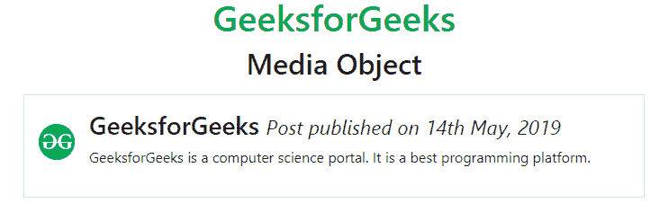
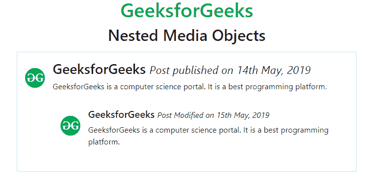
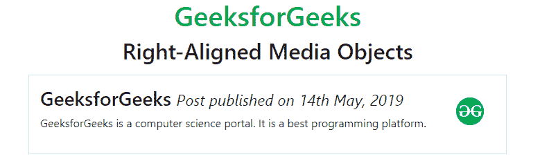
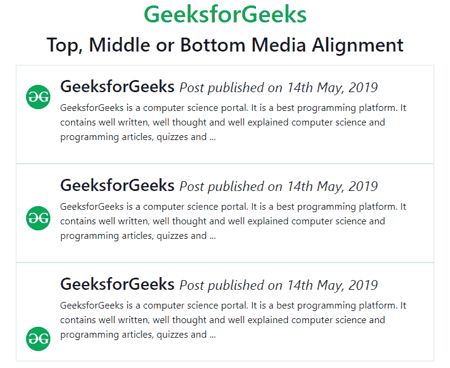

# 引导 4 |媒体对象

> 原文:[https://www.geeksforgeeks.org/bootstrap-4-media-objects/](https://www.geeksforgeeks.org/bootstrap-4-media-objects/)

引导媒体对象(如图像或视频)可以以简单有效的方式与内容向左或向右对齐。引导媒体对象用于将一些数据放在内容旁边，以构建内容的复杂和递归组件。
**基本媒体对象:**使用*。媒体*分类到容器元素，并用*将媒体内容放入子容器中。媒体-正文*类。
**例:**

## 超文本标记语言

```
<!DOCTYPE html>
<html lang="en">
<head>
    <title>Bootstrap Media Object</title>

    <meta charset="utf-8">
    <meta name="viewport" content="width=device-width, initial-scale=1">

    <link rel="stylesheet" href=
"https://maxcdn.bootstrapcdn.com/bootstrap/4.3.1/css/bootstrap.min.css">

    <script src=
"https://ajax.googleapis.com/ajax/libs/jquery/3.3.1/jquery.min.js">
    </script>

    <script src=
"https://cdnjs.cloudflare.com/ajax/libs/popper.js/1.14.7/umd/popper.min.js">
    </script>

    <script src=
"https://maxcdn.bootstrapcdn.com/bootstrap/4.3.1/js/bootstrap.min.js">
    </script>
</head>

<body>
    <h1 class="text-success text-center">GeeksforGeeks</h1>

    <h2 class="text-center">Media Object</h2>

    <div class="container mt-3">
        <div class="media border p-3">
            

            <div class="media-body">
                <h3>GeeksforGeeks
                    <small>
                        <i>Post published on 14th May, 2019</i>
                    </small>
                </h3>

<p>
                    GeeksforGeeks is a computer science portal.
                    It is a best programming platform.
                </p>

            </div>
        </div>
    </div>
</body>

</html>                   
```

**输出:**



**嵌套媒体对象:**媒体对象可以添加到媒体对象内部。它被称为嵌套媒体对象。
**例:**

## 超文本标记语言

```
<!DOCTYPE html>
<html lang="en">
<head>
    <title>Bootstrap Media Object</title>

    <meta charset="utf-8">
    <meta name="viewport" content="width=device-width, initial-scale=1">

    <link rel="stylesheet" href=
"https://maxcdn.bootstrapcdn.com/bootstrap/4.3.1/css/bootstrap.min.css">

    <script src=
"https://ajax.googleapis.com/ajax/libs/jquery/3.3.1/jquery.min.js">
    </script>

    <script src=
"https://cdnjs.cloudflare.com/ajax/libs/popper.js/1.14.7/umd/popper.min.js">
    </script>

    <script src=
"https://maxcdn.bootstrapcdn.com/bootstrap/4.3.1/js/bootstrap.min.js">
    </script>
</head>

<body>
    <h1 class="text-success text-center">GeeksforGeeks</h1>

    <h2 class="text-center">Nested Media Objects</h2>

    <div class="container mt-3">
        <div class="media border p-3">
            

            <div class="media-body">
                <h3>GeeksforGeeks    
                    <small>
                        <i>Post published on 14th May, 2019</i>
                    </small>
                </h3>

<p>
                    GeeksforGeeks is a computer science portal.
                    It is a best programming platform.
                </p>

                <div class="media p-3">
                    

                    <div class="media-body">
                        <h5>GeeksforGeeks    
                            <small>
                                <i>Post Modified on 15th May, 2019</i>
                            </small>
                        </h5>

<p>
                            GeeksforGeeks is a computer science portal.
                            It is a best programming platform.
                        </p>

                    </div>
                </div>
            </div>
        </div>
    </div>
</body>

</html>                   
```

**输出:**



**右对齐媒体图像:**在*后添加图像。媒体主体*容器设置图像右对齐。
**例:**

## 超文本标记语言

```
<!DOCTYPE html>
<html lang="en">
<head>
    <title>Bootstrap Media Object</title>

    <meta charset="utf-8">
    <meta name="viewport" content="width=device-width, initial-scale=1">

    <link rel="stylesheet" href=
"https://maxcdn.bootstrapcdn.com/bootstrap/4.3.1/css/bootstrap.min.css">

    <script src=
"https://ajax.googleapis.com/ajax/libs/jquery/3.3.1/jquery.min.js">
    </script>

    <script src=
"https://cdnjs.cloudflare.com/ajax/libs/popper.js/1.14.7/umd/popper.min.js">
    </script>

    <script src=
"https://maxcdn.bootstrapcdn.com/bootstrap/4.3.1/js/bootstrap.min.js">
    </script>
</head>

<body>
    <h1 class="text-success text-center">GeeksforGeeks</h1>

    <h2 class="text-center">Right-Aligned Media Objects</h2>

    <div class="container mt-3">
        <div class="media border p-3">
            <div class="media-body">
                <h3>GeeksforGeeks    
                    <small>
                        <i>Post published on 14th May, 2019</i>
                    </small>
                </h3>

<p>
                    GeeksforGeeks is a computer science portal.
                    It is a best programming platform.
                </p>

            </div>

            
        </div>
    </div>
</body>

</html>                   
```

**输出:**



**顶部、中部和底部媒体对齐:***。align-self-** 类用于将媒体对象设置在元素的顶部、中间或底部。
**例:**

## 超文本标记语言

```
<!DOCTYPE html>
<html lang="en">
<head>
    <title>Bootstrap Media Object</title>

    <meta charset="utf-8">
    <meta name="viewport" content="width=device-width, initial-scale=1">

    <link rel="stylesheet" href=
"https://maxcdn.bootstrapcdn.com/bootstrap/4.3.1/css/bootstrap.min.css">

    <script src=
"https://ajax.googleapis.com/ajax/libs/jquery/3.3.1/jquery.min.js">
    </script>

    <script src=
"https://cdnjs.cloudflare.com/ajax/libs/popper.js/1.14.7/umd/popper.min.js">
    </script>

    <script src=
"https://maxcdn.bootstrapcdn.com/bootstrap/4.3.1/js/bootstrap.min.js">
    </script>
</head>

<body>
    <h1 class="text-success text-center">GeeksforGeeks</h1>

    <h2 class="text-center">Top, Middle or Bottom Media Alignment</h2>

    <div class="container mt-3">

        <div class="media border p-3">
            

            <div class="media-body">
                <h3>GeeksforGeeks    
                    <small>
                        <i>Post published on 14th May, 2019</i>
                    </small>
                </h3>

<p>
                    GeeksforGeeks is a computer science portal.
                    It is a best programming platform.  It contains
                    well written, well thought and well explained
                    computer science and programming articles,
                    quizzes and ...
                </p>

            </div>
        </div>

        <div class="media border p-3">
            

            <div class="media-body">
                <h3>GeeksforGeeks    
                    <small>
                        <i>Post published on 14th May, 2019</i>
                    </small>
                </h3>

<p>
                    GeeksforGeeks is a computer science portal.
                    It is a best programming platform.  It contains
                    well written, well thought and well explained
                    computer science and programming articles,
                    quizzes and ...
                </p>

            </div>
        </div>

        <div class="media border p-3">
            

            <div class="media-body">
                <h3>GeeksforGeeks    
                    <small>
                        <i>Post published on 14th May, 2019</i>
                    </small>
                </h3>

<p>
                    GeeksforGeeks is a computer science portal.
                    It is a best programming platform.  It contains
                    well written, well thought and well explained
                    computer science and programming articles,
                    quizzes and ...
                </p>

            </div>
        </div>
    </div>
</body>

</html>                   
```

**输出:**



**支持的浏览器:**

*   谷歌 Chrome
*   微软公司出品的 web 浏览器
*   火狐浏览器
*   歌剧
*   旅行队