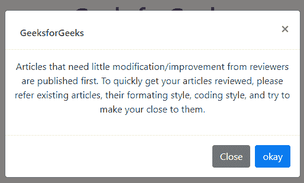
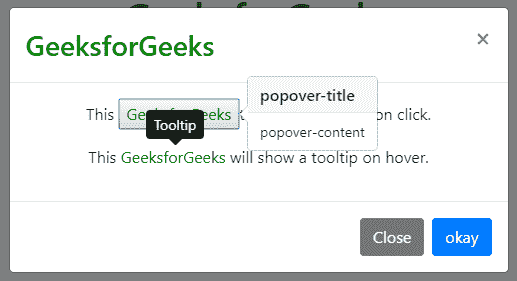

# 自举 4 |模态

> 原文:[https://www.geeksforgeeks.org/bootstrap-4-modal/](https://www.geeksforgeeks.org/bootstrap-4-modal/)

简单地说，模态组件是一个对话框/弹出窗口，一旦点击触发按钮，它就会显示在当前页面的顶部。然而，点击模态的背景会自动关闭模态。此外，必须记住，Bootstrap 不支持嵌套模式，因为它们会给用户带来糟糕的用户界面体验。因此，一次只支持一个模态窗口。

要使用 Bootstrap 4.0，请在项目根文件夹中下载 Bootstrap，或者在 HTML 代码的标题部分复制并粘贴以下链接。

**所需路径:**

> <link rel="”stylesheet”" href="”https://maxcdn.bootstrapcdn.com/bootstrap/4.0.0/css/bootstrap.min.css”" integrity="”sha384-Gn5384xqQ1aoWXA+058RXPxPg6fy4IWvTNh0E263XmFcJlSAwiGgFAW/dAiS6JXm”" crossorigin="”anonymous”">

然而，有许多 BootStrap 组件需要几个 JavaScript 插件才能正常工作。这些插件是 jQuery、Popper.js 和 Bootstrap 的个人 JavaScript 插件。下面的代码块必须放在脚本标记内的结束正文标记之前。

**所需插件:**

**How to create A Bootstrap Modal:**

**Example:**

```
<!DOCTYPE html>
<html lang="en">

<head>
 <!-- Required meta tags -->
 <meta charset="utf-8">
 <meta name="viewport"
  content="width=device-width, initial-scale=1, shrink-to-fit=no">

 <!-- Bootstrap CSS -->
 <link rel="stylesheet"
  href="https://maxcdn.bootstrapcdn.com/bootstrap/4.0.0/css/bootstrap.min.css" 
  integrity="sha384-Gn5384xqQ1aoWXA+058RXPxPg6fy4IWvTNh0E263XmFcJlSAwiGgFAW/dAiS6JXm" 
  crossorigin="anonymous">
 <title>bootstrap | Modal</title>
 <style>
    h1,h6 {
            margin: 2%;
          }
    .btn {
            margin-left: 2%;
          }
 </style>
</head>

<body>
 <center>
  <h1 style="color:green;">GeeksforGeeks</h1>

  <!-- Button trigger modal -->
  <button type="button" class="btn btn-primary" data-toggle="modal" 
                      data-target="#exampleModal">Launch Modal</button>

  <!-- Modal -->
  <div class="modal fade" id="exampleModal" tabindex="-1" role="dialog" 
                 aria-labelledby="exampleModalLabel" aria-hidden="true">
   <div class="modal-dialog" role="document">
    <div class="modal-content">
     <div class="modal-header">
       <h6 class="modal-title" id="exampleModalLabel" style="color:green;">
                                                         GeeksforGeeks</h6>

       <!-- The title of the modal -->
      <button type="button" class="close" data-dismiss="modal"aria-label="Close">
       <span aria-hidden="true">×</span>
      </button>
     </div>
     <div class="modal-body"> 

     <!-- The content inside the modal box -->
     <p>Articles that need little modification/improvement from reviewers
      are published first. To quickly get your articles reviewed, please 
      refer existing articles, their formating style, coding style, and try
      to make your close to them. </p>
    </div>
    <div class="modal-footer">
     <button type="button" class="btn btn-secondary" 
                                             data-dismiss="modal">Close</button>

      <!-- The close button in the bottom of the modal -->
     <button type="button" class="btn btn-primary">okay</button>

      <!-- The save changes button in the bottom of the modal -->
    </div>
   </div>
  </div>
 </div>

 <!-- Optional JavaScript -->
 <!-- jQuery first, then Popper.js, then Bootstrap JS -->
 <script src="https://code.jquery.com/jquery-3.2.1.slim.min.js"
  integrity="sha384-KJ3o2DKtIkvYIK3UENzmM7KCkRr/rE9/Qpg6aAZGJwFDMVNA/GpGFF93hXpG5KkN" 
  crossorigin="anonymous">
 </script>
 <script src="https://cdnjs.cloudflare.com/ajax/libs/popper.js/1.12.9/umd/popper.min.js" 
  integrity="sha384-ApNbgh9B+Y1QKtv3Rn7W3mgPxhU9K/ScQsAP7hUibX39j7fakFPskvXusvfa0b4Q" 
  crossorigin="anonymous">
 </script>
 <script src="https://maxcdn.bootstrapcdn.com/bootstrap/4.0.0/js/bootstrap.min.js"
  integrity="sha384-JZR6Spejh4U02d8jOt6vLEHfe/JQGiRRSQQxSfFWpi1MquVdAyjUar5+76PVCmYl" 
  crossorigin="anonymous">
 </script>
 </center>
</body>

</html>
```

**输出:**

启动模式之前:


启动模式后:



**How Bootstrap Modal works:**

*   模态是用 HTML、CSS 和 JavaScript 构建的。它们位于文档中所有其他内容的上方，并从中移除滚动，以便模态内容改为滚动。*   点击模态“背景”将自动关闭模态。*   该模式一次只支持一个模式窗口。*   Modals 使用 position: fixed，这有时会对它的呈现有点特别。如果可能的话，把你的模态 HTML 放在顶层位置，以避免其他元素的潜在干扰。*   由于位置:固定，在移动设备上使用 modals 几乎没有什么警告。
    **Bootstrap Modal Contents:**
    *   **使用网格:**通过将< b-container fluid >嵌套在模态体内来利用模态内的 Bootstrap 网格系统，否则您可以像在任何其他地方一样使用普通网格系统< b-row >(或< b-form-row >)和< b-col >。
    *   **Tooltips and popovers:**

        工具提示用于在鼠标指针移动时向用户提供关于元素的交互式文本提示。

        popover 是 bootstrap 的一个属性，可以用来使任何网站看起来更加动态。弹出窗口通常用于显示任何元素的附加信息，并在鼠标指针点击该元素时显示。

        **示例:**

        ```
        <!DOCTYPE html>
        <html lang="en">

        <head>
            <!-- Required meta tags -->
            <meta charset="utf-8">
            <meta name="viewport" 
             content="width=device-width, initial-scale=1, shrink-to-fit=no">

            <!-- Bootstrap CSS -->
            <link rel="stylesheet" 
             href="https://maxcdn.bootstrapcdn.com/bootstrap/4.0.0/css/bootstrap.min.css" 
             integrity="sha384-Gn5384xqQ1aoWXA+058RXPxPg6fy4IWvTNh0E263XmFcJlSAwiGgFAW/dAiS6JXm" 
             crossorigin="anonymous">
            <title>bootstrap | Modal</title>
            <style>
                h1,
                h6 {
                    margin: 2%;
                }

                .btn {
                    margin-left: 2%;
                }
            </style>
        </head>

        <body>
            <center>
                <h1 style="color:green;">GeeksforGeeks</h1>
                <!-- Button trigger modal -->
                <button type="button" class="btn btn-primary" data-toggle="modal" 
                        data-target="#exampleModal">
                    Launch Modal
                </button>
                <!-- Modal -->
                <div class="modal fade" id="exampleModal" tabindex="-1" role="dialog" 
                     aria-labelledby="exampleModalLabel" aria-hidden="true">
                    <div class="modal-dialog" role="document">
                        <div class="modal-content">
                            <div class="modal-header">
                                <h3 class="modal-title" id="exampleModalLabel" 
                                    style="color:green;">
                                 GeeksforGeeks</h3>
                                <!-- The title of the modal -->
                                <button type="button" class="close" data-dismiss="modal" 
                                        aria-label="Close">
                                    <span aria-hidden="true">×</span>
                                </button>
                            </div>
                            <div class="modal-body">
                                <!-- The content inside the modal box -->
                                <div class="container">
                                    <p>This
                                        <button style="color:green;" data-toggle="popover"
                                         title="popover-title" data-content="popover-content">
                                            GeeksforGeeks
                                        </button>triggers a popover on click.</p>
                                </div>

                                <script>
                                    $(document).ready(function() {
                                        $('[data-toggle="popover"]').popover();
                                    });
                                </script>
                                <div class="container">

                                    <p>This <a style="color:green;" data-toggle="tooltip" title="Tooltip">
                                        GeeksforGeeks
                                        </a> will show a tooltip on hover.
                                    </p>
                                </div>

                                <script>
                                    $(document).ready(function() {
                                        $('[data-toggle="tooltip"]').tooltip();
                                    });
                                </script>
                            </div>
                            <div class="modal-footer">
                                <button type="button" class="btn btn-secondary" data-dismiss="modal">
                                    Close</button>
                                <!-- The close button in the bottom of the modal -->
                                <button type="button" class="btn btn-primary">okay</button>
                                <!-- The save changes button in the bottom of the modal -->
                            </div>
                        </div>
                    </div>
                </div>
                <!-- Optional JavaScript -->
                <!-- jQuery first, then Popper.js, then Bootstrap JS -->
                <script src="https://code.jquery.com/jquery-3.2.1.slim.min.js"
                 integrity="sha384-KJ3o2DKtIkvYIK3UENzmM7KCkRr/rE9/Qpg6aAZGJwFDMVNA/GpGFF93hXpG5KkN" 
                 crossorigin="anonymous">
                </script>
                <script src="https://cdnjs.cloudflare.com/ajax/libs/popper.js/1.12.9/umd/popper.min.js" 
                 integrity="sha384-ApNbgh9B+Y1QKtv3Rn7W3mgPxhU9K/ScQsAP7hUibX39j7fakFPskvXusvfa0b4Q" 
                 crossorigin="anonymous">
                </script>
                <script src="https://maxcdn.bootstrapcdn.com/bootstrap/4.0.0/js/bootstrap.min.js" 
                 integrity="sha384-JZR6Spejh4U02d8jOt6vLEHfe/JQGiRRSQQxSfFWpi1MquVdAyjUar5+76PVCmYl" 
                 crossorigin="anonymous">
                </script>
            </center>
        </body>

        </html>
        ```

        **输出:**
        

    **Bootstrap Modal Size:**

    **.modal-sm**

    **.modal-lg**

    **.modal-xl**

    **.modal-dialog**

    *   **小情态:**

        ```
        <div class="modal-dialog modal-sm">
        ```

    *   **大情态:**

        ```
        <div class="modal-dialog modal-lg">
        ```

    *   **超大情态:**

        ```
        <div class="modal-dialog modal-xl">
        ```

    **Centered Modal:**

    **.modal-dialog-centered**

    **class:**

    ```
    <div class="<div class="modal-dialog modal-dialog-centered">
    ```

    **Scrolling modal:**

    **class:**

    ```
    <div class="modal-dialog modal-dialog-scrollable">
    ```