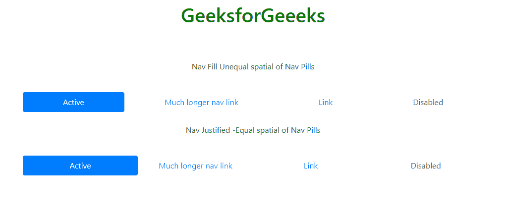
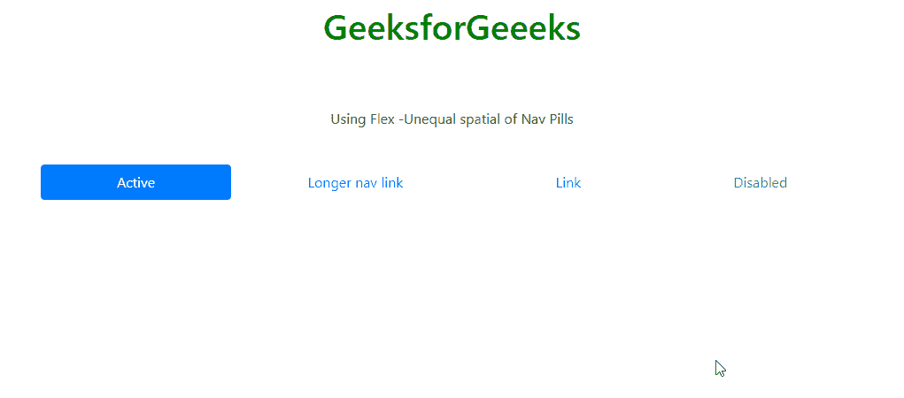

# 自举 4 |导航药丸

> 原文:[https://www.geeksforgeeks.org/bootstrap-4-nav-pills/](https://www.geeksforgeeks.org/bootstrap-4-nav-pills/)

*   导航药丸用于引导 4 到基于导航标签的导航中的菜单目的。*   To Justify Nav-pills with Bootstrap 4 is possible by following approach.

    **方法 1:**

    *   要使用 Bootstrap 3 调整导航标签，可以使用导航调整类，但在 Bootstrap 4 中，默认情况下可以使用导航填充或导航调整类
    *   向导航标签或导航元素添加类导航填充或导航对齐。
    *   nav-fill 和 Nav-aligned 的区别在于类 nav-fill 根据名称长度为 Nav Pill 项目提供了不相等的空间。但是 Nav-aligned 使 Nav Pill 空间彼此相等。

    **示例 1:**
    下面的示例说明了如何使用 Bootstrap 4 使用类导航填充或导航对齐来调整导航药丸。

    ```
    <!DOCTYPE html>
    <html lang="en">

    <head>
        <meta charset="utf-8">
        <meta name="viewport" 
              content="width=device-width, 
                       initial-scale=1">
        <link rel="stylesheet" href="
    https://maxcdn.bootstrapcdn.com/bootstrap/4.3.1/css/bootstrap.min.css">
        <script src="
    https://ajax.googleapis.com/ajax/libs/jquery/3.4.1/jquery.min.js">
      </script>
        <script src=
    "https://cdnjs.cloudflare.com/ajax/libs/popper.js/1.14.7/umd/popper.min.js">
      </script>
        <script src="
    https://maxcdn.bootstrapcdn.com/bootstrap/4.3.1/js/bootstrap.min.js">
      </script>
    </head>

    <body>
        <div class="container">
            <center>
                <h1 style="color:green;padding:13px;">
    GeeksforGeeeks</h1>
                <br>
                <br>
                <p>Nav Fill Unequal spatial of Nav Pills</p>
                <br>
                <nav class="nav nav-pills nav-fill">
                    <a class="nav-item nav-link active"
                       href="#">Active</a>
                    <a class="nav-item nav-link"
                       href="#">Much longer nav link</a>
                    <a class="nav-item nav-link" 
                       href="#">Link</a>
                    <a class="nav-item nav-link disabled" 
                       href="#" 
                       tabindex="-1" 
                       aria-disabled="true">Disabled</a>
                </nav>
                <br>
                <p>Nav Justified -Equal spatial of Nav Pills</p>
                <br>
                <nav class="nav nav-pills nav-justified">
                    <a class="nav-item nav-link active"
                       href="#">Active</a>
                    <a class="nav-item nav-link" href="#">
      Much longer nav link</a>
                    <a class="nav-item nav-link" href="#">
      Link</a>
                    <a class="nav-item nav-link disabled" 
                       href="#" 
                       tabindex="-1" 
                       aria-disabled="true">
                      Disabled</a>
                </nav>
            </center>
        </div>
        <script>
            $(document).ready(function() {
                $('nav a').click(function() {
                    $('nav a').removeClass("active");
                    $(this).addClass("active");
                });
            });
        </script>
    </body>

    </html>
    ```

    **输出:**
    

    **方法 2:**

    *   使用 flex 证明 Bootstrap 4 的导航药丸是正确的，也就是说，如果导航是用 flex box 制作的。
    *   向导航标签或导航元素添加类 flex-column 和 flex-sm-row。
    *   这种弹性在某种程度上类似于导航填充，因为它的导航药丸空间不相等。

    **示例 2:**
    下面的示例说明了如何使用 flex 证明 Bootstrap 4 导航药丸的合理性。

    ```
    <!DOCTYPE html>
    <html lang="en">

    <head>
        <meta charset="utf-8">
        <meta name="viewport" 
              content="width=device-width,
                       initial-scale=1">
        <link rel="stylesheet" href="
    https://maxcdn.bootstrapcdn.com/bootstrap/4.3.1/css/bootstrap.min.css">
        <script src="
    https://ajax.googleapis.com/ajax/libs/jquery/3.4.1/jquery.min.js">
      </script>
        <script src="
    https://cdnjs.cloudflare.com/ajax/libs/popper.js/1.14.7/umd/popper.min.js">
      </script>
        <script src="
    https://maxcdn.bootstrapcdn.com/bootstrap/4.3.1/js/bootstrap.min.js
    "></script>
    </head>

    <body>
        <div class="container">
            <center>
                <h1 style="color:green;padding:13px;">
    GeeksforGeeeks</h1>
                <br>
                <br>
                <p>Using Flex -Unequal spatial of Nav Pills</p>
                <br>
                <nav class="nav nav-pills flex-column flex-sm-row">
                    <a class="flex-sm-fill text-sm-center nav-link active"
                       href="#">Active</a>
                    <a class="flex-sm-fill text-sm-center nav-link" 
                       href="#">Longer nav link</a>
                    <a class="flex-sm-fill text-sm-center nav-link" 
                       href="#">Link</a>
                    <a class="flex-sm-fill text-sm-center nav-link disabled"
                       href="#" 
                       tabindex="-1"
                       aria-disabled="true">
                      Disabled
                  </a>
                </nav>

            </center>
        </div>
        <script>
            $(document).ready(function() {
                $('nav a').click(function() {
                    $('nav a').removeClass("active");
                    $(this).addClass("active");
                });
            });
        </script>
    </body>

    </html>
    ```

    **输出:**
    

    **参考:**T2】https://getbootstrap.com/docs/4.0/components/navs/