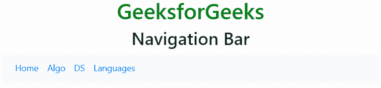
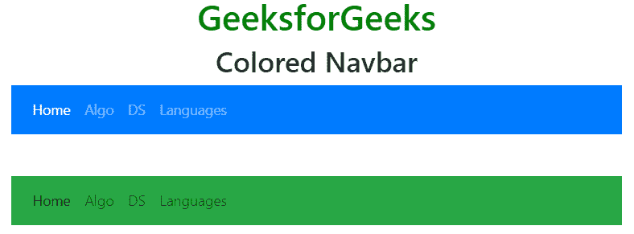
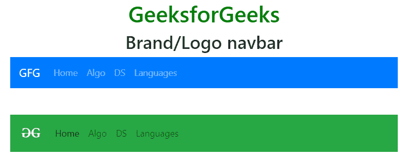
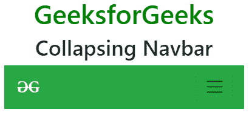
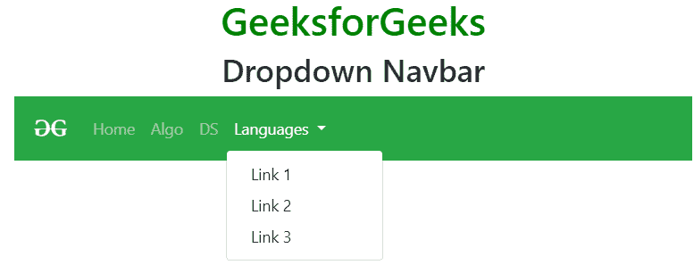
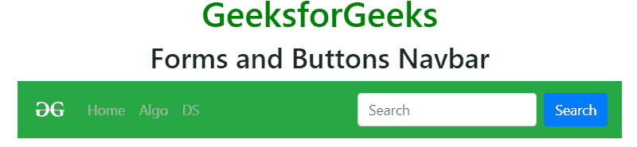
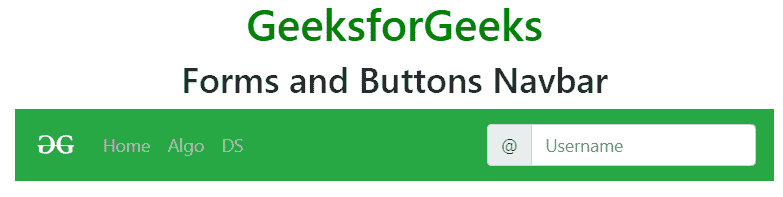
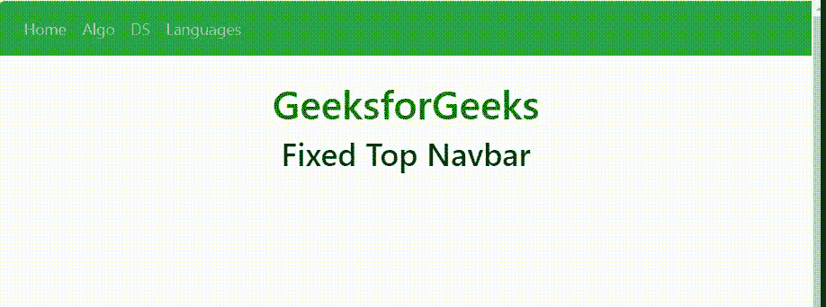
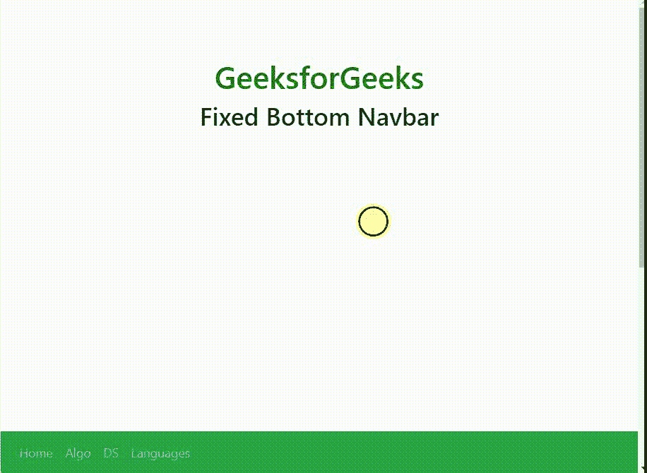
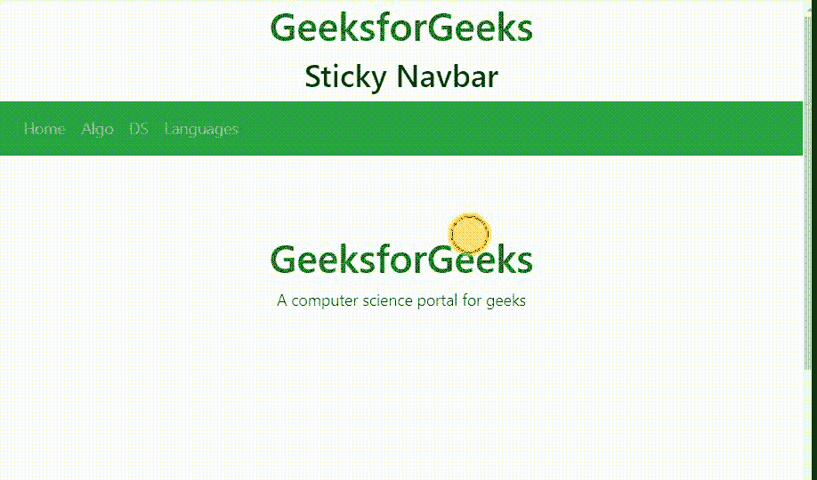

# 引导 4 |导航栏

> 原文:[https://www.geeksforgeeks.org/bootstrap-4-navigation-bar/](https://www.geeksforgeeks.org/bootstrap-4-navigation-bar/)

每个网站都使用导航栏，以使其更加用户友好，从而使网站导航变得容易，用户可以直接搜索他们感兴趣的主题。导航栏位于页面的顶部。
**基本导航栏:***。navbar* 类用于创建导航栏。通过使用*响应创建 navbar。navbar-expand-xl|lg|md|sm* 类。响应式 navbar 垂直堆叠在小屏幕中。< class="nav-item" >元素后跟< a class="nav-link" >用于创建 nav link。
**例:**

## 超文本标记语言

```
<!DOCTYPE html>
<html lang="en">
<head>
    <title>Navigation Bar</title>

    <meta charset="utf-8">
    <meta name="viewport" content="width=device-width, initial-scale=1">

    <link rel="stylesheet" href=
"https://maxcdn.bootstrapcdn.com/bootstrap/4.3.1/css/bootstrap.min.css">

    <script src=
"https://ajax.googleapis.com/ajax/libs/jquery/3.3.1/jquery.min.js">
    </script>

    <script src=
"https://cdnjs.cloudflare.com/ajax/libs/popper.js/1.14.7/umd/popper.min.js">
    </script>

    <script src=
"https://maxcdn.bootstrapcdn.com/bootstrap/4.3.1/js/bootstrap.min.js">
    </script>
</head>

<body style="text-align:center;">

    <div class="container">

        <h1 style="color:green;">
            GeeksforGeeks
        </h1>

        <h2>Navigation Bar</h2>

        <nav class="navbar navbar-expand-sm bg-light">

            <ul class="navbar-nav">
                <li class="nav-item">
                    <a class="nav-link" href="#">Home</a>
                </li>

                <li class="nav-item">
                    <a class="nav-link" href="#">Algo</a>
                </li>

                <li class="nav-item">
                    <a class="nav-link" href="#">DS</a>
                </li>

                <li class="nav-item">
                    <a class="nav-link" href="#">Languages</a>
                </li>
            </ul>
        </nav>
    </div>
</body>

</html>                   
```

**输出:**



**垂直导航条:***。navbar-expand-xl|lg|md|sm* 类用于创建垂直导航栏。
**例:**

## 超文本标记语言

```
<!DOCTYPE html>
<html lang="en">
<head>
    <title>Navigation Bar</title>

    <meta charset="utf-8">
    <meta name="viewport" content="width=device-width, initial-scale=1">

    <link rel="stylesheet" href=
"https://maxcdn.bootstrapcdn.com/bootstrap/4.3.1/css/bootstrap.min.css">

    <script src=
"https://ajax.googleapis.com/ajax/libs/jquery/3.3.1/jquery.min.js">
    </script>

    <script src=
"https://cdnjs.cloudflare.com/ajax/libs/popper.js/1.14.7/umd/popper.min.js">
    </script>

    <script src=
"https://maxcdn.bootstrapcdn.com/bootstrap/4.3.1/js/bootstrap.min.js">
    </script>
</head>

<body style="text-align:center;">

    <div class="container">

        <h1 style="color:green;">
            GeeksforGeeks
        </h1>

        <h2>Vertical Navbar</h2>

        <nav class="navbar navbar-expand-xl|lg|md|sm">

            <ul class="navbar-nav">
                <li class="nav-item">
                    <a class="nav-link" href="#">Home</a>
                </li>

                <li class="nav-item">
                    <a class="nav-link" href="#">Algo</a>
                </li>

                <li class="nav-item">
                    <a class="nav-link" href="#">DS</a>
                </li>

                <li class="nav-item">
                    <a class="nav-link" href="#">Languages</a>
                </li>
            </ul>
        </nav>
    </div>
</body>

</html>                   
```

**输出:**


**中央导航条:***。对齐-内容中心*类用于将导航栏的对齐方式设置为居中。导航栏在中、大、超大屏幕上居中显示。在小屏幕的情况下，导航栏垂直显示并左对齐。
**例:**

## 超文本标记语言

```
<!DOCTYPE html>
<html lang="en">
<head>
    <title>Navigation Bar</title>

    <meta charset="utf-8">
    <meta name="viewport" content="width=device-width, initial-scale=1">

    <link rel="stylesheet" href=
"https://maxcdn.bootstrapcdn.com/bootstrap/4.3.1/css/bootstrap.min.css">

    <script src=
"https://ajax.googleapis.com/ajax/libs/jquery/3.3.1/jquery.min.js">
    </script>

    <script src=
"https://cdnjs.cloudflare.com/ajax/libs/popper.js/1.14.7/umd/popper.min.js">
    </script>

    <script src=
"https://maxcdn.bootstrapcdn.com/bootstrap/4.3.1/js/bootstrap.min.js">
    </script>
</head>

<body style="text-align:center;">

    <div class="container">

        <h1 style="color:green;">
            GeeksforGeeks
        </h1>

        <h2>Centered Navbar</h2>

        <nav class="navbar navbar-expand-sm bg-light justify-content-center">

            <ul class="navbar-nav">
                <li class="nav-item">
                    <a class="nav-link" href="#">Home</a>
                </li>

                <li class="nav-item">
                    <a class="nav-link" href="#">Algo</a>
                </li>

                <li class="nav-item">
                    <a class="nav-link" href="#">DS</a>
                </li>

                <li class="nav-item">
                    <a class="nav-link" href="#">Languages</a>
                </li>
            </ul>
        </nav>
    </div>
</body>

</html>                   
```

**输出:**


**彩色导航条:***。bg-color* 类用于更改导航栏的背景颜色。bg-color 类是:*。bg-primary，。BG-成功，。BG-信息，。BG-警告。BG-危险。BG-二级。BG-深色*和*。bg 灯*。*。navbar-dark* 类用于将链接文本颜色设置为白色和*。navbar-light* 类用于将链接文本颜色设置为黑色。
**例:**

## 超文本标记语言

```
<!DOCTYPE html>
<html lang="en">
<head>
    <title>Navigation Bar</title>

    <meta charset="utf-8">
    <meta name="viewport" content="width=device-width, initial-scale=1">

    <link rel="stylesheet" href=
"https://maxcdn.bootstrapcdn.com/bootstrap/4.3.1/css/bootstrap.min.css">

    <script src=
"https://ajax.googleapis.com/ajax/libs/jquery/3.3.1/jquery.min.js">
    </script>

    <script src=
"https://cdnjs.cloudflare.com/ajax/libs/popper.js/1.14.7/umd/popper.min.js">
    </script>

    <script src=
"https://maxcdn.bootstrapcdn.com/bootstrap/4.3.1/js/bootstrap.min.js">
    </script>
</head>

<body>

    <div class="container">

        <h1 style="color:green;text-align:center;">
            GeeksforGeeks
        </h1>

        <h2 style="text-align:center;">Colored Navbar</h2>

        <nav class="navbar navbar-expand-sm bg-primary navbar-dark">

            <ul class="navbar-nav">
                <li class="nav-item active">
                    <a class="nav-link" href="#">Home</a>
                </li>

                <li class="nav-item">
                    <a class="nav-link" href="#">Algo</a>
                </li>

                <li class="nav-item">
                    <a class="nav-link" href="#">DS</a>
                </li>

                <li class="nav-item">
                    <a class="nav-link" href="#">Languages</a>
                </li>
            </ul>
        </nav>

        <br><br>

        <nav class="navbar navbar-expand-sm bg-success navbar-light">

            <ul class="navbar-nav">
                <li class="nav-item active">
                    <a class="nav-link" href="#">Home</a>
                </li>

                <li class="nav-item">
                    <a class="nav-link" href="#">Algo</a>
                </li>

                <li class="nav-item">
                    <a class="nav-link" href="#">DS</a>
                </li>

                <li class="nav-item">
                    <a class="nav-link" href="#">Languages</a>
                </li>
            </ul>
        </nav>
    </div>
</body>

</html>                   
```

**输出:**



**品牌/标志导航条:***。navbar-brand* 类用于突出品牌/logo 名称。
**例:**

## 超文本标记语言

```
<!DOCTYPE html>
<html lang="en">
<head>
    <title>Navigation Bar</title>

    <meta charset="utf-8">
    <meta name="viewport" content="width=device-width, initial-scale=1">

    <link rel="stylesheet" href=
"https://maxcdn.bootstrapcdn.com/bootstrap/4.3.1/css/bootstrap.min.css">

    <script src=
"https://ajax.googleapis.com/ajax/libs/jquery/3.3.1/jquery.min.js">
    </script>

    <script src=
"https://cdnjs.cloudflare.com/ajax/libs/popper.js/1.14.7/umd/popper.min.js">
    </script>

    <script src=
"https://maxcdn.bootstrapcdn.com/bootstrap/4.3.1/js/bootstrap.min.js">
    </script>
</head>

<body>

    <div class="container">

        <h1 style="color:green;text-align:center;">
            GeeksforGeeks
        </h1>

        <h2 style="text-align:center;">Brand/Logo navbar</h2>

        <nav class="navbar navbar-expand-sm bg-primary navbar-dark">

            <a class="navbar-brand" href="#">GFG</a>

            <ul class="navbar-nav">
                <li class="nav-item">
                    <a class="nav-link" href="#">Home</a>
                </li>

                <li class="nav-item">
                    <a class="nav-link" href="#">Algo</a>
                </li>

                <li class="nav-item">
                    <a class="nav-link" href="#">DS</a>
                </li>

                <li class="nav-item">
                    <a class="nav-link" href="#">Languages</a>
                </li>
            </ul>
        </nav>

        <br><br>

        <nav class="navbar navbar-expand-sm bg-success navbar-light">

            <a class="navbar-brand" href="#">
                
            </a>

            <ul class="navbar-nav">
                <li class="nav-item active">
                    <a class="nav-link" href="#">Home</a>
                </li>

                <li class="nav-item">
                    <a class="nav-link" href="#">Algo</a>
                </li>

                <li class="nav-item">
                    <a class="nav-link" href="#">DS</a>
                </li>

                <li class="nav-item">
                    <a class="nav-link" href="#">Languages</a>
                </li>
            </ul>
        </nav>
    </div>
</body>

</html>                   
```

**输出:**



**折叠导航条:**折叠导航条用于小屏幕。它隐藏了导航链接，并替换为一个按钮。class="navbar-toggler "、data-toggle="collapse "和 data-target="#thetarget "用于创建折叠导航栏。
**例:**

## 超文本标记语言

```
<!DOCTYPE html>
<html lang="en">
<head>
    <title>Navigation Bar</title>

    <meta charset="utf-8">
    <meta name="viewport" content="width=device-width, initial-scale=1">

    <link rel="stylesheet" href=
"https://maxcdn.bootstrapcdn.com/bootstrap/4.3.1/css/bootstrap.min.css">

    <script src=
"https://ajax.googleapis.com/ajax/libs/jquery/3.3.1/jquery.min.js">
    </script>

    <script src=
"https://cdnjs.cloudflare.com/ajax/libs/popper.js/1.14.7/umd/popper.min.js">
    </script>

    <script src=
"https://maxcdn.bootstrapcdn.com/bootstrap/4.3.1/js/bootstrap.min.js">
    </script>
</head>

<body>

    <div class="container">

        <h1 style="color:green;text-align:center;">
            GeeksforGeeks
        </h1>

        <h2 style="text-align:center;">Collapsing Navbar</h2>

        <nav class="navbar navbar-expand-sm bg-success navbar-light">

            <!-- Brand/logo -->
            <a class="navbar-brand" href="#">
                
            </a>

            <button class="navbar-toggler" type="button" data-toggle="collapse"
                        data-target="#collapse_Navbar">
                <span class="navbar-toggler-icon"></span>
            </button>

            <div class="collapse navbar-collapse" id="collapse_Navbar">
                <ul class="navbar-nav">
                    <li class="nav-item active">
                        <a class="nav-link" href="#">Home</a>
                    </li>

                    <li class="nav-item">
                        <a class="nav-link" href="#">Algo</a>
                    </li>

                    <li class="nav-item">
                        <a class="nav-link" href="#">DS</a>
                    </li>

                    <li class="nav-item">
                        <a class="nav-link" href="#">Languages</a>
                    </li>
                </ul>
            </div>
        </nav>
    </div>
</body>

</html>                   
```

**输出:**
**大屏幕上:**


**小屏幕上:**



**下拉导航栏:**可以使用下拉菜单创建导航栏。
**例:**

## 超文本标记语言

```
<!DOCTYPE html>
<html lang="en">
<head>
    <title>Navigation Bar</title>

    <meta charset="utf-8">
    <meta name="viewport" content="width=device-width, initial-scale=1">

    <link rel="stylesheet" href=
"https://maxcdn.bootstrapcdn.com/bootstrap/4.3.1/css/bootstrap.min.css">

    <script src=
"https://ajax.googleapis.com/ajax/libs/jquery/3.3.1/jquery.min.js">
    </script>

    <script src=
"https://cdnjs.cloudflare.com/ajax/libs/popper.js/1.14.7/umd/popper.min.js">
    </script>

    <script src=
"https://maxcdn.bootstrapcdn.com/bootstrap/4.3.1/js/bootstrap.min.js">
    </script>
</head>

<body>

    <div class="container">

        <h1 style="color:green;text-align:center;">
            GeeksforGeeks
        </h1>

        <h2 style="text-align:center;">Dropdown Navbar</h2>

        <nav class="navbar navbar-expand-sm bg-success navbar-dark">

            <!-- Brand/logo -->
            <a class="navbar-brand" href="#">
                
            </a>

            <button class="navbar-toggler" type="button" data-toggle="collapse"
                        data-target="#collapse_Navbar">
                <span class="navbar-toggler-icon"></span>
            </button>

            <div class="collapse navbar-collapse" id="collapse_Navbar">
                <ul class="navbar-nav">
                    <li class="nav-item">
                        <a class="nav-link" href="#">Home</a>
                    </li>

                    <li class="nav-item">
                        <a class="nav-link" href="#">Algo</a>
                    </li>

                    <li class="nav-item">
                        <a class="nav-link" href="#">DS</a>
                    </li>

                    <li class="nav-item dropdown">
                        <a class="nav-link dropdown-toggle" href="#"
                                id="navbardrop" data-toggle="dropdown">
                            Languages
                        </a>

                        <div class="dropdown-menu">
                            <a class="dropdown-item" href="#">Link 1</a>
                            <a class="dropdown-item" href="#">Link 2</a>
                            <a class="dropdown-item" href="#">Link 3</a>
                        </div>
                    </li>
                </ul>
            </div>
        </nav>
    </div>
</body>

</html>                   
```

**输出:**



**表单和按钮导航栏:**<表单类=“表单-内联”>元素用于并排分组输入和按钮。*。输入-组-前置*或*。输入-分组-追加*类用于附加输入文本字段的图标。
**例 1:**

## 超文本标记语言

```
<!DOCTYPE html>
<html lang="en">
<head>
    <title>Navigation Bar</title>

    <meta charset="utf-8">
    <meta name="viewport" content="width=device-width, initial-scale=1">

    <link rel="stylesheet" href=
"https://maxcdn.bootstrapcdn.com/bootstrap/4.3.1/css/bootstrap.min.css">

    <script src=
"https://ajax.googleapis.com/ajax/libs/jquery/3.3.1/jquery.min.js">
    </script>

    <script src=
"https://cdnjs.cloudflare.com/ajax/libs/popper.js/1.14.7/umd/popper.min.js">
    </script>

    <script src=
"https://maxcdn.bootstrapcdn.com/bootstrap/4.3.1/js/bootstrap.min.js">
    </script>
</head>

<body>

    <div class="container">

        <h1 style="color:green;text-align:center;">
            GeeksforGeeks
        </h1>

        <h2 style="text-align:center;">Forms and Buttons Navbar</h2>

        <nav class="navbar navbar-expand-sm bg-success navbar-dark">

            <!-- Brand/logo -->
            <a class="navbar-brand" href="#">
                
            </a>

            <button class="navbar-toggler" type="button" data-toggle="collapse"
                        data-target="#collapse_Navbar">
                <span class="navbar-toggler-icon"></span>
            </button>

            <div class="collapse navbar-collapse" id="collapse_Navbar">
                <ul class="navbar-nav">
                    <li class="nav-item">
                        <a class="nav-link" href="#">Home</a>
                    </li>

                    <li class="nav-item">
                        <a class="nav-link" href="#">Algo</a>
                    </li>

                    <li class="nav-item">
                        <a class="nav-link" href="#">DS</a>
                    </li>
                </ul>
            </div>

            <form class="form-inline" action="#">
                <input class="form-control mr-sm-2" type="text"
                          placeholder="Search">
                <button class="btn btn-primary" type="submit">Search</button>
            </form>
        </nav>
    </div>
</body>

</html>                   
```

**输出:**



**例 2:**

## 超文本标记语言

```
<!DOCTYPE html>
<html lang="en">
<head>
    <title>Navigation Bar</title>

    <meta charset="utf-8">
    <meta name="viewport" content="width=device-width, initial-scale=1">

    <link rel="stylesheet" href=
"https://maxcdn.bootstrapcdn.com/bootstrap/4.3.1/css/bootstrap.min.css">

    <script src=
"https://ajax.googleapis.com/ajax/libs/jquery/3.3.1/jquery.min.js">
    </script>

    <script src=
"https://cdnjs.cloudflare.com/ajax/libs/popper.js/1.14.7/umd/popper.min.js">
    </script>

    <script src=
"https://maxcdn.bootstrapcdn.com/bootstrap/4.3.1/js/bootstrap.min.js">
    </script>
</head>

<body>

    <div class="container">

        <h1 style="color:green;text-align:center;">
            GeeksforGeeks
        </h1>

        <h2 style="text-align:center;">Forms and Buttons Navbar</h2>

        <nav class="navbar navbar-expand-sm bg-success navbar-dark">

            <!-- Brand/logo -->
            <a class="navbar-brand" href="#">
                
            </a>

            <button class="navbar-toggler" type="button" data-toggle="collapse"
                        data-target="#collapse_Navbar">
                <span class="navbar-toggler-icon"></span>
            </button>

            <div class="collapse navbar-collapse" id="collapse_Navbar">
                <ul class="navbar-nav">
                    <li class="nav-item">
                        <a class="nav-link" href="#">Home</a>
                    </li>

                    <li class="nav-item">
                        <a class="nav-link" href="#">Algo</a>
                    </li>

                    <li class="nav-item">
                        <a class="nav-link" href="#">DS</a>
                    </li>
                </ul>
            </div>

            <form class="form-inline" action="#">
                <div class="input-group">
                    <div class="input-group-prepend">
                        <span class="input-group-text">@</span>
                    </div>

                    <input type="text" class="form-control"
                            placeholder="Username">
            </form>
        </nav>
    </div>
</body>

</html>                   
```

**输出:**



**文字导航条:***。navbar-text* 类用于向导航栏添加文本元素。
**例:**

## 超文本标记语言

```
<!DOCTYPE html>
<html lang="en">
<head>
    <title>Navigation Bar</title>

    <meta charset="utf-8">
    <meta name="viewport" content="width=device-width, initial-scale=1">

    <link rel="stylesheet" href=
"https://maxcdn.bootstrapcdn.com/bootstrap/4.3.1/css/bootstrap.min.css">

    <script src=
"https://ajax.googleapis.com/ajax/libs/jquery/3.3.1/jquery.min.js">
    </script>

    <script src=
"https://cdnjs.cloudflare.com/ajax/libs/popper.js/1.14.7/umd/popper.min.js">
    </script>

    <script src=
"https://maxcdn.bootstrapcdn.com/bootstrap/4.3.1/js/bootstrap.min.js">
    </script>
</head>

<body>

    <div class="container">

        <h1 style="color:green;text-align:center;">
            GeeksforGeeks
        </h1>

        <h2 style="text-align:center;">Text Navbar</h2>

        <nav class="navbar navbar-expand-sm bg-success navbar-dark">

            <ul class="navbar-nav">
                <li class="nav-item">
                    <a class="nav-link" href="#">Home</a>
                </li>

                <li class="nav-item">
                    <a class="nav-link" href="#">Algo</a>
                </li>

                <span class="navbar-text">
                    DS
                </span>
            </ul>
        </nav>
    </div>
</body>

</html>                   
```

**输出:**


**固定导航条:***。固定顶*类用于将导航栏固定在顶部位置和*。固定底部*类用于将导航栏固定在底部位置。
**例 1:**

## 超文本标记语言

```
<!DOCTYPE html>
<html lang="en">
<head>
    <title>Navigation Bar</title>

    <meta charset="utf-8">
    <meta name="viewport" content="width=device-width, initial-scale=1">

    <link rel="stylesheet" href=
"https://maxcdn.bootstrapcdn.com/bootstrap/4.3.1/css/bootstrap.min.css">

    <script src=
"https://ajax.googleapis.com/ajax/libs/jquery/3.3.1/jquery.min.js">
    </script>

    <script src=
"https://cdnjs.cloudflare.com/ajax/libs/popper.js/1.14.7/umd/popper.min.js">
    </script>

    <script src=
"https://maxcdn.bootstrapcdn.com/bootstrap/4.3.1/js/bootstrap.min.js">
    </script>
</head>

<body style="height:1000px">

    <nav class="navbar navbar-expand-sm bg-success navbar-dark fixed-top">

        <ul class="navbar-nav">
            <li class="nav-item">
                <a class="nav-link" href="#">Home</a>
            </li>

            <li class="nav-item">
                <a class="nav-link" href="#">Algo</a>
            </li>

            <li class="nav-item">
                <a class="nav-link" href="#">DS</a>
            </li>

            <li class="nav-item">
                <a class="nav-link" href="#">Languages</a>
            </li>
        </ul>
    </nav>

    <div class="container-fluid" style="margin-top:80px">

        <h1 style="color:green;text-align:center;">
            GeeksforGeeks
        </h1>

        <h2 style="text-align:center;">Fixed Top Navbar</h2>
    </div>
</body>

</html>                   
```

**输出:**



**例 2:**

## 超文本标记语言

```
<!DOCTYPE html>
<html lang="en">
<head>
    <title>Navigation Bar</title>

    <meta charset="utf-8">
    <meta name="viewport" content="width=device-width, initial-scale=1">

    <link rel="stylesheet" href=
"https://maxcdn.bootstrapcdn.com/bootstrap/4.3.1/css/bootstrap.min.css">

    <script src=
"https://ajax.googleapis.com/ajax/libs/jquery/3.3.1/jquery.min.js">
    </script>

    <script src=
"https://cdnjs.cloudflare.com/ajax/libs/popper.js/1.14.7/umd/popper.min.js">
    </script>

    <script src=
"https://maxcdn.bootstrapcdn.com/bootstrap/4.3.1/js/bootstrap.min.js">
    </script>
</head>

<body style="height:1000px">
    <nav class="navbar navbar-expand-sm bg-success navbar-dark fixed-bottom">

        <ul class="navbar-nav">
            <li class="nav-item">
                <a class="nav-link" href="#">Home</a>
            </li>

            <li class="nav-item">
                <a class="nav-link" href="#">Algo</a>
            </li>

            <li class="nav-item">
                <a class="nav-link" href="#">DS</a>
            </li>

            <li class="nav-item">
                <a class="nav-link" href="#">Languages</a>
            </li>
        </ul>
    </nav>

    <div class="container-fluid" style="margin-top:80px">

        <h1 style="color:green;text-align:center;">
            GeeksforGeeks
        </h1>

        <h2 style="text-align:center;">Fixed Bottom Navbar</h2>
    </div>
</body>

</html>                   
```

**输出:**



**粘性导航条:***。粘性顶端*类用于创建粘性导航栏。滚动页面时，粘性导航栏固定在页面顶部。
**例:**

## 超文本标记语言

```
<!DOCTYPE html>
<html lang="en">
<head>
    <title>Navigation Bar</title>

    <meta charset="utf-8">
    <meta name="viewport" content="width=device-width, initial-scale=1">

    <link rel="stylesheet" href=
"https://maxcdn.bootstrapcdn.com/bootstrap/4.3.1/css/bootstrap.min.css">

    <script src=
"https://ajax.googleapis.com/ajax/libs/jquery/3.3.1/jquery.min.js">
    </script>

    <script src=
"https://cdnjs.cloudflare.com/ajax/libs/popper.js/1.14.7/umd/popper.min.js">
    </script>

    <script src=
"https://maxcdn.bootstrapcdn.com/bootstrap/4.3.1/js/bootstrap.min.js">
    </script>
</head>

<body style="height:1000px">

    <div class="container-fluid">

        <h1 style="color:green;text-align:center;">
            GeeksforGeeks
        </h1>

        <h2 style="text-align:center;">Sticky Navbar</h2>
    </div>

    <nav class="navbar navbar-expand-sm bg-success navbar-dark sticky-top">

        <ul class="navbar-nav">
            <li class="nav-item">
                <a class="nav-link" href="#">Home</a>
            </li>

            <li class="nav-item">
                <a class="nav-link" href="#">Algo</a>
            </li>

            <li class="nav-item">
                <a class="nav-link" href="#">DS</a>
            </li>

            <li class="nav-item">
                <a class="nav-link" href="#">Languages</a>
            </li>
        </ul>
    </nav>

    <div class="container-fluid" style="margin-top:80px">

        <h1 style="color:green;text-align:center;">
            GeeksforGeeks
        </h1>

        <div style="text-align:center;">
            A computer science portal for geeks
        </div>
    </div>
</body>

</html>                   
```

**输出:**



**支持的浏览器:**

*   谷歌 Chrome
*   微软公司出品的 web 浏览器
*   火狐浏览器
*   歌剧
*   旅行队