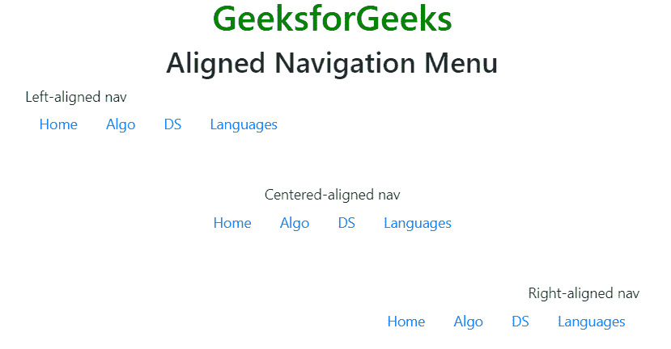
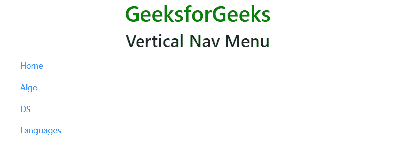
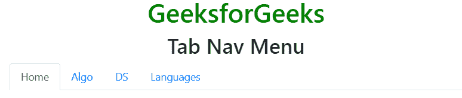
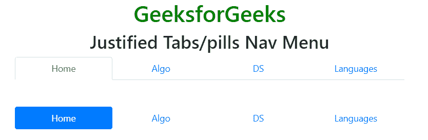
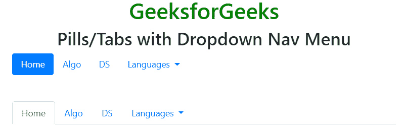
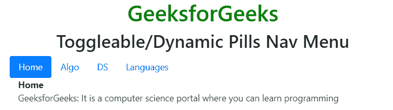
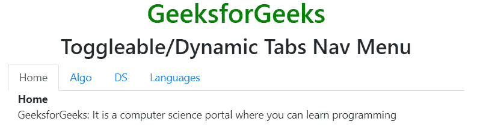

# 自举 4 |导航

> 原文:[https://www.geeksforgeeks.org/bootstrap-4-navs/](https://www.geeksforgeeks.org/bootstrap-4-navs/)

**导航菜单:***。导航。导航项目*和*。导航链接*类用于创建导航菜单。*。导航。导航项目*和*。导航链接*类分别与< ul >、< li >和链接元素一起使用。
**例:**

## 超文本标记语言

```html
<!DOCTYPE html>
<html lang="en">
<head>
    <title>Nav menu</title>

    <meta charset="utf-8">
    <meta name="viewport" content="width=device-width, initial-scale=1">

    <link rel="stylesheet" href=
"https://maxcdn.bootstrapcdn.com/bootstrap/4.3.1/css/bootstrap.min.css">

    <script src=
"https://ajax.googleapis.com/ajax/libs/jquery/3.3.1/jquery.min.js">
    </script>

    <script src=
"https://cdnjs.cloudflare.com/ajax/libs/popper.js/1.14.7/umd/popper.min.js">
    </script>

    <script src=
"https://maxcdn.bootstrapcdn.com/bootstrap/4.3.1/js/bootstrap.min.js">
    </script>
</head>

<body style="text-align:center;">

    <div class="container">

        <h1 style="color:green;">
            GeeksforGeeks
        </h1>

        <h2>Navigation Menu</h2>

        <ul class="nav">
            <li class="nav-item">
                <a class="nav-link" href="#">Home</a>
            </li>
            <li class="nav-item">
                <a class="nav-link" href="#">Algo</a>
            </li>
            <li class="nav-item">
                <a class="nav-link" href="#">DS</a>
            </li>
            <li class="nav-item">
                <a class="nav-link" href="#">Languages</a>
            </li>
        </ul>
    </div>
</body>

</html>                   
```

**输出:**


**对齐导航:***。调整内容中心*和*。对齐-内容-结束*类用于将导航菜单的对齐方式分别设置为居中和结束。
**例:**

## 超文本标记语言

```html
<!DOCTYPE html>
<html lang="en">
<head>
    <title>Nav menu</title>

    <meta charset="utf-8">
    <meta name="viewport" content="width=device-width, initial-scale=1">

    <link rel="stylesheet" href=
"https://maxcdn.bootstrapcdn.com/bootstrap/4.3.1/css/bootstrap.min.css">

    <script src=
"https://ajax.googleapis.com/ajax/libs/jquery/3.3.1/jquery.min.js">
    </script>

    <script src=
"https://cdnjs.cloudflare.com/ajax/libs/popper.js/1.14.7/umd/popper.min.js">
    </script>

    <script src=
"https://maxcdn.bootstrapcdn.com/bootstrap/4.3.1/js/bootstrap.min.js">
    </script>
</head>

<body>

    <div class="container">

        <h1 style="color:green;text-align:center;">
            GeeksforGeeks
        </h1>

        <h2 style="text-align:center;">
            Aligned Navigation Menu
        </h2>

        <div>Left-aligned nav</div>
        <ul class="nav">
            <li class="nav-item">
                <a class="nav-link" href="#">Home</a>
            </li>
            <li class="nav-item">
                <a class="nav-link" href="#">Algo</a>
            </li>
            <li class="nav-item">
                <a class="nav-link" href="#">DS</a>
            </li>
            <li class="nav-item">
                <a class="nav-link" href="#">Languages</a>
            </li>
        </ul>

        <br><br>

        <div class="text-center">Centered-aligned nav</div>
        <ul class="nav justify-content-center">
            <li class="nav-item">
                <a class="nav-link" href="#">Home</a>
            </li>
            <li class="nav-item">
                <a class="nav-link" href="#">Algo</a>
            </li>
            <li class="nav-item">
                <a class="nav-link" href="#">DS</a>
            </li>
            <li class="nav-item">
                <a class="nav-link" href="#">Languages</a>
            </li>
        </ul>

        <br><br>

        <div class="text-right">Right-aligned nav</div>
        <ul class="nav justify-content-end">
            <li class="nav-item">
                <a class="nav-link" href="#">Home</a>
            </li>
            <li class="nav-item">
                <a class="nav-link" href="#">Algo</a>
            </li>
            <li class="nav-item">
                <a class="nav-link" href="#">DS</a>
            </li>
            <li class="nav-item">
                <a class="nav-link" href="#">Languages</a>
            </li>
        </ul>
    </div>
</body>

</html>                   
```

**输出:**



**垂直导航:***。flex-column* 类用于创建垂直导航菜单。
**例:**

## 超文本标记语言

```html
<!DOCTYPE html>
<html lang="en">
<head>
    <title>Nav menu</title>

    <meta charset="utf-8">
    <meta name="viewport" content="width=device-width, initial-scale=1">

    <link rel="stylesheet" href=
"https://maxcdn.bootstrapcdn.com/bootstrap/4.3.1/css/bootstrap.min.css">

    <script src=
"https://ajax.googleapis.com/ajax/libs/jquery/3.3.1/jquery.min.js">
    </script>

    <script src=
"https://cdnjs.cloudflare.com/ajax/libs/popper.js/1.14.7/umd/popper.min.js">
    </script>

    <script src=
"https://maxcdn.bootstrapcdn.com/bootstrap/4.3.1/js/bootstrap.min.js">
    </script>
</head>

<body>

    <div class="container">

        <h1 style="color:green;text-align:center;">
            GeeksforGeeks
        </h1>

        <h2 style="text-align:center;">
            Vertical Nav Menu
        </h2>

        <ul class="nav flex-column">
            <li class="nav-item">
                <a class="nav-link" href="#">Home</a>
            </li>
            <li class="nav-item">
                <a class="nav-link" href="#">Algo</a>
            </li>
            <li class="nav-item">
                <a class="nav-link" href="#">DS</a>
            </li>
            <li class="nav-item">
                <a class="nav-link" href="#">Languages</a>
            </li>
        </ul>
    </div>
</body>

</html>                   
```

**输出:**



**选项卡导航菜单:***。导航标签*类用于创建标签导航菜单。*。激活*类用于激活链接。
**例:**

## 超文本标记语言

```html
<!DOCTYPE html>
<html lang="en">
<head>
    <title>Nav menu</title>

    <meta charset="utf-8">
    <meta name="viewport" content="width=device-width, initial-scale=1">

    <link rel="stylesheet" href=
"https://maxcdn.bootstrapcdn.com/bootstrap/4.3.1/css/bootstrap.min.css">

    <script src=
"https://ajax.googleapis.com/ajax/libs/jquery/3.3.1/jquery.min.js">
    </script>

    <script src=
"https://cdnjs.cloudflare.com/ajax/libs/popper.js/1.14.7/umd/popper.min.js">
    </script>

    <script src=
"https://maxcdn.bootstrapcdn.com/bootstrap/4.3.1/js/bootstrap.min.js">
    </script>
</head>

<body>

    <div class="container">

        <h1 style="color:green;text-align:center;">
            GeeksforGeeks
        </h1>

        <h2 style="text-align:center;">
            Vertical Nav Menu
        </h2>

        <ul class="nav nav-tabs">
            <li class="nav-item">
                <a class="nav-link active" href="#">Home</a>
            </li>
            <li class="nav-item">
                <a class="nav-link" href="#">Algo</a>
            </li>
            <li class="nav-item">
                <a class="nav-link" href="#">DS</a>
            </li>
            <li class="nav-item">
                <a class="nav-link" href="#">Languages</a>
            </li>
        </ul>
    </div>
</body>

</html>                   
```

**输出:**



**药丸导航菜单:***。导航药丸*类用于创建导航药丸菜单。
**例:**

## 超文本标记语言

```html
<!DOCTYPE html>
<html lang="en">
<head>
    <title>Nav menu</title>

    <meta charset="utf-8">
    <meta name="viewport" content="width=device-width, initial-scale=1">

    <link rel="stylesheet" href=
"https://maxcdn.bootstrapcdn.com/bootstrap/4.3.1/css/bootstrap.min.css">

    <script src=
"https://ajax.googleapis.com/ajax/libs/jquery/3.3.1/jquery.min.js">
    </script>

    <script src=
"https://cdnjs.cloudflare.com/ajax/libs/popper.js/1.14.7/umd/popper.min.js">
    </script>

    <script src=
"https://maxcdn.bootstrapcdn.com/bootstrap/4.3.1/js/bootstrap.min.js">
    </script>
</head>

<body>

    <div class="container">

        <h1 style="color:green;text-align:center;">
            GeeksforGeeks
        </h1>

        <h2 style="text-align:center;">
            Pills Nav Menu
        </h2>

        <ul class="nav nav-pills">
            <li class="nav-item">
                <a class="nav-link active" href="#">Home</a>
            </li>
            <li class="nav-item">
                <a class="nav-link" href="#">Algo</a>
            </li>
            <li class="nav-item">
                <a class="nav-link" href="#">DS</a>
            </li>
            <li class="nav-item">
                <a class="nav-link" href="#">Languages</a>
            </li>
        </ul>
    </div>
</body>

</html>                   
```

**输出:**


**对齐标签/药丸导航菜单:***。导航对齐*类用于对齐标签/药丸导航菜单。
**例:**

## 超文本标记语言

```html
<!DOCTYPE html>
<html lang="en">
<head>
    <title>Nav menu</title>

    <meta charset="utf-8">
    <meta name="viewport" content="width=device-width, initial-scale=1">

    <link rel="stylesheet" href=
"https://maxcdn.bootstrapcdn.com/bootstrap/4.3.1/css/bootstrap.min.css">

    <script src=
"https://ajax.googleapis.com/ajax/libs/jquery/3.3.1/jquery.min.js">
    </script>

    <script src=
"https://cdnjs.cloudflare.com/ajax/libs/popper.js/1.14.7/umd/popper.min.js">
    </script>

    <script src=
"https://maxcdn.bootstrapcdn.com/bootstrap/4.3.1/js/bootstrap.min.js">
    </script>
</head>

<body>

    <div class="container">

        <h1 style="color:green;text-align:center;">
            GeeksforGeeks
        </h1>

        <h2 style="text-align:center;">
            Justified Tabs/pills Nav Menu
        </h2>

        <ul class="nav nav-tabs nav-justified">
            <li class="nav-item">
                <a class="nav-link active" href="#">Home</a>
            </li>
            <li class="nav-item">
                <a class="nav-link" href="#">Algo</a>
            </li>
            <li class="nav-item">
                <a class="nav-link" href="#">DS</a>
            </li>
            <li class="nav-item">
                <a class="nav-link" href="#">Languages</a>
            </li>
        </ul>

        <br><br>

        <ul class="nav nav-pills nav-justified">
            <li class="nav-item">
                <a class="nav-link active" href="#">Home</a>
            </li>
            <li class="nav-item">
                <a class="nav-link" href="#">Algo</a>
            </li>
            <li class="nav-item">
                <a class="nav-link" href="#">DS</a>
            </li>
            <li class="nav-item">
                <a class="nav-link" href="#">Languages</a>
            </li>
        </ul>
    </div>
</body>

</html>                   
```

**输出:**



带下拉导航菜单的药丸/标签:*。导航药丸/。导航标签*类用于创建导航标签/标签菜单和*。下拉*类用于创建下拉导航菜单。
**例:**

## 超文本标记语言

```html
<!DOCTYPE html>
<html lang="en">
<head>
    <title>Nav menu</title>

    <meta charset="utf-8">
    <meta name="viewport" content="width=device-width, initial-scale=1">

    <link rel="stylesheet" href=
"https://maxcdn.bootstrapcdn.com/bootstrap/4.3.1/css/bootstrap.min.css">

    <script src=
"https://ajax.googleapis.com/ajax/libs/jquery/3.3.1/jquery.min.js">
    </script>

    <script src=
"https://cdnjs.cloudflare.com/ajax/libs/popper.js/1.14.7/umd/popper.min.js">
    </script>

    <script src=
"https://maxcdn.bootstrapcdn.com/bootstrap/4.3.1/js/bootstrap.min.js">
    </script>
</head>

<body>

    <div class="container">

        <h1 style="color:green;text-align:center;">
            GeeksforGeeks
        </h1>

        <h2 style="text-align:center;">
            Pills/Tabs with Dropdown Nav Menu
        </h2>

        <ul class="nav nav-pills">
            <li class="nav-item">
                <a class="nav-link active" href="#">Home</a>
            </li>

            <li class="nav-item">
                <a class="nav-link" href="#">Algo</a>
            </li>

            <li class="nav-item">
                <a class="nav-link" href="#">DS</a>
            </li>

            <li class="nav-item">
                <a class="nav-link dropdown-toggle"
                        data-toggle="dropdown" href="#">
                    Languages
                </a>
                <div class="dropdown-menu">
                    <a class="dropdown-item" href="#">C</a>
                    <a class="dropdown-item" href="#">C++</a>
                    <a class="dropdown-item" href="#">Java</a>
                    <a class="dropdown-item" href="#">Python</a>
                </div>
            </li>
        </ul>

        <br><br>

        <ul class="nav nav-tabs">
            <li class="nav-item">
                <a class="nav-link active" href="#">Home</a>
            </li>

            <li class="nav-item">
                <a class="nav-link" href="#">Algo</a>
            </li>

            <li class="nav-item">
                <a class="nav-link" href="#">DS</a>
            </li>

            <li class="nav-item">
                <a class="nav-link dropdown-toggle"
                        data-toggle="dropdown" href="#">
                    Languages
                </a>
                <div class="dropdown-menu">
                    <a class="dropdown-item" href="#">C</a>
                    <a class="dropdown-item" href="#">C++</a>
                    <a class="dropdown-item" href="#">Java</a>
                    <a class="dropdown-item" href="#">Python</a>
                </div>
            </li>
        </ul>
    </div>
</body>

</html>                               
```

**输出:**



**可移动/动态药丸导航菜单:**数据切换=“药丸”属性用于使药丸可移动。然后加上一个*。标签窗格*类，每个标签都有一个唯一的标识，并将它们包装在带有类*的< div >元素中。选项卡-内容*。
**例:**

## 超文本标记语言

```html
<!DOCTYPE html>
<html lang="en">
<head>
    <title>Nav menu</title>

    <meta charset="utf-8">
    <meta name="viewport" content="width=device-width, initial-scale=1">

    <link rel="stylesheet" href=
"https://maxcdn.bootstrapcdn.com/bootstrap/4.3.1/css/bootstrap.min.css">

    <script src=
"https://ajax.googleapis.com/ajax/libs/jquery/3.3.1/jquery.min.js">
    </script>

    <script src=
"https://cdnjs.cloudflare.com/ajax/libs/popper.js/1.14.7/umd/popper.min.js">
    </script>

    <script src=
"https://maxcdn.bootstrapcdn.com/bootstrap/4.3.1/js/bootstrap.min.js">
    </script>
</head>

<body>

    <div class="container">

        <h1 style="color:green;text-align:center;">
            GeeksforGeeks
        </h1>

        <h2 style="text-align:center;">
            Toggleable/Dynamic Pills Nav Menu
        </h2>

        <ul class="nav nav-pills" role="tablist">
            <li class="nav-item">
                <a class="nav-link active" data-toggle="pill" href="#home">
                    Home
                </a>
            </li>

            <li class="nav-item">
                <a class="nav-link" data-toggle="pill" href="#algo">Algo</a>
            </li>

            <li class="nav-item">
                <a class="nav-link" data-toggle="pill" href="#ds">DS</a>
            </li>

            <li class="nav-item">
                <a class="nav-link" data-toggle="pill" href="#languages">
                    Languages
                </a>
            </li>
        </ul>

        <div class="tab-content">
            <div id="home" class="container tab-pane active">
                <strong>Home</strong>

<p>
                    GeeksforGeeks: It is a computer science portal
                    where you can learn programming
                </p>

            </div>

            <div id="algo" class="container tab-pane fade">
                <strong>algo</strong>

<p>
                    A process or set of rules to be followed in calculations
                    or other problem-solving operations
                </p>

            </div>

            <div id="ds" class="container tab-pane fade">
                <strong>DS</strong>

<p>
                    Data Structure is a particular way to organizing
                    the dat in computer memory
                </p>

            </div>

            <div id="languages" class="container tab-pane fade">
                <strong>Languages</strong>

<p>
                    There are many programming languages exist
                    in computer science.
                </p>

            </div>
        </div>
    </div>
</body>

</html>                   
```

**输出:**



**可切换/动态选项卡导航菜单:**数据切换=“选项卡”属性用于使选项卡可切换。然后加上一个*。标签窗格*类，每个标签都有一个唯一的标识，并将它们包装在带有类*的< div >元素中。选项卡-内容*。
**例:**

## 超文本标记语言

```html
<!DOCTYPE html>
<html lang="en">
<head>
    <title>Nav menu</title>

    <meta charset="utf-8">
    <meta name="viewport" content="width=device-width, initial-scale=1">

    <link rel="stylesheet" href=
"https://maxcdn.bootstrapcdn.com/bootstrap/4.3.1/css/bootstrap.min.css">

    <script src=
"https://ajax.googleapis.com/ajax/libs/jquery/3.3.1/jquery.min.js">
    </script>

    <script src=
"https://cdnjs.cloudflare.com/ajax/libs/popper.js/1.14.7/umd/popper.min.js">
    </script>

    <script src=
"https://maxcdn.bootstrapcdn.com/bootstrap/4.3.1/js/bootstrap.min.js">
    </script>
</head>

<body>

    <div class="container">

        <h1 style="color:green;text-align:center;">
            GeeksforGeeks
        </h1>

        <h2 style="text-align:center;">
            Toggleable/Dynamic Tabs Nav Menu
        </h2>

        <ul class="nav nav-tabs" role="tablist">
            <li class="nav-item">
                <a class="nav-link active" data-toggle="tab" href="#home">
                    Home
                </a>
            </li>

            <li class="nav-item">
                <a class="nav-link" data-toggle="tab" href="#algo">Algo</a>
            </li>

            <li class="nav-item">
                <a class="nav-link" data-toggle="tab" href="#ds">DS</a>
            </li>

            <li class="nav-item">
                <a class="nav-link" data-toggle="tab" href="#languages">
                    Languages
                </a>
            </li>
        </ul>

        <div class="tab-content">
            <div id="home" class="container tab-pane active">
                <strong>Home</strong>

<p>
                    GeeksforGeeks: It is a computer science portal
                    where you can learn programming
                </p>

            </div>

            <div id="algo" class="container tab-pane fade">
                <strong>algo</strong>

<p>
                    A process or set of rules to be followed in calculations
                    or other problem-solving operations
                </p>

            </div>

            <div id="ds" class="container tab-pane fade">
                <strong>DS</strong>

<p>
                    Data Structure is a particular way to organizing
                    the dat in computer memory
                </p>

            </div>

            <div id="languages" class="container tab-pane fade">
                <strong>Languages</strong>

<p>
                    There are many programming languages exist
                    in computer science.
                </p>

            </div>
        </div>
    </div>
</body>

</html>                   
```

**输出:**



**支持的浏览器:**

*   谷歌 Chrome
*   微软公司出品的 web 浏览器
*   火狐浏览器
*   歌剧
*   旅行队