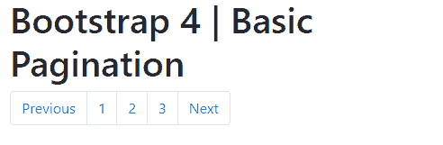
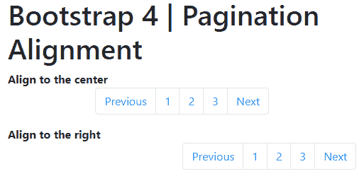

# 引导 4 |分页

> 原文:[https://www.geeksforgeeks.org/bootstrap-4-pagination/](https://www.geeksforgeeks.org/bootstrap-4-pagination/)

分页用于实现网站中页面之间的导航。Bootstrap 中使用的分页有一大块连接的链接，这些链接很难遗漏，并且很容易扩展。

**基本分页:**

可以使用以下类指定基本分页。

*   **。分页**类用于指定列表组的分页。
*   **。页项**类用于指定组中的每个分页项。
*   **。页面链接**类用于指定分页项中的链接。

**示例:**

```
<!DOCTYPE html>
<html>
<head>

        <title>Bootstrap 4 | Pagination</title>
    <meta charset="utf-8"> 
    <meta name="viewport" content="width=device-width, initial-scale=1"> 

    <link rel="stylesheet" href= 
"https://maxcdn.bootstrapcdn.com/bootstrap/4.3.1/css/bootstrap.min.css"> 

    <script src= 
"https://ajax.googleapis.com/ajax/libs/jquery/3.3.1/jquery.min.js"> 
    </script> 

    <script src= 
"https://cdnjs.cloudflare.com/ajax/libs/popper.js/1.14.7/umd/popper.min.js"> 
    </script> 

    <script src= 
"https://maxcdn.bootstrapcdn.com/bootstrap/4.3.1/js/bootstrap.min.js"> 
    </script> 
</head>  
<body>
    <div class="container">
        <h1>Bootstrap 4 | Basic Pagination</h1>

        <!-- Declare the pagination class -->
        <ul class="pagination">

            <!-- Declare the item in the group -->
            <li class="page-item">

                <!-- Declare the link of the item -->
                <a class="page-link" href="#">Previous</a>
            </li>

            <!-- Rest of the pagination items -->
            <li class="page-item">
                <a class="page-link" href="#">1</a>
            </li>
            <li class="page-item">
                <a class="page-link" href="#">2</a>
            </li>
            <li class="page-item">
                <a class="page-link" href="#">3</a>
            </li>
            <li class="page-item">
                <a class="page-link" href="#">Next</a>
            </li>
        </ul>
    </div>
</body>
</html>
```

**输出:**



**禁用状态:**

通过使用**，分页链接可以被设计成不可选择的样式。禁用**类。这可用于禁用“上一步”或“下一步”按钮。

**。disabled** 类在内部使用“指针事件:无”来使链接不可选择，但是，由于该规范并不总是被实现，因此最好通过将“tabindex”属性设置为-1 来使其不可导航。此属性控制是否可以使用 tab 键导航元素。

**示例:**

```
<!DOCTYPE html>
<html>
<head>

<title>Bootstrap 4 | Pagination</title>
<meta charset="utf-8"> 
<meta name="viewport" content="width=device-width, initial-scale=1"> 

<link rel="stylesheet" href= 
"https://maxcdn.bootstrapcdn.com/bootstrap/4.3.1/css/bootstrap.min.css"> 

<script src= 
"https://ajax.googleapis.com/ajax/libs/jquery/3.3.1/jquery.min.js"> 
</script> 

<script src= 
"https://cdnjs.cloudflare.com/ajax/libs/popper.js/1.14.7/umd/popper.min.js"> 
</script> 

<script src= 
"https://maxcdn.bootstrapcdn.com/bootstrap/4.3.1/js/bootstrap.min.js"> 
</script> 
</head>  
<body>
    <div class="container">
        <h1>Bootstrap 4 | Pagination Disabled State</h1>

        <!-- Declare the pagination class -->
        <ul class="pagination">

            <!-- Specify the disabled class to style this item disabled -->
            <li class="page-item disabled">

                <!-- Specify tabindex to make the link non navigatable -->
                <a class="page-link" href="#" tabindex="-1">Previous</a>
            </li>
            <li class="page-item"><a class="page-link" href="#">1</a></li>
            <li class="page-item">
                <a class="page-link" href="#">2</a>
            </li>
            <li class="page-item"><a class="page-link" href="#">3</a></li>
            <li class="page-item">
                <a class="page-link" href="#">Next</a>
            </li>
        </ul>
    </div>
</body>
</html>
```

**输出:**


**活动状态:**

通过使用**，分页链接可以被设计为突出显示当前活动页面。分页项上的活动**类。

**示例:**

```
<!DOCTYPE html>
<html>
<head>

<title>Bootstrap 4 | Pagination</title>
<meta charset="utf-8"> 
<meta name="viewport" content="width=device-width, initial-scale=1"> 

<link rel="stylesheet" href= 
"https://maxcdn.bootstrapcdn.com/bootstrap/4.3.1/css/bootstrap.min.css"> 

<script src= 
"https://ajax.googleapis.com/ajax/libs/jquery/3.3.1/jquery.min.js"> 
</script> 

<script src= 
"https://cdnjs.cloudflare.com/ajax/libs/popper.js/1.14.7/umd/popper.min.js"> 
</script> 

<script src= 
"https://maxcdn.bootstrapcdn.com/bootstrap/4.3.1/js/bootstrap.min.js"> 
</script> 
</head>  
<body>
    <div class="container">
        <h1>Bootstrap 4 | Pagination Active State</h1>

        <!-- Declare the pagination class -->
        <ul class="pagination">
            <li class="page-item">
                <a class="page-link" href="#">Previous</a>
            </li>
            <li class="page-item"><a class="page-link" href="#">1</a></li>

            <li class="page-item"><a class="page-link" href="#">2</a></li>

            <!-- Specify the active class to style this item active -->
            <li class="page-item active">
                <a class="page-link" href="#">3</a>
            </li>

            <li class="page-item">
                <a class="page-link" href="#">Next</a>
            </li>
        </ul>
    </div>
</body>
</html>
```

**输出:**


**调整分页组的大小:**

通过使用额外的类，分页组可以变大或变小。输入组有 3 种可能的大小。

*   **。分页-sm** 类用于较小的尺寸。
*   **。分页-lg** 类用于较大的尺寸。
*   **。分页**类是默认大小。

**示例:**

```
<!DOCTYPE html>
<html>
<head>

<title>Bootstrap 4 | Pagination</title>
<meta charset="utf-8"> 
<meta name="viewport" content="width=device-width, initial-scale=1"> 

<link rel="stylesheet" href= 
"https://maxcdn.bootstrapcdn.com/bootstrap/4.3.1/css/bootstrap.min.css"> 

<script src= 
"https://ajax.googleapis.com/ajax/libs/jquery/3.3.1/jquery.min.js"> 
</script> 

<script src= 
"https://cdnjs.cloudflare.com/ajax/libs/popper.js/1.14.7/umd/popper.min.js"> 
</script> 

<script src= 
"https://maxcdn.bootstrapcdn.com/bootstrap/4.3.1/js/bootstrap.min.js"> 
</script> 
</head>  
<body>
    <div class="container">
        <h1>Bootstrap 4 | Pagination Sizing</h1>
        <b>Large Pagination</b>

        <!-- Specify pagination-lg for large pagination group -->
        <ul class="pagination pagination-lg">
            <li class="page-item">
                <a class="page-link" href="#">Previous</a>
            </li>
            <li class="page-item">
                <a class="page-link" href="#">1</a>
            </li>
            <li class="page-item">
                <a class="page-link" href="#">2</a>
            </li>
            <li class="page-item">
                <a class="page-link" href="#">3</a>
            </li>
            <li class="page-item">
                <a class="page-link" href="#">Next</a>
            </li>
        </ul>

        <b>Small Pagination</b>

        <!-- Specify pagination-sm for small pagination group -->
        <ul class="pagination pagination-sm">
            <li class="page-item">
                <a class="page-link" href="#">Previous</a>
            </li>
            <li class="page-item">
                <a class="page-link" href="#">1</a>
            </li>
            <li class="page-item">
                <a class="page-link" href="#">2</a>
            </li>
            <li class="page-item">
                <a class="page-link" href="#">3</a>
            </li>
            <li class="page-item">
                <a class="page-link" href="#">Next</a>
            </li>
        </ul>

        <b>Normal Pagination</b>

        <!-- Normal size pagination -->
        <ul class="pagination">
            <li class="page-item">
                <a class="page-link" href="#">Previous</a>
            </li>
            <li class="page-item">
                <a class="page-link" href="#">1</a>
            </li>
            <li class="page-item">
                <a class="page-link" href="#">2</a>
            </li>
            <li class="page-item">
                <a class="page-link" href="#">3</a>
            </li>
            <li class="page-item">
                <a class="page-link" href="#">Next</a>
            </li>
        </ul>
    </div>
</body>
</html>
```

**输出:**


**分页组对齐:**

可以使用 flexbox 实用程序类将分页组向右或居中对齐。

*   **。资源中心对齐**类用于将组与中心对齐。
*   **。对齐-内容-结束**类用于将组向右对齐。

**示例:**

```
<!DOCTYPE html>
<html>
<head>

<title>Bootstrap 4 | Pagination</title>
<meta charset="utf-8"> 
<meta name="viewport" content="width=device-width, initial-scale=1"> 

<link rel="stylesheet" href= 
"https://maxcdn.bootstrapcdn.com/bootstrap/4.3.1/css/bootstrap.min.css"> 

<script src= 
"https://ajax.googleapis.com/ajax/libs/jquery/3.3.1/jquery.min.js"> 
</script> 

<script src= 
"https://cdnjs.cloudflare.com/ajax/libs/popper.js/1.14.7/umd/popper.min.js"> 
</script> 

<script src= 
"https://maxcdn.bootstrapcdn.com/bootstrap/4.3.1/js/bootstrap.min.js"> 
</script> 
</head>  
<body>
    <div class="container">
        <h1>Bootstrap 4 | Pagination Alignment</h1>
        <b>Align to the center</b>

        <!-- Specify justify-content-center to align to the center -->
        <ul class="pagination justify-content-center">
            <li class="page-item">
                <a class="page-link" href="#">Previous</a>
            </li>
            <li class="page-item">
                <a class="page-link" href="#">1</a>
            </li>
            <li class="page-item">
                <a class="page-link" href="#">2</a>
            </li>
            <li class="page-item">
                <a class="page-link" href="#">3</a>
            </li>
            <li class="page-item">
                <a class="page-link" href="#">Next</a>
            </li>
        </ul>
        <b>Align to the right</b>

        <!-- Specify justify-content-end to align to the right -->
        <ul class="pagination justify-content-end">
            <li class="page-item">
                <a class="page-link" href="#">Previous</a>
            </li>
            <li class="page-item">
                <a class="page-link" href="#">1</a>
            </li>
            <li class="page-item">
                <a class="page-link" href="#">2</a>
            </li>
            <li class="page-item">
                <a class="page-link" href="#">3</a>
            </li>
            <li class="page-item">
                <a class="page-link" href="#">Next</a>
            </li>
        </ul>
    </div>
</body>
</html>
```

**输出:**

