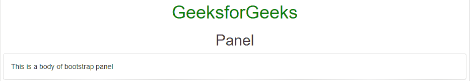
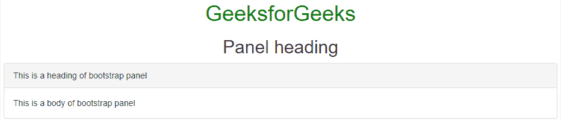
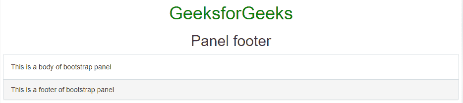
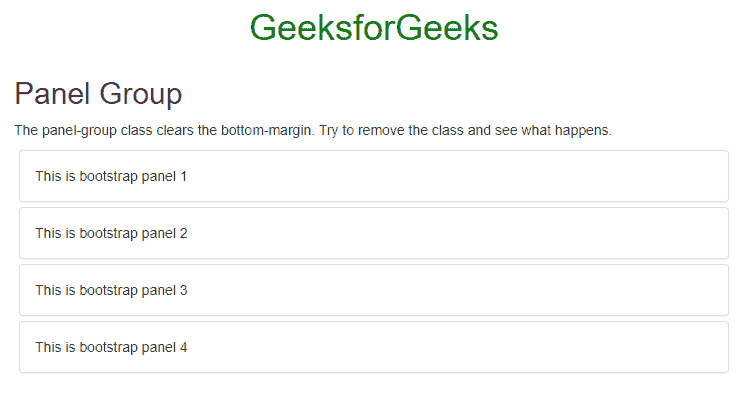
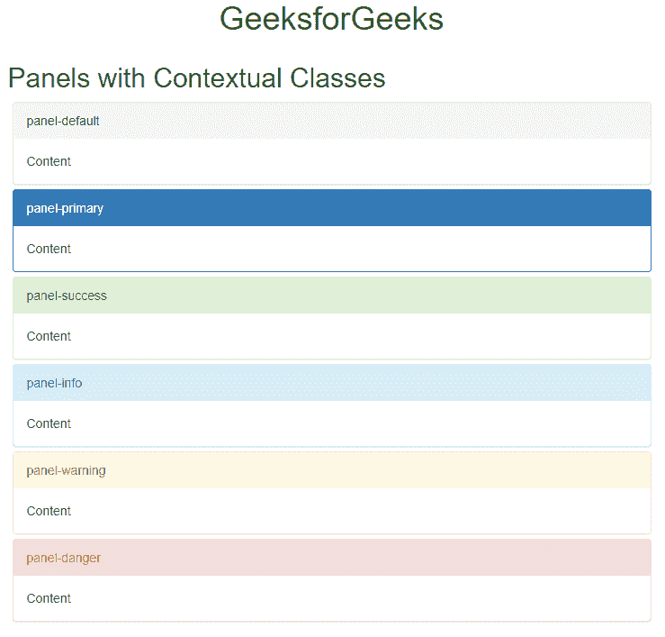

# 自举 4 |面板

> 原文:[https://www.geeksforgeeks.org/bootstrap-4-panels/](https://www.geeksforgeeks.org/bootstrap-4-panels/)

当我们必须引用网页上的一些内容时，我们可以使用面板。我们在内容收件箱周围放置一些填充。引导面板用“面板”类表示。

**示例:**这个示例描述了制作面板的基本代码。

## 超文本标记语言

```
<!DOCTYPE html>
<html lang="en">

<head>
    <meta charset="UTF-8">
    <meta name="viewport"
          content="width=device-width, initial-scale=1.0">
    <title>Panels</title>
    <link rel="stylesheet"
          href=
"https://maxcdn.bootstrapcdn.com/bootstrap/3.4.0/css/bootstrap.min.css">
    <script src=
"https://ajax.googleapis.com/ajax/libs/jquery/3.4.0/jquery.min.js">
    </script>
    <script src=
"https://maxcdn.bootstrapcdn.com/bootstrap/3.4.0/js/bootstrap.min.js">
    </script>
    <style>
        .panel {
            margin: 5px;
        }
    </style>
</head>

<body>
    <h1 style="color:green; text-align:center;">
        GeeksforGeeks
    </h1>
    <h2 style="text-align:center;">
        Panel
    </h2>
    <div class="panel panel-default">
        <div class="panel-body">
          This is a body of bootstrap panel
        </div>
    </div>
</body>

</html>
```

**输出:**



**不同类别的面板:**在引导面板中有一些部分，如 [**引导卡**](https://www.geeksforgeeks.org/bootstrap-cards/) 。引导面板的所有主体部分描述如下:

*   **面板主体**用于定义面板的主体。
*   **面板标题:**用于给面板赋予标题。
*   **面板页脚:**用于给面板赋予页脚类。
*   **面板组:**用于将不同的面板集合在一起成为一个组。

**带有上下文类的面板:**上下文类用于给面板着色。

*   面板-默认
*   面板-主要
*   面板-成功
*   面板信息
*   面板警告
*   面板-危险

**面板标题:**用于创建带有标题的面板。

*   **示例:**

## 超文本标记语言

```
<!DOCTYPE html>
<html lang="en">

<head>
    <meta charset="UTF-8">
    <meta name="viewport"
          content="width=device-width, initial-scale=1.0">
    <title>Panels</title>
    <link rel="stylesheet"
          href=
"https://maxcdn.bootstrapcdn.com/bootstrap/3.4.0/css/bootstrap.min.css">
    <script src=
"https://ajax.googleapis.com/ajax/libs/jquery/3.4.0/jquery.min.js">
    </script>
    <script src=
"https://maxcdn.bootstrapcdn.com/bootstrap/3.4.0/js/bootstrap.min.js">
    </script>
    <style>
        .panel {
            margin: 5px;
        }
    </style>
</head>

<body>
    <h1 style="color:green; text-align:center;">
        GeeksforGeeks
    </h1>
    <h2 style="text-align:center;">
        Panel heading
    </h2>
    <div class="panel panel-default">
        <div class="panel-heading">
         This is a heading of bootstrap panel
        </div>
        <div class="panel-body">
         This is a body of bootstrap panel
        </div>
    </div>
</body>

</html>
```

*   **输出:**



**面板页脚:**用于在面板中添加页脚。

*   **示例:**

## 超文本标记语言

```
<!DOCTYPE html>
<html lang="en">

<head>
    <meta charset="UTF-8">
    <meta name="viewport"
          content="width=device-width, initial-scale=1.0">
    <title>Panels</title>
    <link rel="stylesheet"
          href=
"https://maxcdn.bootstrapcdn.com/bootstrap/3.4.0/css/bootstrap.min.css">
    <script src=
"https://ajax.googleapis.com/ajax/libs/jquery/3.4.0/jquery.min.js">
    </script>
    <script src=
"https://maxcdn.bootstrapcdn.com/bootstrap/3.4.0/js/bootstrap.min.js">
    </script>
    <style>
        .panel {
            margin: 5px;
        }
    </style>
</head>

<body>
    <h1 style="color:green; text-align:center;">
        GeeksforGeeks
    </h1>
    <h2 style="text-align:center;">
        Panel footer
    </h2>
    <div class="panel panel-default">
        <div class="panel-body">
          This is a body of bootstrap panel
        </div>
        <div class="panel-footer">
          This is a footer of bootstrap panel
        </div>
    </div>
</body>

</html>
```

*   **输出:**



**面板组:**用于将面板集合在一起成组。

*   **示例:**

## 超文本标记语言

```
<!DOCTYPE html>
<html lang="en">

<head>
    <meta charset="UTF-8">
    <meta name="viewport"
          content="width=device-width, initial-scale=1.0">
    <title>Panels</title>
    <link rel="stylesheet"
          href=
"https://maxcdn.bootstrapcdn.com/bootstrap/3.4.0/css/bootstrap.min.css">
    <script src=
"https://ajax.googleapis.com/ajax/libs/jquery/3.4.0/jquery.min.js">
    </script>
    <script src=
"https://maxcdn.bootstrapcdn.com/bootstrap/3.4.0/js/bootstrap.min.js">
    </script>
    <style>
        .panel {
            margin: 5px;
        }
    </style>
</head>

<body>
    <h1 style="color:green; text-align:center;">
        GeeksforGeeks
    </h1>
    <div class="container">
    <h2>Panel Group</h2>

<p>
      The panel-group class clears the bottom-margin.
      Try to remove the class and see what happens.
    </p>

    <div class="panel-group">
        <div class="panel panel-default">
            <div class="panel-body">
              This is bootstrap panel 1
            </div>
        </div>
        <div class="panel panel-default">
            <div class="panel-body">
              This is bootstrap panel 2
            </div>
        </div>
        <div class="panel panel-default">
            <div class="panel-body">
              This is bootstrap panel 3
            </div>
        </div>
        <div class="panel panel-default">
            <div class="panel-body">
              This is bootstrap panel 4
            </div>
        </div>
    </div>
    </div>
</body>

</html>
```

*   **输出**



**带有上下文类的面板:**用于根据不同的使用情况突出显示面板内容。

*   **示例:**

## 超文本标记语言

```
<!DOCTYPE html>
<html lang="en">

<head>
    <meta charset="UTF-8">
    <meta name="viewport"
          content="width=device-width, initial-scale=1.0">
    <title>Panels</title>
    <link rel="stylesheet"
          href=
"https://maxcdn.bootstrapcdn.com/bootstrap/3.4.0/css/bootstrap.min.css">
    <script src=
"https://ajax.googleapis.com/ajax/libs/jquery/3.4.0/jquery.min.js">
    </script>
    <script src=
"https://maxcdn.bootstrapcdn.com/bootstrap/3.4.0/js/bootstrap.min.js">
    </script>
    <style>
        .panel {
            margin: 5px;
        }
    </style>
</head>

<body>
    <h1 style="color:green; text-align:center;">
        GeeksforGeeks
    </h1>
    <div class="container">
    <h2>Panels with Contextual Classes</h2>
    <div class="panel-group">
        <div class="panel panel-default">
            <div class="panel-heading">panel-default</div>
            <div class="panel-body">Content</div>
        </div>
        <div class="panel panel-primary">
            <div class="panel-heading">panel-primary</div>
            <div class="panel-body">Content</div>
        </div>
        <div class="panel panel-success">
            <div class="panel-heading"> panel-success</div>
            <div class="panel-body">Content</div>
        </div>
        <div class="panel panel-info">
            <div class="panel-heading"> panel-info</div>
            <div class="panel-body">Content</div>
        </div>
        <div class="panel panel-warning">
            <div class="panel-heading">panel-warning</div>
            <div class="panel-body">Content</div>
        </div>
        <div class="panel panel-danger">
            <div class="panel-heading">panel-danger</div>
            <div class="panel-body">Content</div>
        </div>
    </div>
</body>

</html> 
```

*   **输出:**

