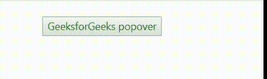
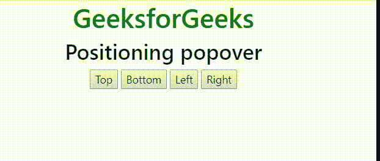
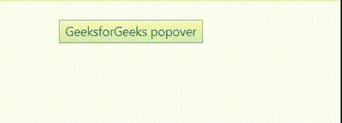
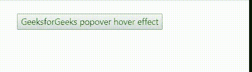

# 自举 4 | Popover

> 原文:[https://www.geeksforgeeks.org/bootstrap-4-popover/](https://www.geeksforgeeks.org/bootstrap-4-popover/)

popover 是 bootstrap 的一个属性，可以用来使任何网站看起来更加动态。弹出窗口通常用于显示任何元素的附加信息，并在鼠标指针点击该元素时显示。
data-toggle =“popover”属性用于创建 popover，title =“popover-title”属性用于添加 popover 的标题，data-content =“popover-content”用于添加 popover 内容。
**语法:**

```html
<element data-toggle="popover" title="popover-title" 
                 data-content="popover-content">
    popover element
<element>
```

**例:**

## 超文本标记语言

```html
<!DOCTYPE html>
<html lang="en">
<head>
    <title>Popover</title>

    <meta charset="utf-8">
    <meta name="viewport" content="width=device-width, initial-scale=1">

    <link rel="stylesheet" href=
"https://maxcdn.bootstrapcdn.com/bootstrap/4.3.1/css/bootstrap.min.css">

    <script src=
"https://ajax.googleapis.com/ajax/libs/jquery/3.3.1/jquery.min.js">
    </script>

    <script src=
"https://cdnjs.cloudflare.com/ajax/libs/popper.js/1.14.7/umd/popper.min.js">
    </script>

    <script src=
"https://maxcdn.bootstrapcdn.com/bootstrap/4.3.1/js/bootstrap.min.js">
    </script>
</head>

<body style="text-align:center;">
    <br>
    <div class="container">

        <button style="color:green;" data-toggle="popover"
                title="popover-title" data-content="popover-content">
            GeeksforGeeks popover
        </button>
    </div>

    <script>
        $(document).ready(function() {
            $('[data-toggle="popover"]').popover();
        });
    </script>
</body>

</html>                   
```

**输出:**



**定位弹出窗口:**数据放置属性用于设置弹出窗口元素的定位。popover 元素的位置可以设置为元素的顶部、底部、左侧或右侧。
**例:**

## 超文本标记语言

```html
<!DOCTYPE html>
<html lang="en">
<head>
    <title>Popover</title>

    <meta charset="utf-8">
    <meta name="viewport" content="width=device-width, initial-scale=1">

    <link rel="stylesheet" href=
"https://maxcdn.bootstrapcdn.com/bootstrap/4.3.1/css/bootstrap.min.css">

    <script src=
"https://ajax.googleapis.com/ajax/libs/jquery/3.3.1/jquery.min.js">
    </script>

    <script src=
"https://cdnjs.cloudflare.com/ajax/libs/popper.js/1.14.7/umd/popper.min.js">
    </script>

    <script src=
"https://maxcdn.bootstrapcdn.com/bootstrap/4.3.1/js/bootstrap.min.js">
    </script>
</head>

<body style="text-align:center;">

    <div class="container">

        <h1 style="color:green;">
            GeeksforGeeks
        </h1>

        <h2>Positioning popover</h2>

        <button data-toggle="popover" data-placement="top"
                title="Top-popover" data-content="Popover content">
            Top
        </button>

        <button data-toggle="popover" data-placement="bottom"
                title="Bottom-popover" data-content="Popover content">
            Bottom
        </button>

        <button data-toggle="popover" data-placement="left"
                title="Left-popover" data-content="Popover content">
            Left
        </button>

        <button data-toggle="popover" data-placement="right"
                title="Right-popover" data-content="Popover content">
            Right
        </button>
    </div>

    <script>
        $(document).ready(function() {
            $('[data-toggle="popover"]').popover();  
        });
    </script>
</body>

</html>                   
```

**输出:**



**关闭弹出窗口:**默认情况下，当鼠标双击时，弹出窗口元素关闭。data-trigger="focus "属性用于在元素外部单击鼠标时关闭 popover 元素。
**例:**

## 超文本标记语言

```html
<!DOCTYPE html>
<html lang="en">
<head>
    <title>Popover</title>

    <meta charset="utf-8">
    <meta name="viewport" content="width=device-width, initial-scale=1">

    <link rel="stylesheet" href=
"https://maxcdn.bootstrapcdn.com/bootstrap/4.3.1/css/bootstrap.min.css">

    <script src=
"https://ajax.googleapis.com/ajax/libs/jquery/3.3.1/jquery.min.js">
    </script>

    <script src=
"https://cdnjs.cloudflare.com/ajax/libs/popper.js/1.14.7/umd/popper.min.js">
    </script>

    <script src=
"https://maxcdn.bootstrapcdn.com/bootstrap/4.3.1/js/bootstrap.min.js">
    </script>
</head>

<body style="text-align:center;">
    <br>
    <div class="container">

        <button style="color:green;" data-toggle="popover" data-trigger="focus"
                title="popover-title" data-content="popover-content">
            GeeksforGeeks popover
        </button>
    </div>

    <script>
        $(document).ready(function() {
            $('[data-toggle="popover"]').popover();
        });
    </script>
</body>

</html>                   
```

**输出:**



**Popover 悬停:**data-trigger =“悬停”属性用于创建 Popover 悬停效果。在这种情况下，当鼠标移动到上方时，将显示弹出窗口。
**例:**

## 超文本标记语言

```html
<!DOCTYPE html>
<html lang="en">
<head>
    <title>Popover</title>

    <meta charset="utf-8">
    <meta name="viewport" content="width=device-width, initial-scale=1">

    <link rel="stylesheet" href=
"https://maxcdn.bootstrapcdn.com/bootstrap/4.3.1/css/bootstrap.min.css">

    <script src=
"https://ajax.googleapis.com/ajax/libs/jquery/3.3.1/jquery.min.js">
    </script>

    <script src=
"https://cdnjs.cloudflare.com/ajax/libs/popper.js/1.14.7/umd/popper.min.js">
    </script>

    <script src=
"https://maxcdn.bootstrapcdn.com/bootstrap/4.3.1/js/bootstrap.min.js">
    </script>
</head>

<body style="text-align:center;">
    <br>
    <div class="container">

        <button style="color:green;" data-toggle="popover" data-trigger="hover"
                title="popover-title" data-content="popover-content">
            GeeksforGeeks popover hover effect
        </button>
    </div>

    <script>
        $(document).ready(function() {
            $('[data-toggle="popover"]').popover();
        });
    </script>
</body>

</html>                   
```

**输出:**



**支持的浏览器:**

*   谷歌 Chrome
*   微软公司出品的 web 浏览器
*   火狐浏览器
*   歌剧
*   旅行队