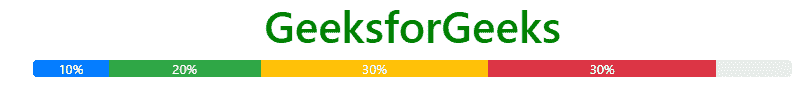

# 引导 4 |进度条

> 原文:[https://www.geeksforgeeks.org/bootstrap-4-progress-bars/](https://www.geeksforgeeks.org/bootstrap-4-progress-bars/)

进度条用于显示计算机上进程的进度。进度条显示流程完成了多少，还剩下多少。您可以使用预定义的引导类在网页上添加进度条。Bootstrap 提供了许多类型的进度条。
**语法:**

```html
<div class="progress">
    <div class="progress-bar" style="width:x%"></div>
<div>
```

**示例:**

## 超文本标记语言

```html
<!DOCTYPE html>
<html lang="en">
<head>
    <title>Bootstrap Progress Bar</title>

    <meta charset="utf-8">
    <meta name="viewport" content="width=device-width, initial-scale=1">

    <link rel="stylesheet" href=
"https://maxcdn.bootstrapcdn.com/bootstrap/4.3.1/css/bootstrap.min.css">

    <script src=
"https://ajax.googleapis.com/ajax/libs/jquery/3.3.1/jquery.min.js">
    </script>

    <script src=
"https://cdnjs.cloudflare.com/ajax/libs/popper.js/1.14.7/umd/popper.min.js">
    </script>

    <script src=
"https://maxcdn.bootstrapcdn.com/bootstrap/4.3.1/js/bootstrap.min.js">
    </script>
</head>

<body>
    <h1 style="color:green;text-align:center;">
        GeeksforGeeks
    </h1>

    <div class="container">
        <div class="progress">
            <div class="progress-bar" style="width:80%"></div>
        </div>
    </div>
</body>

</html>                   
```

**输出:**


**进度条高度:**使用 CSS 属性更改进度条高度。默认进度高度为 16px。进度和进度条容器的高度必须相同。
**语法:**

```html
<div class="progress" style="height:30px;">
    <div class="progress-bar" style="width:x%";height30px;></div>
<div>
```

**例:**

## 超文本标记语言

```html
<!DOCTYPE html>
<html lang="en">
<head>
    <title>Bootstrap Progress Bar</title>

    <meta charset="utf-8">
    <meta name="viewport" content="width=device-width, initial-scale=1">

    <link rel="stylesheet" href=
"https://maxcdn.bootstrapcdn.com/bootstrap/4.3.1/css/bootstrap.min.css">

    <script src=
"https://ajax.googleapis.com/ajax/libs/jquery/3.3.1/jquery.min.js">
    </script>

    <script src=
"https://cdnjs.cloudflare.com/ajax/libs/popper.js/1.14.7/umd/popper.min.js">
    </script>

    <script src=
"https://maxcdn.bootstrapcdn.com/bootstrap/4.3.1/js/bootstrap.min.js">
    </script>
</head>

<body>
    <h1 style="color:green;text-align:center;">
        GeeksforGeeks
    </h1>

    <div class="container">
        <div class="progress" style="height:30px;">
            <div class="progress-bar"
                 style="width:80%;height:30px;">
            </div>
        </div>
    </div>
</body>

</html>                   
```

**输出:**


**标注进度条:**标注进度条用于显示进度条内部的文本，以显示任务完成百分比。
**语法:**

```html
<div class="progress">
    <div class="progress-bar" style="width:x%">x%</div>
<div>
```

**例:**

## 超文本标记语言

```html
<!DOCTYPE html>
<html lang="en">
<head>
    <title>Bootstrap Progress Bar</title>

    <meta charset="utf-8">
    <meta name="viewport" content="width=device-width, initial-scale=1">

    <link rel="stylesheet" href=
"https://maxcdn.bootstrapcdn.com/bootstrap/4.3.1/css/bootstrap.min.css">

    <script src=
"https://ajax.googleapis.com/ajax/libs/jquery/3.3.1/jquery.min.js">
    </script>

    <script src=
"https://cdnjs.cloudflare.com/ajax/libs/popper.js/1.14.7/umd/popper.min.js">
    </script>

    <script src=
"https://maxcdn.bootstrapcdn.com/bootstrap/4.3.1/js/bootstrap.min.js">
    </script>
</head>

<body style="text-align:center;">
    <h1 style="color:green;">
        GeeksforGeeks
    </h1>

    <div class="container">
        <div class="progress">
            <div class="progress-bar" style="width:80%;">
                80%
            </div>
        </div>
    </div>
</body>

</html>                   
```

**输出:**


**彩色进度条:**使用 Bootstrap 4 上下文背景类设置进度条的颜色。进度条的默认颜色是蓝色。
**语法:**

```html
<div class="progress">
    <div class="progress-bar bg-*" style="width:x%">x%</div>
<div>
```

**例:**

## 超文本标记语言

```html
<!DOCTYPE html>
<html lang="en">
<head>
    <title>Bootstrap Progress Bar</title>

    <meta charset="utf-8">
    <meta name="viewport" content="width=device-width, initial-scale=1">

    <link rel="stylesheet" href=
"https://maxcdn.bootstrapcdn.com/bootstrap/4.3.1/css/bootstrap.min.css">

    <script src=
"https://ajax.googleapis.com/ajax/libs/jquery/3.3.1/jquery.min.js">
    </script>

    <script src=
"https://cdnjs.cloudflare.com/ajax/libs/popper.js/1.14.7/umd/popper.min.js">
    </script>

    <script src=
"https://maxcdn.bootstrapcdn.com/bootstrap/4.3.1/js/bootstrap.min.js">
    </script>
</head>

<body style="text-align:center;">
    <h1 style="color:green;">
        GeeksforGeeks
    </h1>

    <div class="container">
        <div class="progress">
            <div class="progress-bar" style="width:50%;">
                50%
            </div>
        </div><br>

        <div class="progress">
            <div class="progress-bar bg-success" style="width:90%;">
                90%
            </div>
        </div><br>

        <div class="progress">
            <div class="progress-bar bg-warning" style="width:30%;">
                30%
            </div>
        </div><br>

        <div class="progress">
            <div class="progress-bar bg-danger" style="width:10%;">
                10%
            </div>
        </div><br>

        <div class="progress">
            <div class="progress-bar bg-info" style="width:70%;">
                70%
            </div>
        </div><br>
    </div>
</body>

</html>                   
```

**输出:**


**剥离进度条:***。进度条剥离*类用于给进度条添加条纹。使用*的组合。进度条*和*。进度条-剥离*类创建剥离进度条。使用 Bootstrap 4 上下文背景类来设置进度条的颜色。
**语法:**

```html
<div class="progress">
    <div class="progress-bar progress-bar-stripped" style="width:x%">
         x%
    </div>
<div>
```

**例:**

## 超文本标记语言

```html
<!DOCTYPE html>
<html lang="en">
<head>
    <title>Bootstrap Progress Bar</title>

    <meta charset="utf-8">
    <meta name="viewport" content="width=device-width, initial-scale=1">

    <link rel="stylesheet" href=
"https://maxcdn.bootstrapcdn.com/bootstrap/4.3.1/css/bootstrap.min.css">

    <script src=
"https://ajax.googleapis.com/ajax/libs/jquery/3.3.1/jquery.min.js">
    </script>

    <script src=
"https://cdnjs.cloudflare.com/ajax/libs/popper.js/1.14.7/umd/popper.min.js">
    </script>

    <script src=
"https://maxcdn.bootstrapcdn.com/bootstrap/4.3.1/js/bootstrap.min.js">
    </script>
</head>

<body style="text-align:center;">
    <h1 style="color:green;">
        GeeksforGeeks
    </h1>

    <div class="container">
        <div class="progress">
            <div class="progress-bar progress-bar-stripped"
                        style="width:50%;">50%</div>
        </div><br>

        <div class="progress">
            <div class="progress-bar bg-success progress-bar-stripped"
                        style="width:90%;">90%</div>
        </div><br>

        <div class="progress">
            <div class="progress-bar bg-warning progress-bar-stripped"
                        style="width:30%;">30%</div>
        </div><br>

        <div class="progress">
            <div class="progress-bar bg-danger progress-bar-stripped"
                        style="width:10%;">10%</div>
        </div><br>

        <div class="progress">
            <div class="progress-bar bg-info progress-bar-stripped"
                        style="width:70%;">70%</div>
        </div><br>
    </div>
</body>

</html>                           
```

**输出:**


**动画进度条:**的。进度条动画类用于创建动画进度条。使用的组合。进度条，进度条剥离和进度条动画创建一个动画进度条。
**语法:**

```html
<div class="progress">
    <div class="progress-bar progress-bar-stripped progress-bar-animated" 
            style="width:x%">
        x%
    </div>
<div>
```

**例:**

## 超文本标记语言

```html
<!DOCTYPE html>
<html lang="en">
<head>
    <title>Bootstrap Progress Bar</title>

    <meta charset="utf-8">
    <meta name="viewport" content="width=device-width, initial-scale=1">

    <link rel="stylesheet" href=
"https://maxcdn.bootstrapcdn.com/bootstrap/4.3.1/css/bootstrap.min.css">

    <script src=
"https://ajax.googleapis.com/ajax/libs/jquery/3.3.1/jquery.min.js">
    </script>

    <script src=
"https://cdnjs.cloudflare.com/ajax/libs/popper.js/1.14.7/umd/popper.min.js">
    </script>

    <script src=
"https://maxcdn.bootstrapcdn.com/bootstrap/4.3.1/js/bootstrap.min.js">
    </script>
</head>

<body style="text-align:center;">
    <h1 style="color:green;">
        GeeksforGeeks
    </h1>

    <div class="container">
        <div class="progress">
            <div class="progress-bar progress-bar-stripped
                    progress-bar-animated" style="width:50%;">50%</div>
        </div><br>

        <div class="progress">
            <div class="progress-bar bg-success progress-bar-stripped
                    progress-bar-animated" style="width:90%;">90%</div>
        </div><br>

        <div class="progress">
            <div class="progress-bar bg-warning progress-bar-stripped
                    progress-bar-animated" style="width:30%;">30%</div>
        </div><br>

        <div class="progress">
            <div class="progress-bar bg-danger progress-bar-stripped
                    progress-bar-animated" style="width:10%;">10%</div>
        </div><br>

        <div class="progress">
            <div class="progress-bar bg-info progress-bar-stripped
                    progress-bar-animated" style="width:70%;">70%</div>
        </div><br>
    </div>
</body>

</html>                   
```

**输出:**


**多个进度条:**可以堆叠多个进度条，以显示不同颜色的进度条。
**例:**

## 超文本标记语言

```html
<!DOCTYPE html>
<html lang="en">
<head>
    <title>Bootstrap Progress Bar</title>

    <meta charset="utf-8">
    <meta name="viewport" content="width=device-width, initial-scale=1">

    <link rel="stylesheet" href=
"https://maxcdn.bootstrapcdn.com/bootstrap/4.3.1/css/bootstrap.min.css">

    <script src=
"https://ajax.googleapis.com/ajax/libs/jquery/3.3.1/jquery.min.js">
    </script>

    <script src=
"https://cdnjs.cloudflare.com/ajax/libs/popper.js/1.14.7/umd/popper.min.js">
    </script>

    <script src=
"https://maxcdn.bootstrapcdn.com/bootstrap/4.3.1/js/bootstrap.min.js">
    </script>
</head>

<body style="text-align:center;">
    <h1 style="color:green;">
        GeeksforGeeks
    </h1>

    <div class="container">
        <div class="progress">
            <div class="progress-bar" style="width:10%;">
                10%
            </div>

            <div class="progress-bar bg-success" style="width:20%;">
                20%
            </div>

            <div class="progress-bar bg-warning" style="width:30%;">
                30%
            </div>

            <div class="progress-bar bg-danger" style="width:30%;">
                30%
            </div>
        </div>
    </div>
</body>

</html>                               
```

**输出:**



**支持的浏览器:**

*   谷歌 Chrome
*   微软公司出品的 web 浏览器
*   火狐浏览器
*   歌剧
*   旅行队