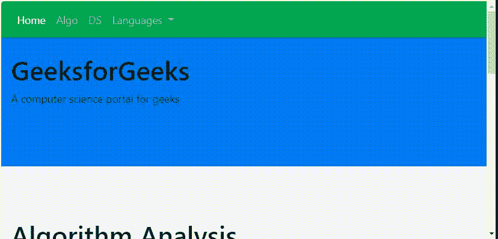

# 引导杆 4 \ scroll spy

> 原文:[https://www.geeksforgeeks.org/bootstrap-4-scrollspy/](https://www.geeksforgeeks.org/bootstrap-4-scrollspy/)

有时在设计网站时，我们会加入一些吸引人的功能，让网站引人注目。其中一个特性是 Bootstrap scrollspy，它可以在滚动区域时自动定位导航栏内容。
**创建滚动间谍:**数据间谍=“滚动”和数据目标=“。navbar "属性用于创建 scrollspy 元素。scrollspy 用于在滚动页面时更新导航链接。

**示例:**

## 超文本标记语言

```html
<!DOCTYPE html>
<html lang="en">
<head>
    <title>Scrollspy</title>

    <meta charset="utf-8">
    <meta name="viewport" content="width=device-width, initial-scale=1">

    <link rel="stylesheet" href=
"https://maxcdn.bootstrapcdn.com/bootstrap/4.3.1/css/bootstrap.min.css">

    <script src=
"https://ajax.googleapis.com/ajax/libs/jquery/3.3.1/jquery.min.js">
    </script>

    <script src=
"https://cdnjs.cloudflare.com/ajax/libs/popper.js/1.14.7/umd/popper.min.js">
    </script>

    <script src=
"https://maxcdn.bootstrapcdn.com/bootstrap/4.3.1/js/bootstrap.min.js">
    </script>

     <style>
        body {
            position: relative;
        }
    </style>
</head>

<body data-spy="scroll" data-target=".navbar" data-offset="50">

    <nav class="navbar navbar-expand-sm bg-success navbar-dark fixed-top">

        <ul class="navbar-nav">
            <li class="nav-item">
                <a class="nav-link" href="#content1">Home</a>
            </li>

            <li class="nav-item">
                <a class="nav-link" href="#content2">Algo</a>
            </li>

            <li class="nav-item">
                <a class="nav-link" href="#content3">DS</a>
            </li>

            <li class="nav-item dropdown">
                <a class="nav-link dropdown-toggle" href="#"
                        id="navbardrop" data-toggle="dropdown">
                    Languages
                </a>

                <div class="dropdown-menu">
                    <a class="dropdown-item" href="#content4">C</a>
                    <a class="dropdown-item" href="#content5">C++</a>
                </div>
            </li>
        </ul>
    </nav>

    <div id="content1" class="container-fluid bg-primary"
            style="height:250px; padding-top:80px;">
        <h1>GeeksforGeeks</h1>

<p>A computer science portal for geeks</p>

    </div>

    <div id="content2" class="container-fluid bg-light"
            style="height:250px; padding-top:80px;">
        <h1>Algorithm Analysis</h1>

<p>A stepwise procedure to solve a problem</p>

    </div>

    <div id="content3" class="container-fluid bg-warning"
            style="height:250px; padding-top:80px;">
        <h1>Data Structure</h1>

<p>
            Data structure is a particular way to organizing the data
            in computer memory so that it can be used efficiently.
        </p>

    </div>

    <div id="content4" class="container-fluid bg-info"
            style="height:250px; padding-top:80px;">
        <h1>C Languages</h1>

<p>
            C is a computer science programming language
        </p>

    </div>

    <div id="content5" class="container-fluid bg-dark"
            style="height:250px; padding-top:80px;">
        <h1>C++ Languages</h1>

<p>
            C++ is the extension of C language.
        </p>

    </div>
</body>

</html>                   
```

**输出:**



**Scrollspy 垂直菜单:**创建垂直导航菜单，内容根据菜单显示。

## 超文本标记语言

```html
<!DOCTYPE html>
<html lang="en">
<head>
    <title>Scrollspy</title>

    <meta charset="utf-8">
    <meta name="viewport" content="width=device-width, initial-scale=1">

    <link rel="stylesheet" href=
"https://maxcdn.bootstrapcdn.com/bootstrap/4.3.1/css/bootstrap.min.css">

    <script src=
"https://ajax.googleapis.com/ajax/libs/jquery/3.3.1/jquery.min.js">
    </script>

    <script src=
"https://cdnjs.cloudflare.com/ajax/libs/popper.js/1.14.7/umd/popper.min.js">
    </script>

    <script src=
"https://maxcdn.bootstrapcdn.com/bootstrap/4.3.1/js/bootstrap.min.js">
    </script>

    <style>
        body {
            position: relative;
        }
        ul.nav-pills {
            top: 20px;
            position: fixed;
        }
        div.col-8 div {
            height: 500px;
        }
    </style>
</head>

<body data-spy="scroll" data-target="#GFG_scrollspy" data-offset="1">

    <div class="container-fluid">
        <div class="row">

            <nav class="col-sm-4 col-4" id="GFG_scrollspy">

                <ul class="nav nav-pills flex-column">
                    <li class="nav-item">
                        <a class="nav-link active" href="#content1">
                            Home
                        </a>
                    </li>

                    <li class="nav-item">
                        <a class="nav-link" href="#content2">
                            Algo
                        </a>
                    </li>

                    <li class="nav-item">
                        <a class="nav-link" href="#content3">
                            DS
                        </a>
                    </li>

                    <li class="nav-item dropdown">
                        <a class="nav-link dropdown-toggle" href="#"
                                id="navbardrop" data-toggle="dropdown">
                            Languages
                        </a>

                        <div class="dropdown-menu">
                            <a class="dropdown-item"
                               href="#content4">C</a>

                            <a class="dropdown-item"
                               href="#content5">C++</a>
                        </div>
                    </li>
                </ul>
            </nav>

            <div class="col-sm-8 col-8">
                <div id="content1" class="container-fluid bg-primary"
                            style="height:250px; padding-top:80px;">
                    <h1>GeeksforGeeks</h1>

<p>A computer science portal for geeks</p>

                </div>

                <div id="content2" class="container-fluid bg-light"
                            style="height:250px; padding-top:80px;">
                    <h1>Algorithm Analysis</h1>

<p>A stepwise procedure to solve a problem</p>

                </div>

                <div id="content3" class="container-fluid bg-warning"
                            style="height:250px; padding-top:80px;">
                    <h1>Data Structure</h1>

<p>
                        Data structure is a particular way to organizing
                        the data in computer memory so that it can be
                        used efficiently.
                    </p>

                </div>

                <div id="content4" class="container-fluid bg-info"
                            style="height:250px; padding-top:80px;">
                    <h1>C Languages</h1>

<p>
                        C is a computer science programming language
                    </p>

                </div>

                <div id="content5" class="container-fluid bg-dark"
                            style="height:250px; padding-top:80px;">
                    <h1>C++ Languages</h1>

<p>
                        C++ is the extension of C language.
                    </p>

                </div>
            </div>
        </div>
    </div>
</body>

</html>                               
```

**输出:**


**支持的浏览器:**

*   谷歌 Chrome
*   微软公司出品的 web 浏览器
*   火狐浏览器
*   歌剧
*   旅行队