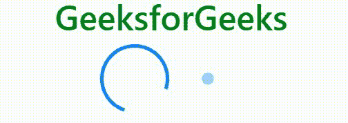
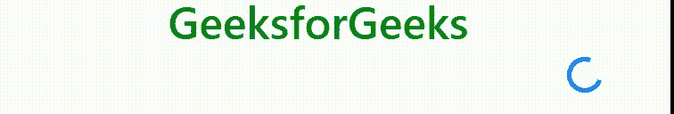

# 自举 4 |旋转器

> 原文:[https://www.geeksforgeeks.org/bootstrap-4-spinners/](https://www.geeksforgeeks.org/bootstrap-4-spinners/)

Bootstrap 提供了不同的类来创建不同风格的“微调器”来显示项目的加载状态。这些类内置了 HTML 和 CSS，因此不需要编写任何 JavaScript 来创建它们。我们还可以用 Bootstrap 提供的类修改微调器的外观、大小和位置。
**微调器类型:**

*   **边框微调器:**我们可以使用*创建轻量级边框微调器。旋转边框*等级如下。
    **语法:**

```
<div class="spinner-border" role="status"> 
    <span class="sr-only">Loading</span>
</div> 
```

*   **例:**

## 超文本标记语言

```
<!DOCTYPE html>
<html lang="en">

<head>
    <title>Bootstrap Spinners</title>

    <meta charset="utf-8">
    <meta name="viewport" content="width=device-width, initial-scale=1">

    <link rel="stylesheet" href=
"https://maxcdn.bootstrapcdn.com/bootstrap/4.3.1/css/bootstrap.min.css">

    <script src=
"https://ajax.googleapis.com/ajax/libs/jquery/3.3.1/jquery.min.js">
    </script>

    <script src=
"https://cdnjs.cloudflare.com/ajax/libs/popper.js/1.14.7/umd/popper.min.js">
    </script>

    <script src=
"https://maxcdn.bootstrapcdn.com/bootstrap/4.3.1/js/bootstrap.min.js">
    </script>
</head>

<body>
    <center>
        <h1 style="color:green;text-align:center;">
        GeeksforGeeks
    </h1>

        <!-- spinner-border -->
        <div class="spinner-border" role="status">
            <span class="sr-only">Loading</span>
        </div>
  </center>
</body>

</html>
```

*   **输出:**


*   **注意:**我们使用了*类。< div >元素内的微调边框*。出于可访问性的目的，我们在< div >中使用了**角色=“状态”**属性值对，以及带有 class =“Sr-only”的< span >标记，这是一个 Bootstrap 类，它使容器及其内容仅在屏幕阅读器上可见。

*   **彩色微调器:**我们可以使用 Bootstrap 的文本颜色实用程序类以及*来更改边框微调器的颜色。旋转边框*等级如下。
    **语法:**

```
<div class="spinner-border text-primary" role="status">
    <span class="sr-only">Loading</span>
</div> 
```

*   **例:**

## 超文本标记语言

```
<!DOCTYPE html>
<html lang="en">

<head>
    <title>Bootstrap Spinners</title>

    <meta charset="utf-8">
    <meta name="viewport" content="width=device-width, initial-scale=1">

    <link rel="stylesheet" href=
"https://maxcdn.bootstrapcdn.com/bootstrap/4.3.1/css/bootstrap.min.css">

    <script src=
"https://ajax.googleapis.com/ajax/libs/jquery/3.3.1/jquery.min.js">
    </script>

    <script src=
"https://cdnjs.cloudflare.com/ajax/libs/popper.js/1.14.7/umd/popper.min.js">
    </script>

    <script src=
"https://maxcdn.bootstrapcdn.com/bootstrap/4.3.1/js/bootstrap.min.js">
    </script>
</head>

<body>
    <center>
        <h1 style="color:green;text-align:center;">
        GeeksforGeeks
    </h1>

        <!-- spinner-border, #1 -->
        <div class="spinner-border text-primary" role="status">
            <span class="sr-only">Loading</span>
        </div>

        <!-- spinner-border, #2 -->
        <div class="spinner-border text-secondary" role="status">
            <span class="sr-only">Loading</span>
        </div>

        <!-- spinner-border, #3 -->
        <div class="spinner-border text-success" role="status">
            <span class="sr-only">Loading</span>
        </div>

        <!-- spinner-border, #4 -->
        <div class="spinner-border text-danger" role="status">
            <span class="sr-only">Loading</span>
        </div>

        <!-- spinner-border, #5 -->
        <div class="spinner-border text-warning" role="status">
            <span class="sr-only">Loading</span>
        </div>

        <!-- spinner-border, #6 -->
        <div class="spinner-border text-info" role="status">
            <span class="sr-only">Loading</span>
        </div>

        <!-- spinner-border, #7 -->
        <div class="spinner-border text-light" role="status">
            <span class="sr-only">Loading</span>
        </div>

        <!-- spinner-border, #8 -->
        <div class="spinner-border text-dark" role="status">
            <span class="sr-only">Loading</span>
        </div>

    </div>
</center>
</body>

</html>                   
```

*   **输出:**


*   **注意:**我们使用了**文本颜色实用程序**而不是**边框颜色实用程序**，因为每个边框微调器至少为一侧指定了一个透明边框，**边框-{color}实用程序**会覆盖该边框。

*   **生长微调器:**我们可以使用*来创建生长微调器。旋转生长*类自举。它显示为反复增长。
    **语法:**

```

<div class="spinner-grow" role="status"> 
     <span class="sr-only">Loading</span>
</div> 
```

*   **例:**

## 超文本标记语言

```
<!DOCTYPE html>
<html lang="en">
<head>
    <title>Bootstrap Spinners</title>

    <meta charset="utf-8">
    <meta name="viewport" content="width=device-width, initial-scale=1">

    <link rel="stylesheet" href=
"https://maxcdn.bootstrapcdn.com/bootstrap/4.3.1/css/bootstrap.min.css">

    <script src=
"https://ajax.googleapis.com/ajax/libs/jquery/3.3.1/jquery.min.js">
    </script>

    <script src=
"https://cdnjs.cloudflare.com/ajax/libs/popper.js/1.14.7/umd/popper.min.js">
    </script>

    <script src=
"https://maxcdn.bootstrapcdn.com/bootstrap/4.3.1/js/bootstrap.min.js">
    </script>
</head>

<body>
<center>
    <h1 style="color:green;text-align:center;">
        GeeksforGeeks
    </h1>

        <!-- spinner-grow -->
        <div class="spinner-grow" role="status">
            <span class="sr-only">Loading</span>
        </div>

    </div>
    <center>
</body>

</html>                   
```

*   **输出:**


*   **注意:**我们使用了*类。旋转器-在<分区>内生长*。我们在< div >中使用了 role =“status”属性值对用于可访问性目的，并且使用了带有 class =“Sr-only”的< span >标记，这是一个 Bootstrap 类，它使容器及其内容仅在屏幕阅读器上可见。

*   **彩色生长微调器:**我们可以通过使用**文本颜色工具**类的 Bootstrap 和*来更改**生长微调器**的颜色。旋转-生长*类如下。
    **语法:**

```
<div class="spinner-grow text-primary" role="status"> 
    <span class="sr-only">Loading</span>
</div> 
```

*   **例:**

## 超文本标记语言

```
<!DOCTYPE html>
<html lang="en">

<head>
    <title>Bootstrap Spinners</title>

    <meta charset="utf-8">
    <meta name="viewport" content="width=device-width, initial-scale=1">

    <link rel="stylesheet" href=
"https://maxcdn.bootstrapcdn.com/bootstrap/4.3.1/css/bootstrap.min.css">

    <script src=
"https://ajax.googleapis.com/ajax/libs/jquery/3.3.1/jquery.min.js">
    </script>

    <script src=
"https://cdnjs.cloudflare.com/ajax/libs/popper.js/1.14.7/umd/popper.min.js">
    </script>

    <script src=
"https://maxcdn.bootstrapcdn.com/bootstrap/4.3.1/js/bootstrap.min.js">
    </script>
</head>

<body>
    <center>
        <h1 style="color:green;text-align:center;">
        GeeksforGeeks
    </h1>

        <!-- spinner-grow, #1 -->
        <div class="spinner-grow text-primary" role="status">
            <span class="sr-only">Loading</span>
        </div>

        <!-- spinner-grow, #2 -->
        <div class="spinner-grow text-secondary" role="status">
            <span class="sr-only">Loading</span>
        </div>

        <!-- spinner-grow, #3 -->
        <div class="spinner-grow text-success" role="status">
            <span class="sr-only">Loading</span>
        </div>

        <!-- spinner-grow, #4 -->
        <div class="spinner-grow text-danger" role="status">
            <span class="sr-only">Loading</span>
        </div>

        <!-- spinner-grow, #5 -->
        <div class="spinner-grow text-warning" role="status">
            <span class="sr-only">Loading</span>
        </div>

        <!-- spinner-grow, #6 -->
        <div class="spinner-grow text-info" role="status">
            <span class="sr-only">Loading</span>
        </div>

        <!-- spinner-grow, #7 -->
        <div class="spinner-grow text-light" role="status">
            <span class="sr-only">Loading</span>
        </div>

        <!-- spinner-grow, #8 -->
        <div class="spinner-grow text-dark" role="status">
            <span class="sr-only">Loading</span>
        </div>
</center>
</body>

</html>                   
```

*   **输出:**


*   **注意:**微调器是用 currentColor 构建的，它很容易用文本颜色工具改变外观。

*   **带边框微调器的按钮:**我们可以使用*将边框微调器放置在带文本或不带文本的按钮内。在<跨度>标签内的旋转边界*类。
    **语法:**

```
<button type="button" class="btn btn-primary" disabled> 
    <span class="spinner-border spinner-border-sm" role="status" aria-hidden="true"> 
    </span> 
    Text 
</button>
```

*   **例:**

## 超文本标记语言

```
<!DOCTYPE html>
<html lang="en">

<head>
    <title>Bootstrap Spinners</title>

    <meta charset="utf-8">
    <meta name="viewport" content="width=device-width, initial-scale=1">

    <link rel="stylesheet" href=
"https://maxcdn.bootstrapcdn.com/bootstrap/4.3.1/css/bootstrap.min.css">

    <script src=
"https://ajax.googleapis.com/ajax/libs/jquery/3.3.1/jquery.min.js">
    </script>

    <script src=
"https://cdnjs.cloudflare.com/ajax/libs/popper.js/1.14.7/umd/popper.min.js">
    </script>

    <script src=
"https://maxcdn.bootstrapcdn.com/bootstrap/4.3.1/js/bootstrap.min.js">
    </script>
</head>

<body>
    <center>
        <h1 style="color:green;text-align:center;">
        GeeksforGeeks
    </h1>
    <div class="container">
         <button type="button" class="btn btn-secondary" disabled>
            <span class="spinner-border spinner-border-sm"
                  role="status"
                  aria-hidden="true">
            </span>
            <span class="sr-only">Loading</span>
        </button>

        <button type="button" class="btn btn-primary" disabled>
            <span class="spinner-border spinner-border-sm"
                  role="status"
                  aria-hidden="true">
            </span> 
            Processing...
        </button>
    </div>
</center>
</body>

</html>                   
```

*   **输出:**


*   **注意:**我们已经在<按钮>标签内放置了**“禁用”**属性以将其停用，并在<跨度>标签内使用了**“角色”**和**“咏叹调-隐藏”**属性以实现可访问性。

*   **带生长微调器的按钮:**我们可以使用*将生长微调器放置在带文本或不带文本的按钮内。旋转器-在<跨度>标签内生长*类。
    **语法:**

```
<button type="button" class="btn btn-primary" disabled> 
    <span class="spinner-grow spinner-grow-sm" role="status" aria-hidden="true"></span>  
    text
</button> 
```

*   **例:**

## 超文本标记语言

```
<!DOCTYPE html>
<html lang="en">

<head>
    <title>Bootstrap Spinners</title>

    <meta charset="utf-8">
    <meta name="viewport" content="width=device-width, initial-scale=1">

    <link rel="stylesheet" href=
"https://maxcdn.bootstrapcdn.com/bootstrap/4.3.1/css/bootstrap.min.css">

    <script src=
"https://ajax.googleapis.com/ajax/libs/jquery/3.3.1/jquery.min.js">
    </script>

    <script src=
"https://cdnjs.cloudflare.com/ajax/libs/popper.js/1.14.7/umd/popper.min.js">
    </script>

    <script src=
"https://maxcdn.bootstrapcdn.com/bootstrap/4.3.1/js/bootstrap.min.js">
    </script>
</head>

<body>
    <center>
        <h1 style="color:green;text-align:center;">
        GeeksforGeeks
    </h1>
    <div class="container">
         <button type="button" class="btn btn-secondary" disabled>
            <span class="spinner-grow spinner-grow-sm"
                  role="status"
                  aria-hidden="true">
            </span>
            <span class="sr-only">Loading</span>
        </button>

        <button type="button" class="btn btn-primary" disable>
            <span class="spinner-grow spinner-grow-sm"
                  role="status"
                  aria-hidden="true">
            </span> 
            Processing...
        </button>
    </div>
</center>
</body>

</html>                   
```

*   **输出:**


*   **注意:**我们已经在<按钮>标签内放置了**“禁用”**属性以将其停用，并在<跨度>标签内使用了**“角色”**和**“咏叹调-隐藏”**属性以实现可访问性。

**改变尺寸:**

*   **使用类:**我们可以使用类*改变大小。微调-边框-sm* 和*。旋转-生长-sm* 和*。旋转边框*和*。微调-成长*类。
    尺寸等级列表如下:
    *   钐
    *   钔
    *   水准仪
*   **使用 CSS:** 我们也可以使用 CSS 样式改变微调器的大小，如下所示。
    **例:**

## 超文本标记语言

```
<!DOCTYPE html>
<html lang="en">

<head>
    <title>Bootstrap Spinners</title>

    <meta charset="utf-8">
    <meta name="viewport" content="width=device-width, initial-scale=1">

    <link rel="stylesheet" href=
"https://maxcdn.bootstrapcdn.com/bootstrap/4.3.1/css/bootstrap.min.css">

    <script src=
"https://ajax.googleapis.com/ajax/libs/jquery/3.3.1/jquery.min.js">
    </script>

    <script src=
"https://cdnjs.cloudflare.com/ajax/libs/popper.js/1.14.7/umd/popper.min.js">
    </script>

    <script src=
"https://maxcdn.bootstrapcdn.com/bootstrap/4.3.1/js/bootstrap.min.js">
    </script>
</head>

<body>
    <center>
      <div class="container">
        <h1 style="color:green;text-align:center;">
        GeeksforGeeks
    </h1>

        <div class="spinner-border text-primary"
             role="status"
             style="height:5rem; width:5rem;">
            <span class="sr-only">Loading</span>
        </div>

        <div class="spinner-grow text-primary"
             role="status"
             style="height:5rem; width:5rem;">
            <span class="sr-only">Loading</span>
        </div>
    </div>
</center>
</body>

</html>                   
```

*   **输出:**



**更改路线:**

*   **使用文本对齐实用程序:**我们可以通过将微调器放置在< div >标签中来更改微调器的对齐方式，该标签使用文本对齐实用程序类来控制子元素的对齐方式，如下所示。
    **例:**

## 超文本标记语言

```
<!DOCTYPE html>
<html lang="en">

<head>
    <title>Bootstrap Spinners</title>

    <meta charset="utf-8">
    <meta name="viewport" content="width=device-width, initial-scale=1">

    <link rel="stylesheet" href=
"https://maxcdn.bootstrapcdn.com/bootstrap/4.3.1/css/bootstrap.min.css">

    <script src=
"https://ajax.googleapis.com/ajax/libs/jquery/3.3.1/jquery.min.js">
    </script>

    <script src=
"https://cdnjs.cloudflare.com/ajax/libs/popper.js/1.14.7/umd/popper.min.js">
    </script>

    <script src=
"https://maxcdn.bootstrapcdn.com/bootstrap/4.3.1/js/bootstrap.min.js">
    </script>
</head>

<body>
      <div class="container">
        <h1 style="color:green;text-align:center;">
        GeeksforGeeks
    </h1>

    <!-- Changing alignment using text utilities class -->
    <div class="text-center">
        <div class="spinner-border text-primary" role="status">
            <span class="sr-only">Loading</span>
        </div>
    </div>

</body>

</html>                   
```

*   **输出:**


*   **使用浮动工具:**我们可以通过将微调器放置在< div >标签中来更改微调器的对齐，该标签使用浮动工具类来控制子元素的对齐，或者直接在< div >标签中使用浮动工具类来创建微调器，如下所示。
    **例:**

## 超文本标记语言

```
<!DOCTYPE html>
<html lang="en">

<head>
    <title>Bootstrap Spinners</title>

    <meta charset="utf-8">
    <meta name="viewport" content="width=device-width, initial-scale=1">

    <link rel="stylesheet" href=
"https://maxcdn.bootstrapcdn.com/bootstrap/4.3.1/css/bootstrap.min.css">

    <script src=
"https://ajax.googleapis.com/ajax/libs/jquery/3.3.1/jquery.min.js">
    </script>

    <script src=
"https://cdnjs.cloudflare.com/ajax/libs/popper.js/1.14.7/umd/popper.min.js">
    </script>

    <script src=
"https://maxcdn.bootstrapcdn.com/bootstrap/4.3.1/js/bootstrap.min.js">
    </script>
</head>

<body>
      <div class="container">
        <h1 style="color:green;text-align:center;">
        GeeksforGeeks
    </h1>

        <!-- Changing alignment using text utilities class -->
        <div class="clearfix float-right">
            <div class="spinner-border text-primary" role="status">
                <span class="sr-only">Loading</span>
            </div>
        </div>
    </div>

</body>

</html>                   
```

*   **输出:**



*   **使用 flexbox 实用程序:**我们可以通过将微调器放置在< div >元素中来更改微调器的对齐方式，该元素使用 flexbox 实用程序类来控制子元素的对齐方式，如下所示。
    **例:**

## 超文本标记语言

```
<!DOCTYPE html>
<html lang="en">

<head>
    <title>Bootstrap Spinners</title>

    <meta charset="utf-8">
    <meta name="viewport" content="width=device-width, initial-scale=1">

    <link rel="stylesheet" href=
"https://maxcdn.bootstrapcdn.com/bootstrap/4.3.1/css/bootstrap.min.css">

    <script src=
"https://ajax.googleapis.com/ajax/libs/jquery/3.3.1/jquery.min.js">
    </script>

    <script src=
"https://cdnjs.cloudflare.com/ajax/libs/popper.js/1.14.7/umd/popper.min.js">
    </script>

    <script src=
"https://maxcdn.bootstrapcdn.com/bootstrap/4.3.1/js/bootstrap.min.js">
    </script>
</head>

<body>
      <div class="container">
        <h1 style="color:green;text-align:center;">
        GeeksforGeeks
    </h1>

        <!-- Changing alignment using text utilities class -->
        <div class="d-flex justify-content-center">
            <div class="spinner-border text-primary" role="status">
                <span class="sr-only">Loading</span>
            </div>
        </div> 
    </div>

</body>

</html>                   
```

*   **输出:**


**支持的浏览器:**

*   谷歌 Chrome
*   微软公司出品的 web 浏览器
*   火狐浏览器
*   歌剧
*   狩猎