# 引导 4 |表格

> 原文:[https://www.geeksforgeeks.org/bootstrap-4-tables/](https://www.geeksforgeeks.org/bootstrap-4-tables/)

Bootstrap 提供了一系列类，可用于对表格应用各种样式，如更改标题外观、剥离行、添加或删除边框、使行可悬停等。Bootstrap 还提供了使表响应的类。
**简表:***。表*类用于创建简单的 Bootstrap 表。该类名与<表格>标签一起使用，创建表格。

**语法:**

```html
<table class="table"> Table Contents... <table>
```

**示例:**

## 超文本标记语言

```html
<!DOCTYPE html>
<html lang="en">
<head>
    <title>Bootstrap Tables</title>

    <meta charset="utf-8">
    <meta name="viewport" content="width=device-width, initial-scale=1">

    <link rel="stylesheet" href=
"https://maxcdn.bootstrapcdn.com/bootstrap/4.3.1/css/bootstrap.min.css">

    <script src=
"https://ajax.googleapis.com/ajax/libs/jquery/3.3.1/jquery.min.js">
    </script>

    <script src=
"https://cdnjs.cloudflare.com/ajax/libs/popper.js/1.14.7/umd/popper.min.js">
    </script>

    <script src=
"https://maxcdn.bootstrapcdn.com/bootstrap/4.3.1/js/bootstrap.min.js">
    </script>
</head>

<body>
    <div class="container">

        <h1 style="text-align:center;color:green;">
            GeeksforGeeks
        </h1>

        <!-- Bootstrap table class -->
        <table class="table">
            <thead>
                <tr>
                    <th scope="col">S. No.</td>
                    <th scope="col">Name</td>
                    <th scope="col">City</td>
                    <th scope="col">Age</td>
                </tr>
            </thead>

            <tbody>
                <tr>
                    <th scope="row">1</td>
                    <td>Ajay</td>
                    <td>Patna</td>
                    <td>20</td>
                </tr>
                <tr>
                    <th scope="row">2</td>
                    <td>Rahul</td>
                    <td>Chandigarh</td>
                    <td>17</td>
                </tr>
                <tr>
                    <th scope="row">3</td>
                    <td>Parush</td>
                    <td>Kolkata</td>
                    <td>22</td>
                </tr>
            </tbody>
        </table>
    </div>
</body>

</html>
```

**输出:**

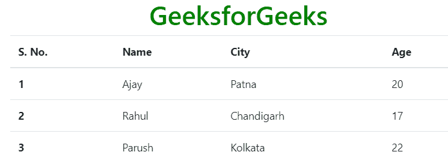

**扒排:***。表剥离*类用于创建交替的暗行和亮行。使用<表>标签中的表和表剥离类的组合来创建剥离表。
**语法:**

```html
<table class="table table-stripped"> Table Contents... <table>
```

**示例:**

## 超文本标记语言

```html
<!DOCTYPE html>
<html lang="en">
<head>
    <title>Bootstrap Tables</title>

    <meta charset="utf-8">
    <meta name="viewport" content="width=device-width, initial-scale=1">

    <link rel="stylesheet" href=
"https://maxcdn.bootstrapcdn.com/bootstrap/4.3.1/css/bootstrap.min.css">

    <script src=
"https://ajax.googleapis.com/ajax/libs/jquery/3.3.1/jquery.min.js">
    </script>

    <script src=
"https://cdnjs.cloudflare.com/ajax/libs/popper.js/1.14.7/umd/popper.min.js">
    </script>

    <script src=
"https://maxcdn.bootstrapcdn.com/bootstrap/4.3.1/js/bootstrap.min.js">
    </script>
</head>

<body>
    <div class="container">

        <h1 style="text-align:center;color:green;">
            GeeksforGeeks
        </h1>

        <!-- Bootstrap table and table-stripped classes -->
        <table class="table table-stripped">
            <thead>
                <tr>
                    <th scope="col">S. No.</td>
                    <th scope="col">Name</td>
                    <th scope="col">City</td>
                    <th scope="col">Age</td>
                </tr>
            </thead>

            <tbody>
                <tr>
                    <th scope="row">1</td>
                    <td>Ajay</td>
                    <td>Patna</td>
                    <td>20</td>
                </tr>
                <tr>
                    <th scope="row">2</td>
                    <td>Rahul</td>
                    <td>Chandigarh</td>
                    <td>17</td>
                </tr>
                <tr>
                    <th scope="row">3</td>
                    <td>Parush</td>
                    <td>Kolkata</td>
                    <td>22</td>
                </tr>
            </tbody>
        </table>
    </div>
</body>

</html>
```

**输出:**

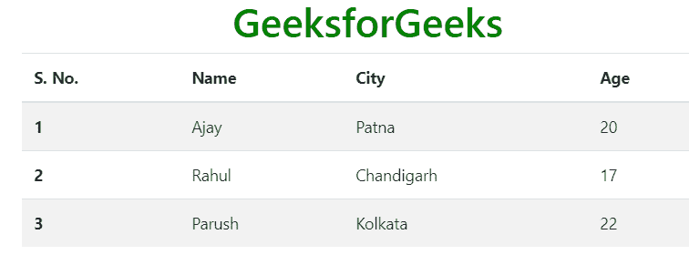

**带边框的桌子:***。表格边框*类用于在表格和单元格的所有边上添加边框。使用<表格>标签中表格和表格边框类的组合来创建边框表格。
**语法:**

```html
<table class="table table-bordered"> Table Contents... <table>
```

**示例:**

## 超文本标记语言

```html
<!DOCTYPE html>
<html lang="en">
<head>
    <title>Bootstrap Tables</title>

    <meta charset="utf-8">
    <meta name="viewport" content="width=device-width, initial-scale=1">

    <link rel="stylesheet" href=
"https://maxcdn.bootstrapcdn.com/bootstrap/4.3.1/css/bootstrap.min.css">

    <script src=
"https://ajax.googleapis.com/ajax/libs/jquery/3.3.1/jquery.min.js">
    </script>

    <script src=
"https://cdnjs.cloudflare.com/ajax/libs/popper.js/1.14.7/umd/popper.min.js">
    </script>

    <script src=
"https://maxcdn.bootstrapcdn.com/bootstrap/4.3.1/js/bootstrap.min.js">
    </script>
</head>

<body>
    <div class="container">

        <h1 style="text-align:center;color:green;">
            GeeksforGeeks
        </h1>

        <!-- Bootstrap table and table-bordered classes -->
        <table class="table table-bordered">
            <thead>
                <tr>
                    <th scope="col">S. No.</td>
                    <th scope="col">Name</td>
                    <th scope="col">City</td>
                    <th scope="col">Age</td>
                </tr>
            </thead>

            <tbody>
                <tr>
                    <th scope="row">1</td>
                    <td>Ajay</td>
                    <td>Patna</td>
                    <td>20</td>
                </tr>
                <tr>
                    <th scope="row">2</td>
                    <td>Rahul</td>
                    <td>Chandigarh</td>
                    <td>17</td>
                </tr>
                <tr>
                    <th scope="row">3</td>
                    <td>Parush</td>
                    <td>Kolkata</td>
                    <td>22</td>
                </tr>
            </tbody>
        </table>
    </div>
</body>

</html>
```

**输出:**

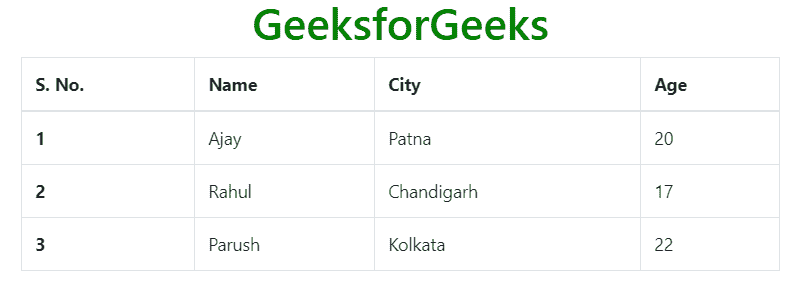

**悬停行表:***。table-hover* 类用于在表格行上添加悬停效果(鼠标移动到上方时背景颜色变为灰色)。使用<表格>标签中表格和表格悬停类的组合来创建悬停行表格。
**语法:**

```html
<table class="table table-hover"> Table Contents... <table>
```

**示例:**

## 超文本标记语言

```html
<!DOCTYPE html>
<html lang="en">
<head>
    <title>Bootstrap Tables</title>

    <meta charset="utf-8">
    <meta name="viewport" content="width=device-width, initial-scale=1">

    <link rel="stylesheet" href=
"https://maxcdn.bootstrapcdn.com/bootstrap/4.3.1/css/bootstrap.min.css">

    <script src=
"https://ajax.googleapis.com/ajax/libs/jquery/3.3.1/jquery.min.js">
    </script>

    <script src=
"https://cdnjs.cloudflare.com/ajax/libs/popper.js/1.14.7/umd/popper.min.js">
    </script>

    <script src=
"https://maxcdn.bootstrapcdn.com/bootstrap/4.3.1/js/bootstrap.min.js">
    </script>
</head>

<body>
    <div class="container">

        <h1 style="text-align:center;color:green;">
            GeeksforGeeks
        </h1>

        <!-- Bootstrap table and table-hover classes -->
        <table class="table table-hover">
            <thead>
                <tr>
                    <th scope="col">S. No.</td>
                    <th scope="col">Name</td>
                    <th scope="col">City</td>
                    <th scope="col">Age</td>
                </tr>
            </thead>

            <tbody>
                <tr>
                    <th scope="row">1</td>
                    <td>Ajay</td>
                    <td>Patna</td>
                    <td>20</td>
                </tr>
                <tr>
                    <th scope="row">2</td>
                    <td>Rahul</td>
                    <td>Chandigarh</td>
                    <td>17</td>
                </tr>
                <tr>
                    <th scope="row">3</td>
                    <td>Parush</td>
                    <td>Kolkata</td>
                    <td>22</td>
                </tr>
            </tbody>
        </table>
    </div>
</body>

</html>                   
```

**输出:**

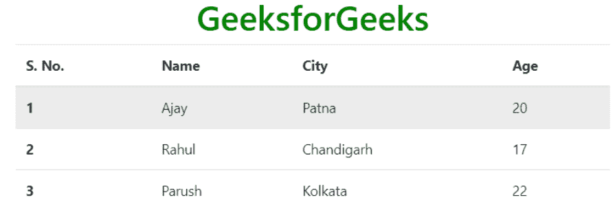

**黑/暗桌:***。表格-深色*类用于添加表格的黑色背景颜色。使用<表>标签中的表和表暗类的组合来创建暗表。
**语法:**

```html
<table class="table table-dark"> Table Contents... <table>
```

**示例:**

## 超文本标记语言

```html
<!DOCTYPE html>
<html lang="en">
<head>
    <title>Bootstrap Tables</title>

    <meta charset="utf-8">
    <meta name="viewport" content="width=device-width, initial-scale=1">

    <link rel="stylesheet" href=
"https://maxcdn.bootstrapcdn.com/bootstrap/4.3.1/css/bootstrap.min.css">

    <script src=
"https://ajax.googleapis.com/ajax/libs/jquery/3.3.1/jquery.min.js">
    </script>

    <script src=
"https://cdnjs.cloudflare.com/ajax/libs/popper.js/1.14.7/umd/popper.min.js">
    </script>

    <script src=
"https://maxcdn.bootstrapcdn.com/bootstrap/4.3.1/js/bootstrap.min.js">
    </script>
</head>

<body>
    <div class="container">

        <h1 style="text-align:center;color:green;">
            GeeksforGeeks
        </h1>

        <!-- Bootstrap table and table-dark classes -->
        <table class="table table-dark">
            <thead>
                <tr>
                    <th scope="col">S. No.</td>
                    <th scope="col">Name</td>
                    <th scope="col">City</td>
                    <th scope="col">Age</td>
                </tr>
            </thead>

            <tbody>
                <tr>
                    <th scope="row">1</td>
                    <td>Ajay</td>
                    <td>Patna</td>
                    <td>20</td>
                </tr>
                <tr>
                    <th scope="row">2</td>
                    <td>Rahul</td>
                    <td>Chandigarh</td>
                    <td>17</td>
                </tr>
                <tr>
                    <th scope="row">3</td>
                    <td>Parush</td>
                    <td>Kolkata</td>
                    <td>22</td>
                </tr>
            </tbody>
        </table>
    </div>
</body>

</html>                   
```

**输出:**

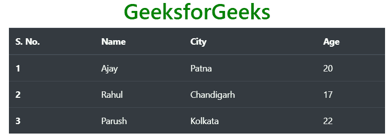

**暗扒桌:***。暗台*和*。表剥离*类用于创建暗剥离表。使用<表>标签中的表、表暗和表剥离类的组合来创建暗剥离表。
**语法:**

```html
<table class="table table-dark table-stripped"> Table Contents... <table>
```

**示例:**

## 超文本标记语言

```html
<!DOCTYPE html>
<html lang="en">
<head>
    <title>Bootstrap Tables</title>

    <meta charset="utf-8">
    <meta name="viewport" content="width=device-width, initial-scale=1">

    <link rel="stylesheet" href=
"https://maxcdn.bootstrapcdn.com/bootstrap/4.3.1/css/bootstrap.min.css">

    <script src=
"https://ajax.googleapis.com/ajax/libs/jquery/3.3.1/jquery.min.js">
    </script>

    <script src=
"https://cdnjs.cloudflare.com/ajax/libs/popper.js/1.14.7/umd/popper.min.js">
    </script>

    <script src=
"https://maxcdn.bootstrapcdn.com/bootstrap/4.3.1/js/bootstrap.min.js">
    </script>
</head>

<body>
    <div class="container">

        <h1 style="text-align:center;color:green;">
            GeeksforGeeks
        </h1>

        <!-- Bootstrap table and table-dark and table-stripped classes -->
        <table class="table table-dark table-stripped">
            <thead>
                <tr>
                    <th scope="col">S. No.</td>
                    <th scope="col">Name</td>
                    <th scope="col">City</td>
                    <th scope="col">Age</td>
                </tr>
            </thead>

            <tbody>
                <tr>
                    <th scope="row">1</td>
                    <td>Ajay</td>
                    <td>Patna</td>
                    <td>20</td>
                </tr>
                <tr>
                    <th scope="row">2</td>
                    <td>Rahul</td>
                    <td>Chandigarh</td>
                    <td>17</td>
                </tr>
                <tr>
                    <th scope="row">3</td>
                    <td>Parush</td>
                    <td>Kolkata</td>
                    <td>22</td>
                </tr>
            </tbody>
        </table>
    </div>
</body>

</html>                   
```

**输出:**

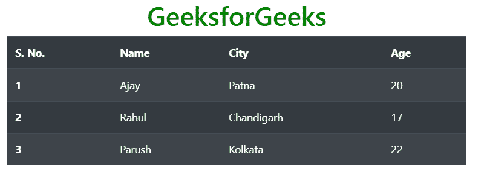

**黑暗悬浮桌:**T2。暗台和*。table-悬停*类用于在表格行上添加悬停效果(当鼠标移动到上方时，将背景颜色更改为深灰色)。使用<表格>标签中表格、表格-深色和表格-悬停类的组合来创建深色悬停效果表格。
**语法:**

```html
<table class="table table-dark table-hover"> Table Contents... <table>
```

**示例:**

## 超文本标记语言

```html
<!DOCTYPE html>
<html lang="en">
<head>
    <title>Bootstrap Tables</title>

    <meta charset="utf-8">
    <meta name="viewport" content="width=device-width, initial-scale=1">

    <link rel="stylesheet" href=
"https://maxcdn.bootstrapcdn.com/bootstrap/4.3.1/css/bootstrap.min.css">

    <script src=
"https://ajax.googleapis.com/ajax/libs/jquery/3.3.1/jquery.min.js">
    </script>

    <script src=
"https://cdnjs.cloudflare.com/ajax/libs/popper.js/1.14.7/umd/popper.min.js">
    </script>

    <script src=
"https://maxcdn.bootstrapcdn.com/bootstrap/4.3.1/js/bootstrap.min.js">
    </script>
</head>

<body>
    <div class="container">

        <h1 style="text-align:center;color:green;">
            GeeksforGeeks
        </h1>

        <!-- Bootstrap table, table-dark and table-hover classes -->
        <table class="table table-dark table-hover">
            <thead>
                <tr>
                    <th scope="col">S. No.</td>
                    <th scope="col">Name</td>
                    <th scope="col">City</td>
                    <th scope="col">Age</td>
                </tr>
            </thead>

            <tbody>
                <tr>
                    <th scope="row">1</td>
                    <td>Ajay</td>
                    <td>Patna</td>
                    <td>20</td>
                </tr>
                <tr>
                    <th scope="row">2</td>
                    <td>Rahul</td>
                    <td>Chandigarh</td>
                    <td>17</td>
                </tr>
                <tr>
                    <th scope="row">3</td>
                    <td>Parush</td>
                    <td>Kolkata</td>
                    <td>22</td>
                </tr>
            </tbody>
        </table>
    </div>
</body>

</html>                   
```

**输出:**

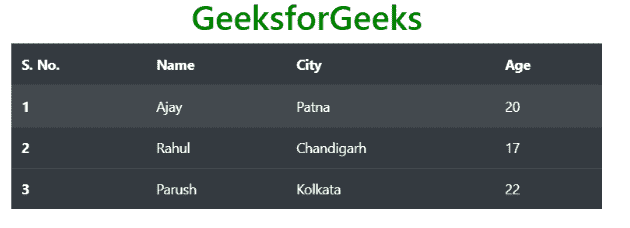

**无边界表:***。表格-无边框*用于从表格中移除边框。使用<表格>标签中表格和无表格边界类的组合来创建无边界表格。
**语法:**

```html
<table class="table table-borderless"> Table Contents... <table>
```

**示例:**

## 超文本标记语言

```html
<!DOCTYPE html>
<html lang="en">
<head>
    <title>Bootstrap Tables</title>

    <meta charset="utf-8">
    <meta name="viewport" content="width=device-width, initial-scale=1">

    <link rel="stylesheet" href=
"https://maxcdn.bootstrapcdn.com/bootstrap/4.3.1/css/bootstrap.min.css">

    <script src=
"https://ajax.googleapis.com/ajax/libs/jquery/3.3.1/jquery.min.js">
    </script>

    <script src=
"https://cdnjs.cloudflare.com/ajax/libs/popper.js/1.14.7/umd/popper.min.js">
    </script>

    <script src=
"https://maxcdn.bootstrapcdn.com/bootstrap/4.3.1/js/bootstrap.min.js">
    </script>
</head>

<body>
    <div class="container">

        <h1 style="text-align:center;color:green;">
            GeeksforGeeks
        </h1>

        <!-- Bootstrap table, table-borderless classes -->
        <table class="table table-borderless">
            <thead>
                <tr>
                    <th scope="col">S. No.</td>
                    <th scope="col">Name</td>
                    <th scope="col">City</td>
                    <th scope="col">Age</td>
                </tr>
            </thead>

            <tbody>
                <tr>
                    <th scope="row">1</td>
                    <td>Ajay</td>
                    <td>Patna</td>
                    <td>20</td>
                </tr>
                <tr>
                    <th scope="row">2</td>
                    <td>Rahul</td>
                    <td>Chandigarh</td>
                    <td>17</td>
                </tr>
                <tr>
                    <th scope="row">3</td>
                    <td>Parush</td>
                    <td>Kolkata</td>
                    <td>22</td>
                </tr>
            </tbody>
        </table>
    </div>
</body>

</html>                   
```

**输出:**

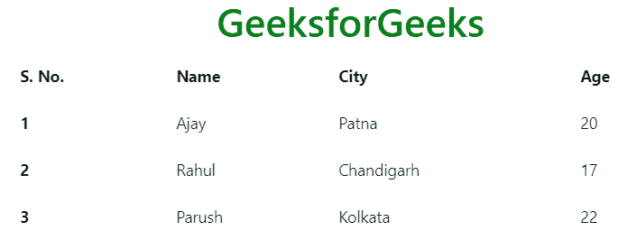

**彩色表格:** Bootstrap 提供了许多上下文类，可用于给表格的整行或单个单元格着色。这些类应该与浅色桌子一起使用，而不是与深色桌子一起使用，以获得更好的外观。上下文类列表如下所示。

<figure class="table">

| Table-primary | Table-secondary | Table-Success |
| Table-Danger | Table-Warning | Table-information |
| Table-Bright | Table-Dark | Table-Active |

</figure>

**示例:**

## 超文本标记语言

```html
<!DOCTYPE html>
<html lang="en">
<head>
    <title>Bootstrap Tables</title>

    <meta charset="utf-8">
    <meta name="viewport" content="width=device-width, initial-scale=1">

    <link rel="stylesheet" href=
"https://maxcdn.bootstrapcdn.com/bootstrap/4.3.1/css/bootstrap.min.css">

    <script src=
"https://ajax.googleapis.com/ajax/libs/jquery/3.3.1/jquery.min.js">
    </script>

    <script src=
"https://cdnjs.cloudflare.com/ajax/libs/popper.js/1.14.7/umd/popper.min.js">
    </script>

    <script src=
"https://maxcdn.bootstrapcdn.com/bootstrap/4.3.1/js/bootstrap.min.js">
    </script>
</head>

<body>
    <div class="container">

        <h1 style="text-align:center;color:green;">
            GeeksforGeeks
        </h1>

        <!-- Bootstrap table class -->
        <table class="table">
            <thead>
                <tr class="table-primary">
                    <th scope="col">S. No.</td>
                    <th scope="col">Name</td>
                    <th scope="col">City</td>
                    <th scope="col">Age</td>
                </tr>
            </thead>

            <tbody>
                <tr class="table-secondary">
                    <th scope="row">1</td>
                    <td>Ajay</td>
                    <td>Patna</td>
                    <td>20</td>
                </tr>
                <tr class="table-success">
                    <th scope="row">2</td>
                    <td>Rahul</td>
                    <td>Chandigarh</td>
                    <td>17</td>
                </tr>
                <tr class="table-danger">
                    <th scope="row">3</td>
                    <td>Parush</td>
                    <td>Kolkata</td>
                    <td>22</td>
                </tr>
            </tbody>
        </table>
    </div>
</body>

</html>                   
```

**输出:**

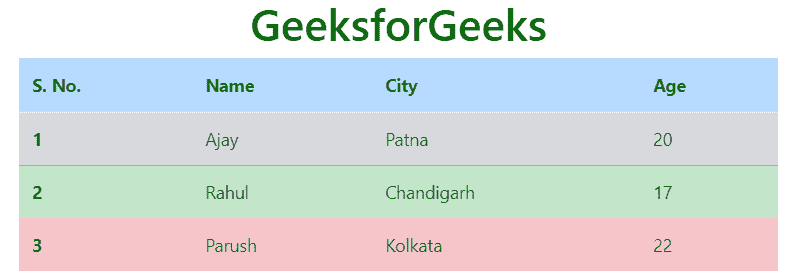

**深色表:**要给深色表上色，Bootstrap 的背景色类将使用。
T3】例:

## 超文本标记语言

```html
<!DOCTYPE html>
<html lang="en">
<head>
    <title>Bootstrap Tables</title>

    <meta charset="utf-8">
    <meta name="viewport" content="width=device-width, initial-scale=1">

    <link rel="stylesheet" href=
"https://maxcdn.bootstrapcdn.com/bootstrap/4.3.1/css/bootstrap.min.css">

    <script src=
"https://ajax.googleapis.com/ajax/libs/jquery/3.3.1/jquery.min.js">
    </script>

    <script src=
"https://cdnjs.cloudflare.com/ajax/libs/popper.js/1.14.7/umd/popper.min.js">
    </script>

    <script src=
"https://maxcdn.bootstrapcdn.com/bootstrap/4.3.1/js/bootstrap.min.js">
    </script>
</head>

<body>
    <div class="container">

        <h1 style="text-align:center;color:green;">
            GeeksforGeeks
        </h1>

        <!-- Bootstrap table and table-dark classes -->
        <table class="table table-dark">
            <thead>
                <tr>
                    <th scope="col">S. No.</td>
                    <th scope="col">Name</td>
                    <th scope="col">City</td>
                    <th scope="col">Age</td>
                </tr>
            </thead>

            <tbody>
                <tr class="bg-secondary">
                    <th scope="row">1</td>
                    <td>Ajay</td>
                    <td>Patna</td>
                    <td>20</td>
                </tr>
                <tr class="bg-success">
                    <th scope="row">2</td>
                    <td>Rahul</td>
                    <td>Chandigarh</td>
                    <td>17</td>
                </tr>
                <tr class="bg-danger">
                    <th scope="row">3</td>
                    <td>Parush</td>
                    <td>Kolkata</td>
                    <td>22</td>
                </tr>
            </tbody>
        </table>
    </div>
</body>

</html>                   
```

**输出:**

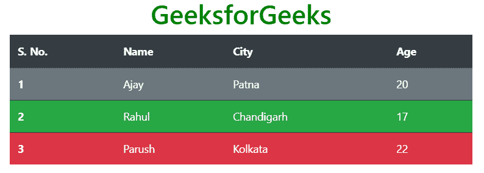

**小桌子:***。table-sm* 类用于通过减少单元格填充来创建小表格。使用<表格>标签中表格、表格边框和表格 sm 类的组合来创建一个有边框的小表格。
**语法:**

```html
<table class="table table-bordered table-sm"> Table Contents... <table>
```

**示例:**

## 超文本标记语言

```html
<!DOCTYPE html>
<html lang="en">
<head>
    <title>Bootstrap Tables</title>

    <meta charset="utf-8">
    <meta name="viewport" content="width=device-width, initial-scale=1">

    <link rel="stylesheet" href=
"https://maxcdn.bootstrapcdn.com/bootstrap/4.3.1/css/bootstrap.min.css">

    <script src=
"https://ajax.googleapis.com/ajax/libs/jquery/3.3.1/jquery.min.js">
    </script>

    <script src=
"https://cdnjs.cloudflare.com/ajax/libs/popper.js/1.14.7/umd/popper.min.js">
    </script>

    <script src=
"https://maxcdn.bootstrapcdn.com/bootstrap/4.3.1/js/bootstrap.min.js">
    </script>
</head>

<body>
    <div class="container">

        <h1 style="text-align:center;color:green;">
            GeeksforGeeks
        </h1>

        <!-- Bootstrap table, table-bordered and table-sm classes -->
        <table class="table table-bordered table-sm">
            <thead>
                <tr>
                    <th scope="col">S. No.</td>
                    <th scope="col">Name</td>
                    <th scope="col">City</td>
                    <th scope="col">Age</td>
                </tr>
            </thead>

            <tbody>
                <tr>
                    <th scope="row">1</td>
                    <td>Ajay</td>
                    <td>Patna</td>
                    <td>20</td>
                </tr>
                <tr>
                    <th scope="row">2</td>
                    <td>Rahul</td>
                    <td>Chandigarh</td>
                    <td>17</td>
                </tr>
                <tr>
                    <th scope="row">3</td>
                    <td>Parush</td>
                    <td>Kolkata</td>
                    <td>22</td>
                </tr>
            </tbody>
        </table>
    </div>
</body>

</html>                   
```

**输出:**

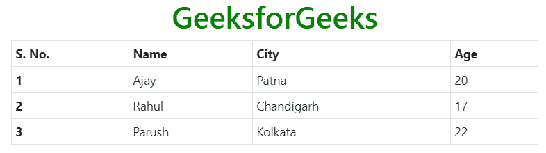

**响应表:**的。表响应类用于创建响应表。要使表格对所有视口大小都有响应，请将表格包装在一个打开和关闭的< div >标签中，在打开的< div >标签中包含类表格响应。同样，要根据视口大小使表格响应，请使用类表格响应{-sm|-md|-lg|-xl}。
在视口特定响应表的情况下，如果视口大小小于类表响应{-sm|-md|-lg|-xl}指定的视口，则该表将变为响应表。响应式表视口大小列表如下:

<figure class="table">T22】表-响应式-MD

| Responsive table class | Screen width |
| --- | --- |
| Table-Response -sm | < 576 像素 |
| < 768 像素 |
| Table-Response -LGG |

</figure>

**语法:**

```html
<div class="table-responsive"> Table <div>
```

**示例:**

## 超文本标记语言

```html
<!DOCTYPE html>
<html lang="en">
<head>
    <title>Bootstrap Tables</title>

    <meta charset="utf-8">
    <meta name="viewport" content="width=device-width, initial-scale=1">

    <link rel="stylesheet" href=
"https://maxcdn.bootstrapcdn.com/bootstrap/4.3.1/css/bootstrap.min.css">

    <script src=
"https://ajax.googleapis.com/ajax/libs/jquery/3.3.1/jquery.min.js">
    </script>

    <script src=
"https://cdnjs.cloudflare.com/ajax/libs/popper.js/1.14.7/umd/popper.min.js">
    </script>

    <script src=
"https://maxcdn.bootstrapcdn.com/bootstrap/4.3.1/js/bootstrap.min.js">
    </script>
</head>

<body>
    <div class="container">

        <h1 style="text-align:center;color:green;">
            GeeksforGeeks
        </h1>

        <!-- Bootstrap table-responsive class -->
        <div class="table-responsive-xl">

            <!-- Bootstrap table class -->
            <table class="table">
                <thead>
                    <tr>
                        <th scope="col">S. No.</td>
                        <th scope="col">First Name</td>
                        <th scope="col">Last Name</td>
                        <th scope="col">Email</td>
                        <th scope="col">Contect No.</td>
                        <th scope="col">Gender</td>
                        <th scope="col">City</td>
                        <th scope="col">Country</td>
                        <th scope="col">Pin Code</td>
                    </tr>
                </thead>

                <tbody>
                    <tr>
                        <td>1</td>
                        <td>Ajit</td>
                        <td>Singh</td>
                        <td>ajt@gfg.com</td>
                        <td>XXXXXXXXXX</td>
                        <td>Male</td>
                        <td>Noida</td>
                        <td>India</td>
                        <td>201301</td>
                    </tr>
                </tbody>
            </table>
        </div>
    </div>
</body>

</html>                   
```

**输出:**

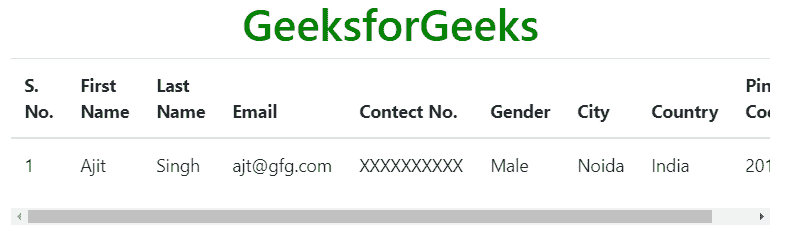

**支持的浏览器:**

*   谷歌 Chrome
*   微软公司出品的 web 浏览器
*   火狐浏览器
*   歌剧
*   旅行队