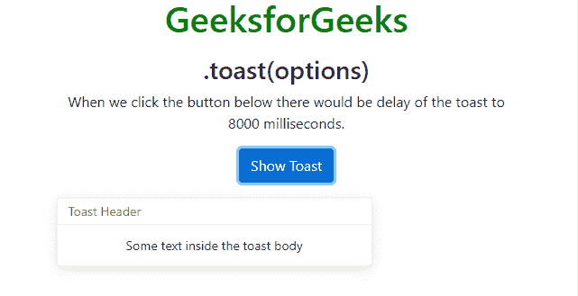

# 自举 4 |吐司

> 原文:[https://www.geeksforgeeks.org/bootstrap-4-toast/](https://www.geeksforgeeks.org/bootstrap-4-toast/)

Toast 用于创建类似于警报框的东西，当有事情发生时，它会显示一小段时间，比如几秒钟。比如当用户点击一个按钮或者提交一个表单和许多其他动作时。

*   **。吐司:**有助于制作吐司
*   **。吐司标题:**它有助于创建吐司标题
*   **。吐司体:**它有助于创造吐司体

**敬酒方法:**

*   **。吐司(选项):**用选项参数激活吐司有帮助。在下面的实现中，我们移除了吐司的渐变效果，并且当吐司显示时，我们将它的隐藏延迟到 8000 毫秒。它有三个选项动画，自动隐藏，延迟。有关这些选项的更多信息，请参考[链接](https://www.geeksforgeeks.org/bootstrap-tooltips/)。
    **例:**

## 超文本标记语言

```html
<!DOCTYPE html>
<html lang="en">

<head>
    <title>Bootstrap Example</title>
    <meta charset="utf-8">
    <meta name="viewport" content="width=device-width, initial-scale=1">
    <link rel="stylesheet" href=
"https://maxcdn.bootstrapcdn.com/bootstrap/4.3.1/css/bootstrap.min.css">
    <script src=
"https://ajax.googleapis.com/ajax/libs/jquery/3.4.0/jquery.min.js">
    </script>
    <script src=
"https://cdnjs.cloudflare.com/ajax/libs/popper.js/1.14.7/umd/popper.min.js">
    </script>
    <script src=
"https://maxcdn.bootstrapcdn.com/bootstrap/4.3.1/js/bootstrap.min.js">
    </script>
</head>

<body style="text-align: center">
    <h1 style="color:green">GeeksforGeeks</h1>
    <div class="container mt-3">
        <h3>.toast(options)</h3>

<p>When we click the button below there
          would be delay of the toast to 8000
          milliseconds.</p>

        <button type="button"
                class="btn btn-primary"
                id="myBtn">Show Toast</button>

        <div class="toast mt-3">
            <div class="toast-header">
                Toast Header
            </div>
            <div class="toast-body">
                Some text inside the toast body
            </div>
        </div>
    </div>

    <script>
        $(document).ready(function() {
            $('#myBtn').click(function() {
                $('.toast').toast({
                    animation: false,
                    delay: 2000
                });
                $('.toast').toast('show');
            });
        });
    </script>

</body>

</html>
```

*   **输出:**



*   **。吐司(“显示”):**显示吐司
*   **。吐司(“隐藏”):**它隐藏吐司
*   **。吐司(“处理”):**它处理吐司

**土司事件:**
**例:**

## 超文本标记语言

```html
<!DOCTYPE html>
<html lang="en">

<head>
    <title>Bootstrap Example</title>
    <meta charset="utf-8">
    <meta name="viewport" content="width=device-width, initial-scale=1">
    <link rel="stylesheet" href=
"https://maxcdn.bootstrapcdn.com/bootstrap/4.3.1/css/bootstrap.min.css">
    <script src=
"https://ajax.googleapis.com/ajax/libs/jquery/3.4.0/jquery.min.js">
  </script>
    <script src=
"https://cdnjs.cloudflare.com/ajax/libs/popper.js/1.14.7/umd/popper.min.js">
  </script>
    <script src=
"https://maxcdn.bootstrapcdn.com/bootstrap/4.3.1/js/bootstrap.min.js">
  </script>
</head>

<body style="text-align:center">
    <h1 style="color:green">GeeksforGeeks</h1>
    <div class="container mt-3">
        <h3>Toast Events</h3>
        <strong>show.bs.toast, </strong>
        <strong>shown.bs.toast, </strong>
        <strong>hide.bs.toast, </strong>
        <strong>hidden.bs.toast </strong>

<p>Click on the button below to perform toast.</p>

        <button type="button"
                class="btn btn-primary"
                id="myShowBtn">
          Show Toast
      </button>

        <div class="toast mt-3">
            <div class="toast-header">
                Toast Header
            </div>
            <div class="toast-body">
                Some text inside the toast body
            </div>
        </div>
    </div>

    <script>
        $(document).ready(function() {
            $("#myShowBtn").click(function() {
                $('.toast').toast('show');
            });

            $('.toast').on('show.bs.toast', function() {
                alert('The toast is about to be shown.');
            });
            $('.toast').on('shown.bs.toast', function() {
                alert('The toast is now fully shown.');
            });
            $('.toast').on('hide.bs.toast', function() {
                alert('The toast is about to be hidden.');
            });
            $('.toast').on('hidden.bs.toast', function() {
                alert('The toast is now hidden.');
            });
        });
    </script>

</body>

</html>
```

**输出:**


**show.bs.toast :** 它发生在吐司即将展示的时候。


**显示的吐司:**当吐司显示时就会出现。


**hide.bs.toast :** 吐司即将隐藏时发生。


**hidden.bs.toast :** 当吐司完全隐藏时就会发生。


**支持的浏览器:**

*   谷歌 Chrome
*   微软公司出品的 web 浏览器
*   火狐浏览器
*   歌剧
*   旅行队