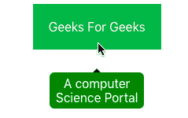
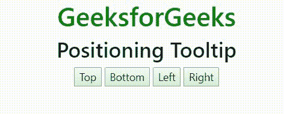

# 引导 4 |工具提示

> 原文:[https://www.geeksforgeeks.org/bootstrap-4-tooltip/](https://www.geeksforgeeks.org/bootstrap-4-tooltip/)

工具提示用于在鼠标指针移动时向用户提供关于元素的交互式文本提示。例如，在下图中，GeeksForGeeks 是一个按钮，当用户鼠标在上面移动时，将显示“计算机科学门户”的附加信息。工具提示对于显示网页中不同元素的描述非常有用。



**创建工具提示:**数据-toggle=“工具提示”属性用于创建工具提示。title 属性用于指定应该在工具提示中显示的文本。
**例:**

## 超文本标记语言

```
<!DOCTYPE html>
<html lang="en">
<head>
    <title>Tooltip</title>

    <meta charset="utf-8">
    <meta name="viewport" content="width=device-width, initial-scale=1">

    <link rel="stylesheet" href=
"https://maxcdn.bootstrapcdn.com/bootstrap/4.3.1/css/bootstrap.min.css">

    <script src=
"https://ajax.googleapis.com/ajax/libs/jquery/3.3.1/jquery.min.js">
    </script>

    <script src=
"https://cdnjs.cloudflare.com/ajax/libs/popper.js/1.14.7/umd/popper.min.js">
    </script>

    <script src=
"https://maxcdn.bootstrapcdn.com/bootstrap/4.3.1/js/bootstrap.min.js">
    </script>
</head>

<body style="text-align:center;">

    <div class="container">

        <h1 style="color:green;" data-toggle="tooltip" title="Tooltip">
            GeeksforGeeks
        </h1>
    </div>

    <script>
        $(document).ready(function() {
            $('[data-toggle="tooltip"]').tooltip();  
        });
    </script>
</body>

</html>                   
```

**输出:**


**定位工具提示:**数据放置属性用于设置工具提示属性的位置。工具提示元素可以显示在元素的顶部、左侧、右侧或底部。
**例:**

## 超文本标记语言

```
<!DOCTYPE html>
<html lang="en">
<head>
    <title>Tooltip</title>

    <meta charset="utf-8">
    <meta name="viewport" content="width=device-width, initial-scale=1">

    <link rel="stylesheet" href=
"https://maxcdn.bootstrapcdn.com/bootstrap/4.3.1/css/bootstrap.min.css">

    <script src=
"https://ajax.googleapis.com/ajax/libs/jquery/3.3.1/jquery.min.js">
    </script>

    <script src=
"https://cdnjs.cloudflare.com/ajax/libs/popper.js/1.14.7/umd/popper.min.js">
    </script>

    <script src=
"https://maxcdn.bootstrapcdn.com/bootstrap/4.3.1/js/bootstrap.min.js">
    </script>
</head>

<body style="text-align:center;">

    <div class="container">

        <h1 style="color:green;">
            GeeksforGeeks
        </h1>

        <h2>Positioning Tooltip</h2>

        <button data-toggle="tooltip" data-placement="top"
                title="Top tooltip">Top</button>

        <button data-toggle="tooltip" data-placement="bottom"
                title="Bottom tooltip">Bottom</button>

        <button data-toggle="tooltip" data-placement="left"
                title="Left tooltip">Left</button>

        <button data-toggle="tooltip" data-placement="right"
                title="Right tooltip">Right</button>
    </div>

    <script>
        $(document).ready(function() {
            $('[data-toggle="tooltip"]').tooltip();  
        });
    </script>
</body>

</html>                   
```

**输出:**



**支持的浏览器:**

*   谷歌 Chrome
*   微软公司出品的 web 浏览器
*   火狐浏览器
*   歌剧
*   旅行队