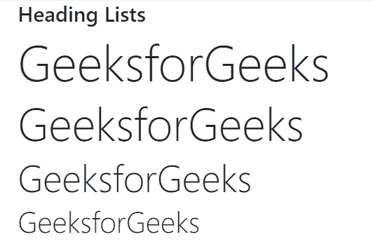

# 引导 4 |排版

> 原文:[https://www.geeksforgeeks.org/bootstrap-4-typography/](https://www.geeksforgeeks.org/bootstrap-4-typography/)

排版是 Bootstrap 的一个特性，用于设置文本内容的样式和格式。它用于创建自定义标题、内嵌副标题、列表、段落、对齐、添加更多面向设计的字体样式等等。引导程序支持字体堆栈、标题和链接样式的全局设置，用于各种类型的操作系统和设备的网络应用程序，以提供最佳的用户界面。
**排版可以用来创建:**

*   标题
*   副标题
*   文本和段落字体颜色、字体类型和对齐方式
*   列表
*   其他内嵌元素

**在引导程序中实现排版功能的标签和类:**

*   **显示标题:**用于创建更好的标题(更大的字体大小和更轻的字体粗细)。显示标题中有四个类别。显示器-1，。显示器-2，。显示器-3 和。显示器-4。
*   **引导:**用于使一个段落突出，即视觉效果更好。
*   **标记:**用于突出文本内容。
*   **初始值设定项:**用于以略小的文本大小渲染缩写。
*   **blockquote:** 用于引用文本内容。
*   **区块报价-页脚:**用于添加页脚详细信息，用于标识报价来源。
*   **文本居中:**用于将文本对齐居中。
*   **列表-内联:**用于使列表的元素内联。
*   **text-truncate:** 用于通过用省略号截断来缩短较长的文本。
*   **文本静音:**用于文本颜色，文本静音淡化文本，即文本变灰。
*   **文字-大写:**用于将文字转换为大写。
*   **文字-小写:**用于将文字转换为小写。
*   **text-大写:**用于将文本转换为每个单词的第一个字母大写，其他字母小写。
*   **。字体粗细加粗:**设置字体粗细为加粗。它用于显示文本的重要性。
*   **。字体粗细加粗:**设置字体粗细为深加粗。它用于显示文本的重要性。
*   **。字体-斜体:**将字体样式设置为斜体。
*   **。字体-粗细-轻:**它将字体粗细设置为轻。
*   **。字体-重量-较轻:**设置较轻的字体重量。
*   **。字体-粗细-正常:**设置正常字体大小和粗细。
*   **。导语:**它让段落脱颖而出。
*   **。小:**用于创建二级副标题。
*   **。text-left:** 设置文本的左对齐方式。
*   **。text-*-left:** 它设置所有屏幕上文本的左对齐方式(小、中、大或 xlarge)。
*   **。text-break:** 它将长字符串文本拆分为短文本子字符串。

**示例 1:** 本示例使用标题类显示标题。

## 超文本标记语言

```html
<!DOCTYPE html>
<html lang="en">

<head>
    <title>
        Bootstrap Typography example
    </title>

    <meta charset="utf-8">

    <meta name="viewport"
        content="width=device-width, initial-scale=1">

    <link rel="stylesheet" href=
"https://maxcdn.bootstrapcdn.com/bootstrap/4.3.1/css/bootstrap.min.css">
    <script src=
"https://ajax.googleapis.com/ajax/libs/jquery/3.3.1/jquery.min.js">
    </script>
    <script src=
"https://cdnjs.cloudflare.com/ajax/libs/popper.js/1.14.7/umd/popper.min.js">
    </script>
    <script src=
"https://maxcdn.bootstrapcdn.com/bootstrap/4.3.1/js/bootstrap.min.js">
    </script>
</head>

<body>
    <div class="container">
        <h1>Heading Lists</h1>
        <h1 class="display-1">GeeksforGeeks</h1>
        <h1 class="display-2">GeeksforGeeks</h1>
        <h1 class="display-3">GeeksforGeeks</h1>
        <h1 class="display-4">GeeksforGeeks</h1>
    </div>

</body>
</html>
```

**输出:**



**示例 2:** 本示例使用<标记>标签来显示文本的重要性。

## 超文本标记语言

```html
<!DOCTYPE html>
<html lang="en">

<head>
    <title>
        Bootstrap Typography example
    </title>

    <meta charset="utf-8">

    <meta name="viewport"
        content="width=device-width, initial-scale=1">

    <link rel="stylesheet" href=
"https://maxcdn.bootstrapcdn.com/bootstrap/4.3.1/css/bootstrap.min.css">
    <script src=
"https://ajax.googleapis.com/ajax/libs/jquery/3.3.1/jquery.min.js">
    </script>
    <script src=
"https://cdnjs.cloudflare.com/ajax/libs/popper.js/1.14.7/umd/popper.min.js">
    </script>
    <script src=
"https://maxcdn.bootstrapcdn.com/bootstrap/4.3.1/js/bootstrap.min.js">
    </script>
</head>

<body>
    <div class="container">
        <h1>GeeksforGeeks</h1>   

<p>A <mark>computer science</mark> portal for geeks</p>

    </div>
</body>
</html>
```

**输出:**


**支持的浏览器:**

*   谷歌 Chrome
*   微软公司出品的 web 浏览器
*   火狐浏览器
*   歌剧
*   旅行队