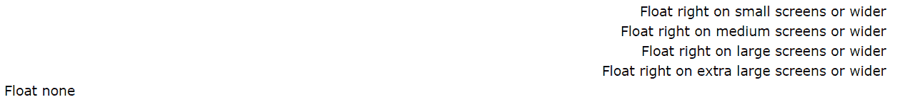

# 引导程序 4 |实用程序

> 原文:[https://www.geeksforgeeks.org/bootstrap-4-utilities/](https://www.geeksforgeeks.org/bootstrap-4-utilities/)

对于不熟悉这个术语的人来说， **Bootstrap 4** 是一个免费的前端框架，用于更快、更容易的网络开发。
Bootstrap 包括基于 **[HTML](https://www.geeksforgeeks.org/html-tutorials/)** 和 **[CSS](https://www.geeksforgeeks.org/css-tutorials/)** 的设计模板，用于*排版*、*表单*、*按钮*、*表格*、*导航*、 *modals* 、*图像转盘*和许多其他模板，以及可选的 **JavaScript**

Bootstrap 还让您能够轻松创建响应性设计。

**用于布局的实用程序:**
为了更快的移动友好和响应性开发，Bootstrap 4 包括几十个用于显示、隐藏、对齐和间隔内容的实用程序类。所有这些都进行了分类，并列举了以下示例:

*   **颜色:**
    *   They are used to convey meaning through colors with a handful of color utility classes. Bootstrap 4 includes support for styling links with hover states (state when you move cursor over item) too.
        **Example 1:**

        ```
        <!DOCTYPE html>
        <html lang="en">

        <head>
            <link rel="stylesheet"
                  href=
        "https://maxcdn.bootstrapcdn.com/bootstrap/4.3.1/css/bootstrap.min.css">
        </head>

        <body>

            <div class="container">
                <p class="text-primary">.text-primary</p>
                <p class="text-secondary">.text-secondary</p>
                <p class="text-success">.text-success</p>
                <p class="text-danger">.text-danger</p>
                <p class="text-warning">.text-warning</p>
                <p class="text-info">.text-info</p>
                <p class="text-light bg-dark">.text-light</p>
                <p class="text-dark">.text-dark</p>
                <p class="text-muted">.text-muted</p>
                <p class="text-white bg-dark">.text-white</p>
            </div>

        </body>

        </html>
        ```

        **输出:**
        

    *   上下文文本类也可以用于链接，这将增加一个更深的悬停颜色。
        **例 2:**

```
<!DOCTYPE html>
<html lang="en">

<head>
    <link rel="stylesheet"
          href=
"https://maxcdn.bootstrapcdn.com/bootstrap/4.3.1/css/bootstrap.min.css">
</head>

<body>

    <div class="container">
        <h2>Contextual Link Colors</h2>
        <p>Hover over the links.</p>
        <a href="#" class="text-muted">
          Muted link.
      </a>
        <a href="#" class="text-primary">
          Primary link.
      </a>
        <a href="#" class="text-success">
          Success link.
      </a>
        <a href="#" class="text-info">
          Info link.
      </a>
        <a href="#" class="text-warning">
          Warning link.
      </a>
        <a href="#" class="text-danger">
          Danger link.
      </a>
        <a href="#" class="text-secondary">
          Secondary link.
      </a>
        <a href="#" class="text-dark">
          Dark grey link.
      </a>
        <a href="#" class="text-body">
          Body/black link.
      </a>
        <a href="#" class="text-light">
          Light grey link.
      </a>
    </div>

</body>

</html>
```

**输出:**


*   Here, when we hover above the text (links) in the code above, a darker color appears.
    We can also add 50% opacity for black or white text with the *.text-black-50* or *.text-white-50* classes, as shown below:
    **Example 3:**

    ```
    <!DOCTYPE html>
    <html lang="en">

    <head>
        <link rel="stylesheet"
              href=
    "https://maxcdn.bootstrapcdn.com/bootstrap/4.3.1/css/bootstrap.min.css">
    </head>

    <body>

        <div class="container">
            <p class="text-black-50">
              Black text with 50% opacity on white background
          </p>
            <p class="text-white-50 bg-dark">
              White text with 50% opacity on black background
          </p>
        </div>

    </body>

    </html>
    ```

    **输出:**
    

    *   **Background colours :**
    Similar to the contextual text color classes, we can easily set the background of an element to any contextual class. The classes for background colors are: *.bg-primary*, *.bg-success*, *.bg-info*, *.bg-warning*, *.bg-danger*, *.bg-secondary*, *.bg-dark* and *.bg-light*.

    **注意:**背景色不设置文字颜色，所以在某些情况下你会想要和*一起使用。正文-** 类。

    **示例:**

    ```
    <!DOCTYPE html>
    <html lang="en">

    <head>
        <link rel="stylesheet" 
              href=
    "https://maxcdn.bootstrapcdn.com/bootstrap/4.3.1/css/bootstrap.min.css">
    </head>

    <body>

        <div class="container">
            <p class="bg-primary text-white">
              This text is important.
          </p>
            <p class="bg-success text-white">
              This text indicates success.
          </p>
            <p class="bg-info text-white">
              This text represents some information.
          </p>
            <p class="bg-warning text-white">
              This text represents a warning.
          </p>
            <p class="bg-danger text-white">
              This text represents danger.
          </p>
            <p class="bg-secondary text-white">
              Secondary background color.
          </p>
            <p class="bg-dark text-white">
              Dark grey background color.
          </p>
            <p class="bg-light text-dark">
              Light grey background color.
          </p>
        </div>
    </body>

    </html>
    ```

    **输出:**
    

    *   **边框工具:**
    它们用于添加或移除元素的边框。使用边框工具快速设置元素的边框和边框半径的样式。适用于图像、按钮或任何其他元素。在这里使用*类【T4 边境】。*
    1.  **Additive Borders:** Use to ‘add’ borders.
        **Example:**

        ```
        <!DOCTYPE html>
        <html lang="en">

        <head>
            <link rel="stylesheet" 
                  href=
        "https://maxcdn.bootstrapcdn.com/bootstrap/4.3.1/css/bootstrap.min.css">
            <style>
                .border {
                    display: inline-block;
                    width: 70px;
                    height: 70px;
                    margin: 6px;
                }
            </style>
        </head>

        <body>

            <div class="container">
                <span class="border"></span>
                <span class="border border"></span>
                <span class="border border-top"></span>
                <span class="border border-right"></span>
                <span class="border border-bottom"></span>
                <span class="border border-left"></span>
            </div>
        </body>

        </html>
        ```

        **输出:**
        

        可以看到，所有 4 个边框都被添加到第一个方块中，然后顶部、右侧、底部和左侧的边框被添加到后面的方块中，如上面的代码所示。(边框较轻，仔细观察)

    2.  **减法边框:**用于*【移除】*边框:
        **示例:**

    ```
    <!DOCTYPE html>
    <html lang="en">

    <head>
        <link rel="stylesheet" 
              href=
    "https://maxcdn.bootstrapcdn.com/bootstrap/4.3.1/css/bootstrap.min.css">
        <style>
            .border {
                display: inline-block;
                width: 70px;
                height: 70px;
                margin: 6px;
            }
        </style>
    </head>

    <body>

        <div class="container">
            <span class="border"></span>
            <span class="border border-0"></span>
            <span class="border border-top-0"></span>
            <span class="border border-right-0"></span>
            <span class="border border-bottom-0"></span>
            <span class="border border-left-0"></span>
        </div>

    </body>

    </html>
    ```

    **输出:**
    

    从上面提供的图片中可以再次清楚地看到，所有 4 个边框都从第一个方块中移除，然后顶部、右侧、底部和左侧的边框也从随后的方块中移除(从最初的 4 边带边框的方块中)，如上面的代码所示。(边框是浅色的，仔细观察)
    注意，我们只需在代码中添加一个“-0”(在“边框”之后)，使其减色。

    8.  **Border colour:** Use to give a particular colour to the border.
        **Example:**

        ```
        <!DOCTYPE html>
        <html lang="en">

        <head>
            <link rel="stylesheet" 
                  href=
        "https://maxcdn.bootstrapcdn.com/bootstrap/4.3.1/css/bootstrap.min.css">
            <style>
                .border {
                    display: inline-block;
                    width: 70px;
                    height: 70px;
                    margin: 6px;
                }
            </style>
        </head>

        <body>

            <div class="container">
                <span class="border border-primary">
              </span>
                <span class="border border-secondary">
              </span>
                <span class="border border-success">
              </span>
                <span class="border border-danger">
              </span>
                <span class="border border-warning">
              </span>
                <span class="border border-info">
              </span>
                <span class="border border-light">
              </span>
                <span class="border border-dark">
              </span>
                <span class="border border-white">
              </span>
            </div>

        </body>

        </html>
        ```

        **输出:**
        

        上面的例子很简单，边框颜色通常表示危险，比如红色表示危险，黄色表示警告(如警告街道标志)，绿色表示成功，等等。

    9.  **Border radius:** Use to give a particular radius type: (like being circular edged)
        **Example:**

        ```
        <!DOCTYPE html>
        <html lang="en">

        <head>
            <link rel="stylesheet" 
                  href=
        "https://maxcdn.bootstrapcdn.com/bootstrap/4.3.1/css/bootstrap.min.css">
            <style>
                span {
                    display: inline-block;
                    width: 70px;
                    height: 70px;
                    margin: 6px;
                    background-color: #555;
                }
            </style>
        </head>

        <body>

            <div class="container">
                <span class="rounded-sm">
              </span>
                <span class="rounded">
              </span>
                <span class="rounded-lg">
              </span>
                <span class="rounded-top">
              </span>
                <span class="rounded-right">
              </span>
                <span class="rounded-bottom">
              </span>
                <span class="rounded-left">
              </span>
                <span class="rounded-circle">
              </span>
                <span class="rounded-0">
              </span>
            </div>

        </body>

        </html>
        ```

        **输出:**
        

        在上面的例子中，我们在前三个正方形的所有 4 边上添加了圆角(拐角分别是小的、正常的和大的)，然后只添加了后续正方形的顶部、右侧、底部和左侧，从上面的代码中可以明显看出。然后实现完全圆形边框(不是正方形、圆形)和非圆形边框(正方形、没有圆形边缘)。

        *   **文本:**
    Bootstrap 4 包括用于控制对齐、环绕、粗细等常用文本实用程序的文档和示例。
    1.  **Text Alignment:** For left, right, and center alignment, responsive classes are available that use the same viewport width breakpoints as the grid system.
        **Example:**

        ```
        <!DOCTYPE html>
        <html>

        <head>
            <link rel="stylesheet" 
                  href=
        "https://maxcdn.bootstrapcdn.com/bootstrap/4.3.1/css/bootstrap.min.css">
        </head>

        <body>

            <div class="container">
                <p class="text-left">
                  Left aligned text on all viewport sizes.
              </p>
                <p class="text-center">
                  Center aligned text on all viewport sizes.
              </p>
                <p class="text-right">
                  Right aligned text on all viewport sizes.
              </p>

                <p class="text-sm-left">
                  Left aligned text on viewports sized SM 
                  (small) or wider.
              </p>
                <p class="text-md-left">
                  Left aligned text on viewports sized MD
                  (medium) or wider.
              </p>
                <p class="text-lg-left">
                  Left aligned text on viewports sized LG
                  (large) or wider.
              </p>
                <p class="text-xl-left">
                  Left aligned text on viewports sized XL
                  (extra-large) or wider.
              </p>
            </div>

        </body>

        </html>
        ```

        **输出:**
        

    2.  **Text Transform:** We can transform text in components with text capitalization classes.
        **Example:**

        ```
        <!DOCTYPE html>
        <html>

        <head>
            <link rel="stylesheet" 
                  href=
        "https://maxcdn.bootstrapcdn.com/bootstrap/4.3.1/css/bootstrap.min.css">
        </head>

        <body>

            <div class="container">
                <p class="text-lowercase">Lowercased text.</p>
                <p class="text-uppercase">Uppercased text.</p>
                <p class="text-capitalize">Capitalized text.</p>
            </div>
        </body>

        </html>
        ```

        **输出:**
        

    3.  **Font Weight/Italics:** We can change the weight/boldness of text or italicize text.
        **Example:**

        ```
        <!DOCTYPE html>
        <html lang="en">

        <head>
            <link rel="stylesheet" 
                  href=
        "https://maxcdn.bootstrapcdn.com/bootstrap/4.3.1/css/bootstrap.min.css">
        </head>

        <body>

            <div class="container">
                <h1>Font weight and italics</h1>
                <p class="font-weight-bold">
                  Bold text.
              </p>
                <p class="font-weight-normal">
                  Normal weight text.
              </p>
                <p class="font-weight-light">
                  Light weight text.
              </p>
                <p class="font-italic">
                  Italic text.
              </p>
            </div>
        </body>

        </html>
        ```

        **输出:**
        

        *   **浮动和清除工具:**
    我们可以用*将一个元素向右浮动。与*类似，向右浮动*级或向左浮动。向左浮动*级。
    **示例:**

```
<!DOCTYPE html>
<html lang="en">

<head>
    <link rel="stylesheet" 
          href=
"https://maxcdn.bootstrapcdn.com/bootstrap/4.3.1/css/bootstrap.min.css">
</head>

<body>
    <div class="container">
        <div class="clearfix">
            <span class="float-left">
              Float left
          </span>
            <span class="float-right">
              Float right
          </span>
        </div>
    </div>

</body>

</html>
```

**输出:**

我们可以用清除浮漂。clearfix 类。

1.  **Responsive Floats:**
    We can float an element to the left or to the right depending on screen width, with the responsive float classes (*.float-*-left|right* – where * is sm (>=576px), md (>=768px), lg (>=992px) or xl (>=1200px)). The sizes for these different categories (small, medium, large, extra large) are fixed.

    **示例:**

    ```
    <!DOCTYPE html>
    <html lang="en">

    <head>
        <link rel="stylesheet" 
              href=
    "https://maxcdn.bootstrapcdn.com/bootstrap/4.3.1/css/bootstrap.min.css">
    </head>

    <body>
        <div class="container">
            <div class="clearfix">
                <div class="float-sm-right">
                  Float right on small screens or wider
              </div>
                <br>
                <div class="float-md-right">
                  Float right on medium screens or wider
              </div>
                <br>
                <div class="float-lg-right">
                  Float right on large screens or wider
              </div>
                <br>
                <div class="float-xl-right">
                  Float right on extra large screens or wider
              </div>
                <br>
                <div class="float-none">
                  Float none
              </div>
            </div>
        </div>
    </body>

    </html>
    ```

    **输出:**
    

*   **Position:**
    There are shorthand utilities for quickly configuring the position of an element. Some quick positioning classes are “*position-static*“, “*position-relative*“, “*position-absolute*“, “*position-fixed*” and “*position-sticky*“.

    例如，我们可以使用*。固定顶部*类使任何元素固定/停留在页面顶部。
    同样，*。固定底部*类将一个元素定位在视口的底部，从一边到另一边。
    粘顶会将一个元素从一条边到另一条边放置在视口的顶部，但前提是你要经过它。*。粘顶*实用程序使用了 CSS 的定位:粘性，这并不是所有浏览器都完全支持的。同样，粘性底部对底面也是如此。

    *   **尺寸:**
    Bootstrap 4 使我们能够使用元素的宽度和高度实用程序轻松地使元素与它的父元素一样宽或一样高。
    1.  **Width:** Set the width of an element with the w-* classes (.w-25, .w-50, .w-75, .w-100, .mw-100).
        **Example:**

        ```
        <!DOCTYPE html>
        <html lang="en">

        <head>
            <link rel="stylesheet" 
                  href=
        "https://maxcdn.bootstrapcdn.com/bootstrap/4.3.1/css/bootstrap.min.css">
        </head>

        <body>

            <div class="container">
                <div class="w-25 bg-success">
                  Width 25%
              </div>
                <div class="w-50 bg-success">
                  Width 50%
              </div>
                <div class="w-75 bg-success">
                  Width 75%
              </div>
                <div class="w-100 bg-success">
                  Width 100%
              </div>
                <div class="mw-100 bg-success">
                  Max Width 100%
              </div>
            </div>
        </body>

        </html>
        ```

        **输出:**
        

    2.  **Height:** Set the height of an element with the h-* classes (.h-25, .h-50, .h-75, .h-100, .mh-100).
        **Example:**

        ```
        <!DOCTYPE html>
        <html lang="en">

        <head>
            <link rel="stylesheet" 
                  href=
        "https://maxcdn.bootstrapcdn.com/bootstrap/4.3.1/css/bootstrap.min.css">
        </head>

        <body>

            <div class="container">
                <div style="height:200px;background-color:#ddd">
                    <div class="h-25 d-inline-block p-2 bg-success">
                      Height 25%
                  </div>
                    <div class="h-50 d-inline-block p-2 bg-success">
                      Height 50%
                  </div>
                    <div class="h-75 d-inline-block p-2 bg-success">
                      Height 75%
                  </div>
                    <div class="h-100 d-inline-block p-2 bg-success">
                      Height 100%
                  </div>
                    <div class="mh-100 d-inline-block p-2 bg-success" 
                         style="height:500px">
                      Max Height 100%
                  </div>
                </div>
            </div>
        </body>

        </html>
        ```

        **输出:**
        

        *   **Spacing :**
    Bootstrap 4 has a wide range of responsive margin and padding utility classes. They work for all breakpoints (have no breakpoint abbreviation in them): xs (=576px), md (>=768px), lg (>=992px) or xl (>=1200px)):

    这些类的格式为:xs(超小型)为 **{property}{sides}-{size}** ，sm、md、lg 和 xl 为**{ property } { sides }-{断点}-{size}** 。

    其中属性为:
    **m**–设置边距
    **p**–设置填充
    其中边为:

    **t**–设置边距顶部或填充顶部
    **b**–设置边距底部或填充底部
    **l**–设置边距左侧或填充左侧
    **r**–设置边距右侧或填充右侧
    **x**–设置边距左侧和填充右侧或边距左侧和填充右侧
    **y**–设置填充顶部和填充底部或

    **0**–将边距或填充设置为 0
    **1**–将边距或填充设置为. 25rem(如果字体大小为 16px，则为 4px)
    **2**–将边距或填充设置为. 5rem(如果字体大小为 16px，则为 8px)
    **3**–将边距或填充设置为 1rem(如果字体大小为 16px，则为 16px)
    **4**–设置边距或填充
    **5**–将边距或填充设置为 3rem(如果字号为 16px，则为 48px)
    **auto**–将边距设置为 auto
    **注意:**边距也可以是负数，在字号前面加一个**“n”**。

    **n1**–将边距设置为 *-.25rem* (-4px，如果字号为 16px)
    **N2**–将边距设置为 *-.5rem* (-8px，如果字号为 16px)
    **n3**–将边距设置为 *-1rem* (-16px，如果字号为 16px)
    **n4n**

    **示例:**

    ```
    <!DOCTYPE html>
    <html lang="en">

    <head>
        <link rel="stylesheet" 
              href=
    "https://maxcdn.bootstrapcdn.com/bootstrap/4.3.1/css/bootstrap.min.css">
    </head>

    <body>

        <div class="container">
            <div class="pt-4 bg-info">
              I only have a top padding (1.5rem = 24px)
          </div>
            <div class="p-5 bg-success">
              I have a padding on all sides (3rem = 48px)
          </div>
            <div class="m-5 pb-5 bg-info">
              I have a margin on all sides (3rem = 48px) 
              and a bottom padding (3rem = 48px)
          </div>
        </div>
    </body>

    </html>
    ```

    **输出:**
    

    **更多间距示例:**

    | 。m-# / m-*-# | 四面空白 |
    | .mt-# / mt-*-# | 上边距 |
    | .mb-# / mb-*-# | 边距底部 |
    | 。ml-# / ml-*-# | 左边距 |
    | 。-# /先生-*-# | 右边距 |
    | . mx-# / mx-*- | 左右边距 |
    | 。我的-# /我的-*-# | 上边距和下边距 |

    | 。p-# / p-*-# | 四面都有衬垫 |
    | . pt-# / pt-*- | 填充顶部 |
    | .pb-# / pb-*-# | 填充底部 |
    | 。pl-# / pl-*-# | 左填充 |
    | .pr-# / pr-*-# | 向右填充 |
    | 。py-# / py-*-# | 填充顶部和底部 |
    | 。px-# / px-*-# | 。px-# / px-*-# |

    **阴影:**使用*阴影类*为元素添加阴影。
    **例:**

    ```
    <!DOCTYPE html>
    <html lang="en">

    <head>
        <link rel="stylesheet"
              href=
    "https://maxcdn.bootstrapcdn.com/bootstrap/4.3.1/css/bootstrap.min.css">
    </head>

    <body>

        <div class="container">
            <div class="shadow-none p-4 mb-4 bg-light">
              No shadow
          </div>
            <div class="shadow-sm p-4 mb-4 bg-white">
              Small shadow
          </div>
            <div class="shadow p-4 mb-4 bg-white">
              Default shadow
          </div>
            <div class="shadow-lg p-4 mb-4 bg-white">
              Large shadow
          </div>
        </div>
    </body>

    </html>
    ```

    **输出:**
    

    *   **垂直对齐:**
    Bootstrap 4 使用*对齐类*来更改元素的对齐方式(仅适用于内联、内联块、内联表格和表格单元格元素)。我们可以从*中选择。对齐基线*、*。对齐顶部*、*。对齐-中间*、*。对齐-底部*，*。对齐-文本-底部*和*。根据需要对齐-文本-顶部*。
    **例如:**
    1.  **Vertical Align with inline-elements:**

        ```
        <!DOCTYPE html>
        <html lang="en">

        <head>
            <link rel="stylesheet"
                  href=
        "https://maxcdn.bootstrapcdn.com/bootstrap/4.3.1/css/bootstrap.min.css">
        </head>

        <body>

            <div class="container">
                <span class="align-baseline">
                  baseline
              </span>
                <span class="align-top">
                  top
              </span>
                <span class="align-middle">
                  middle
              </span>
                <span class="align-bottom">
                  bottom
              </span>
                <span class="align-text-top">
                  text-top
              </span>
                <span class="align-text-bottom">
                  text-bottom
              </span>
            </div>
        </body>

        </html>
        ```

        **输出:**
        

    2.  **Vertical Align with table-cells:**

        ```
        <!DOCTYPE html>
        <html lang="en">

        <head>
            <link rel="stylesheet" 
                  href=
        "https://maxcdn.bootstrapcdn.com/bootstrap/4.3.1/css/bootstrap.min.css">
        </head>

        <body>
            <div class="container">
                <table style="height: 100px;">
                    <tbody>
                        <tr>
                            <td class="align-baseline">
                              baseline
                          </td>
                            <td class="align-top">
                              top
                          </td>
                            <td class="align-middle">
                              middle
                          </td>
                            <td class="align-bottom">
                              bottom
                          </td>
                            <td class="align-text-top">
                              text-top
                          </td>
                            <td class="align-text-bottom">
                              text-bottom
                          </td>
                        </tr>
                    </tbody>
                </table>
            </div>
        </body>

        </html>
        ```

        **输出:**
        

        *   **Embeds:**
    Bootstrap 4 enables us to create responsive video or slideshow embeds based on the width of the parent by creating an intrinsic ratio that scales on any device. We simply need to add the *.embed-responsive-item* to any embed elements in a parent element with *.embed-responsive* and an aspect ratio of our choice.
    **Example:**

    ```
    <!DOCTYPE html>
    <html lang="en">

    <head>
        <link rel="stylesheet"
              href=
    "https://maxcdn.bootstrapcdn.com/bootstrap/4.3.1/css/bootstrap.min.css">
    </head>

    <body>

        <div class="container mt-3">
            <p>Create a responsive video 
              and scale it nicely to the parent element.</p>

            <h2>Aspect ratio 1:1</h2>
            <div class="embed-responsive embed-responsive-1by1">
                <iframe class="embed-responsive-item" 
                        src=
    "https://www.youtube.com/embed/MtQL_ll5KhQ">
                </iframe>
            </div>
            <br>

            <h2>Aspect ratio 4:3</h2>
            <div class="embed-responsive embed-responsive-4by3">
                <iframe class="embed-responsive-item"
                        src=
    "https://www.youtube.com/embed/MtQL_ll5KhQ">
                </iframe>
            </div>
            <br>

            <h2>Aspect ratio 16:9</h2>
            <div class="embed-responsive embed-responsive-16by9">
                <iframe class="embed-responsive-item" 
                        src=
    "https://www.youtube.com/embed/MtQL_ll5KhQ">
                </iframe>
            </div>
            <br>

            <h2>Aspect ratio 21:9</h2>
            <div class="embed-responsive embed-responsive-21by9">
                <iframe class="embed-responsive-item"
                        src=
    "https://www.youtube.com/embed/MtQL_ll5KhQ">
                </iframe>
            </div>
        </div>

    </body>

    </html>
    ```

    **输出:**
    

    在上面的代码中，将标签*‘tgbNymZ7vqY’*替换为您想要的 youtube 视频或您选择的视频 URL，以防您想要不同的视频。(或更改其他视频托管/共享网站的完整网址)

    *   **Visibility:**
    We can control the visibility, without modifying the display, of elements with visibility utilities.
    Simply use the *.visible* or *.invisible* classes to control the visibility of elements.
    **Example:**

    ```
    <!DOCTYPE html>
    <html lang="en">

    <head>
        <link rel="stylesheet"
              href=
    "https://maxcdn.bootstrapcdn.com/bootstrap/4.3.1/css/bootstrap.min.css">
    </head>

    <body>
        <div class="container">
            <div class="visible bg-success">
              I am visible
          </div>
            <div class="invisible bg-warning">
              I am invisible
          </div>
        </div>
    </body>

    </html>
    ```

    **输出:**
    

    *   **Close Icon:**
    We can use the *.close* class to style a close icon. This is often used for dismissing alerts and modals.

    **注意:**我们使用 **×** 符号来创建实际的图标(更好看的“x”)。还要注意的是，默认情况下它会向右浮动:
    **示例:**
    (关闭时显示为空白/白色)

    ```
    <!DOCTYPE html>
    <html lang="en">

    <head>
        <link rel="stylesheet" 
              href=
    "https://maxcdn.bootstrapcdn.com/bootstrap/4.3.1/css/bootstrap.min.css">
    </head>

    <body>
        <div class="container">
            <div class="clearfix">
                <button type="button"
                        class="close">
                  ×
              </button>
            </div>
        </div>
    </body>

    </html>
    ```

    **输出:**
    

    *   **Screenreaders:**
    We can use screenreader utility (*.sr-only*) to hide elements on all devices except screen readers.
    **Example:**

    ```
    <!DOCTYPE html>
    <html lang="en">

    <head>
        <link rel="stylesheet" 
              href=
    "https://maxcdn.bootstrapcdn.com/bootstrap/4.3.1/css/bootstrap.min.css">
    </head>

    <body>

        <div class="container mt-3">
            <p>Use the .sr-only class to hide an element on
              all devices, except screen readers:</p>

            <span class="sr-only">
              I will be hidden on all screens
              except for screen readers.</span>
        </div>

    </body>

    </html>
    ```

    **输出:**

    *   **Blocks:**
    To make an element into a block element, add the *.d-block* class. We can use any of the *d-*-block* classes to control **when** the element should be a block element on a specific screen width.
    **Example:**

    ```
    <!DOCTYPE html>
    <html lang="en">

    <head>
        <link rel="stylesheet" 
              href=
    "https://maxcdn.bootstrapcdn.com/bootstrap/4.3.1/css/bootstrap.min.css">
    </head>

    <body>

        <div class="container mt-3">
            <span class="d-block bg-success">
              d-block
          </span>
            <span class="d-sm-block bg-success">
              d-sm-block
          </span>
            <span class="d-md-block bg-success">
              d-md-block
          </span>
            <span class="d-lg-block bg-success">
              d-lg-block
          </span>
            <span class="d-xl-block bg-success">
              d-xl-block
          </span>
        </div>

    </body>

    </html>
    ```

    **输出:**
    

    *   **Flex:**
    Bootstrap 4 通过一整套响应灵敏的 flexbox 实用程序，帮助我们快速管理网格列、导航、组件等的布局、对齐和大小调整。对于更复杂的实现，自定义 CSS 可能是必要的。我们可以用*。flex-** 类使用 flexbox 控制布局。
    1.  **Flex Behaviours:**
        We can apply display utilities to create a flexbox container and transform direct children elements into flex items. Flex containers and items are able to be modified further with additional flex properties.

        **示例:**

        ```
        <!DOCTYPE html>
        <html lang="en">

        <head>
            <link rel="stylesheet" 
                  href=
        "https://maxcdn.bootstrapcdn.com/bootstrap/4.3.1/css/bootstrap.min.css">
        </head>

        <body>
            <div class="container mt-3">
                <div class="d-flex p-2">
                  I'm a flexbox container!
              </div>
                <div class="d-inline-flex p-2">
                  I'm an inline flexbox container!
              </div>
            </div>
        </body>

        </html>
        ```

        **输出:**
        
        

        **方向:**
        我们可以在带有方向工具的 flex 容器中设置 flex 项目的方向。在大多数情况下，您可以省略水平类，因为浏览器默认为一行。但是，您可能会遇到需要显式设置该值的情况(如响应布局)。
        使用*。柔排*设置水平方向(浏览器默认)或*。弯曲-行-反转*从对面开始水平方向。
        **示例:**

        ```
        <!DOCTYPE html>
        <html lang="en">

        <head>
            <link rel="stylesheet"
                  href=
        "https://maxcdn.bootstrapcdn.com/bootstrap/4.3.1/css/bootstrap.min.css">
        </head>

        <body>
            <div class="container mt-3">

                <div class="d-flex flex-row">
                    <div class="p-2">
                      Flex item 1
                  </div>
                    <div class="p-2">
                      Flex item 2
                  </div>
                    <div class="p-2">
                      Flex item 3
                  </div>
                </div>
                <div class="d-flex flex-row-reverse">
                    <div class="p-2">
                      Flex item 1
                  </div>
                    <div class="p-2">
                      Flex item 2
                  </div>
                    <div class="p-2">
                      Flex item 3
                  </div>
                </div>
            </div>

        </body>

        </html>
        ```

        **输出:**
        

    2.  Likewise, we can use *.flex-column* to set a vertical direction, or *.flex-column-reverse* to start the vertical direction from the opposite side.
        **Example:**

        ```
        <!DOCTYPE html>
        <html lang="en">

        <head>
            <link rel="stylesheet" 
                  href=
        "https://maxcdn.bootstrapcdn.com/bootstrap/4.3.1/css/bootstrap.min.css">
        </head>

        <body>

            <div class="container mt-3">
                <div class="d-flex flex-column">
                    <div class="p-2">
                      Flex item 1
                  </div>
                    <div class="p-2">
                      Flex item 2
                  </div>
                    <div class="p-2">
                      Flex item 3
                  </div>
                </div>
                <div class="d-flex flex-column-reverse">
                    <div class="p-2">
                      Flex item 1
                  </div>
                    <div class="p-2">
                      Flex item 2
                  </div>
                    <div class="p-2">
                      Flex item 3
                  </div>
                </div>
            </div>

        </body>

        </html>
        ```

        **输出:**
        

    3.  **Justify:**
        We can use justify-content utilities on flexbox containers to change the alignment of flex items on the main axis (the x-axis to start, y-axis if flex-direction: column). Choose from start (browser default), end, center, between, or around.
        **Examples:**

        ```
        <!DOCTYPE html>
        <html lang="en">

        <head>
            <link rel="stylesheet" 
                  href=
        "https://maxcdn.bootstrapcdn.com/bootstrap/4.3.1/css/bootstrap.min.css">
        </head>

        <body>
            <div class="container mt-3">
                <div class="d-flex justify-content-start bg-secondary mb-3">
                    <div class="p-2 bg-success">
                      Flex item 1
                  </div>
                    <div class="p-2 bg-success">
                      Flex item 2
                  </div>
                    <div class="p-2 bg-success">
                      Flex item 3
                  </div>
                </div>
                <div class="d-flex justify-content-end bg-secondary mb-3">
                    <div class="p-2 bg-success">
                      Flex item 1
                  </div>
                    <div class="p-2 bg-success">
                      Flex item 2
                  </div>
                    <div class="p-2 bg-success">
                      Flex item 3
                  </div>
                </div>
                <div class="d-flex justify-content-center bg-secondary mb-3">
                    <div class="p-2 bg-success">
                      Flex item 1
                  </div>
                    <div class="p-2 bg-success">
                      Flex item 2
                  </div>
                    <div class="p-2 bg-success">
                      Flex item 3
                  </div>
                </div>
                <div class="d-flex justify-content-between bg-secondary mb-3">
                    <div class="p-2 bg-success">
                      Flex item 1
                  </div>
                    <div class="p-2 bg-success">
                      Flex item 2
                  </div>
                    <div class="p-2 bg-success">
                      Flex item 3
                  </div>
                </div>
                <div class="d-flex justify-content-around bg-secondary mb-3">
                    <div class="p-2 bg-success">
                      Flex item 1
                  </div>
                    <div class="p-2 bg-success">
                      Flex item 2
                  </div>
                    <div class="p-2 bg-success">
                      Flex item 3
                  </div>
                </div>
            </div>
        </body>

        </html>
        ```

        **输出:**
        

        **订单:**
        我们还可以用少量的订单实用程序来更改特定 flex 项目的视觉顺序。我们只提供了让一个项目成为第一个或最后一个的选项，以及使用 DOM 顺序的重置。当 order 取任何整数值(例如 5)时，为任何需要的附加值添加自定义 CSS。
        **例:**

        ```
        <!DOCTYPE html>
        <html lang="en">

        <head>
            <link rel="stylesheet" 
                  href=
        "https://maxcdn.bootstrapcdn.com/bootstrap/4.3.1/css/bootstrap.min.css">
        </head>

        <body>
            <div class="container mt-3">
                <div class="d-flex mb-3">
                    <div class="p-2 order-3 bg-success">
                      Flex item 1
                  </div>
                    <div class="p-2 order-2 bg-success">
                      Flex item 2
                  </div>
                    <div class="p-2 order-1 bg-success">
                      Flex item 3
                  </div>
                </div>
            </div>
        </body>

        </html>
        ```

        **输出:**
        

    4.  **Display:**
        Lastly, we can change the value of the display property with our responsive display utility classes. Bootstrap 4 purposely support only a subset of all possible values for display. Classes can be combined for various effects as we need.
        As such, the classes are named using the format:
        *.d-{value}* for xs
        *.d-{breakpoint}-{value}* for sm, md, lg, and xl.

        **其中值为:**之一

        *   没有人
        *   在一条直线上的
        *   内嵌块
        *   街区
        *   桌子
        *   表格单元格
        *   表格行
        *   弯曲
        *   内联 flex

        **示例:**

        ```
        <!DOCTYPE html>
        <html lang="en">

        <head>
            <link rel="stylesheet" 
                  href=
        "https://maxcdn.bootstrapcdn.com/bootstrap/4.3.1/css/bootstrap.min.css">
        </head>

        <body>
            <div class="d-inline p-2 bg-primary text-white">
                d-inline
            </div>
            <div class="d-inline p-2 bg-dark text-white">
                d-inline
            </div>
        </body>

        </html>
        ```

        **输出:**
        

        ```
        <!DOCTYPE html>
        <html lang="en">

        <head>
            <link rel="stylesheet" 
                  href=
        "https://maxcdn.bootstrapcdn.com/bootstrap/4.3.1/css/bootstrap.min.css">
        </head>

        <body>

            <span class="d-block p-2 bg-primary text-white">
              d-block
          </span>
            <span class="d-block p-2 bg-dark text-white">
              d-block
          </span>

        </body>

        </html>
        ```

        **输出:**
        

        此外，要隐藏元素，我们只需使用*。d-none* 级或者*之一。d-{sm，md，lg，XL }-无任何响应屏幕变化的*类。
        同样，为了仅在给定的屏幕尺寸间隔上显示元素，我们可以组合一个*。d-*-无*级带*。d-*-** 类，例如*。d-无*、*。d-md-block* 、*。d-xl-none* 将隐藏除中大型设备外的所有屏幕尺寸的元素。