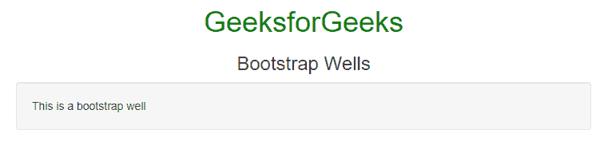
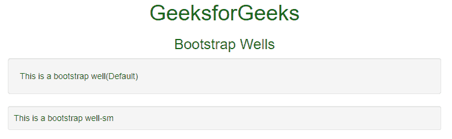
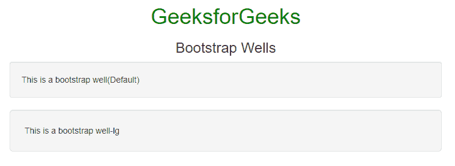

# 自举 4 |井

> 原文:[https://www.geeksforgeeks.org/bootstrap-4-wells/](https://www.geeksforgeeks.org/bootstrap-4-wells/)

自举井类似于一个带有圆形边框和衬垫的自举板。这是用来引起对网页某些内容的注意。**。well** 类在元素周围添加了一个带有灰色背景色和一些填充的圆形边框。但是我们可以在 CSS 的帮助下改变文本的颜色和填充。
T3】基本井: The。井类用于创建基本井。

*   **例:**

## 超文本标记语言

```html
<!DOCTYPE html>
<html lang="en">

<head>
    <title>Bootstrap Wells</title>
    <meta charset="utf-8">
    <meta name="viewport"
          content="width=device-width, initial-scale=1">
    <link rel="stylesheet"
          href=
"https://maxcdn.bootstrapcdn.com/bootstrap/3.4.1/css/bootstrap.min.css">
    <script src=
"https://ajax.googleapis.com/ajax/libs/jquery/3.4.1/jquery.min.js">
    </script>
    <script src=
"https://maxcdn.bootstrapcdn.com/bootstrap/3.4.1/js/bootstrap.min.js">
    </script>
</head>

<body>
  <div class="container">
    <h1 align="center" style="color: green;">
        GeeksforGeeks
    </h1>
    <h3 align="center">Bootstrap Wells</h3>

    <!-- By default wells are medium in size -->
    <div class="well">
        This is a bootstrap well
    </div>
  </div>
</body>

</html>           
```

*   **输出:**



**小井:****。井-sm** 后**。井类**用于创建小型井。小井如下:

*   **例:**

## 超文本标记语言

```html
<!DOCTYPE html>
<html lang="en">

<head>
    <title>Bootstrap Wells</title>
    <meta charset="utf-8">
    <meta name="viewport"
        content="width=device-width, initial-scale=1">
    <link rel="stylesheet"
        href=
"https://maxcdn.bootstrapcdn.com/bootstrap/3.4.1/css/bootstrap.min.css">
    <script src=
"https://ajax.googleapis.com/ajax/libs/jquery/3.4.1/jquery.min.js">
    </script>
    <script src=
"https://maxcdn.bootstrapcdn.com/bootstrap/3.4.1/js/bootstrap.min.js">
    </script>
</head>

<body>
<div class="container">
    <h1 align="center" style="color: green;">
        GeeksforGeeks
    </h1>
    <h3 align="center">Bootstrap Wells</h3>

    <div class="well">
        This is a bootstrap well(Default)
    </div>

    <div class="well well-sm">
        This is a bootstrap well-sm
    </div>
</div>
</body>

</html>                   
```

*   **输出:**



**大井:****。井-lg** 在**之后。井类**用于创建小型井。大井如下:

*   **例:**

## 超文本标记语言

```html
<!DOCTYPE html>
<html lang="en">

<head>
    <title>Bootstrap Wells</title>
    <meta charset="utf-8">
    <meta name="viewport"
        content="width=device-width, initial-scale=1">
    <link rel="stylesheet"
        href=
"https://maxcdn.bootstrapcdn.com/bootstrap/3.4.1/css/bootstrap.min.css">
    <script src=
"https://ajax.googleapis.com/ajax/libs/jquery/3.4.1/jquery.min.js">
    </script>
    <script src=
"https://maxcdn.bootstrapcdn.com/bootstrap/3.4.1/js/bootstrap.min.js">
    </script>
</head>

<body>
<div class="container">
    <h1 align="center" style="color: green;">
        GeeksforGeeks
    </h1>
    <h3 align="center">Bootstrap Wells</h3>

    <div class="well">
        This is a bootstrap well(Default)
    </div>

    <div class="well well-lg">
        This is a bootstrap well-lg
    </div>
</div>
</body>

</html>                   
```

*   **输出:**



**支持的浏览器:**

*   谷歌 Chrome
*   微软公司出品的 web 浏览器
*   火狐浏览器
*   歌剧
*   旅行队