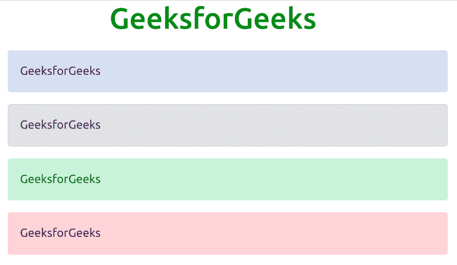
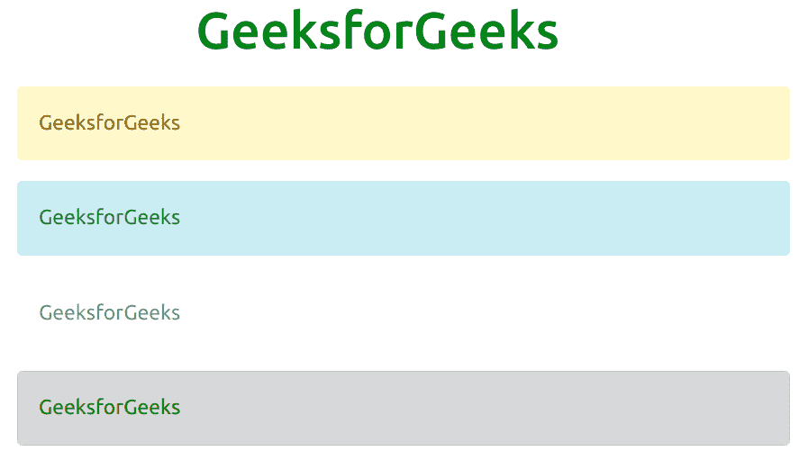

# 引导 5 警报

> 原文:[https://www.geeksforgeeks.org/bootstrap-5-alerts/](https://www.geeksforgeeks.org/bootstrap-5-alerts/)

Bootstrap 5 是 Bootstrap 的最新主要版本，在该版本中，用户界面得到了改进，并进行了各种更改。警报为典型的用户操作提供上下文反馈消息，并带有少量可用且灵活的警报消息。Bootstrap 允许使用预定义的类在网站上显示这些警报消息。每个类都有不同的相关颜色。

**语法:**

```html
<div class="alert alert-type"> Contents of the alert... <div>
```

**类型:**引导数据库 5 中有八种类型的警报。这些警报的类别如下:

*   警报-主要
*   警报-二级
*   警报-成功
*   警戒-危险
*   警报-警告
*   警报信息
*   警报灯
*   警戒-黑暗

**示例 1:** 此示例显示了引导数据库 5 中的前四种警报类型。

## 超文本标记语言

```html
<!DOCTYPE html>
<html>

<head>
    <title>
        Bootstrap 5 | Alerts
    </title>

    <!-- Load Bootstrap -->
    <link rel="stylesheet" href=
"https://stackpath.bootstrapcdn.com/bootstrap/5.0.0-alpha1/css/bootstrap.min.css">
</head>

<body>
    <div style="text-align: center;
              width:600px;">
        <h1 style="color: green;">
            GeeksforGeeks
        </h1>
    </div>
    <div id="canvas" style="width: 600px;
                          height: 200px;
                          margin: 20px;">
        <div class="alert alert-primary" role="alert">
            GeeksforGeeks
        </div>
        <div class="alert alert-secondary" role="alert">
            GeeksforGeeks
        </div>
        <div class="alert alert-success" role="alert">
            GeeksforGeeks
        </div>
        <div class="alert alert-danger" role="alert">
            GeeksforGeeks
        </div>
    </div>
</body>

</html>
```

**输出:**



**示例 2:** 此示例显示了引导数据库 5 中接下来的四种警报类型。

## 超文本标记语言

```html
<!DOCTYPE html>
<html>

<head>
    <title>
        Bootstrap 5 | Alerts
    </title>

    <!-- Load Bootstrap -->
    <link rel="stylesheet" href=
"https://stackpath.bootstrapcdn.com/bootstrap/5.0.0-alpha1/css/bootstrap.min.css">

</head>

<body>
    <div style="text-align: center;
              width: 600px;">
        <h1 style="color: green;">
            GeeksforGeeks
        </h1>
    </div>
    <div id="canvas" style="width: 600px;
              height: 200px;
              margin: 20px;">
        <div class="alert alert-warning" role="alert">
            GeeksforGeeks
        </div>
        <div class="alert alert-info" role="alert">
            GeeksforGeeks
        </div>
        <div class="alert alert-light" role="alert">
            GeeksforGeeks
        </div>
        <div class="alert alert-dark" role="alert">
            GeeksforGeeks
        </div>
    </div>
</body>

</html>
```

**输出:**

