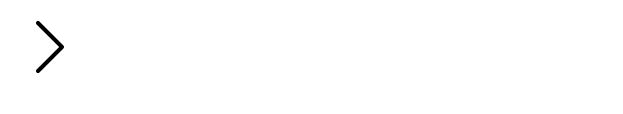
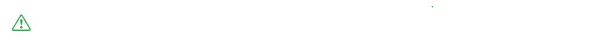

# 引导 5α|图标库

> 原文:[https://www . geesforgeks . org/bootstrap-5-alpha-icons-library/](https://www.geeksforgeeks.org/bootstrap-5-alpha-icons-library/)

bootstrap 第一次有了自己的图标库，它是为 Bootstrap 组件和文档定制设计和构建的。

引导图标被设计用于从表单控件到导航的引导组件。引导图标是支持向量组，以便快速简单地缩放，并且可以用 CSS 进行样式化。虽然它们是为 Bootstrap 构建的，但它们会添加任何项目。它们是在麻省理工学院许可下开源的，因此您可以根据需要自由下载、使用和定制。

**如何安装:**

引导图标发布到 npm，但如果需要，也可以下载。

**使用 npm 通过命令行安装引导图标。**

```
npm install bootstrap-icons
```

用法:

引导图标是支持向量机。因此，您可以根据正在处理的项目类型，以各种方式在 HTML 代码中包含内容。

1.  将支持向量机复制粘贴为嵌入的 HTML
2.  带有<use>元素的 SVG 精灵</use>
3.  作为外部形象

**注意:**引导图标默认包括宽度和高度为“ *1 em* ，以便通过字体大小轻松调整大小。

**Various ways of usage:**

*   **将 SVG 复制粘贴为嵌入的 HTML :** 将图标嵌入到页面的 HTML 中(相对于外部图像文件)。这里我们使用了自定义的宽度和高度。

    ```
    <svg class="bi bi-chevron-right " 
         width="64" height="64" 
         viewBox="0 0 20 20" fill="currentColor" 
         xmlns=
    "http://www.w3.org/2000/svg">
    <path fill-rule="evenodd" 
             d=
    "M6.646 3.646a.5.5 0 01.708 0l6 6a.5.5 0 010 
    .708l-6 6a.5.5 0 01-.708-.708L12.293 10 6.646 
    4.354a.5.5 0 010-.708z"/></svg>
    ```

    **示例:**

    ```
    <!DOCTYPE html>
    <html lang="en">
        <head>
            <title>Bootstrap Cards</title>

            <meta charset="utf-8" />
            <meta name="viewport" 
                  content="width=device-width,
                           initial-scale=1" />

            <link rel="stylesheet" 
                  href=
    "https://maxcdn.bootstrapcdn.com/bootstrap/v5.0.0/css/bootstrap.min.css" />
        </head>

        <body>
            <svg class="bi bi-chevron-right" 
                 width="64" height="64" 
                 viewBox="0 0 20 20" 
                 fill="currentColor" 
                 xmlns="http://www.w3.org/2000/svg">

                <path fill-rule="evenodd" 
                      d=
    "M6.646 3.646a.5.5 0 01.708 0l6 6a.5.5 0 010 
     .708l-6 6a.5.5 0 01-.708-.708L12.293 
     10 6.646 4.354a.5.5 0 010-.708z" />
            </svg>
        </body>
    </html>
    ```

    **输出:**

    

    *   **SVG 精灵配合<使用>元素:**使用 SVG 精灵通过<使用>元素插入任意图标。使用图标的文件名作为片段标识符(例如，heart 是#heart)。SVG 精灵允许你引用一个类似于< img >元素的外部文件，但是使用了 currentColor 的功能以便于主题化。

    **示例:**

    ```
    <svg class="bi" width="40" 
         height="40" fill="currentColor">
      <use xlink:href=
    "bootstrap-icons.svg#heart-fill"/>
    </svg>
    <svg class="bi" width="40" 
         height="40" fill="currentColor">
      <use xlink:href=
    "bootstrap-icons.svg#toggles"/>
    </svg>
    <svg class="bi" width="40" 
         height="40" fill="currentColor">
      <use xlink:href=
    "bootstrap-icons.svg#shop"/>
    </svg>
    ```

    **输出:**

    

    *   **作为外部图像:**将引导图标 SVG 复制到您选择的任何目录，并使用< img >标签像普通图像一样引用它们。

    **示例:**

    ```
    
    ```

    **输出:**

    

    *   **Styling of Icons:**

    对于图标的样式，请将其视为与文本相同。颜色也可以通过使用. text-*类或自定义 CSS 来更改。

    **示例:**

    ```
    <svg class="bi bi-alert-triangle text-success " 
         width="40" height="40" 
         viewBox="0 0 20 20"
         fill="currentColor"
         xmlns="http://www.w3.org/2000/svg">
      .....
    </svg>
    ```

    **输出:**

    