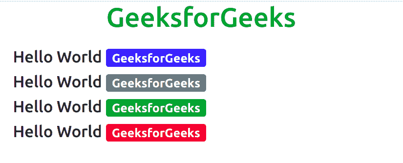
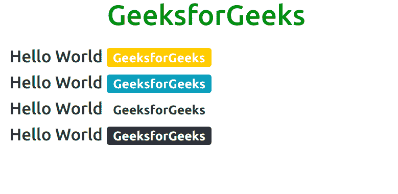
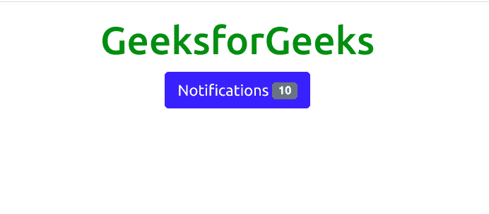
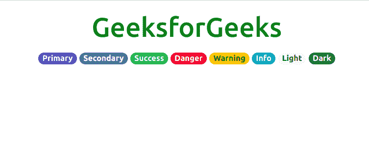

# 自举-5 徽章

> 原文:[https://www.geeksforgeeks.org/bootstrap-5-badges/](https://www.geeksforgeeks.org/bootstrap-5-badges/)

Bootstrap 5 是 Bootstrap 的最新主要版本，他们已经修改了用户界面并做了各种更改。徽章用于创建标签。徽章通过使用相对字体大小来缩放以匹配直接父元素的大小。

**语法:**

```
<div class="badge bg-type"> Contents... <div>
```

**类型:**以下是 Bootstrap 5 中提供的八种背景类型。

*   BG-初级
*   BG-中学
*   血糖-成功
*   BG-危险
*   BG-警告
*   BG-信息
*   bg 灯
*   BG-深色

**示例 1:** 该示例演示了 Bootstrap 5 中前四种徽章的工作方式。

## 超文本标记语言

```
<!DOCTYPE html>
<html>

<head>

    <!-- Load Bootstrap -->
    <link rel="stylesheet"    
     href=
"https://stackpath.bootstrapcdn.com/bootstrap/5.0.0-alpha1/css/bootstrap.min.css"
         integrity=
"sha384-r4NyP46KrjDleawBgD5tp8Y7UzmLA05oM1iAEQ17CSuDqnUK2+k9luXQOfXJCJ4I"
         crossorigin="anonymous">
</head>

<body>
    <div style="text-align: center;width: 600px;">
        <h1 style="color: green;">
            GeeksforGeeks
        </h1>
    </div>
    <div
      id="canvas"
      style="width: 600px;height: 200px;margin:20px;">
        <h4>Hello World
            <span class="badge bg-primary">
                GeeksforGeeks
            </span>
        </h4>
        <h4>
            Hello World
            <span class="badge bg-secondary">
                GeeksforGeeks
            </span>
        </h4>
        <h4>
            Hello World
            <span class="badge bg-success">
                GeeksforGeeks
            </span>
        </h4>
        <h4>
            Hello World
            <span class="badge bg-danger">
                GeeksforGeeks
            </span>
        </h4>
    </div>
</body>

</html>  
```

**输出:**



**示例 2:** 该示例演示了 Bootstrap 5 中最后四种徽章的工作方式。

## 超文本标记语言

```
<!DOCTYPE html>
<html>

<head>

    <!-- Load Bootstrap -->
    <link  rel="stylesheet" href=
"https://stackpath.bootstrapcdn.com/bootstrap/5.0.0-alpha1/css/bootstrap.min.css"
        integrity=
"sha384-r4NyP46KrjDleawBgD5tp8Y7UzmLA05oM1iAEQ17CSuDqnUK2+k9luXQOfXJCJ4I"
        crossorigin="anonymous">
</head>

<body>
    <div style="text-align: center;width: 600px;">
        <h1 style="color: green;">
            GeeksforGeeks
        </h1>
    </div>
    <div id="canvas"
    style="width: 600px;height: 200px;margin:20px;">
        <h4>Hello World
            <span class="badge bg-warning">
                GeeksforGeeks
            </span>
        </h4>
        <h4>
            Hello World
            <span class="badge bg-info">
                GeeksforGeeks
            </span>
        </h4>
        <h4>
            Hello World
            <span class="badge bg-light text-dark">
                GeeksforGeeks
            </span>
        </h4>
        <h4>
            Hello World
            <span class="badge bg-dark">
                GeeksforGeeks
            </span>
        </h4>
    </div>
</body>

</html>
```

**输出:**



**示例 3:** 该示例显示了 Bootstrap 5 中通知徽章的工作方式。

## 超文本标记语言

```
<!DOCTYPE html>
<html>

<head>
    <!-- Load Bootstrap -->
    <link rel="stylesheet" href=
"https://stackpath.bootstrapcdn.com/bootstrap/5.0.0-alpha1/css/bootstrap.min.css"
        integrity=
"sha384-r4NyP46KrjDleawBgD5tp8Y7UzmLA05oM1iAEQ17CSuDqnUK2+k9luXQOfXJCJ4I"
        crossorigin="anonymous">
</head>

<body style="text-align:center;">
    <div class="container mt-3">
        <h1 style="color:green;">
            GeeksforGeeks
        </h1>
        <button type="button"
            class="btn btn-primary">
                Notifications
                <span class="badge bg-secondary">
                    10
                 </span>
        </button>
    </div>
</body>
</html>                  
```

**输出:**



**示例 4:** 此示例显示了 Bootstrap 5 中药丸徽章的工作方式。

## 超文本标记语言

```
<!DOCTYPE html>
<html>

<head>
    <!-- Load Bootstrap -->
    <link rel="stylesheet" href=
"https://stackpath.bootstrapcdn.com/bootstrap/5.0.0-alpha1/css/bootstrap.min.css"
         integrity=
"sha384-r4NyP46KrjDleawBgD5tp8Y7UzmLA05oM1iAEQ17CSuDqnUK2+k9luXQOfXJCJ4I"
         crossorigin="anonymous">
</head>

<body style="text-align:center;">
    <div class="container mt-3">

        <h1 style="color:green;">
            GeeksforGeeks
        </h1>
        <span class="badge rounded-pill
            bg-primary">Primary
        </span>
        <span class="badge rounded-pill
            bg-secondary">Secondary
        </span>
        <span class="badge rounded-pill
            bg-success">Success
        </span>
        <span class="badge rounded-pill
            bg-danger">Danger
        </span>
        <span class="badge rounded-pill
            bg-warning text-dark">Warning
        </span>
        <span class="badge rounded-pill
            bg-info">Info
        </span>
        <span class="badge rounded-pill
            bg-light text-dark">Light
        </span>
        <span class="badge rounded-pill
            bg-dark">Dark
        </span>
    </div>
</body>

</html>                  
```

**输出:**



**支持的浏览器:**

*   谷歌 Chrome
*   微软公司出品的 web 浏览器
*   火狐浏览器
*   歌剧
*   旅行队