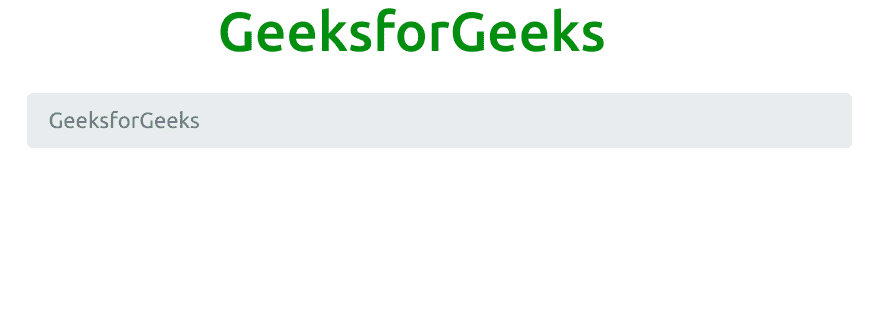
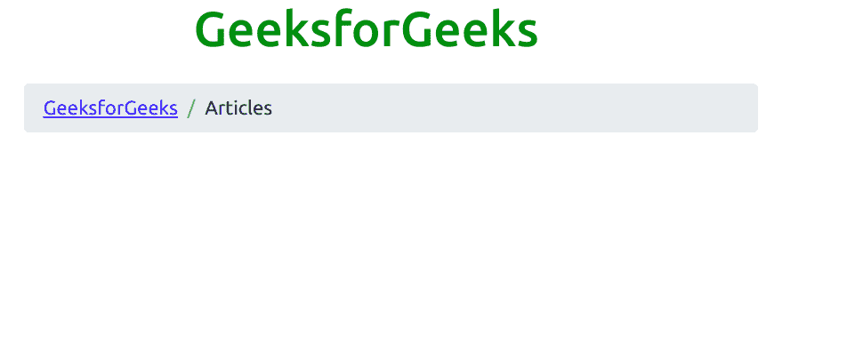
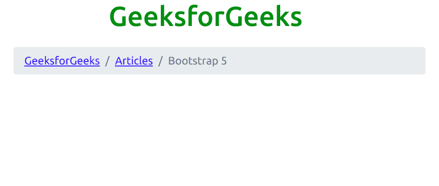

# 引导 5 |面包屑

> 原文:[https://www.geeksforgeeks.org/bootstrap-5-breadcrumb/](https://www.geeksforgeeks.org/bootstrap-5-breadcrumb/)

Bootstrap 5 是 Bootstrap 的最新主要版本，在该版本中，他们修改了用户界面并进行各种更改。面包屑用于指示当前页面在导航层次结构中的位置。

**语法:**

```
<ol class="breadcrumb">
  <li class="breadcrumb-item"> Content .. </li>
</ol>
```

**示例 1:** 该示例用于显示 Bootstrap 5 中面包屑的工作方式。

```
<!DOCTYPE html>
<html>

<head>
    <title>
        Bootstrap 5 | Breadcrumbs
    </title>

    <!-- Load Bootstrap -->
    <link rel="stylesheet" 
          href=
"https://stackpath.bootstrapcdn.com/bootstrap/5.0.0-alpha1/css/bootstrap.min.css"
        integrity=
"sha384-r4NyP46KrjDleawBgD5tp8Y7UzmLA05oM1iAEQ17CSuDqnUK2+k9luXQOfXJCJ4I" 
        crossorigin="anonymous">
</head>

<body>
    <div style="text-align: center;width: 600px;">
        <h1 style="color: green;">
            GeeksforGeeks
        </h1>
    </div>
    <div style="width: 600px;height: 200px;
         margin:20px;">
        <nav aria-label="breadcrumb">
            <ol class="breadcrumb">
                <li class="breadcrumb-item active">
                        GeeksforGeeks
                </li>
            </ol>
        </nav>
    </div>
</body>

</html>
```

**输出:**



**示例 2:** 本示例使用 Bootstrap 5 展示面包屑的工作方式。

```
<!DOCTYPE html>
<html>

<head>
    <title>
        Bootstrap 5 | Breadcrumbs
    </title>

    <!-- Load Bootstrap -->
    <link rel="stylesheet" 
          href=
"https://stackpath.bootstrapcdn.com/bootstrap/5.0.0-alpha1/css/bootstrap.min.css"
        integrity=
"sha384-r4NyP46KrjDleawBgD5tp8Y7UzmLA05oM1iAEQ17CSuDqnUK2+k9luXQOfXJCJ4I"
        crossorigin="anonymous">
</head>

<body>
    <div style="text-align: center;width: 600px;">
        <h1 style="color: green;">
            GeeksforGeeks
        </h1>
    </div>
    <div style="width: 600px;height: 200px;margin:20px;">
        <nav aria-label="breadcrumb">
            <ol class="breadcrumb">
                <li class="breadcrumb-item">
                    <a href="#">GeeksforGeeks
                    </a></li>
                <li class="breadcrumb-item">Articles</li>
            </ol>
        </nav>
    </div>
</body>

</html> 
```

**输出:**



**示例 3:** 本示例使用 Bootstrap 5 展示面包屑的工作方式。

```
<!DOCTYPE html>
<html>

<head>
    <title>
        Bootstrap 5 | Breadcrumbs
    </title>

    <!-- Load Bootstrap -->
    <link rel="stylesheet" 
          href=
"https://stackpath.bootstrapcdn.com/bootstrap/5.0.0-alpha1/css/bootstrap.min.css"
        integrity=
"sha384-r4NyP46KrjDleawBgD5tp8Y7UzmLA05oM1iAEQ17CSuDqnUK2+k9luXQOfXJCJ4I" 
        crossorigin="anonymous">
</head>

<body>
    <div style="text-align: center;width: 600px;">
        <h1 style="color: green;">
            GeeksforGeeks
        </h1>
    </div>
    <div style="width: 600px;height: 200px;margin:20px;">
        <nav aria-label="breadcrumb">
            <ol class="breadcrumb">
                <li class="breadcrumb-item">
                     <a href="#">GeeksforGeeks</a></li>
                <li class="breadcrumb-item">
                     <a href="#">Articles</a></li>
                <li class="breadcrumb-item active">
                               Bootstrap 5</li>
            </ol>
        </nav>
    </div>
</body>

</html>  
```

**输出:**

