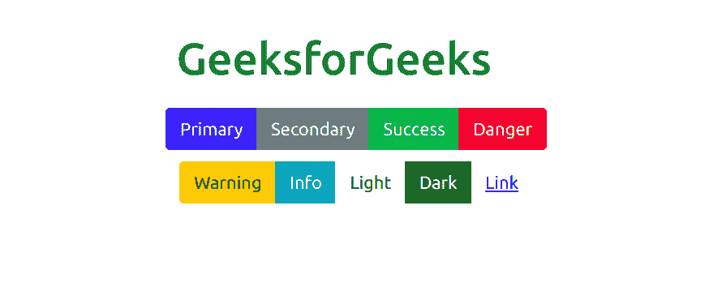
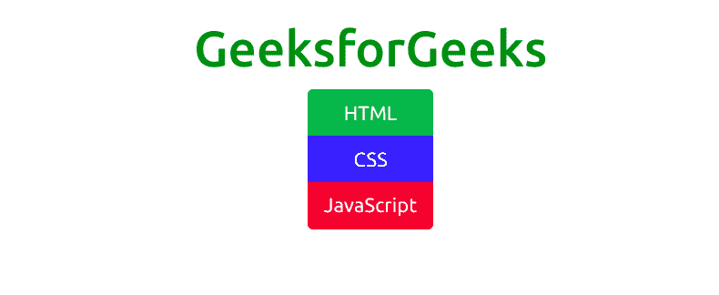
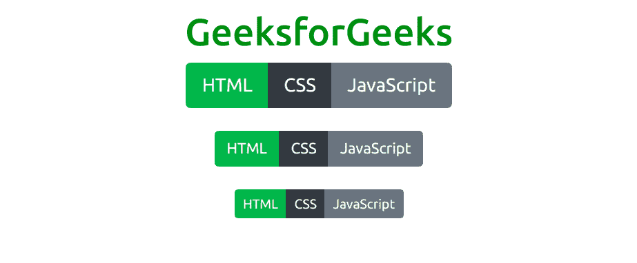
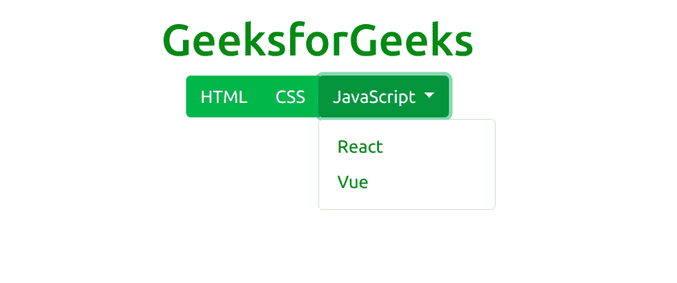
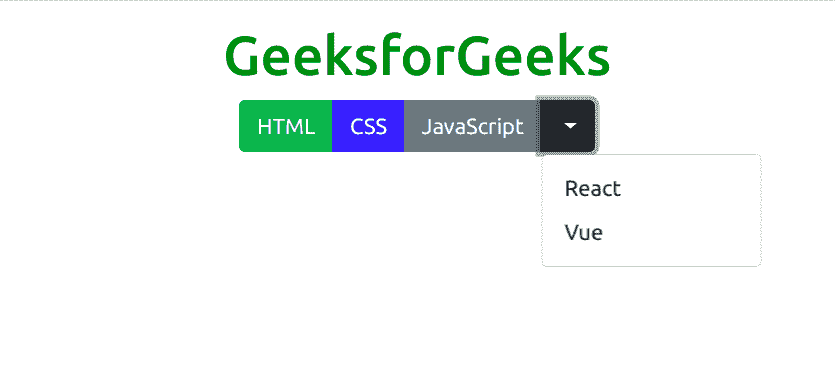
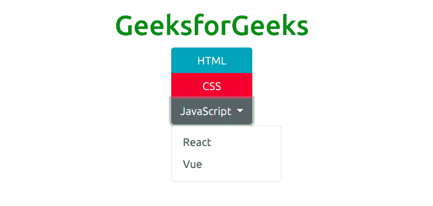

# 自举 5 |按钮组

> 原文:[https://www.geeksforgeeks.org/bootstrap-5-button-group/](https://www.geeksforgeeks.org/bootstrap-5-button-group/)

Bootstrap 5 是 Bootstrap 的最新主要版本，在该版本中，他们修改了用户界面并进行各种更改。按钮组是 Bootstrap 5 提供的一个组件，它有助于将一系列按钮组合成一行。它支持所有类型的按钮。

**语法:**

```
<div class="btn-group"> Buttons... <div>
```

**类型:**以下是 Bootstrap 5 中提供的九种按钮类型:

*   BTN-初级
*   BTN-二级
*   BTN-成功
*   BTN-危险
*   BTN-警告

*   btn 信息
*   BTN-光
*   BTN-暗
*   btn-link

**水平排列的按钮组:**的。btn-group 类用于创建水平排列的按钮组。

*   **示例:**本示例用于展示 Bootstrap 5 中水平排列的按钮组的工作情况。

    ```
    <!DOCTYPE html>
    <html>

    <head>
        <title>
            Bootstrap 5 | Buttons group
        </title>

        <!-- Load Bootstrap -->
        <link rel="stylesheet" 
              href=
    "https://stackpath.bootstrapcdn.com/bootstrap/5.0.0-alpha1/css/bootstrap.min.css"
            integrity=
    "sha384-r4NyP46KrjDleawBgD5tp8Y7UzmLA05oM1iAEQ17CSuDqnUK2+k9luXQOfXJCJ4I" 
             crossorigin="anonymous">

    </head>

    <body>
        <div style="text-align: center;
               width: 600px; margin-top:100px;">
            <h1 style="color: green;">
                GeeksforGeeks
            </h1>
        </div>
        <div style="width: 600px;height: 200px;
             margin:20px;text-align: center;">
            <div class="btn-group">
                <button type="button" class="btn btn-primary">
                              Primary</button>
                <button type="button" class="btn btn-secondary">
                              Secondary</button>
                <button type="button" class="btn btn-success">
                              Success</button>
                <button type="button" class="btn btn-danger">
                              Danger</button>
            </div>
            <div class="btn-group" style="margin-top: 10px;">
                <button type="button" class="btn btn-warning">
                         Warning</button>
                <button type="button" class="btn btn-info">
                         Info</button>
                <button type="button" class="btn btn-light">
                        Light</button>
                <button type="button" class="btn btn-dark">
                        Dark</button>
                <button type="button" class="btn btn-link">
                        Link</button>
            </div>
        </div>
    </body>

    </html>                 
    ```

    **输出:**

    

*   **Vertically arranged button groups:** The .btn-group-vertical class is used in parent div to create vertical button group.

    **示例:**该示例用于显示 Bootstrap 5 中垂直排列的按钮组的工作情况。

    ```
    <!DOCTYPE html>
    <html>

    <head>
        <title>
            Bootstrap 5 | Buttons group
        </title>

        <!-- Load Bootstrap -->
        <link rel="stylesheet" 
              href=
    "https://stackpath.bootstrapcdn.com/bootstrap/5.0.0-alpha1/css/bootstrap.min.css"
            integrity=
    "sha384-r4NyP46KrjDleawBgD5tp8Y7UzmLA05oM1iAEQ17CSuDqnUK2+k9luXQOfXJCJ4I" 
            crossorigin="anonymous">
    </head>

    <body style="text-align:center;">
        <div class="container mt-3">

            <h1 style="color:green;">
                GeeksforGeeks
            </h1>

            <div class="btn-group-vertical">
                <button type="button" 
                        class="btn btn-success">
                    HTML
                </button>

                <button type="button" 
                        class="btn btn-primary">
                    CSS
                </button>

                <button type="button" 
                        class="btn btn-danger">
                    JavaScript
                </button>
            </div>
        </div>
    </body>

    </html>
    ```

    **输出:**

    

*   **Button group sizing:** The whole button group can be given the same size by including the class btn-group-* (* could be sm, md or lg) in the .btn-group parent element, instead of including sizing classes in each button.

    **示例:**该示例使用 Bootstrap 5 中的按钮组显示按钮大小的工作方式。

    ```
    <!DOCTYPE html>
    <html>

    <head>
        <title>
            Bootstrap 5 | Buttons group
        </title>

        <!-- Load Bootstrap -->
        <link rel="stylesheet" 
              href=
    "https://stackpath.bootstrapcdn.com/bootstrap/5.0.0-alpha1/css/bootstrap.min.css"
            integrity=
    "sha384-r4NyP46KrjDleawBgD5tp8Y7UzmLA05oM1iAEQ17CSuDqnUK2+k9luXQOfXJCJ4I"
            crossorigin="anonymous">

    </head>

    <body style="text-align:center;">
        <div class="container mt-3">

            <h1 style="color:green;">
                GeeksforGeeks
            </h1>

            <div class="container">
                <div class="btn-group btn-group-lg">
                    <button type="button" 
                            class="btn btn-success">
                        HTML
                    </button>

                    <button type="button" class="btn btn-dark">
                        CSS
                    </button>

                    <button type="button"
                            class="btn btn-secondary">
                        JavaScript
                    </button>
                </div>

                <br><br>

                <div class="btn-group btn-group-md">
                    <button type="button" 
                            class="btn btn-success">
                        HTML
                    </button>

                    <button type="button" 
                            class="btn btn-dark">
                        CSS
                    </button>

                    <button type="button" 
                            class="btn btn-secondary">
                        JavaScript
                    </button>
                </div>

                <br><br>

                <div class="btn-group btn-group-sm">
                    <button type="button" 
                            class="btn btn-success">
                        HTML
                    </button>

                    <button type="button" 
                            class="btn btn-dark">
                        CSS
                    </button>

                    <button type="button" 
                            class="btn btn-secondary">
                        JavaScript
                    </button>
                </div>
            </div>
        </div>
    </body>

    </html>
    ```

    **输出:**

    

*   Nesting button groups and making dropdown menus: A button group can be nested within another button group and dropdown menus can be created this way.

    **单按钮下拉:**
    **示例:**

    ```
    <!DOCTYPE html>
    <html>

    <head>
        <title>
            Bootstrap 5 | Buttons group
        </title>

            <!-- Load Bootstrap -->
        <link rel="stylesheet" 
              href=
    "https://stackpath.bootstrapcdn.com/bootstrap/5.0.0-alpha1/css/bootstrap.min.css"
            integrity=
    "sha384-r4NyP46KrjDleawBgD5tp8Y7UzmLA05oM1iAEQ17CSuDqnUK2+k9luXQOfXJCJ4I" 
            crossorigin="anonymous">
        <script src=
    "https://cdn.jsdelivr.net/npm/popper.js@1.16.0/dist/umd/popper.min.js"
            integrity=
    "sha384-Q6E9RHvbIyZFJoft+2mJbHaEWldlvI9IOYy5n3zV9zzTtmI3UksdQRVvoxMfooAo"
            crossorigin="anonymous">
        </script>
        <script src=
    "https://stackpath.bootstrapcdn.com/bootstrap/5.0.0-alpha1/js/bootstrap.min.js"
            integrity=
    "sha384-oesi62hOLfzrys4LxRF63OJCXdXDipiYWBnvTl9Y9/TRlw5xlKIEHpNyvvDShgf/"
            crossorigin="anonymous">
      </script>
    </head>

    <body style="text-align:center;">
        <div class="container mt-3">

            <h1 style="color:green;">
                GeeksforGeeks
            </h1>

            <div class="container">
                <div class="btn-group">
                    <button type="button" 
                            class="btn btn-success">
                        HTML
                    </button>

                    <button type="button"
                            class="btn btn-success btn-group">
                        CSS
                    </button>

                    <div class="btn-group">
                        <div class="dropdown">
                            <button type="button" 
    class="btn btn-success dropdown-toggle" data-toggle="dropdown">
                                JavaScript<span class="caret"></span>
                         </button>

                         <ul class="dropdown-menu" role="menu">
                           <li><a class="dropdown-item" href="#">React</a></li>
                           <li><a class="dropdown-item" href="#">Vue</a></li>
                        </ul>
                        </div>
                    </div>
                </div>
            </div>
        </div>
    </body>

    </html>      
    ```

    **输出:**

    

*   **Split button dropdown:**
    **Example:**

    ```
    <!DOCTYPE html>
    <html>

    <head>
        <title>
            Bootstrap 5 | Buttons group
        </title>

            <!-- Load Bootstrap -->
        <link rel="stylesheet"
              href=
    "https://stackpath.bootstrapcdn.com/bootstrap/5.0.0-alpha1/css/bootstrap.min.css"
            integrity=
    "sha384-r4NyP46KrjDleawBgD5tp8Y7UzmLA05oM1iAEQ17CSuDqnUK2+k9luXQOfXJCJ4I" 
            crossorigin="anonymous">

        <script src=
    "https://cdn.jsdelivr.net/npm/popper.js@1.16.0/dist/umd/popper.min.js"
            integrity=
    "sha384-Q6E9RHvbIyZFJoft+2mJbHaEWldlvI9IOYy5n3zV9zzTtmI3UksdQRVvoxMfooAo"
            crossorigin="anonymous">
        </script>
        <script src=
    "https://stackpath.bootstrapcdn.com/bootstrap/5.0.0-alpha1/js/bootstrap.min.js"
            integrity=
    "sha384-oesi62hOLfzrys4LxRF63OJCXdXDipiYWBnvTl9Y9/TRlw5xlKIEHpNyvvDShgf/"
            crossorigin="anonymous">
       </script>
    </head>

    <body style="text-align:center;">
        <div class="container mt-3">

            <h1 style="color:green;">
                GeeksforGeeks
            </h1>

            <div class="container">
                <div class="btn-group">
                    <button type="button"
                            class="btn btn-success">
                        HTML
                    </button>

                    <button type="button"
                            class="btn btn-primary btn-group">
                        CSS
                    </button>

                    <div class="btn-group">
                        <button type="button" 
                                class="btn btn-secondary">
                            JavaScript
                        </button>
                        <button type="button" 
                           class="btn btn-dark dropdown-toggle"
                           data-toggle="dropdown">
                            <span class="caret"></span>
                        </button>

                        <ul class="dropdown-menu" role="menu">
                            <li>
                              <a class="dropdown-item" href="#">
                                    React</a></li>
                            <li><a class="dropdown-item" href="#">
                                Vue</a></li>
                        </ul>
                    </div>
                </div>
            </div>
        </div>
    </body>

    </html>
    ```

    **输出:**

    

*   Bootstrap 5 also supports **Split Button Vertical Dropdown**.
    **Example:**

    ```
    <!DOCTYPE html>
    <html>

    <head>
        <title>
            Bootstrap 5 | Buttons group
        </title>

        <!-- Load Bootstrap -->
        <link rel="stylesheet" 
              href=
    "https://stackpath.bootstrapcdn.com/bootstrap/5.0.0-alpha1/css/bootstrap.min.css"
             integrity="sha384-r4NyP46KrjDleawBgD5tp8Y7UzmLA05oM1iAEQ17CSuDqnUK2+k9luXQOfXJCJ4I" 
             crossorigin="anonymous">
        <script src=
    "https://cdn.jsdelivr.net/npm/popper.js@1.16.0/dist/umd/popper.min.js"
            integrity=
    "sha384-Q6E9RHvbIyZFJoft+2mJbHaEWldlvI9IOYy5n3zV9zzTtmI3UksdQRVvoxMfooAo"
            crossorigin="anonymous">
         </script>
        <script src=
    "https://stackpath.bootstrapcdn.com/bootstrap/5.0.0-alpha1/js/bootstrap.min.js"
            integrity=
    "sha384-oesi62hOLfzrys4LxRF63OJCXdXDipiYWBnvTl9Y9/TRlw5xlKIEHpNyvvDShgf/"
            crossorigin="anonymous">
        </script>
    </head>

    <body style="text-align:center;">
        <div class="container mt-3">

            <h1 style="color:green;">
                GeeksforGeeks
            </h1>

            <div class="container">
                <div class="btn-group-vertical">
                  <button type="button" class="btn btn-info">
                        HTML
                  </button>

                    <button type="button" 
                           class="btn btn-danger">
                        CSS
                    </button>

                    <div class="btn-group">
                        <button type="button" 
    class="btn btn-secondary dropdown-toggle" 
                            data-toggle="dropdown">
                            JavaScript
                        </button>

                        <ul class="dropdown-menu" role="menu">
                            <li><a class="dropdown-item" href="#">
                                    React</a></li>
                            <li><a class="dropdown-item" href="#">
                                    Vue</a></li>
                        </ul>
                    </div>
                </div>
            </div>
        </div>
    </body>

    </html>
    ```

    **输出:**

    