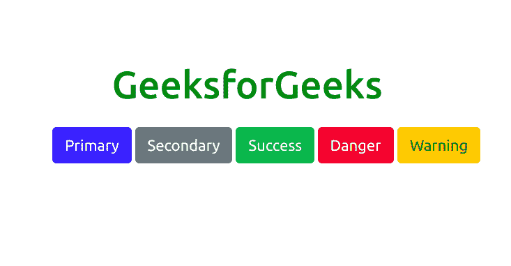
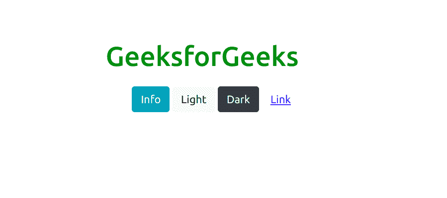
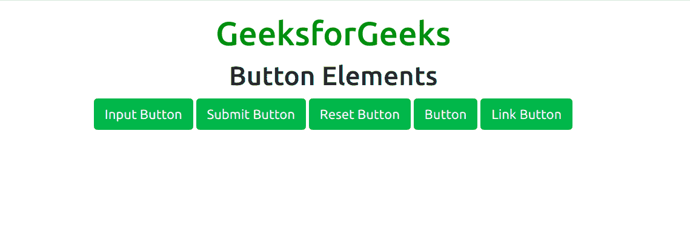
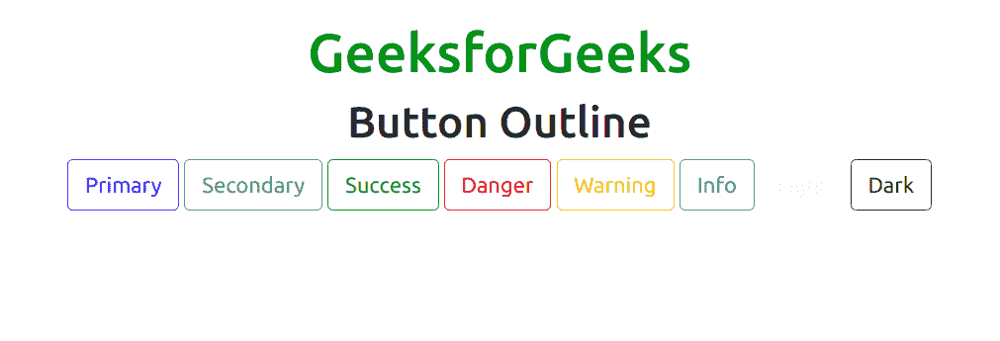
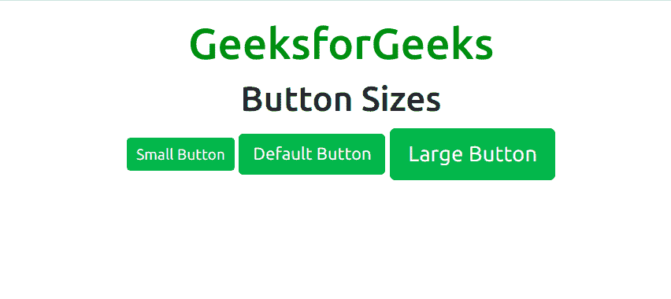
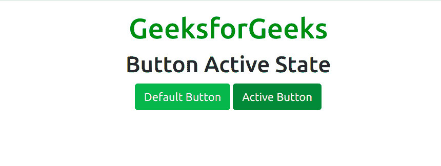
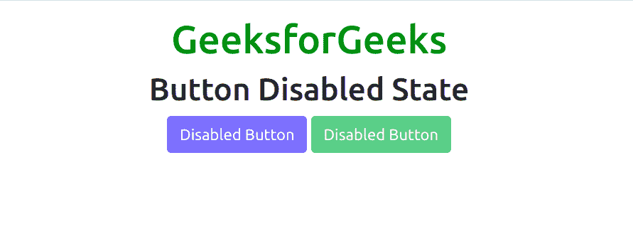
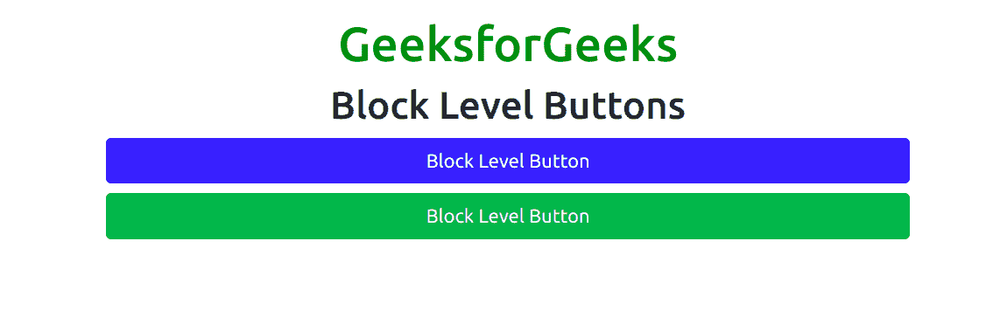
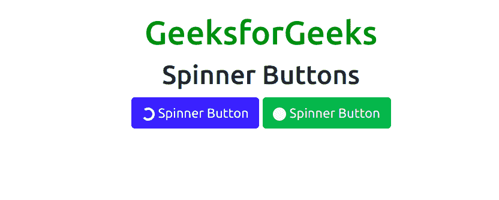

# 自举 5 |按钮

> 原文:[https://www.geeksforgeeks.org/bootstrap-5-buttons/](https://www.geeksforgeeks.org/bootstrap-5-buttons/)

Bootstrap 5 是 Bootstrap 的最新主要版本，在该版本中，他们修改了用户界面并进行各种更改。按钮是用来创建各种按钮的组件。Bootstrap 5 包括几个预定义的按钮样式，每个都有自己的用途。

**语法:**

```
<button class="badge bg-type"> Button Text <button>
```

**类型:**以下是 Bootstrap 5 中提供的九种按钮类型:

*   BTN-初级
*   BTN-二级
*   BTN-成功
*   BTN-危险
*   BTN-警告

*   btn 信息
*   BTN-光
*   BTN-暗
*   btn-link

**示例 1:** 此示例用于显示 Bootstrap 5 中前五种按钮的工作方式。

```
<!DOCTYPE html>
<html>

<head>
    <title>
        Bootstrap 5 | Buttons
    </title>

    <!-- Load Bootstrap -->
    <link rel="stylesheet" 
          href=
"https://stackpath.bootstrapcdn.com/bootstrap/5.0.0-alpha1/css/bootstrap.min.css"
        integrity=
"sha384-r4NyP46KrjDleawBgD5tp8Y7UzmLA05oM1iAEQ17CSuDqnUK2+k9luXQOfXJCJ4I" 
        crossorigin="anonymous">
</head>

<body>
    <div style="text-align: center;width: 600px;">
        <h1 style="color: green;">
            GeeksforGeeks
        </h1>
    </div>
    <div style="width: 600px; height: 200px; 
         margin:20px;text-align: center;">
        <button type="button" 
                class="btn btn-primary">Primary</button>
        <button type="button" 
                class="btn btn-secondary">Secondary</button>
        <button type="button" 
                class="btn btn-success">Success</button>
        <button type="button" 
                class="btn btn-danger">Danger</button>
        <button type="button" 
                class="btn btn-warning">Warning</button>
    </div>
</body>

</html>
```

**输出:**



**示例 2:** 此示例用于显示 Bootstrap 5 中最后四种类型按钮的工作情况。

```
<!DOCTYPE html>
<html>

<head>
    <title>
        Bootstrap 5 | Buttons
    </title>

    <!-- Load Bootstrap -->
    <link rel="stylesheet" 
          href=
"https://stackpath.bootstrapcdn.com/bootstrap/5.0.0-alpha1/css/bootstrap.min.css"
        integrity=
"sha384-r4NyP46KrjDleawBgD5tp8Y7UzmLA05oM1iAEQ17CSuDqnUK2+k9luXQOfXJCJ4I" 
        crossorigin="anonymous">
</head>

<body>
    <div style="text-align: center;width: 600px;">
        <h1 style="color: green;">
            GeeksforGeeks
        </h1>
    </div>
        <div style="width: 600px;height: 200px;
             margin:20px;text-align: center;">
        <button type="button"
                class="btn btn-info">Info</button>
        <button type="button" 
                class="btn btn-light">Light</button>
        <button type="button" 
                class="btn btn-dark">Dark</button>
        <button type="button" 
                class="btn btn-link">Link</button>
    </div>
</body>

</html>
```

**输出:**



**示例 3:** 该示例使用 Bootstrap 5 中的按钮来显示不同元素的工作方式。

```
<!DOCTYPE html>
<html>

<head>
    <title>
        Bootstrap 5 | Buttons
    </title>

    <!-- Load Bootstrap -->
    <link rel="stylesheet" 
          href=
"https://stackpath.bootstrapcdn.com/bootstrap/5.0.0-alpha1/css/bootstrap.min.css"
        integrity=
"sha384-r4NyP46KrjDleawBgD5tp8Y7UzmLA05oM1iAEQ17CSuDqnUK2+k9luXQOfXJCJ4I"
        crossorigin="anonymous">
</head>

<body style="text-align:center;">  
    <div class="container mt-3"> 

        <h1 style="color:green;"> 
            GeeksforGeeks 
        </h1> 

        <h2>Button Elements</h2>  

        <input class="btn btn-success" 
               type="button" value="Input Button"> 
        <input class="btn btn-success" 
               type="submit" value="Submit Button"> 
        <input class="btn btn-success" 
               type="reset" value="Reset Button"> 
        <button class="btn btn-success"
                type="button">Button</button> 
        <a href="#" class="btn btn-success" 
           role="button">Link Button</a> 
    </div>  
</body>  

</html>           
```

**输出:**



**按钮轮廓:** Bootstrap 5 提供了一系列类，当我们需要在项目中使用轮廓样式的按钮时，即没有背景颜色的按钮时，可以使用这些类。大纲按钮类删除应用于按钮的任何背景颜色或背景图像样式。所有按钮类型都支持它，如下例所示:

**示例:**该示例用于显示 Bootstrap 5 中不同轮廓按钮的工作情况。

```
<!DOCTYPE html>
<html>

<head>
    <title>
        Bootstrap 5 | Buttons
    </title>

    <!-- Load Bootstrap -->
    <link rel="stylesheet"
          href=
"https://stackpath.bootstrapcdn.com/bootstrap/5.0.0-alpha1/css/bootstrap.min.css"
        integrity=
"sha384-r4NyP46KrjDleawBgD5tp8Y7UzmLA05oM1iAEQ17CSuDqnUK2+k9luXQOfXJCJ4I" 
        crossorigin="anonymous">
</head>

<body style="text-align:center;">
    <div class="container mt-3">

        <h1 style="color:green;">
            GeeksforGeeks
        </h1>

        <h2>Button Outline</h2>

        <button type="button" 
                class="btn btn-outline-primary">
            Primary
        </button>

        <button type="button" 
                class="btn btn-outline-secondary">
            Secondary
        </button>

        <button type="button" 
                class="btn btn-outline-success">
            Success
        </button>

        <button type="button" 
                class="btn btn-outline-danger">
            Danger
        </button>

        <button type="button" 
                class="btn btn-outline-warning">
            Warning
        </button>

        <button type="button" 
                class="btn btn-outline-info">
            Info
        </button>

        <button type="button" 
                class="btn btn-outline-light">
            Light
        </button>
        <button type="button"
                class="btn btn-outline-dark">
            Dark
        </button>
    </div>
</body>

</html>
```

**输出:**



**按钮大小:** Bootstrap 5 提供了不同的类，允许改变按钮的大小。*。btn-lg* 和*。btn-sm* 类用于大小按钮。

**示例:**此示例用于显示 Bootstrap 5 中不同按钮大小的工作情况。

```
<!DOCTYPE html>
<html>

<head>
    <title>
        Bootstrap 5 | Buttons
    </title>

    <!-- Load Bootstrap -->
    <link rel="stylesheet" 
          href=
"https://stackpath.bootstrapcdn.com/bootstrap/5.0.0-alpha1/css/bootstrap.min.css"
        integrity=
"sha384-r4NyP46KrjDleawBgD5tp8Y7UzmLA05oM1iAEQ17CSuDqnUK2+k9luXQOfXJCJ4I" 
        crossorigin="anonymous">
</head>

<body style="text-align:center;">  
    <div class="container mt-3"> 

        <h1 style="color:green;"> 
            GeeksforGeeks 
        </h1> 

        <h2>Button Sizes</h2>  

        <button type="button"
                class="btn btn-success btn-sm"> 
            Small Button 
        </button>  

        <button type="button" 
                class="btn btn-success"> 
            Default Button 
        </button>  

        <button type="button" 
                class="btn btn-success btn-lg"> 
            Large Button 
        </button>  
    </div>  
</body>  

</html>
```

**输出:**



**活动状态按钮:**的。活动类用于制作按钮并链接到活动状态。

**示例:**该示例用于显示 Bootstrap 5 中按钮活动状态的工作情况。

```
<!DOCTYPE html>
<html>

<head>
    <title>
        Bootstrap 5 | Buttons
    </title>

    <!-- Load Bootstrap -->
    <link rel="stylesheet" 
          href=
"https://stackpath.bootstrapcdn.com/bootstrap/5.0.0-alpha1/css/bootstrap.min.css"
        integrity=
"sha384-r4NyP46KrjDleawBgD5tp8Y7UzmLA05oM1iAEQ17CSuDqnUK2+k9luXQOfXJCJ4I" 
        crossorigin="anonymous">

</head>

<body style="text-align:center;">
    <div class="container mt-3">

        <h1 style="color:green;">
            GeeksforGeeks
        </h1>

        <h2>Button Active State</h2>

        <button type="button"
                class="btn btn-success">
            Default Button
        </button>

        <button type="button" 
                class="btn btn-success active">
            Active Button
        </button>
    </div>
</body>

</html>
```

**输出:**



**禁用状态按钮:**禁用属性与按钮元素一起用于设置按钮的禁用状态。

**示例:**此示例用于显示 Bootstrap 5 中按钮禁用状态的工作情况。

```
<!DOCTYPE html>
<html>

<head>
    <title>
        Bootstrap 5 | Buttons
    </title>

    <!-- Load Bootstrap -->
    <link rel="stylesheet" 
          href=
"https://stackpath.bootstrapcdn.com/bootstrap/5.0.0-alpha1/css/bootstrap.min.css"
        integrity=
"sha384-r4NyP46KrjDleawBgD5tp8Y7UzmLA05oM1iAEQ17CSuDqnUK2+k9luXQOfXJCJ4I" 
        crossorigin="anonymous">
</head>

<body style="text-align:center;">  
    <div class="container mt-3"> 

        <h1 style="color:green;"> 
            GeeksforGeeks 
        </h1> 

        <h2>Button Disabled State</h2>  

        <button type="button" 
                class="btn btn-primary" disabled> 
            Disabled Button 
        </button>  

        <button type="button" 
                class="btn btn-success" disabled> 
            Disabled Button 
        </button>  
    </div>  
</body> 

</html>  
```

**输出:**



**块级按钮:**的。btn-block 类用于创建块级按钮，该按钮占据父元素的所有宽度。

**示例:**该示例显示了 Bootstrap 5 中块级按钮的工作情况。

```
<!DOCTYPE html>
<html>

<head>
    <title>
        Bootstrap 5 | Buttons
    </title>

    <!-- Load Bootstrap -->
    <link rel="stylesheet"
          href=
"https://stackpath.bootstrapcdn.com/bootstrap/5.0.0-alpha1/css/bootstrap.min.css"
        integrity=
"sha384-r4NyP46KrjDleawBgD5tp8Y7UzmLA05oM1iAEQ17CSuDqnUK2+k9luXQOfXJCJ4I" 
        crossorigin="anonymous">

</head>

<body style="text-align:center;" style="width:700px;">
    <div class="container mt-3">

        <h1 style="color:green;">
            GeeksforGeeks
        </h1>

        <h2>Block Level Buttons</h2>

        <button type="button" 
                class="btn btn-block btn-primary">
            Block Level Button
        </button>

        <button type="button"
                class="btn btn-block btn-success">
            Block Level Button
        </button>
    </div>
</body>

</html>
```

**输出:**



**微调按钮:**微调器-*类用于向按钮添加微调器。

**示例:**该示例显示了 Bootstrap 5 中微调按钮的工作方式。

```
<!DOCTYPE html>
<html>

<head>
    <title>
        Bootstrap 5 | Buttons
    </title>

    <!-- Load Bootstrap -->
    <link rel="stylesheet"
          href=
"https://stackpath.bootstrapcdn.com/bootstrap/5.0.0-alpha1/css/bootstrap.min.css"
        integrity=
"sha384-r4NyP46KrjDleawBgD5tp8Y7UzmLA05oM1iAEQ17CSuDqnUK2+k9luXQOfXJCJ4I"
        crossorigin="anonymous">
</head>

<body style="text-align:center;">
    <div class="container mt-3">

        <h1 style="color:green;">
            GeeksforGeeks
        </h1>

        <h2>Spinner Buttons</h2>

        <button type="button" class="btn btn-primary">
            <span class="spinner-border spinner-border-sm">
            </span>
            Spinner Button
        </button>

        <button type="button" class="btn btn-success">
            <span class="spinner-grow spinner-grow-sm">
            </span>
            Spinner Button
        </button>
    </div>
</body>

</html>
```

**输出:**

