# 自举 5 |卡片

> 原文:[https://www.geeksforgeeks.org/bootstrap-5-card/](https://www.geeksforgeeks.org/bootstrap-5-card/)

Bootstrap 5 是 Bootstrap 的最新主要版本，在该版本中，他们修改了用户界面并进行各种更改。该卡是 Bootstrap 5 提供的一个组件，它提供了一个灵活且可扩展的内容容器，具有多种变体和选项。它包括页眉和页脚选项。卡片支持多种内容，包括图像、文本、列表组、链接等。

**语法:**

```
<div class="card"> Card Content ... <div>
```

*   **基本卡:**一张卡的基本积木是**卡体**，以**卡**类为父类，我们可以创建一张基本卡。
    **例:**

## 超文本标记语言

```
<!DOCTYPE html>
<html lang="en">
    <head>
        <title>Bootstrap Card</title>
        <meta charset="utf-8" />
        <meta name="viewport"
              content="width=device-width,
                       initial-scale=1" />
        <!-- Load Bootstrap -->
        <link rel="stylesheet"
              href=
"https://stackpath.bootstrapcdn.com/bootstrap/5.0.0-alpha1/css/bootstrap.min.css"
              integrity=
"sha384-r4NyP46KrjDleawBgD5tp8Y7UzmLA05oM1iAEQ17CSuDqnUK2+k9luXQOfXJCJ4I"
              crossorigin="anonymous" />
        <script src=
"https://cdn.jsdelivr.net/npm/popper.js@1.16.0/dist/umd/popper.min.js"
                integrity=
"sha384-Q6E9RHvbIyZFJoft+2mJbHaEWldlvI9IOYy5n3zV9zzTtmI3UksdQRVvoxMfooAo"
                crossorigin="anonymous"></script>
        <script src=
"https://stackpath.bootstrapcdn.com/bootstrap/5.0.0-alpha1/js/bootstrap.min.js"
                integrity=
"sha384-oesi62hOLfzrys4LxRF63OJCXdXDipiYWBnvTl9Y9/TRlw5xlKIEHpNyvvDShgf/"
                crossorigin="anonymous"></script>
    </head>
    <body style="text-align: center;">
        <div class="container mt-3">
            <h1 style="color: green;">
                GeeksforGeeks
            </h1>

            <div class="container mt-3"
                 style="width: 600px;">
                <div class="card">
                    <div class="card-body">
                      A computer science portal for geeks
                  </div>
                </div>
            </div>
        </div>
    </body>
</html>
```

**输出:**

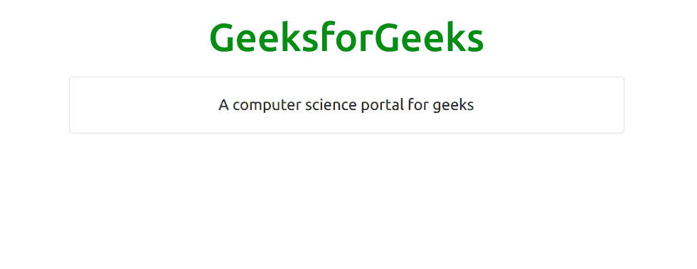

*   **页眉和页脚:****卡片页眉**为卡片提供页眉，**卡片页脚**为卡片提供页脚，如下所示。
    **例:**

## 超文本标记语言

```
<!DOCTYPE html>
<html lang="en">
    <head>
        <title>Bootstrap Card</title>
        <meta charset="utf-8" />
        <meta name="viewport"
              content="width=device-width,
                       initial-scale=1" />
        <!-- Load Bootstrap -->
        <link rel="stylesheet"
              href=
"https://stackpath.bootstrapcdn.com/bootstrap/5.0.0-alpha1/css/bootstrap.min.css"
              integrity=
"sha384-r4NyP46KrjDleawBgD5tp8Y7UzmLA05oM1iAEQ17CSuDqnUK2+k9luXQOfXJCJ4I"
              crossorigin="anonymous" />
        <script src=
"https://cdn.jsdelivr.net/npm/popper.js@1.16.0/dist/umd/popper.min.js"
                integrity=
"sha384-Q6E9RHvbIyZFJoft+2mJbHaEWldlvI9IOYy5n3zV9zzTtmI3UksdQRVvoxMfooAo"
                crossorigin="anonymous"></script>
        <script src=
"https://stackpath.bootstrapcdn.com/bootstrap/5.0.0-alpha1/js/bootstrap.min.js"
                integrity=
"sha384-oesi62hOLfzrys4LxRF63OJCXdXDipiYWBnvTl9Y9/TRlw5xlKIEHpNyvvDShgf/"
                crossorigin="anonymous"></script>
    </head>
    <body style="text-align: center;">
        <div class="container mt-3">
            <h1 style="color: green;">
                GeeksforGeeks
            </h1>

            <div class="container mt-3" style="width: 600px;">
                <div class="card">
                    <div class="card-header">Header</div>
                    <div class="card-body">Content</div>
                    <div class="card-footer">Footer</div>
                </div>
            </div>
        </div>
    </body>
</html>
```

**输出:**

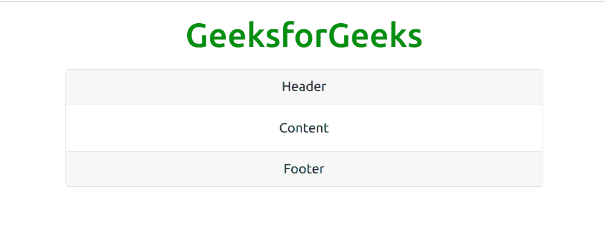

*   **标题和链接:****卡片标题**用于给卡片一个标题，**卡片链接**用于在卡片需要时提供卡片链接。
    **例:**

## 超文本标记语言

```
<!DOCTYPE html>
<html lang="en">
    <head>
        <title>Bootstrap Card</title>
        <meta charset="utf-8" />
        <meta name="viewport"
              content="width=device-width,
                       initial-scale=1" />
        <!-- Load Bootstrap -->
        <link rel="stylesheet"
              href=
"https://stackpath.bootstrapcdn.com/bootstrap/5.0.0-alpha1/css/bootstrap.min.css"
              integrity=
"sha384-r4NyP46KrjDleawBgD5tp8Y7UzmLA05oM1iAEQ17CSuDqnUK2+k9luXQOfXJCJ4I"
              crossorigin="anonymous" />
        <script src=
"https://cdn.jsdelivr.net/npm/popper.js@1.16.0/dist/umd/popper.min.js"
                integrity=
"sha384-Q6E9RHvbIyZFJoft+2mJbHaEWldlvI9IOYy5n3zV9zzTtmI3UksdQRVvoxMfooAo"
                crossorigin="anonymous"></script>
        <script src=
"https://stackpath.bootstrapcdn.com/bootstrap/5.0.0-alpha1/js/bootstrap.min.js"
                integrity=
"sha384-oesi62hOLfzrys4LxRF63OJCXdXDipiYWBnvTl9Y9/TRlw5xlKIEHpNyvvDShgf/"
                crossorigin="anonymous"></script>
    </head>
    <body style="text-align: center;">
        <div class="container mt-3">
            <h1 style="color: green;">
                GeeksforGeeks
            </h1>

            <div class="container mt-3"
                 style="width: 600px;">
                <div class="card">
                    <div class="card-body">
                        <h4 class="card-title">
                          Card title</h4>
                        <p class="card-text">
                          Some example text.
                          Some example text.</p>

                        <a href="#" class="card-link">
                          Card link</a>
                        <a href="#" class="card-link">
                          Another link</a>
                    </div>
                </div>
            </div>
        </div>
    </body>
</html>
```

**输出:**

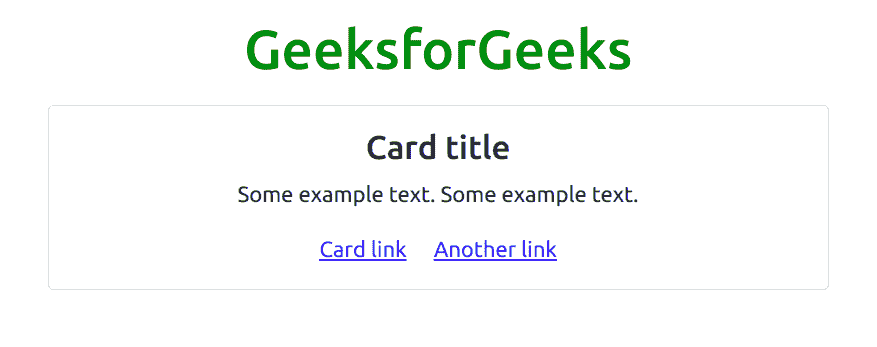

*   **图片:**卡片上的图片插入**卡片-img-top** 和**卡片-img-bottom** 在这两者的帮助下，使用 **img** 标签来添加图片。
    **示例:**

## 超文本标记语言

```
<!DOCTYPE html>
<html lang="en">
    <head>
        <title>Bootstrap Card</title>
        <meta charset="utf-8" />
        <meta name="viewport"
              content="width=device-width,
                       initial-scale=1" />
        <!-- Load Bootstrap -->
        <link rel="stylesheet"
              href=
"https://stackpath.bootstrapcdn.com/bootstrap/5.0.0-alpha1/css/bootstrap.min.css"
              integrity=
"sha384-r4NyP46KrjDleawBgD5tp8Y7UzmLA05oM1iAEQ17CSuDqnUK2+k9luXQOfXJCJ4I"
              crossorigin="anonymous" />
        <script src=
"https://cdn.jsdelivr.net/npm/popper.js@1.16.0/dist/umd/popper.min.js"
                integrity=
"sha384-Q6E9RHvbIyZFJoft+2mJbHaEWldlvI9IOYy5n3zV9zzTtmI3UksdQRVvoxMfooAo"
                crossorigin="anonymous"></script>
        <script src=
"https://stackpath.bootstrapcdn.com/bootstrap/5.0.0-alpha1/js/bootstrap.min.js"
                integrity=
"sha384-oesi62hOLfzrys4LxRF63OJCXdXDipiYWBnvTl9Y9/TRlw5xlKIEHpNyvvDShgf/"
                crossorigin="anonymous"></script>
    </head>
    <body style="text-align: center;">
        <div class="container mt-3">
            <h1 style="color: green;">
                GeeksforGeeks
            </h1>

            <div class="container mt-3"
                 style="width: 600px;">
                <div class="card">
                    
                    <div class="card-body">
                        <h4 class="card-title">Developer Guy</h4>
                        <p class="card-text">Developer Guy love to
                          develope front-end and back-end</p>

                        <a href="#"
                           class="btn btn-primary">
                          See Profile</a>
                    </div>
                </div>
            </div>
        </div>
    </body>
</html>
```

**输出:**


*   **按钮中的图像示例:**
    **示例:**

## 超文本标记语言

```
<!DOCTYPE html>
<html lang="en">
    <head>
        <title>Bootstrap Card</title>
        <meta charset="utf-8" />
        <meta name="viewport"
              content="width=device-width,
                       initial-scale=1" />
        <!-- Load Bootstrap -->
        <link rel="stylesheet"
              href=
"https://stackpath.bootstrapcdn.com/bootstrap/5.0.0-alpha1/css/bootstrap.min.css"
              integrity=
"sha384-r4NyP46KrjDleawBgD5tp8Y7UzmLA05oM1iAEQ17CSuDqnUK2+k9luXQOfXJCJ4I"
              crossorigin="anonymous" />
        <script src=
"https://cdn.jsdelivr.net/npm/popper.js@1.16.0/dist/umd/popper.min.js"
                integrity=
"sha384-Q6E9RHvbIyZFJoft+2mJbHaEWldlvI9IOYy5n3zV9zzTtmI3UksdQRVvoxMfooAo"
                crossorigin="anonymous"></script>
        <script src=
"https://stackpath.bootstrapcdn.com/bootstrap/5.0.0-alpha1/js/bootstrap.min.js"
                integrity=
"sha384-oesi62hOLfzrys4LxRF63OJCXdXDipiYWBnvTl9Y9/TRlw5xlKIEHpNyvvDShgf/"
                crossorigin="anonymous"></script>
    </head>
    <body style="text-align: center;">
        <div class="container mt-3">
            <h1 style="color: green;">
                GeeksforGeeks
            </h1>

            <div class="container mt-3" style="width: 600px;">
                <div class="card">
                    <div class="card-body">
                        <h4 class="card-title">Developer Guy</h4>
                        <p class="card-text">Developer Guy love to
                          develope front-end and back-end</p>

                        <a href="#"
                           class="btn btn-primary">See Profile</a>
                    </div>
                    
                </div>
            </div>
        </div>
    </body>
</html>
```

**输出:**


*   **图像叠加:**在这种情况下，我们必须在您用于卡片图像的同一行代码中使用一个名为**卡片-img-叠加**的额外类。这会将图像变成卡片背景，并覆盖卡片的文本。
    **例:**

## 超文本标记语言

```
<!DOCTYPE html>
<html lang="en">
    <head>
        <title>Bootstrap Card</title>
        <meta charset="utf-8" />
        <meta name="viewport"
              content="width=device-width,
                       initial-scale=1" />
        <!-- Load Bootstrap -->
        <link rel="stylesheet"
              href=
"https://stackpath.bootstrapcdn.com/bootstrap/5.0.0-alpha1/css/bootstrap.min.css"
              integrity=
"sha384-r4NyP46KrjDleawBgD5tp8Y7UzmLA05oM1iAEQ17CSuDqnUK2+k9luXQOfXJCJ4I"
              crossorigin="anonymous" />
        <script src=
"https://cdn.jsdelivr.net/npm/popper.js@1.16.0/dist/umd/popper.min.js"
                integrity=
"sha384-Q6E9RHvbIyZFJoft+2mJbHaEWldlvI9IOYy5n3zV9zzTtmI3UksdQRVvoxMfooAo"
                crossorigin="anonymous"></script>
        <script src=
"https://stackpath.bootstrapcdn.com/bootstrap/5.0.0-alpha1/js/bootstrap.min.js"
                integrity=
"sha384-oesi62hOLfzrys4LxRF63OJCXdXDipiYWBnvTl9Y9/TRlw5xlKIEHpNyvvDShgf/"
                crossorigin="anonymous"></script>
    </head>
    <body style="text-align: center;">
        <div class="container mt-3">
            <h1 style="color: green;">
                GeeksforGeeks
            </h1>

            <div class="container mt-3"
                 style="width: 600px;">
                <div class="card"
                     style="width: 400px;">
                    
                    <div class="card-img-overlay">
                        <div class="card-body">
                            <h4 class="card-title">
                              Developer Guy
                          </h4>
                            <p class="card-text"
                               style="color: red;">
                              Developer Guy love to develope
                              front-end and back-end</p>

                            <a href="#"
                               class="btn btn-primary">
                              See Profile
                          </a>
                        </div>
                    </div>
                </div>
            </div>
        </div>
    </body>
</html>
```

**输出:**

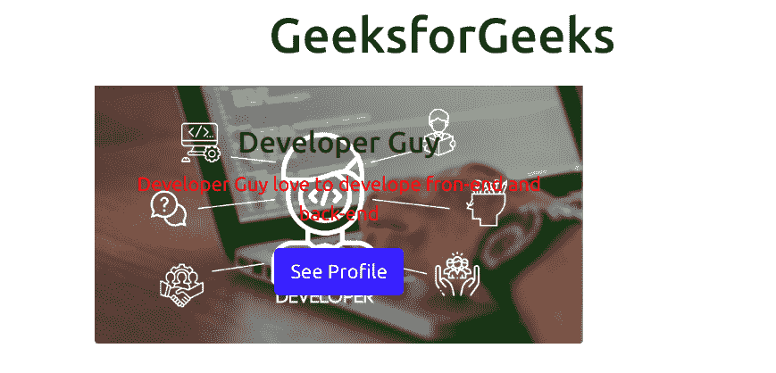

*   **卡组:**使用卡组将卡渲染为具有等宽等高列的单个附着元素。
    T3】例:

## 超文本标记语言

```
<!DOCTYPE html>
<html lang="en">
    <head>
        <title>Bootstrap Card</title>
        <meta charset="utf-8" />
        <meta name="viewport"
              content="width=device-width,
                       initial-scale=1" />
        <!-- Load Bootstrap -->
        <link rel="stylesheet"
              href=
"https://stackpath.bootstrapcdn.com/bootstrap/5.0.0-alpha1/css/bootstrap.min.css"
              integrity=
"sha384-r4NyP46KrjDleawBgD5tp8Y7UzmLA05oM1iAEQ17CSuDqnUK2+k9luXQOfXJCJ4I"
              crossorigin="anonymous" />
        <script src=
"https://cdn.jsdelivr.net/npm/popper.js@1.16.0/dist/umd/popper.min.js"
                integrity=
"sha384-Q6E9RHvbIyZFJoft+2mJbHaEWldlvI9IOYy5n3zV9zzTtmI3UksdQRVvoxMfooAo"
                crossorigin="anonymous"></script>
        <script src=
"https://stackpath.bootstrapcdn.com/bootstrap/5.0.0-alpha1/js/bootstrap.min.js"
                integrity=
"sha384-oesi62hOLfzrys4LxRF63OJCXdXDipiYWBnvTl9Y9/TRlw5xlKIEHpNyvvDShgf/"
                crossorigin="anonymous"></script>
    </head>
    <body style="text-align: center;">
        <div class="container mt-3">
            <h1 style="color: green;">
                GeeksforGeeks
            </h1>

            <div class="container mt-3"
                 style="width: 600px;">
                <div class="card-group">
                    <div class="card"
                         style="width: 200px;">
                        <div class="card-body">
                            <h4 class="card-title">
                              Developer Guy I
                          </h4>
                            <p class="card-text">
                              Developer Guy love to develop
                              front-end and back-end</p>

                            <a href="#"
                               class="btn btn-primary">
                              See Profile
                          </a>
                        </div>
                        
                    </div>
                    <div class="card"
                         style="width: 200px;">
                        <div class="card-body">
                            <h4 class="card-title">
                              Developer Guy II
                          </h4>
                            <p class="card-text">
                              Developer Guy love to develop
                              android apps</p>

                            <a href="#"
                               class="btn btn-primary">
                              See Profile
                          </a>
                        </div>
                        
                    </div>
                    <div class="card"
                         style="width: 200px;">
                        <div class="card-body">
                            <h4 class="card-title">
                              Developer Guy III
                          </h4>
                            <p class="card-text">
                              Developer Guy love to
                              develop machine learning models
                          </p>

                            <a href="#"
                               class="btn btn-primary">
                              See Profile</a>
                        </div>
                        
                    </div>
                </div>
            </div>
        </div>
    </body>
</html>
```

**输出:**


*   **列表组:**它在卡片中创建一个内容列表。
    T3】例:

## 超文本标记语言

```
<html lang="en">
    <head>
        <title>Bootstrap Card</title>
        <meta charset="utf-8" />
        <meta name="viewport"
              content="width=device-width,
                       initial-scale=1" />
        <!-- Load Bootstrap -->
        <link rel="stylesheet"
              href=
"https://stackpath.bootstrapcdn.com/bootstrap/5.0.0-alpha1/css/bootstrap.min.css"
              integrity=
"sha384-r4NyP46KrjDleawBgD5tp8Y7UzmLA05oM1iAEQ17CSuDqnUK2+k9luXQOfXJCJ4I"
              crossorigin="anonymous" />
        <script src=
"https://cdn.jsdelivr.net/npm/popper.js@1.16.0/dist/umd/popper.min.js"
                integrity=
"sha384-Q6E9RHvbIyZFJoft+2mJbHaEWldlvI9IOYy5n3zV9zzTtmI3UksdQRVvoxMfooAo"
                crossorigin="anonymous"></script>
        <script src=
"https://stackpath.bootstrapcdn.com/bootstrap/5.0.0-alpha1/js/bootstrap.min.js"
                integrity=
"sha384-oesi62hOLfzrys4LxRF63OJCXdXDipiYWBnvTl9Y9/TRlw5xlKIEHpNyvvDShgf/"
                crossorigin="anonymous"></script>
    </head>
    <body style="text-align: center;">
        <div class="container mt-3">
            <h1 style="color: green;">
                GeeksforGeeks
            </h1>

            <div class="container mt-3"
                 style="width: 600px;">
                <div class="card">
                    <ul class="list-group list-group-flush">
                        <li class="list-group-item">
                          Bootstrap</li>
                        <li class="list-group-item">
                          HTML</li>
                        <li class="list-group-item">
                          JavaScript</li>
                    </ul>
                </div>
            </div>
        </div>
    </body>
</html>
```

**输出:**

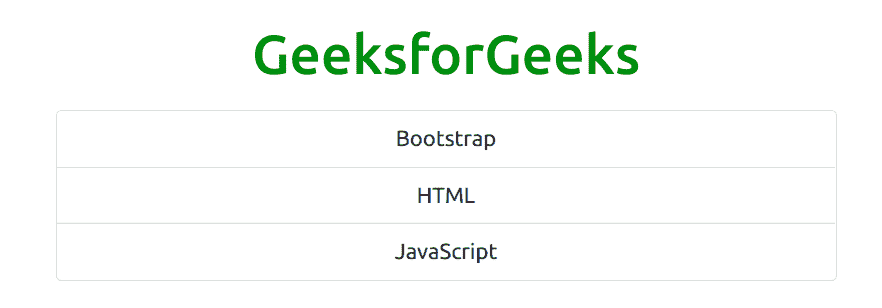

*   **厨房水槽:**它是由包含所有东西的卡片类型命名的，它是多种内容的混合和匹配，以制作您想要的卡片
    **示例:**

## 超文本标记语言

```
<html lang="en">
    <head>
        <title>Bootstrap Card</title>
        <meta charset="utf-8" />
        <meta name="viewport"
              content="width=device-width,
                       initial-scale=1" />
        <!-- Load Bootstrap -->
        <link rel="stylesheet"
              href=
"https://stackpath.bootstrapcdn.com/bootstrap/5.0.0-alpha1/css/bootstrap.min.css"
              integrity=
"sha384-r4NyP46KrjDleawBgD5tp8Y7UzmLA05oM1iAEQ17CSuDqnUK2+k9luXQOfXJCJ4I"
              crossorigin="anonymous" />
        <script src=
"https://cdn.jsdelivr.net/npm/popper.js@1.16.0/dist/umd/popper.min.js"
                integrity=
"sha384-Q6E9RHvbIyZFJoft+2mJbHaEWldlvI9IOYy5n3zV9zzTtmI3UksdQRVvoxMfooAo"
                crossorigin="anonymous"></script>
        <script src=
"https://stackpath.bootstrapcdn.com/bootstrap/5.0.0-alpha1/js/bootstrap.min.js"
                integrity=
"sha384-oesi62hOLfzrys4LxRF63OJCXdXDipiYWBnvTl9Y9/TRlw5xlKIEHpNyvvDShgf/"
                crossorigin="anonymous"></script>
    </head>
    <body style="text-align: center;">
        <div class="container mt-3">
            <h1 style="color: green;">
                GeeksforGeeks
            </h1>

            <div class="container mt-3"
                 style="width: 600px;">
                <div class="card">
                    <ul class="list-group list-group-flush">
                        <li class="list-group-item">
                          Bootstrap</li>
                        <li class="list-group-item">
                          HTML</li>
                        <li class="list-group-item">
                          JavaScript</li>
                    </ul>
                    <div class="card-body">
                        <a href="" class="class-link">
                          Cart</a>
                        <a href="" class="class-link">
                          Add Item</a>
                    </div>
                </div>
            </div>
        </div>
    </body>
</html>
```

**输出:**

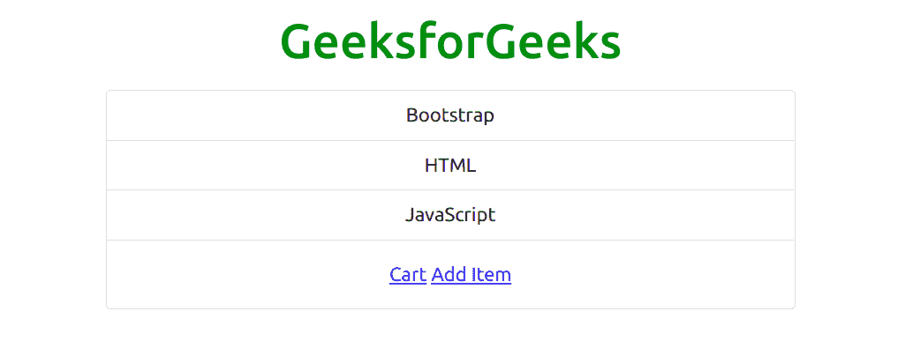

*   **导航:**为卡片增加导航栏。
    T3】例:

## 超文本标记语言

```
<html lang="en">
    <head>
        <title>Bootstrap Card</title>
        <meta charset="utf-8" />
        <meta name="viewport"
              content="width=device-width,
                       initial-scale=1" />
        <!-- Load Bootstrap -->
        <link rel="stylesheet"
              href=
"https://stackpath.bootstrapcdn.com/bootstrap/5.0.0-alpha1/css/bootstrap.min.css"
              integrity=
"sha384-r4NyP46KrjDleawBgD5tp8Y7UzmLA05oM1iAEQ17CSuDqnUK2+k9luXQOfXJCJ4I"
              crossorigin="anonymous" />
        <script src=
"https://cdn.jsdelivr.net/npm/popper.js@1.16.0/dist/umd/popper.min.js"
                integrity=
"sha384-Q6E9RHvbIyZFJoft+2mJbHaEWldlvI9IOYy5n3zV9zzTtmI3UksdQRVvoxMfooAo"
                crossorigin="anonymous"></script>
        <script src=
"https://stackpath.bootstrapcdn.com/bootstrap/5.0.0-alpha1/js/bootstrap.min.js"
                integrity=
"sha384-oesi62hOLfzrys4LxRF63OJCXdXDipiYWBnvTl9Y9/TRlw5xlKIEHpNyvvDShgf/"
                crossorigin="anonymous"></script>
    </head>
    <body style="text-align: center;">
        <div class="container mt-3">
            <h1 style="color: green;">
                GeeksforGeeks
            </h1>

            <div class="container mt-3"
                 style="width: 600px;">
                <div class="card-text-center">
                    <div class="card-header">
                        <ul class=
                            "nav nav-tabs card-header-tabs">
                            <li class="nav-item">
                                <a class="nav-link active"
                                   href="#">Active</a>
                            </li>
                            <li class="nav-item">
                                <a class="nav-link"
                                   href="#">link</a>
                            </li>
                            <li class="nav-item">
                                <a class="nav-link disabled"
                                   href="#">Disabled</a>
                            </li>
                        </ul>
                    </div>
                    <div class="card-block">
                        <h4 class="card-title">Title</h4>
                        <p class="card-text">
                          This the th test area</p>

                        <a href="#" btn-btn-primary>
                          Click me</a>
                    </div>
                </div>
            </div>
        </div>
    </body>
</html>
```

**输出:**

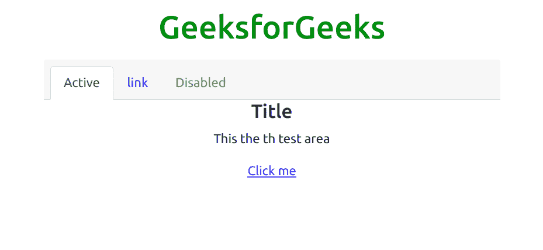

*   **药丸形态的另一个例子:**
    **例子:**

## 超文本标记语言

```
<html lang="en">
    <head>
        <title>Bootstrap Card</title>
        <meta charset="utf-8" />
        <meta name="viewport"
              content="width=device-width,
                       initial-scale=1" />
        <!-- Load Bootstrap -->
        <link rel="stylesheet"
              href=
"https://stackpath.bootstrapcdn.com/bootstrap/5.0.0-alpha1/css/bootstrap.min.css"
              integrity=
"sha384-r4NyP46KrjDleawBgD5tp8Y7UzmLA05oM1iAEQ17CSuDqnUK2+k9luXQOfXJCJ4I"
              crossorigin="anonymous" />
        <script src=
"https://cdn.jsdelivr.net/npm/popper.js@1.16.0/dist/umd/popper.min.js"
                integrity=
"sha384-Q6E9RHvbIyZFJoft+2mJbHaEWldlvI9IOYy5n3zV9zzTtmI3UksdQRVvoxMfooAo"
                crossorigin="anonymous"></script>
        <script src=
"https://stackpath.bootstrapcdn.com/bootstrap/5.0.0-alpha1/js/bootstrap.min.js"
                integrity=
"sha384-oesi62hOLfzrys4LxRF63OJCXdXDipiYWBnvTl9Y9/TRlw5xlKIEHpNyvvDShgf/"
                crossorigin="anonymous"></script>
    </head>
    <body style="text-align: center;">
        <div class="container mt-3">
            <h1 style="color: green;">
                GeeksforGeeks
            </h1>

            <div class="container mt-3"
                 style="width: 600px;">
                <div class="card-text-center">
                    <div class="card-header">
                        <ul class=
                            "nav nav-pills card-header-tabs">
                            <li class="nav-item">
                                <a class="nav-link active"
                                   href="#">Active</a>
                            </li>
                            <li class="nav-item">
                                <a class="nav-link"
                                   href="#">link</a>
                            </li>
                            <li class="nav-item">
                                <a class="nav-link disabled"
                                   href="#">Disabled</a>
                            </li>
                        </ul>
                    </div>
                    <div class="card-block">
                        <h4 class="card-title">Title</h4>
                        <p class="card-text">
                          This the th test area</p>

                        <a href="#"
                           btn-btn-primary>Click me</a>
                    </div>
                </div>
            </div>
        </div>
    </body>
</html>
```

**输出:**

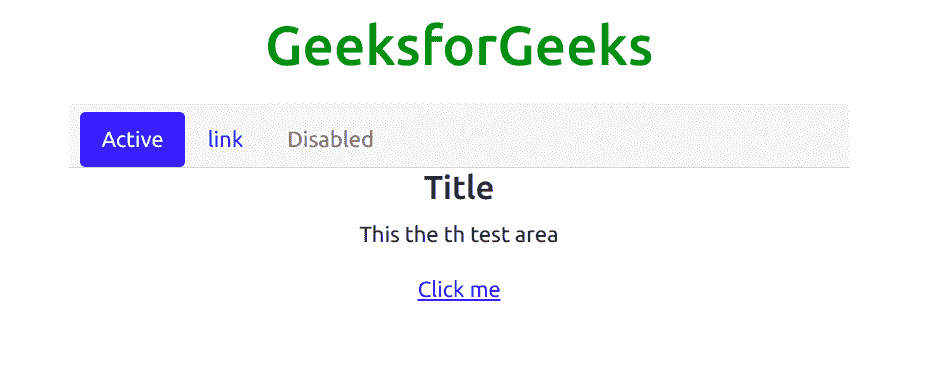

### 卡片中的文本对齐

我们可以使用 Bootstrap 的 Bootstrap 文本对齐类轻松更改 Bootstrap 中任何卡片或卡片特定部分的文本对齐。

下面是一个代码示例，显示了我们使用文本对齐类更改整个卡片或卡片特定部分的对齐方式的示例。

#### 代码:

和

#### 输出:

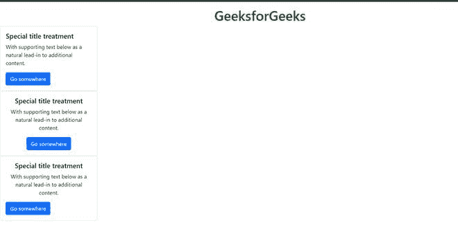

### 水平卡

使用网格类工具，我们可以创建一张卡片，其中卡片图像和卡片主体水平放置，而不是使用网格工具类垂直放置。该功能也是移动友好的，并且对响应性网站也很有用。

下面是一个代码示例，其中我们创建了一个样本卡，图像和卡体文本水平放置。

#### 代码:

## 超文本标记语言

```
<html lang="en">

<head>
    <title>Bootstrap Card</title>
    <meta charset="utf-8" />
    <meta name="viewport" content="width=device-width,
                       initial-scale=1" />
    <!--  Bootstrap CSS -->
    <link rel="stylesheet" href="https://stackpath.bootstrapcdn.com/bootstrap/5.0.0-alpha1/css/bootstrap.min.css"
        integrity="sha384-r4NyP46KrjDleawBgD5tp8Y7UzmLA05oM1iAEQ17CSuDqnUK2+k9luXQOfXJCJ4I" crossorigin="anonymous" />

</head>

<body>
    <div class="container mt-3">
        <h1 style="color: green; text-align: center;">
            GeeksforGeeks
        </h1>
    </div>
    <div class="card mb-2" style="max-width: 540px;">
        <div class="row g-0">
          <div class="col-md-6">
            
          </div>
          <div class="col-md-6">
            <div class="card-body">
              <h5 class="card-title">Card title</h5>
              <p class="card-text">The card body and the card image is placed horizontally.</p>

            </div>
          </div>
        </div>
      </div>

    <!-- Bootstrap JS -->
    <script src="https://cdn.jsdelivr.net/npm/popper.js@1.16.0/dist/umd/popper.min.js"
        integrity="sha384-Q6E9RHvbIyZFJoft+2mJbHaEWldlvI9IOYy5n3zV9zzTtmI3UksdQRVvoxMfooAo"
        crossorigin="anonymous"></script>
    <script src="https://stackpath.bootstrapcdn.com/bootstrap/5.0.0-alpha1/js/bootstrap.min.js"
        integrity="sha384-oesi62hOLfzrys4LxRF63OJCXdXDipiYWBnvTl9Y9/TRlw5xlKIEHpNyvvDShgf/"
        crossorigin="anonymous"></script>
</body>

</html>
```

#### 输出:

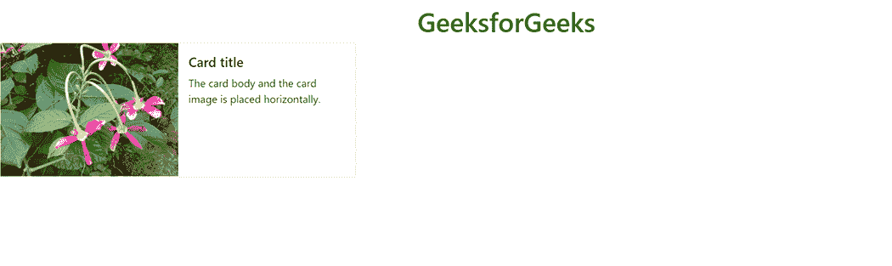

### 更改卡片的颜色

我们可以使用 Bootstrap 中的背景实用程序类和文本颜色类来改变卡片的颜色。

#### 语法:

```
<div class="card text-white bg-primary"></div>
```

#### 代码:

## 超文本标记语言

```
<html lang="en">

<head>
    <title>Bootstrap Card</title>
    <meta charset="utf-8" />
    <meta name="viewport" content="width=device-width,
                       initial-scale=1" />
    <!--  Bootstrap CSS -->
    <link rel="stylesheet" href="https://stackpath.bootstrapcdn.com/bootstrap/5.0.0-alpha1/css/bootstrap.min.css"
        integrity="sha384-r4NyP46KrjDleawBgD5tp8Y7UzmLA05oM1iAEQ17CSuDqnUK2+k9luXQOfXJCJ4I" crossorigin="anonymous" />

</head>

<body>
    <div class="container mt-3">
        <h1 style="color: green; text-align: center;">
            GeeksforGeeks
        </h1>
    </div>

    <div class="card text-white bg-primary mb-3" style="max-width: 18rem;">
        <div class="card-header">This is the card header</div>
        <div class="card-body">
          <h5 class="card-title">This is card title</h5>
          <p class="card-text">This is the body of the card made using Bootstrap Classes.</p>

        </div>
      </div>
      <div class="card text-white bg-secondary mb-3" style="max-width: 18rem;">
        <div class="card-header">This is the card header</div>
        <div class="card-body">
          <h5 class="card-title">This is card title</h5>
          <p class="card-text">This is the body of the card made using Bootstrap Classes.</p>

        </div>
      </div>
      <div class="card text-white bg-success mb-3" style="max-width: 18rem;">
        <div class="card-header">This is the card header</div>
        <div class="card-body">
          <h5 class="card-title">This is card title</h5>
          <p class="card-text">This is the body of the card made using Bootstrap Classes.</p>

        </div>
      </div>
      <div class="card text-white bg-danger mb-3" style="max-width: 18rem;">
        <div class="card-header">This is the card header</div>
        <div class="card-body">
          <h5 class="card-title">This is card title</h5>
          <p class="card-text">This is the body of the card made using Bootstrap Classes.</p>

        </div>
      </div>

    <!-- Bootstrap JS -->
    <script src="https://cdn.jsdelivr.net/npm/popper.js@1.16.0/dist/umd/popper.min.js"
        integrity="sha384-Q6E9RHvbIyZFJoft+2mJbHaEWldlvI9IOYy5n3zV9zzTtmI3UksdQRVvoxMfooAo"
        crossorigin="anonymous"></script>
    <script src="https://stackpath.bootstrapcdn.com/bootstrap/5.0.0-alpha1/js/bootstrap.min.js"
        integrity="sha384-oesi62hOLfzrys4LxRF63OJCXdXDipiYWBnvTl9Y9/TRlw5xlKIEHpNyvvDShgf/"
        crossorigin="anonymous"></script>
</body>

</html>
```

#### 输出:

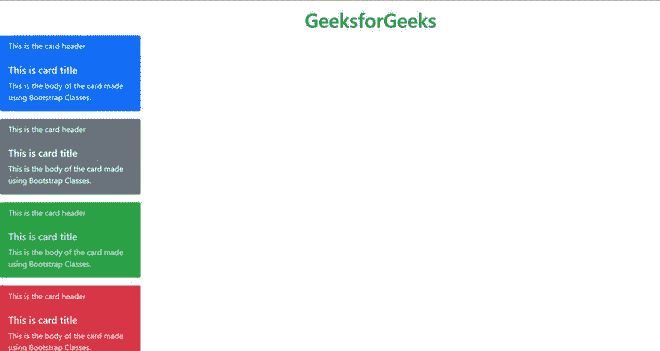

### 给卡片添加边框

我们可以使用 Bootstrap 框架中的边界实用程序类给卡片添加边界，比如边界主类、边界成功类、边界危险类等等。

#### 语法:

```
<div class="card border-primary"></div>
```

#### 完整代码:

## 超文本标记语言

```
<html lang="en">

<head>
    <title>Bootstrap Card</title>
    <meta charset="utf-8" />
    <meta name="viewport" content="width=device-width,
                       initial-scale=1" />
    <!--  Bootstrap CSS -->
    <link rel="stylesheet" href="https://stackpath.bootstrapcdn.com/bootstrap/5.0.0-alpha1/css/bootstrap.min.css"
        integrity="sha384-r4NyP46KrjDleawBgD5tp8Y7UzmLA05oM1iAEQ17CSuDqnUK2+k9luXQOfXJCJ4I" crossorigin="anonymous" />

</head>

<body>
    <div class="container mt-3">
        <h1 style="color: green; text-align: center;">
            GeeksforGeeks
        </h1>
    </div>

    <div class="card border-primary text-primary mb-3" style="max-width: 18rem;">
        <div class="card-header">This is the card header</div>
        <div class="card-body">
            <h5 class="card-title">This is card title</h5>
            <p class="card-text">This is the body of the card made using Bootstrap Classes.</p>

        </div>
    </div>
    <div class="card text-success border-success mb-3" style="max-width: 18rem;">
        <div class="card-header">This is the card header</div>
        <div class="card-body">
            <h5 class="card-title">This is card title</h5>
            <p class="card-text">This is the body of the card made using Bootstrap Classes.</p>

        </div>
    </div>
    <div class="card text-secondary border-secondary mb-3" style="max-width: 18rem;">
        <div class="card-header">This is the card header</div>
        <div class="card-body">
            <h5 class="card-title">This is card title</h5>
            <p class="card-text">This is the body of the card made using Bootstrap Classes.</p>

        </div>
    </div>
    <div class="card text-danger border-danger mb-3" style="max-width: 18rem;">
        <div class="card-header">This is the card header</div>
        <div class="card-body">
            <h5 class="card-title">This is card title</h5>
            <p class="card-text">This is the body of the card made using Bootstrap Classes.</p>

        </div>
    </div>

    <!-- Bootstrap JS -->
    <script src="https://cdn.jsdelivr.net/npm/popper.js@1.16.0/dist/umd/popper.min.js"
        integrity="sha384-Q6E9RHvbIyZFJoft+2mJbHaEWldlvI9IOYy5n3zV9zzTtmI3UksdQRVvoxMfooAo"
        crossorigin="anonymous"></script>
    <script src="https://stackpath.bootstrapcdn.com/bootstrap/5.0.0-alpha1/js/bootstrap.min.js"
        integrity="sha384-oesi62hOLfzrys4LxRF63OJCXdXDipiYWBnvTl9Y9/TRlw5xlKIEHpNyvvDShgf/"
        crossorigin="anonymous"></script>
</body>

</html>
```

#### 输出:

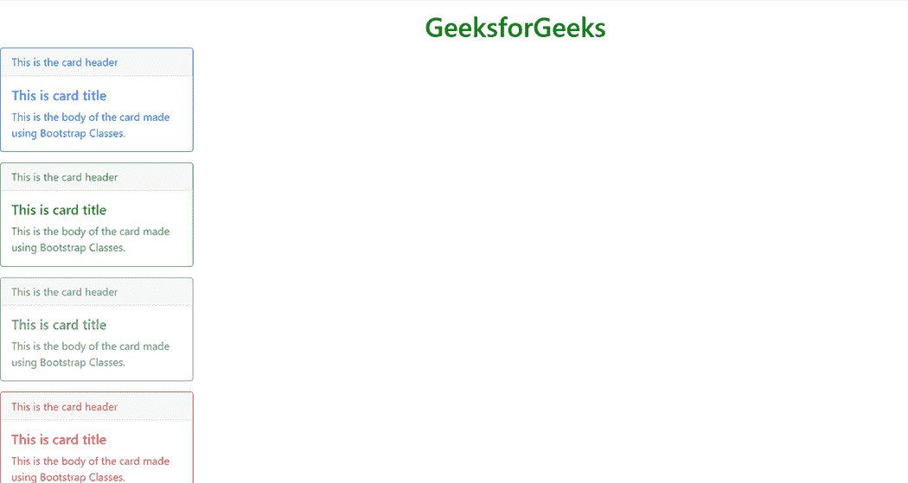

### 支持的浏览器

*   谷歌 Chrome
*   Mozilla Firefox
*   旅行队
*   勇敢的浏览器
*   歌剧