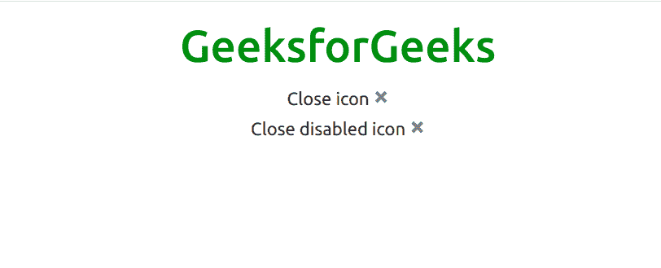

# 自举 5 |关闭按钮

> 原文:[https://www.geeksforgeeks.org/bootstrap-5-close-button/](https://www.geeksforgeeks.org/bootstrap-5-close-button/)

Bootstrap 5 提供了一个新的组件，它是一个关闭按钮，可以用来关闭像模式和警报这样的内容。可以使用 **bootstrap.js** 或 **bootstrap.min.js** 将其包含在网页中。该组件可以与模型、警报和弹出窗口相结合。禁用的关闭按钮有*指针事件:无；*应用于，防止悬停和活动状态触发。

**示例:**

```
<!DOCTYPE html>
<html>
    <head>
        <title>
            Bootstrap 5 | Close button
        </title>

        <!-- Load Bootstrap -->
        <link rel="stylesheet" 
              href=
"https://stackpath.bootstrapcdn.com/bootstrap/5.0.0-alpha1/css/bootstrap.min.css" 
              integrity=
"sha384-r4NyP46KrjDleawBgD5tp8Y7UzmLA05oM1iAEQ17CSuDqnUK2+k9luXQOfXJCJ4I" 
              crossorigin="anonymous" />
        <script src=
"https://cdn.jsdelivr.net/npm/popper.js@1.16.0/dist/umd/popper.min.js" 
                integrity=
"sha384-Q6E9RHvbIyZFJoft+2mJbHaEWldlvI9IOYy5n3zV9zzTtmI3UksdQRVvoxMfooAo" 
                crossorigin="anonymous">
      </script>
        <script src=
"https://stackpath.bootstrapcdn.com/bootstrap/5.0.0-alpha1/js/bootstrap.min.js" 
                integrity=
"sha384-oesi62hOLfzrys4LxRF63OJCXdXDipiYWBnvTl9Y9/TRlw5xlKIEHpNyvvDShgf/" 
                crossorigin="anonymous">
      </script>
    </head>

    <body style="text-align: center;">
        <div class="container mt-3">
            <h1 style="color: green;">
                GeeksforGeeks
            </h1>
            Close icon
            <button type="button"
                    class="close"
                    aria-label="Close">
                <span aria-hidden="true">×</span>
            </button>
            <br />

            Close disabled icon
            <button type="button"
                    class="close"
                    aria-label="Close" 
                    disabled>
                <span aria-hidden="true">×</span>
            </button>
        </div>
    </body>
</html>
```

**输出:**



参考:[https://V5 . getbootstrap . com/docs/5.0/components/close-button/](https://v5.getbootstrap.com/docs/5.0/components/close-button/)