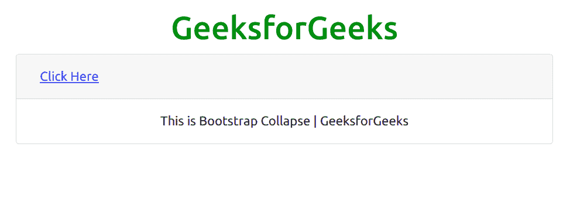
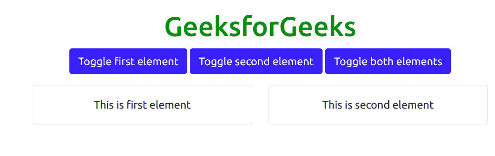

# 自举 5 崩溃

> 原文:[https://www.geeksforgeeks.org/bootstrap-5-collapse/](https://www.geeksforgeeks.org/bootstrap-5-collapse/)

Bootstrap 5 是 Bootstrap 的最新主要版本，在该版本中，他们修改了用户界面并进行各种更改。“折叠”用于切换项目中内容的可见性，包括几个类和 Bootstrap 5 附带的 JavaScript 插件。折叠组件的工作基于应用的类更改。例如 ***。*折叠**隐藏**内容*。在过渡期间应用折叠*** 和 ***。折叠显示*** 显示内容。

**语法:**

```
<div class="collapse"> Contents... <div>
```

**示例 1:** 该示例使用 Bootstrap 5 中的按钮和链接显示可折叠 div 的工作方式。

```
<!DOCTYPE html>
<html>
    <head>
        <!-- Load Bootstrap -->
        <link rel="stylesheet"
              href=
"https://stackpath.bootstrapcdn.com/bootstrap/5.0.0-alpha1/css/bootstrap.min.css" 
              integrity=
"sha384-r4NyP46KrjDleawBgD5tp8Y7UzmLA05oM1iAEQ17CSuDqnUK2+k9luXQOfXJCJ4I"
              crossorigin="anonymous" />
        <script src=
"https://cdn.jsdelivr.net/npm/popper.js@1.16.0/dist/umd/popper.min.js"
                integrity=
"sha384-Q6E9RHvbIyZFJoft+2mJbHaEWldlvI9IOYy5n3zV9zzTtmI3UksdQRVvoxMfooAo"
                crossorigin="anonymous">
      </script>
        <script src=
"https://stackpath.bootstrapcdn.com/bootstrap/5.0.0-alpha1/js/bootstrap.min.js" 
                integrity=
"sha384-oesi62hOLfzrys4LxRF63OJCXdXDipiYWBnvTl9Y9/TRlw5xlKIEHpNyvvDShgf/" 
                crossorigin="anonymous">
      </script>
    </head>
    <body style="text-align: center;">
        <div class="container mt-3"
             style="width: 700px;">
            <h1 style="color: green;">
                GeeksforGeeks
            </h1>
            <p>
                <a class="btn btn-primary"
                   data-toggle="collapse"
                   href="#collapseExample"
                   role="button">
                    Link with href
                </a>
                <button class="btn btn-primary" 
                        type="button"
                        data-toggle="collapse" 
                        data-target="#collapseExample">
                    Button with data-target
                </button>
            </p>
            <div class="collapse" 
                 id="collapseExample">
                <div class="card card-body">
                    GeeksforGeeks
                </div>
            </div>
        </div>
    </body>
</html>
```

**输出:**


**示例 2:** 此示例用于显示 Bootstrap 5 中可折叠卡片的工作方式。

```
<!DOCTYPE html>
<html>
    <head>
        <!-- Load Bootstrap -->
        <link rel="stylesheet"
              href=
"https://stackpath.bootstrapcdn.com/bootstrap/5.0.0-alpha1/css/bootstrap.min.css"
              integrity=
"sha384-r4NyP46KrjDleawBgD5tp8Y7UzmLA05oM1iAEQ17CSuDqnUK2+k9luXQOfXJCJ4I" 
              crossorigin="anonymous" />
        <script src=
"https://cdn.jsdelivr.net/npm/popper.js@1.16.0/dist/umd/popper.min.js"
                integrity=
"sha384-Q6E9RHvbIyZFJoft+2mJbHaEWldlvI9IOYy5n3zV9zzTtmI3UksdQRVvoxMfooAo" 
                crossorigin="anonymous">
      </script>
        <script src=
"https://stackpath.bootstrapcdn.com/bootstrap/5.0.0-alpha1/js/bootstrap.min.js"
                integrity=
"sha384-oesi62hOLfzrys4LxRF63OJCXdXDipiYWBnvTl9Y9/TRlw5xlKIEHpNyvvDShgf/" 
                crossorigin="anonymous">
      </script>
    </head>

    <body style="text-align: center;">
        <div class="container mt-3"
             style="width: 700px;">
            <h1 style="color: green;">
                GeeksforGeeks
            </h1>
            <div class="accordion" 
                 id="accordionExample">
                <div class="card">
                    <div class="card-header"
                         id="headingThree">
                        <h2 class="mb-0">
                            <button class="btn btn-link 
                                           btn-block
                                           text-left 
                                           collapsed" 
                                    type="button"
                                    data-toggle="collapse" 
                                    data-target=
                                    "#collapseThree">
                                Click Here
                            </button>
                        </h2>
                    </div>
                    <div id="collapseThree" 
                         class="collapse"
                         data-parent=
                       "#accordionExample">
                        <div class="card-body">
          This is Bootstrap Collapse | GeeksforGeeks
                        </div>
                    </div>
                </div>
            </div>
        </div>
    </body>
</html>
```

**输出:**



**示例 3:** 此示例用于显示 Bootstrap 5 中多个可折叠凹坑的工作情况。

```
<!DOCTYPE html>
<html>
    <head>
        <!-- Load Bootstrap -->
        <link rel="stylesheet"
              href=
"https://stackpath.bootstrapcdn.com/bootstrap/5.0.0-alpha1/css/bootstrap.min.css"
              integrity=
"sha384-r4NyP46KrjDleawBgD5tp8Y7UzmLA05oM1iAEQ17CSuDqnUK2+k9luXQOfXJCJ4I"
              crossorigin="anonymous" />
        <script src=
"https://cdn.jsdelivr.net/npm/popper.js@1.16.0/dist/umd/popper.min.js" 
                integrity=
"sha384-Q6E9RHvbIyZFJoft+2mJbHaEWldlvI9IOYy5n3zV9zzTtmI3UksdQRVvoxMfooAo"
                crossorigin="anonymous">
      </script>
        <script src=
"https://stackpath.bootstrapcdn.com/bootstrap/5.0.0-alpha1/js/bootstrap.min.js" 
                integrity=           
"sha384-oesi62hOLfzrys4LxRF63OJCXdXDipiYWBnvTl9Y9/TRlw5xlKIEHpNyvvDShgf/" 
                crossorigin="anonymous">
      </script>
    </head>

    <body style="text-align: center;">
        <div class="container mt-3" 
             style="width: 700px;">
            <h1 style="color: green;">
                GeeksforGeeks
            </h1>
            <p>
                <a class="btn btn-primary" 
                   data-toggle="collapse" 
                   href="#multiCollapseExample1"
                   role="button"> Toggle first element</a>
                <button class="btn btn-primary" 
                        type="button" 
                        data-toggle="collapse" 
                        data-target="#multiCollapseExample2">
                    Toggle second element
                </button>
                <button class="btn btn-primary" 
                        type="button" 
                        data-toggle="collapse" 
                        data-target=".multi-collapse">
                    Toggle both elements
                </button>
            </p>
            <div class="row">
                <div class="col">
                    <div class="collapse multi-collapse"
                         id="multiCollapseExample1">
                        <div class="card card-body">
                            This is first element
                        </div>
                    </div>
                </div>
                <div class="col">
                    <div class="collapse multi-collapse"
                         id="multiCollapseExample2">
                        <div class="card card-body">
                            This is second element
                        </div>
                    </div>
                </div>
            </div>
        </div>
    </body>
</html>
```

**输出:**

