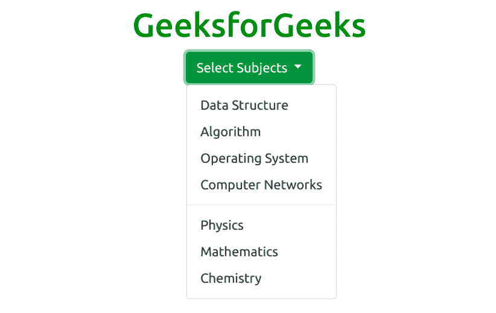

# 自举 5 次下降

> 原文:[https://www.geeksforgeeks.org/bootstrap-5-dropdowns/](https://www.geeksforgeeks.org/bootstrap-5-dropdowns/)

Bootstrap 5 是 Bootstrap 的最新主要版本，在该版本中，他们修改了用户界面并进行各种更改。下拉列表是可切换的上下文覆盖，用于显示链接列表等。它们与包含的引导下拉 JavaScript 插件进行交互。它们是通过点击而不是悬停来切换的；这是一个有意的设计决定。

**语法:**

```html
<div class="dropdown"> Contents... <div>
```

**示例 1:** 该示例使用 Bootstrap 5 中的按钮显示下拉菜单的工作方式。

```html
<!DOCTYPE html>
<html>
    <head>
        <!-- Load Bootstrap -->
        <link rel="stylesheet" 
              href=
"https://stackpath.bootstrapcdn.com/bootstrap/5.0.0-alpha1/css/bootstrap.min.css"
              integrity=
"sha384-r4NyP46KrjDleawBgD5tp8Y7UzmLA05oM1iAEQ17CSuDqnUK2+k9luXQOfXJCJ4I" 
              crossorigin="anonymous" />
        <script src=
"https://cdn.jsdelivr.net/npm/popper.js@1.16.0/dist/umd/popper.min.js" 
                integrity=
"sha384-Q6E9RHvbIyZFJoft+2mJbHaEWldlvI9IOYy5n3zV9zzTtmI3UksdQRVvoxMfooAo" 
                crossorigin="anonymous">
      </script>
        <script src=
"https://stackpath.bootstrapcdn.com/bootstrap/5.0.0-alpha1/js/bootstrap.min.js" 
                integrity=
"sha384-oesi62hOLfzrys4LxRF63OJCXdXDipiYWBnvTl9Y9/TRlw5xlKIEHpNyvvDShgf/" 
                crossorigin="anonymous">
      </script>
    </head>
    <body style="text-align: center;">
        <div class="container mt-3"
             style="width: 700px;">
            <h1 style="color: green;">
                GeeksforGeeks
            </h1>
            <div class="dropdown">
                <button type="button"
                        class="btn btn-success dropdown-toggle"
                        data-toggle="dropdown">
                    Select CS Subjects
                </button>

                <div class="dropdown-menu">
                    <a class="dropdown-item" 
                       href="#">Data Structure</a>
                    <a class="dropdown-item" 
                       href="#">Algorithm</a>
                    <a class="dropdown-item" 
                       href="#">Operating System</a>
                    <a class="dropdown-item" 
                       href="#">Computer Networks</a>
                </div>
            </div>
        </div>
    </body>
</html>
```

**输出:**


**下拉分隔线:**该。dropdown-divider 类用于通过使用细水平线来划分下拉菜单列表。此示例显示了 Bootstrap 5 中可折叠卡的工作方式。

```html
<!DOCTYPE html>
<html>
    <head>
        <!-- Load Bootstrap -->
        <link rel="stylesheet"
              href=
"https://stackpath.bootstrapcdn.com/bootstrap/5.0.0-alpha1/css/bootstrap.min.css" 
              integrity=
"sha384-r4NyP46KrjDleawBgD5tp8Y7UzmLA05oM1iAEQ17CSuDqnUK2+k9luXQOfXJCJ4I" 
              crossorigin="anonymous" />
        <script src=
"https://cdn.jsdelivr.net/npm/popper.js@1.16.0/dist/umd/popper.min.js" 
                integrity=
"sha384-Q6E9RHvbIyZFJoft+2mJbHaEWldlvI9IOYy5n3zV9zzTtmI3UksdQRVvoxMfooAo"
                crossorigin="anonymous"></script>
        <script src=
"https://stackpath.bootstrapcdn.com/bootstrap/5.0.0-alpha1/js/bootstrap.min.js" 
                integrity=
"sha384-oesi62hOLfzrys4LxRF63OJCXdXDipiYWBnvTl9Y9/TRlw5xlKIEHpNyvvDShgf/" 
                crossorigin="anonymous"></script>
    </head>

    <body style="text-align: center;">
        <div class="container mt-3"
             style="width: 700px;">
            <h1 style="color: green;">
                GeeksforGeeks
            </h1>
            <div class="dropdown">
                <button type="button" 
                        class="btn btn-success 
                               dropdown-toggle" 
                        data-toggle="dropdown">
                    Select Subjects
                </button>
                <div class="dropdown-menu">
                    <a class="dropdown-item"
                       href="#">Data Structure</a>
                    <a class="dropdown-item" 
                       href="#">Algorithm</a>
                    <a class="dropdown-item" 
                       href="#">Operating System</a>
                    <a class="dropdown-item" 
                       href="#">Computer Networks</a>

                    <div class="dropdown-divider"></div>
                    <a class="dropdown-item" 
                       href="#">Physics</a>
                    <a class="dropdown-item" 
                       href="#">Mathematics</a>
                    <a class="dropdown-item" 
                       href="#">Chemistry</a>
                </div>
            </div>
        </div>
    </body>
</html>
```

**输出:**



**下拉标题:**该。dropdown-header 类用于在下拉列表中添加标题部分。

```html
<!DOCTYPE html>
<html>
    <head>
        <!-- Load Bootstrap -->
        <link rel="stylesheet" 
              href=
"https://stackpath.bootstrapcdn.com/bootstrap/5.0.0-alpha1/css/bootstrap.min.css" 
              integrity=
"sha384-r4NyP46KrjDleawBgD5tp8Y7UzmLA05oM1iAEQ17CSuDqnUK2+k9luXQOfXJCJ4I" 
              crossorigin="anonymous" />
        <script src=
"https://cdn.jsdelivr.net/npm/popper.js@1.16.0/dist/umd/popper.min.js"
                integrity=
"sha384-Q6E9RHvbIyZFJoft+2mJbHaEWldlvI9IOYy5n3zV9zzTtmI3UksdQRVvoxMfooAo" 
                crossorigin="anonymous">
      </script>
        <script src=
"https://stackpath.bootstrapcdn.com/bootstrap/5.0.0-alpha1/js/bootstrap.min.js"
                integrity=
"sha384-oesi62hOLfzrys4LxRF63OJCXdXDipiYWBnvTl9Y9/TRlw5xlKIEHpNyvvDShgf/"
                crossorigin="anonymous">
      </script>
    </head>

    <body style="text-align: center;">
        <div class="container mt-3" 
             style="width: 700px;">
            <h1 style="color: green;">
                GeeksforGeeks
            </h1>
            <div class="dropdown">
                <button type="button" 
                        class="btn btn-success
                               dropdown-toggle"
                        data-toggle="dropdown">
                    Select Subjects
                </button>

                <div class="dropdown-menu">
                    <strong class="dropdown-header">
                      CS Subjects</strong>
                    <a class="dropdown-item" 
                       href="#">Data Structure</a>
                    <a class="dropdown-item"
                       href="#">Algorithm</a>
                    <a class="dropdown-item" 
                       href="#">Operating System</a>
                    <a class="dropdown-item" 
                       href="#">Computer Networks</a>

                    <div class="dropdown-divider"></div>
                    <strong class="dropdown-header">
                      Other Subjects</strong>
                    <a class="dropdown-item" 
                       href="#">Physics</a>
                    <a class="dropdown-item"
                       href="#">Mathematics</a>
                    <a class="dropdown-item" 
                       href="#">Chemistry</a>
                </div>
            </div>
        </div>
    </body>
</html>
```

**输出:**


**禁用和激活项目:***。激活*类用于添加高亮显示的列表项。*。禁用*类用于禁用物品列表。

```html
<!DOCTYPE html>
<html>
    <head>
        <!-- Load Bootstrap -->
        <link rel="stylesheet" 
              href=
"https://stackpath.bootstrapcdn.com/bootstrap/5.0.0-alpha1/css/bootstrap.min.css" 
              integrity=
"sha384-r4NyP46KrjDleawBgD5tp8Y7UzmLA05oM1iAEQ17CSuDqnUK2+k9luXQOfXJCJ4I"
              crossorigin="anonymous" />
        <script src=
"https://cdn.jsdelivr.net/npm/popper.js@1.16.0/dist/umd/popper.min.js" 
                integrity=
"sha384-Q6E9RHvbIyZFJoft+2mJbHaEWldlvI9IOYy5n3zV9zzTtmI3UksdQRVvoxMfooAo"
                crossorigin="anonymous"></script>
        <script src=
"https://stackpath.bootstrapcdn.com/bootstrap/5.0.0-alpha1/js/bootstrap.min.js"
                integrity=
"sha384-oesi62hOLfzrys4LxRF63OJCXdXDipiYWBnvTl9Y9/TRlw5xlKIEHpNyvvDShgf/" 
                crossorigin="anonymous"></script>
    </head>

    <body style="text-align: center;">
        <div class="container mt-3" 
             style="width: 700px;">
            <h1 style="color: green;">
                GeeksforGeeks
            </h1>
            <div class="dropdown">
                <button type="button" 
                        class="btn btn-success
                               dropdown-toggle" 
                        data-toggle="dropdown">
                    Select Subjects
                </button>

                <div class="dropdown-menu">
                    <a class="dropdown-item active"
                       href="#">Data Structure</a>
                    <a class="dropdown-item disabled" 
                       href="#">Algorithm</a>
                    <a class="dropdown-item active"
                       href="#">Operating System</a>
                    <a class="dropdown-item"
                       href="#">Computer Networks</a>
                </div>
            </div>
        </div>
    </body>
</html>
```

**输出:**


**下拉位置:***。右移*和*。dropleft* 类用于设置下拉列表在左右两侧的位置。

```html
<!DOCTYPE html>
<html>
    <head>
        <!-- Load Bootstrap -->
        <link rel="stylesheet" 
              href=
"https://stackpath.bootstrapcdn.com/bootstrap/5.0.0-alpha1/css/bootstrap.min.css" 
              integrity=
"sha384-r4NyP46KrjDleawBgD5tp8Y7UzmLA05oM1iAEQ17CSuDqnUK2+k9luXQOfXJCJ4I" 
              crossorigin="anonymous" />
        <script src=
"https://cdn.jsdelivr.net/npm/popper.js@1.16.0/dist/umd/popper.min.js" 
                integrity=
"sha384-Q6E9RHvbIyZFJoft+2mJbHaEWldlvI9IOYy5n3zV9zzTtmI3UksdQRVvoxMfooAo" 
                crossorigin="anonymous">
      </script>
        <script src=
"https://stackpath.bootstrapcdn.com/bootstrap/5.0.0-alpha1/js/bootstrap.min.js" 
                integrity=
"sha384-oesi62hOLfzrys4LxRF63OJCXdXDipiYWBnvTl9Y9/TRlw5xlKIEHpNyvvDShgf/" 
                crossorigin="anonymous">
      </script>
    </head>

    <body style="text-align: center;">
        <div class="container mt-3" 
             style="width: 700px;">
            <h1 style="color: green;">
                GeeksforGeeks
            </h1>
            <div class="dropdown dropright">
                <button type="button" 
                        class="btn btn-success dropdown-toggle" 
                        data-toggle="dropdown">
                    Select Subjects
                </button>

                <div class="dropdown-menu">
                    <a class="dropdown-item"
                       href="#">Data Structure</a>
                    <a class="dropdown-item" 
                       href="#">Algorithm</a>
                    <a class="dropdown-item" 
                       href="#">Operating System</a>
                    <a class="dropdown-item" 
                       href="#">Computer Networks</a>
                </div>
            </div>
        </div>
    </body>
</html>
```

**输出:**


**例 2:**

```html
<!DOCTYPE html>
<html>
    <head>
        <!-- Load Bootstrap -->
        <link rel="stylesheet" 
              href=
"https://stackpath.bootstrapcdn.com/bootstrap/5.0.0-alpha1/css/bootstrap.min.css"
              integrity=
"sha384-r4NyP46KrjDleawBgD5tp8Y7UzmLA05oM1iAEQ17CSuDqnUK2+k9luXQOfXJCJ4I" 
              crossorigin="anonymous" />
        <script src=
"https://cdn.jsdelivr.net/npm/popper.js@1.16.0/dist/umd/popper.min.js" 
                integrity=
"sha384-Q6E9RHvbIyZFJoft+2mJbHaEWldlvI9IOYy5n3zV9zzTtmI3UksdQRVvoxMfooAo" 
                crossorigin="anonymous">
      </script>
        <script src=
"https://stackpath.bootstrapcdn.com/bootstrap/5.0.0-alpha1/js/bootstrap.min.js" 
                integrity=
"sha384-oesi62hOLfzrys4LxRF63OJCXdXDipiYWBnvTl9Y9/TRlw5xlKIEHpNyvvDShgf/" 
                crossorigin="anonymous">
      </script>
    </head>

    <body style="text-align: center;">
        <div class="container mt-3" 
             style="width: 700px;">
            <h1 style="color: green;">
                GeeksforGeeks
            </h1>
            <div class="dropdown dropleft">
                <button type="button" 
                        class="btn btn-success 
                               dropdown-toggle" 
                        data-toggle="dropdown">
                    Select Subjects
                </button>

                <div class="dropdown-menu">
                    <a class="dropdown-item" 
                       href="#">Data Structure</a>
                    <a class="dropdown-item" 
                       href="#">Algorithm</a>
                    <a class="dropdown-item" 
                       href="#">Operating System</a>
                    <a class="dropdown-item" 
                       href="#">Computer Networks</a>
                </div>
            </div>
        </div>
    </body>
</html>
```

**输出:**


**下拉菜单右对齐:***。下拉菜单-右*类用于设置下拉菜单的右对齐。

```html
<!DOCTYPE html>
<html>
    <head>
        <!-- Load Bootstrap -->
        <link rel="stylesheet"
              href=
"https://stackpath.bootstrapcdn.com/bootstrap/5.0.0-alpha1/css/bootstrap.min.css" 
              integrity=
"sha384-r4NyP46KrjDleawBgD5tp8Y7UzmLA05oM1iAEQ17CSuDqnUK2+k9luXQOfXJCJ4I" 
              crossorigin="anonymous" />
        <script src=
"https://cdn.jsdelivr.net/npm/popper.js@1.16.0/dist/umd/popper.min.js" 
                integrity=
"sha384-Q6E9RHvbIyZFJoft+2mJbHaEWldlvI9IOYy5n3zV9zzTtmI3UksdQRVvoxMfooAo" 
                crossorigin="anonymous"></script>
        <script src=
"https://stackpath.bootstrapcdn.com/bootstrap/5.0.0-alpha1/js/bootstrap.min.js" 
                integrity=
"sha384-oesi62hOLfzrys4LxRF63OJCXdXDipiYWBnvTl9Y9/TRlw5xlKIEHpNyvvDShgf/" 
                crossorigin="anonymous"></script>
    </head>

    <body style="text-align: center;">
        <div class="container mt-3"
             style="width: 700px;">
            <h1 style="color: green;">
                GeeksforGeeks
            </h1>
            <div class="dropdown">
                <button type="button" 
                        class="btn btn-success
                               dropdown-toggle" 
                        data-toggle="dropdown">
                    Select Computer Science Subject from List
                </button>

                <div class="dropdown-menu dropdown-menu-right">
                    <a class="dropdown-item" 
                       href="#">Data Structure</a>
                    <a class="dropdown-item" 
                       href="#">Algorithm</a>
                    <a class="dropdown-item" 
                       href="#">Operating System</a>
                    <a class="dropdown-item" 
                       href="#">Computer Networks</a>
                </div>
            </div>
        </div>
    </body>
</html>
```

**输出:**


**下降:**T2。使用 dropup 类代替*。下拉*类以 upwords 展开菜单列表。

```html
<!DOCTYPE html>
<html>
    <head>
        <!-- Load Bootstrap -->
        <link rel="stylesheet"
              href=
"https://stackpath.bootstrapcdn.com/bootstrap/5.0.0-alpha1/css/bootstrap.min.css" 
              integrity=
"sha384-r4NyP46KrjDleawBgD5tp8Y7UzmLA05oM1iAEQ17CSuDqnUK2+k9luXQOfXJCJ4I"
              crossorigin="anonymous" />
        <script src=
"https://cdn.jsdelivr.net/npm/popper.js@1.16.0/dist/umd/popper.min.js" 
                integrity=
 "sha384-Q6E9RHvbIyZFJoft+2mJbHaEWldlvI9IOYy5n3zV9zzTtmI3UksdQRVvoxMfooAo" 
                crossorigin="anonymous">
      </script>
        <script src=
"https://stackpath.bootstrapcdn.com/bootstrap/5.0.0-alpha1/js/bootstrap.min.js" 
                integrity=
"sha384-oesi62hOLfzrys4LxRF63OJCXdXDipiYWBnvTl9Y9/TRlw5xlKIEHpNyvvDShgf/" 
                crossorigin="anonymous">
      </script>
    </head>

    <body style="text-align: center;">
        <div class="container mt-3"
             style="width: 700px;">
            <h1 style="color: green;">
                GeeksforGeeks
            </h1>
            <div class="dropup" 
                 style="margin-top: 180px;">
                <button type="button"
                        class="btn btn-success 
                               dropdown-toggle" 
                        data-toggle="dropdown">
                    Select Subject
                </button>

                <div class="dropdown-menu">
                    <a class="dropdown-item"
                       href="#">Data Structure</a>
                    <a class="dropdown-item" 
                       href="#">Algorithm</a>
                    <a class="dropdown-item" 
                       href="#">Operating System</a>
                    <a class="dropdown-item"
                       href="#">Computer Networks</a>
                </div>
            </div>
        </div>
    </body>
</html>
```

**输出:**


**下拉文本:***。下拉-项目-文本*类用于在下拉菜单列表中添加纯文本。

```html
<!DOCTYPE html>
<html>
    <head>
        <!-- Load Bootstrap -->
        <link rel="stylesheet" 
              href=
"https://stackpath.bootstrapcdn.com/bootstrap/5.0.0-alpha1/css/bootstrap.min.css"
              integrity=
"sha384-r4NyP46KrjDleawBgD5tp8Y7UzmLA05oM1iAEQ17CSuDqnUK2+k9luXQOfXJCJ4I"
              crossorigin="anonymous" />
        <script src=
"https://cdn.jsdelivr.net/npm/popper.js@1.16.0/dist/umd/popper.min.js" 
                integrity=
"sha384-Q6E9RHvbIyZFJoft+2mJbHaEWldlvI9IOYy5n3zV9zzTtmI3UksdQRVvoxMfooAo" 
                crossorigin="anonymous"></script>
        <script src=
"https://stackpath.bootstrapcdn.com/bootstrap/5.0.0-alpha1/js/bootstrap.min.js" 
                integrity=
"sha384-oesi62hOLfzrys4LxRF63OJCXdXDipiYWBnvTl9Y9/TRlw5xlKIEHpNyvvDShgf/"
                crossorigin="anonymous"></script>
    </head>

    <body style="text-align: center;">
        <div class="container mt-3" 
             style="width: 700px;">
            <h1 style="color: green;">
                GeeksforGeeks
            </h1>
            <div class="dropdown">
                <button type="button" 
                        class="btn btn-success dropdown-toggle" 
                        data-toggle="dropdown">
                    Select Subject
                </button>

                <div class="dropdown-menu">
                    <div class="dropdown-item-text">
                      Data Structure</div>
                    <div class="dropdown-item-text">
                      Algorithm</div>
                    <div class="dropdown-item-text">
                      Operating System</div>
                    <div class="dropdown-item-text">
                      Another Text</div>
                </div>
            </div>
        </div>
    </body>
</html>
```

**输出:**


**下拉分组按钮:***。btn-group* 类用于创建一组按钮和*。下拉菜单*类用于创建下拉列表。

```html
<!DOCTYPE html>
<html>
    <head>
        <!-- Load Bootstrap -->
        <link rel="stylesheet"
              href="https://stackpath.bootstrapcdn.com/bootstrap/5.0.0-alpha1/css/bootstrap.min.css" 
              integrity="sha384-r4NyP46KrjDleawBgD5tp8Y7UzmLA05oM1iAEQ17CSuDqnUK2+k9luXQOfXJCJ4I" 
              crossorigin="anonymous" />
        <script src="https://cdn.jsdelivr.net/npm/popper.js@1.16.0/dist/umd/popper.min.js" 
                integrity="sha384-Q6E9RHvbIyZFJoft+2mJbHaEWldlvI9IOYy5n3zV9zzTtmI3UksdQRVvoxMfooAo" 
                crossorigin="anonymous"></script>
        <script src="https://stackpath.bootstrapcdn.com/bootstrap/5.0.0-alpha1/js/bootstrap.min.js" 
                integrity="sha384-oesi62hOLfzrys4LxRF63OJCXdXDipiYWBnvTl9Y9/TRlw5xlKIEHpNyvvDShgf/" 
                crossorigin="anonymous"></script>
    </head>

    <body style="text-align: center;">
        <div class="container mt-3"
             style="width: 700px;">
            <h1 style="color: green;">
                GeeksforGeeks
            </h1>
            <div class="btn-group">
                <button type="button" 
                        class="btn btn-success
                               btn-primary">
                    Programming
                </button>

                <button type="button" 
                        class="btn btn-success 
                               btn-primary">
                    Theory
                </button>

                <div class="btn-group">
                    <button type="button" 
                            class="btn btn-success dropdown-toggle" 
                            data-toggle="dropdown">
                        Select Subject
                    </button>

                    <div class="dropdown-menu">
                        <div class="dropdown-item-text">
                          Data Structure</div>
                        <div class="dropdown-item-text">
                          Algorithm</div>
                        <div class="dropdown-item-text">
                          Operating System</div>
                        <div class="dropdown-item-text">
                          Computer Networks</div>
                    </div>
                </div>
            </div>
        </div>
    </body>
</html>
```

**输出:**


**分离按钮下拉菜单:***。下拉-切换-拆分*类用于拆分下拉按钮。

```html
<!DOCTYPE html>
<html>
    <head>
        <!-- Load Bootstrap -->
        <link rel="stylesheet" 
              href=
"https://stackpath.bootstrapcdn.com/bootstrap/5.0.0-alpha1/css/bootstrap.min.css" 
              integrity=
"sha384-r4NyP46KrjDleawBgD5tp8Y7UzmLA05oM1iAEQ17CSuDqnUK2+k9luXQOfXJCJ4I" 
              crossorigin="anonymous" />
        <script src=
"https://cdn.jsdelivr.net/npm/popper.js@1.16.0/dist/umd/popper.min.js"
                integrity=
"sha384-Q6E9RHvbIyZFJoft+2mJbHaEWldlvI9IOYy5n3zV9zzTtmI3UksdQRVvoxMfooAo" 
                crossorigin="anonymous"></script>
        <script src=
"https://stackpath.bootstrapcdn.com/bootstrap/5.0.0-alpha1/js/bootstrap.min.js" 
                integrity=
"sha384-oesi62hOLfzrys4LxRF63OJCXdXDipiYWBnvTl9Y9/TRlw5xlKIEHpNyvvDShgf/" 
                crossorigin="anonymous">
      </script>
    </head>

    <body style="text-align: center;">
        <div class="container mt-3" 
             style="width: 700px;">
            <h1 style="color: green;">
                GeeksforGeeks
            </h1>
            <div class="btn-group">
                <button type="button" 
                        class="btn btn-success
                               btn-primary">
                    Programming
                </button>
                <button type="button" 
                        class="btn btn-success 
                               dropdown-toggle
                               dropdown-toggle-split" 
                        data-toggle="dropdown">
              </button>

                <div class="dropdown-menu">
                    <a class="dropdown-item"
                       href="#">C Programming</a>
                    <a class="dropdown-item" 
                       href="#">C++ Programming</a>
                    <a class="dropdown-item" 
                       href="#">Java Programming</a>
                </div>
            </div>

            <div class="btn-group">
                <button type="button" 
                        class="btn btn-success
                               btn-primary">
                    Theory
                </button>

                <button type="button" 
                        class="btn btn-success 
                               dropdown-toggle 
                               dropdown-toggle-split" 
                        data-toggle="dropdown"></button>

                <div class="dropdown-menu">
                    <a class="dropdown-item" 
                       href="#">Operating System</a>
                    <a class="dropdown-item" 
                       href="#">Computer Networks</a>
                </div>
            </div>

            <div class="btn-group">
                <button type="button" 
                        class="btn btn-success
                               btn-primary">
                    Select Subject
                </button>

                <button type="button" 
                        class="btn btn-success 
                               dropdown-toggle 
                               dropdown-toggle-split" 
                        data-toggle="dropdown"></button>

                <div class="dropdown-menu">
                    <div class="dropdown-item">
                      Data Structure</div>
                    <div class="dropdown-item">
                      Algorithm</div>
                    <div class="dropdown-item">
                      Operating System</div>
                    <div class="dropdown-item">
                      Computer Networks</div>
                </div>
            </div>
        </div>
    </body>
</html>
```

**输出:**


**垂直按钮组下拉列表:***。btn-group-vertical* 类用于创建带有 fropdown 列表的垂直按钮组。

```html
<!DOCTYPE html>
<html>
    <head>
        <!-- Load Bootstrap -->
        <link rel="stylesheet" 
              href=
"https://stackpath.bootstrapcdn.com/bootstrap/5.0.0-alpha1/css/bootstrap.min.css" 
              integrity=
"sha384-r4NyP46KrjDleawBgD5tp8Y7UzmLA05oM1iAEQ17CSuDqnUK2+k9luXQOfXJCJ4I" 
              crossorigin="anonymous" />
        <script src=
"https://cdn.jsdelivr.net/npm/popper.js@1.16.0/dist/umd/popper.min.js" 
                integrity=
"sha384-Q6E9RHvbIyZFJoft+2mJbHaEWldlvI9IOYy5n3zV9zzTtmI3UksdQRVvoxMfooAo" 
                crossorigin="anonymous"></script>
        <script src=
"https://stackpath.bootstrapcdn.com/bootstrap/5.0.0-alpha1/js/bootstrap.min.js" 
                integrity=
"sha384-oesi62hOLfzrys4LxRF63OJCXdXDipiYWBnvTl9Y9/TRlw5xlKIEHpNyvvDShgf/" 
                crossorigin="anonymous"></script>
    </head>

    <body style="text-align: center;">
        <div class="container mt-3" 
             style="width: 700px;">
            <h1 style="color: green;">
                GeeksforGeeks
            </h1>
            <div class="btn-group-vertical">
                <div class="btn-group dropright">
                    <button type="button"
                            class="btn btn-success 
                                   btn-primary">
                        Programming
                    </button>
                    <button type="button" 
                            class="btn btn-success 
                                   dropdown-toggle 
                                   dropdown-toggle-split" 
                            data-toggle="dropdown"></button>

                    <div class="dropdown-menu">
                        <a class="dropdown-item"
                           href="#">C Programming</a>
                        <a class="dropdown-item" 
                           href="#">C++ Programming</a>
                        <a class="dropdown-item" 
                           href="#">Java Programming</a>
                    </div>
                </div>

                <div class="btn-group dropright">
                    <button type="button" 
                            class="btn btn-success
                                   btn-primary">
                        Theory
                    </button>

                    <button type="button" 
                            class="btn btn-success
                                   dropdown-toggle
                                   dropdown-toggle-split"
                            data-toggle="dropdown">
                  </button>

                    <div class="dropdown-menu">
                        <a class="dropdown-item"
                           href="#">Operating System</a>
                        <a class="dropdown-item"
                           href="#">Computer Networks</a>
                    </div>
                </div>
            </div>
        </div>
    </body>
</html>
```

**输出:**

