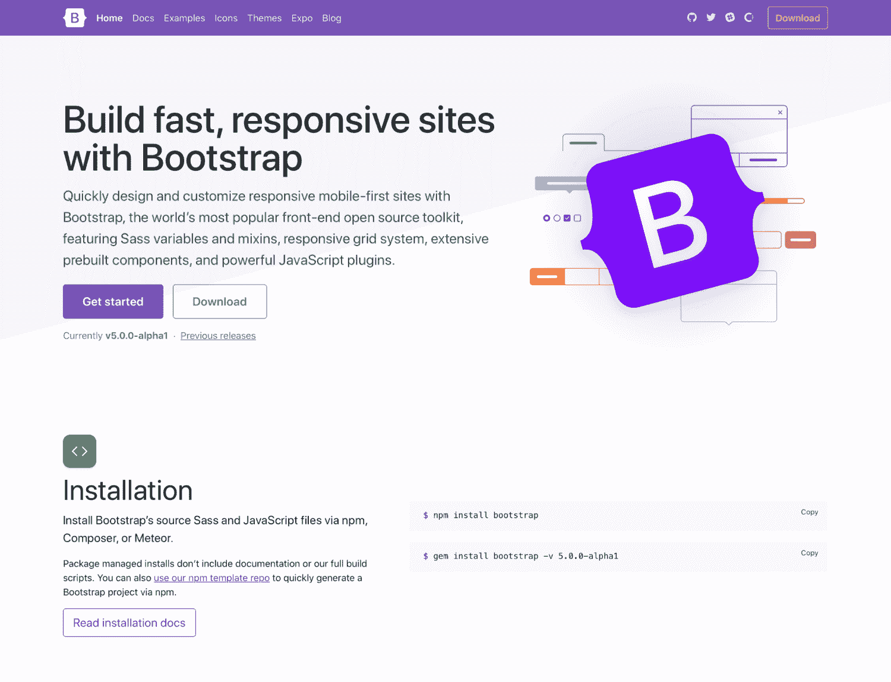
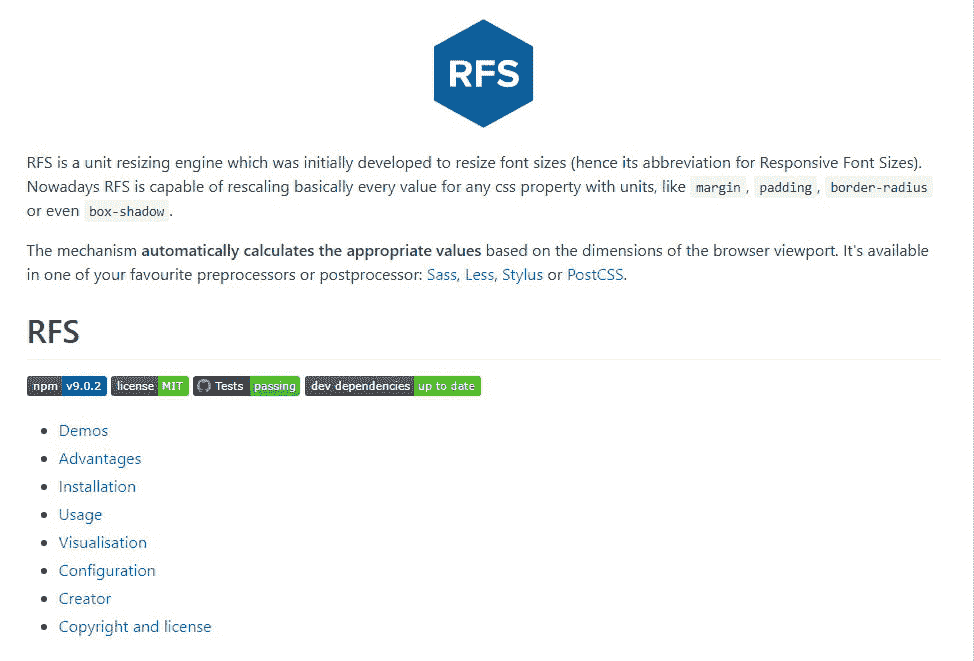
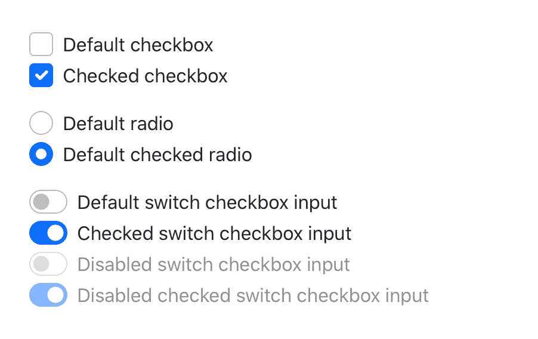
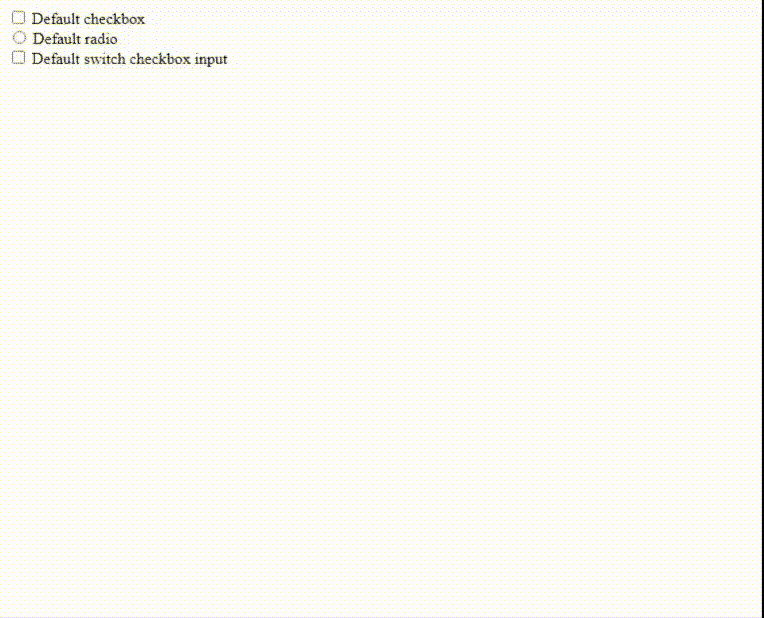
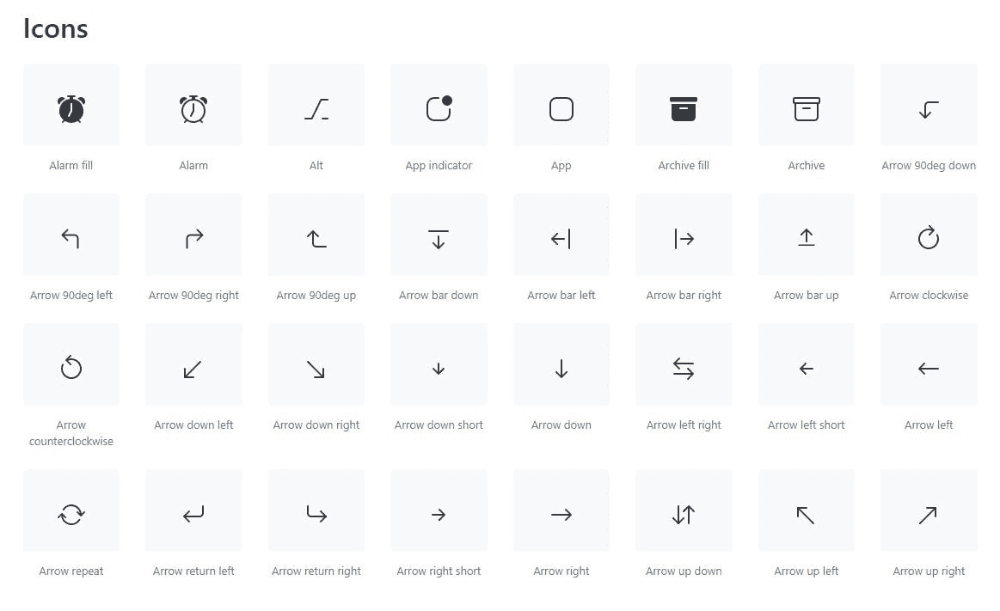

# 自举 5 介绍

> 原文:[https://www.geeksforgeeks.org/bootstrap-5-introduction/](https://www.geeksforgeeks.org/bootstrap-5-introduction/)

**Bootstrap** 是一个免费开源的 CSS 和 JavaScript/jQuery 代码集合，用于创建动态网站布局和 web 应用程序。Bootstrap 是最流行的前端框架之一，它有一组非常好的预定义 CSS 代码。Bootstrap 使用不同类型的类来创建响应性网站。Bootstrap 5 在重新定义其特性几个月后，于 2020 年 6 月 16 日正式发布。

**Bootstrap 5 的一些重要变化:**

**1。官方文档更新:**4 . 5 . 0 版的文档主页外观更新，其他官方文档也有一些改进。Bootstrap 文档的角上有一些很好的填充，使其更易读，并突出其内容。



**2。jQuery 被完全移除:**早期，像**模式、工具提示、popovers** 等引导组件依赖于 jQuery 和 *popper.js* 。 *alpha 5* 版本发布后，Bootstrap 不再依赖 jQuery。虽然 jQuery 已经在 Bootstrap 中使用了 8 年多，但许多开发人员都有一个问题，即 jQuery 给他们带来了对复杂 JavaScript 行为的不均匀访问。他们的 JavaScript 维护者[https://github.com/johann-s](https://github.com/johann-s)使整个过程成为可能

**3。切换到香草 JavaScript:** JavaScript 是网络的编程语言。大多数现代网站都是由 JavaScript 驱动的，所有手机、平板电脑、控制台、桌面上的现代网络浏览器都包括 JavaScript 解释器。放弃 jQuery 的一个主要原因是完全基于现代 JavaScript 标准重新定义框架。

**4。放弃对 Internet Explorer 10 和 11 的支持:** Internet Explorer 是微软在 1995 年发布的。到今天为止，互联网浏览器不再与流行的浏览器相关，如 Chrome、Firefox 和基于 Chrome 构建的微软边缘。当 bootstrap 决定纯粹在*普通 JavaScript* 上改进他们的框架时，他们放弃了对 IE 的支持，因为 IE 与现代 JavaScript 标准不兼容。

**5。响应字体:** Bootstrap 引入了响应字体大小，它将通过 RFS 引擎根据视口大小自动调整排版元素的大小。RFS 引擎是为调整字体大小而开发的。它提供了调整 CSS 属性大小的功能，如“边距”、“填充”、“边框半径”、“框阴影”等。



**6。移除的卡片:**Bootstrap 的新网格系统对布局提供了更灵敏的控制。因此，他们删除了新网格布局可以设计的不必要的额外类。Bootstrap 的旧版本仍然支持卡系统。

**示例:**

## 超文本标记语言

```html
<div class="card-deck">
  <div class="card">
    
    <div class="card-body">
      <h5 class="card-title">Card title</h5>
      <p class="card-text">Sample Card text</p>

      <p class="card-text">
        <small class="text-muted">Sample paragraph</small>
      </p>

    </div>
  </div>
  <div class="card">
    
    <div class="card-body">
      <h5 class="card-title">Card title</h5>
      <p class="card-text">Sample Card text</p>

      <p class="card-text">
        <small class="text-muted">Sample paragraph</small>
      </p>

    </div>
  </div>
  <div class="card">
    
    <div class="card-body">
      <h5 class="card-title">Card title</h5>
      <p class="card-text">Sample Card text</p>

      <p class="card-text">
        <small class="text-muted">Sample paragraph</small>
      </p>

    </div>
  </div>
</div>
```

**7。更新的表单:** Bootstrap 5 引入了一个完全专用于 Bootstrap 表单的部分，改进了文档和组件。它现在有一组表单控件，可以重新设计现有元素，而不是通过伪元素生成新元素。引导表现在看起来更好了。



## 超文本标记语言

```html
<div class="form-check">
  <input class="form-check-input"
    type="checkbox" value=""
    id="flexCheckDefault">
  <label class="form-check-label"
    for="flexCheckDefault">
    Default checkbox
  </label>
</div>

<div class="form-check">
  <input class="form-check-input"
    type="radio" name="flexRadioDefault"
    id="flexRadioDefault1">
  <label class="form-check-label"
    for="flexRadioDefault1">
    Default radio
  </label>
</div>

<div class="form-check form-switch">
  <input class="form-check-input" type="checkbox"
    id="flexSwitchCheckDefault">
  <label class="form-check-label"
    for="flexSwitchCheckDefault">
    Default switch checkbox input
  </label>
</div>
```

**输出:**



**7。新的支持向量机和图标库:** Bootstrap 3 引入了 250 个可重用的图标组件，称为*【图形】*，创建这些组件是为了向*警报**下拉菜单**输入*字段等提供图标。Bootstrap 4 完全删除了*的字体*，因为大多数设计师使用的图标来自网站，如 *Fontawesome、图标 8* 等。否则，他们使用自己创建的 SVG 图标来增强可定制性。Bootstrap 5 发布了一个新的 SVG 图标库，由 Bootstrap 的联合创始人马克·奥托负责。

更多信息请参考此链接:[获取引导](https://icons.getbootstrap.com/)

