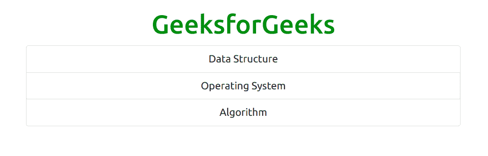
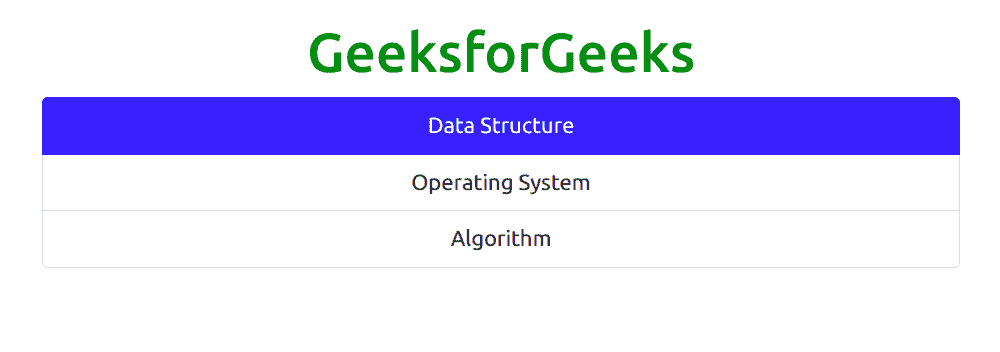
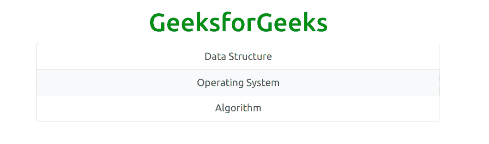
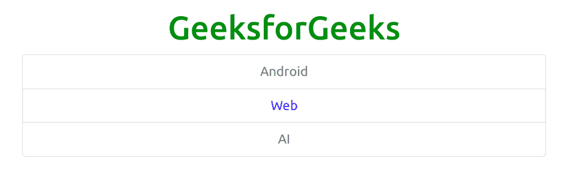
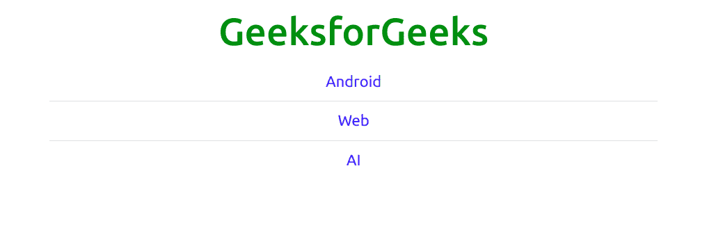
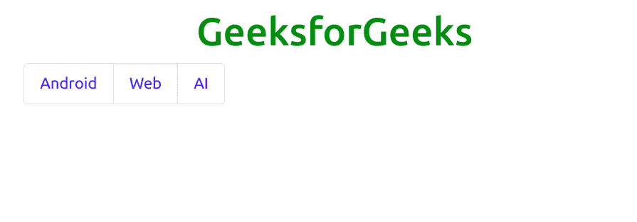
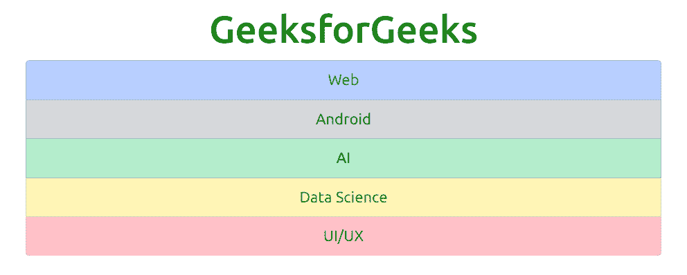
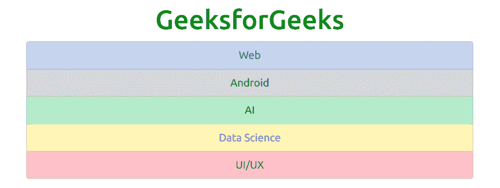
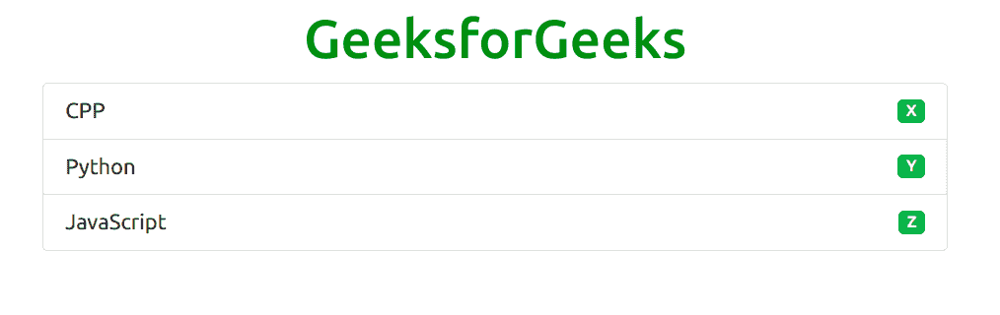

# 引导 5 列表组

> 原文:[https://www.geeksforgeeks.org/bootstrap-5-list-group/](https://www.geeksforgeeks.org/bootstrap-5-list-group/)

Bootstrap 5 是 Bootstrap 的最新主要版本，在该版本中，他们修改了用户界面并进行各种更改。列表组是显示一系列内容的灵活而强大的组件。这些可以修改和扩展，以支持几乎任何内容。使用*。列表组*和*。列表-组-项目*类创建项目列表。*。列表组*类与< ul >元素和*一起使用。列表-组-项目*与< li >元素一起使用。

**语法:**

```
<div class="list-group"> Contents... <div>
```

**示例:**

```
<!DOCTYPE html>
<html>
    <head>
        <!-- Load Bootstrap -->
        <link rel="stylesheet"
              href=
"https://stackpath.bootstrapcdn.com/bootstrap/5.0.0-alpha1/css/bootstrap.min.css" 
              integrity=
"sha384-r4NyP46KrjDleawBgD5tp8Y7UzmLA05oM1iAEQ17CSuDqnUK2+k9luXQOfXJCJ4I" 
              crossorigin="anonymous" />
        <script src=
"https://cdn.jsdelivr.net/npm/popper.js@1.16.0/dist/umd/popper.min.js"
                integrity=
"sha384-Q6E9RHvbIyZFJoft+2mJbHaEWldlvI9IOYy5n3zV9zzTtmI3UksdQRVvoxMfooAo" 
                crossorigin="anonymous"></script>
        <script src=
"https://stackpath.bootstrapcdn.com/bootstrap/5.0.0-alpha1/js/bootstrap.min.js" 
                integrity=
"sha384-oesi62hOLfzrys4LxRF63OJCXdXDipiYWBnvTl9Y9/TRlw5xlKIEHpNyvvDShgf/" 
                crossorigin="anonymous"></script>
    </head>
    <body style="text-align: center;">
        <div class="container mt-3"
             style="width: 700px;">
            <h1 style="color: green;">
                GeeksforGeeks
            </h1>
            <ul class="list-group">
                <li class="list-group-item">
                  Data Structure</li>
                <li class="list-group-item">
                  Operating System</li>
                <li class="list-group-item">
                  Algorithm</li>
            </ul>
        </div>
    </body>
</html>
```

**输出:**



**活动列表项:***。激活*类用于高亮当前项目。
**例:**

```
<!DOCTYPE html>
<html>
    <head>
        <!-- Load Bootstrap -->
        <link rel="stylesheet" 
              href=
"https://stackpath.bootstrapcdn.com/bootstrap/5.0.0-alpha1/css/bootstrap.min.css" 
              integrity=
"sha384-r4NyP46KrjDleawBgD5tp8Y7UzmLA05oM1iAEQ17CSuDqnUK2+k9luXQOfXJCJ4I" 
              crossorigin="anonymous" />
        <script src=
"https://cdn.jsdelivr.net/npm/popper.js@1.16.0/dist/umd/popper.min.js" 
                integrity=
"sha384-Q6E9RHvbIyZFJoft+2mJbHaEWldlvI9IOYy5n3zV9zzTtmI3UksdQRVvoxMfooAo" 
                crossorigin="anonymous"></script>
        <script src=
"https://stackpath.bootstrapcdn.com/bootstrap/5.0.0-alpha1/js/bootstrap.min.js" 
                integrity=
"sha384-oesi62hOLfzrys4LxRF63OJCXdXDipiYWBnvTl9Y9/TRlw5xlKIEHpNyvvDShgf/" 
                crossorigin="anonymous"></script>
    </head>

    <body style="text-align: center;">
        <div class="container mt-3" 
             style="width: 700px;">
            <h1 style="color: green;">
                GeeksforGeeks
            </h1>
            <ul class="list-group">
                <li class="list-group-item active">
                  Data Structure</li>
                <li class="list-group-item">
                  Operating System</li>
                <li class="list-group-item">
                  Algorithm</li>
            </ul>
        </div>
    </body>
</html>
```

**输出:**



**列出带有链接项目的组:**使用< div >和< a >标签代替< ul >和< li >创建带有链接项目的组列表。*。列表-组-项目-动作*类用于设置悬停效果将背景颜色改为灰色。
**例:**

```
<!DOCTYPE html>
<html>
    <head>
        <!-- Load Bootstrap -->
        <link rel="stylesheet" 
              href=
"https://stackpath.bootstrapcdn.com/bootstrap/5.0.0-alpha1/css/bootstrap.min.css" 
              integrity=
"sha384-r4NyP46KrjDleawBgD5tp8Y7UzmLA05oM1iAEQ17CSuDqnUK2+k9luXQOfXJCJ4I" 
              crossorigin="anonymous" />
        <script src=
"https://cdn.jsdelivr.net/npm/popper.js@1.16.0/dist/umd/popper.min.js"
                integrity=
"sha384-Q6E9RHvbIyZFJoft+2mJbHaEWldlvI9IOYy5n3zV9zzTtmI3UksdQRVvoxMfooAo" 
                crossorigin="anonymous"></script>
        <script src=
"https://stackpath.bootstrapcdn.com/bootstrap/5.0.0-alpha1/js/bootstrap.min.js" 
                integrity=
"sha384-oesi62hOLfzrys4LxRF63OJCXdXDipiYWBnvTl9Y9/TRlw5xlKIEHpNyvvDShgf/" 
                crossorigin="anonymous"></script>
    </head>

    <body style="text-align: center;">
        <div class="container mt-3"
             style="width: 700px;">
            <h1 style="color: green;">
                GeeksforGeeks
            </h1>
            <div class="container">
                <div class="list-group">
                    <a href="#"
                       class="list-group-item
                              list-group-item-action">
                        Data Structure
                    </a>

                    <a href="#" 
                       class="list-group-item 
                              list-group-item-action">
                        Operating System
                    </a>

                    <a href="#" 
                       class="list-group-item 
                              list-group-item-action">
                        Algorithm
                    </a>
                </div>
            </div>
        </div>
    </body>
</html>
```

**输出:**



**禁用项目:***。禁用*类用于禁用文本内容。这个类将文本颜色设置为浅色。当在链接上使用时，它将移除悬停效果。
**例:**

```
<!DOCTYPE html>
<html>
    <head>
        <!-- Load Bootstrap -->
        <link rel="stylesheet"
              href=
"https://stackpath.bootstrapcdn.com/bootstrap/5.0.0-alpha1/css/bootstrap.min.css" 
              integrity=
"sha384-r4NyP46KrjDleawBgD5tp8Y7UzmLA05oM1iAEQ17CSuDqnUK2+k9luXQOfXJCJ4I" 
              crossorigin="anonymous" />
        <script src=
"https://cdn.jsdelivr.net/npm/popper.js@1.16.0/dist/umd/popper.min.js" 
                integrity=
"sha384-Q6E9RHvbIyZFJoft+2mJbHaEWldlvI9IOYy5n3zV9zzTtmI3UksdQRVvoxMfooAo"
                crossorigin="anonymous"></script>
        <script src=
"https://stackpath.bootstrapcdn.com/bootstrap/5.0.0-alpha1/js/bootstrap.min.js" 
                integrity=
"sha384-oesi62hOLfzrys4LxRF63OJCXdXDipiYWBnvTl9Y9/TRlw5xlKIEHpNyvvDShgf/" 
                crossorigin="anonymous"></script>
    </head>

    <body style="text-align: center;">
        <div class="container mt-3"
             style="width: 700px;">
            <h1 style="color: green;">
                GeeksforGeeks
            </h1>
            <div class="container">
                <div class="list-group">
                    <a href="#" 
                       class="list-group-item disabled">
                        Android
                    </a>

                    <a href="#" 
                       class="list-group-item">
                        Web
                    </a>

                    <a href="#" 
                       class="list-group-item disabled">
                        AI
                    </a>
                </div>
            </div>
        </div>
    </body>
</html>
```

**输出:**



**清除/移除边框:***。list-group-flush* 类用来去除一些边框和圆角。
**例:**

```
<!DOCTYPE html>
<html>

<head>

    <!-- Load Bootstrap -->
    <link rel="stylesheet" 
          href=
"https://stackpath.bootstrapcdn.com/bootstrap/5.0.0-alpha1/css/bootstrap.min.css"
        integrity=
"sha384-r4NyP46KrjDleawBgD5tp8Y7UzmLA05oM1iAEQ17CSuDqnUK2+k9luXQOfXJCJ4I" 
          crossorigin="anonymous">
    <script src=
"https://cdn.jsdelivr.net/npm/popper.js@1.16.0/dist/umd/popper.min.js"
        integrity=
"sha384-Q6E9RHvbIyZFJoft+2mJbHaEWldlvI9IOYy5n3zV9zzTtmI3UksdQRVvoxMfooAo"
        crossorigin="anonymous"></script>
    <script src=
"https://stackpath.bootstrapcdn.com/bootstrap/5.0.0-alpha1/js/bootstrap.min.js"
        integrity=
"sha384-oesi62hOLfzrys4LxRF63OJCXdXDipiYWBnvTl9Y9/TRlw5xlKIEHpNyvvDShgf/"
        crossorigin="anonymous"></script>
</head>

<body style="text-align:center;">
    <div class="container mt-3" 
         style="width:700px;">
        <h1 style="color:green;">
            GeeksforGeeks
        </h1>
        <div class="container">
            <ul class="list-group
                       list-group-flush">
                <a href="#" 
                   class="list-group-item">
                    Android
                </a>

                <a href="#" 
                   class="list-group-item">
                    Web
                </a>

                <a href="#" 
                   class="list-group-item">
                    AI
                </a>
              </div>
    </div>
  </body>

</html>
```

**输出:**



**横向列表组:***。列表-组-水平*类用于水平显示项目列表，而不是垂直显示。
**例:**

```
<!DOCTYPE html>
<html>

<head>

    <!-- Load Bootstrap -->
    <link rel="stylesheet" 
          href=
"https://stackpath.bootstrapcdn.com/bootstrap/5.0.0-alpha1/css/bootstrap.min.css"
        integrity=
"sha384-r4NyP46KrjDleawBgD5tp8Y7UzmLA05oM1iAEQ17CSuDqnUK2+k9luXQOfXJCJ4I" 
          crossorigin="anonymous">
    <script src=
"https://cdn.jsdelivr.net/npm/popper.js@1.16.0/dist/umd/popper.min.js"
        integrity=
"sha384-Q6E9RHvbIyZFJoft+2mJbHaEWldlvI9IOYy5n3zV9zzTtmI3UksdQRVvoxMfooAo"
        crossorigin="anonymous"></script>
    <script src=
"https://stackpath.bootstrapcdn.com/bootstrap/5.0.0-alpha1/js/bootstrap.min.js"
        integrity=
"sha384-oesi62hOLfzrys4LxRF63OJCXdXDipiYWBnvTl9Y9/TRlw5xlKIEHpNyvvDShgf/"
        crossorigin="anonymous"></script>
</head>

<body style="text-align:center;">
    <div class="container mt-3" 
         style="width:700px;">
        <h1 style="color:green;">
            GeeksforGeeks
        </h1>
        <div class="container">
            <ul class="list-group 
                       list-group-horizontal">
                <a href="#" 
                   class="list-group-item">
                    Android
                </a>

                <a href="#" 
                   class="list-group-item">
                    Web
                </a>

                <a href="#" 
                   class="list-group-item">
                    AI
                </a>
        </div>
    </div>
</body>

</html>
```

**输出:**



**上下文类:**用于设置项目列表的颜色。为列表项目着色的类别有:*。列表-组-项目-成功*、*。列表-组-项目-二级*、*。列表-组-项目-信息*、*。列表-组-项目-警告*，*。列表-组-项目-危险*、*。列表-组-项目-主要*、*。列表-组-项目-深色*和*。列表-组-项目-灯*。

**示例:**

```
<!DOCTYPE html>
<html>
    <head>
        <!-- Load Bootstrap -->
        <link rel="stylesheet"
              href=
"https://stackpath.bootstrapcdn.com/bootstrap/5.0.0-alpha1/css/bootstrap.min.css"
              integrity=
"sha384-r4NyP46KrjDleawBgD5tp8Y7UzmLA05oM1iAEQ17CSuDqnUK2+k9luXQOfXJCJ4I"
              crossorigin="anonymous" />
        <script src=
"https://cdn.jsdelivr.net/npm/popper.js@1.16.0/dist/umd/popper.min.js"
                integrity=
"sha384-Q6E9RHvbIyZFJoft+2mJbHaEWldlvI9IOYy5n3zV9zzTtmI3UksdQRVvoxMfooAo" 
                crossorigin="anonymous"></script>
        <script src=
"https://stackpath.bootstrapcdn.com/bootstrap/5.0.0-alpha1/js/bootstrap.min.js" 
                integrity=
"sha384-oesi62hOLfzrys4LxRF63OJCXdXDipiYWBnvTl9Y9/TRlw5xlKIEHpNyvvDShgf/" 
                crossorigin="anonymous"></script>
    </head>

    <body style="text-align: center;">
        <div class="container mt-3"
             style="width: 700px;">
            <h1 style="color: green;">
                GeeksforGeeks
            </h1>
            <ul class="list-group">
                <li class="list-group-item 
                           list-group-item-primary">
                    Web
                </li>

                <li class="list-group-item 
                           list-group-item-secondary">
                    Android
                </li>

                <li class="list-group-item 
                           list-group-item-success">
                    AI
                </li>

                <li class="list-group-item 
                           list-group-item-warning">
                    Data Science
                </li>

                <li class="list-group-item 
                           list-group-item-danger">
                    UI/UX
                </li>
            </ul>
        </div>
    </body>
</html>
```

**输出:**



**用上下文类链接项目:**上下文类可以与项目列表一起使用。
T3】例:

```
<!DOCTYPE html>
<html>
    <head>
        <!-- Load Bootstrap -->
        <link rel="stylesheet"
              href=
"https://stackpath.bootstrapcdn.com/bootstrap/5.0.0-alpha1/css/bootstrap.min.css"
              integrity=
"sha384-r4NyP46KrjDleawBgD5tp8Y7UzmLA05oM1iAEQ17CSuDqnUK2+k9luXQOfXJCJ4I" 
              crossorigin="anonymous" />
        <script src=
"https://cdn.jsdelivr.net/npm/popper.js@1.16.0/dist/umd/popper.min.js" 
                integrity=
"sha384-Q6E9RHvbIyZFJoft+2mJbHaEWldlvI9IOYy5n3zV9zzTtmI3UksdQRVvoxMfooAo"
                crossorigin="anonymous"></script>
        <script src=
"https://stackpath.bootstrapcdn.com/bootstrap/5.0.0-alpha1/js/bootstrap.min.js" 
                integrity=
"sha384-oesi62hOLfzrys4LxRF63OJCXdXDipiYWBnvTl9Y9/TRlw5xlKIEHpNyvvDShgf/" 
                crossorigin="anonymous"></script>
    </head>

    <body style="text-align: center;">
        <div class="container mt-3" 
             style="width: 700px;">
            <h1 style="color: green;">
                GeeksforGeeks
            </h1>
            <ul class="list-group">
                <a class="list-group-item 
                          list-group-item-primary">
                    Web
                </a>
                <a class="list-group-item
                          list-group-item-secondary">
                    Android
                </a>
                <a class="list-group-item 
                          list-group-item-success">
                    AI
                </a>
                <a class="list-group-item
                          list-group-item-warning">
                    Data Science
                </a>
                <a class="list-group-item 
                          list-group-item-danger">
                    UI/UX
                </a>
            </ul>
        </div>
    </body>
</html>
```

**输出:**



**带徽章的名单组:***。徽章*类可以和效用类结合在组列表里面添加徽章。

**示例:**

```
<!DOCTYPE html>
<html>
    <head>
        <!-- Load Bootstrap -->
        <link rel="stylesheet" 
              href="https://stackpath.bootstrapcdn.com/bootstrap/5.0.0-alpha1/css/bootstrap.min.css" 
              integrity="sha384-r4NyP46KrjDleawBgD5tp8Y7UzmLA05oM1iAEQ17CSuDqnUK2+k9luXQOfXJCJ4I" 
              crossorigin="anonymous" />
        <script src="https://cdn.jsdelivr.net/npm/popper.js@1.16.0/dist/umd/popper.min.js" 
                integrity="sha384-Q6E9RHvbIyZFJoft+2mJbHaEWldlvI9IOYy5n3zV9zzTtmI3UksdQRVvoxMfooAo"
                crossorigin="anonymous"></script>
        <script src="https://stackpath.bootstrapcdn.com/bootstrap/5.0.0-alpha1/js/bootstrap.min.js" 
                integrity="sha384-oesi62hOLfzrys4LxRF63OJCXdXDipiYWBnvTl9Y9/TRlw5xlKIEHpNyvvDShgf/" 
                crossorigin="anonymous"></script>
    </head>

    <body style="text-align: center;">
        <div class="container mt-3" 
             style="width: 700px;">
            <h1 style="color: green;">
                GeeksforGeeks
            </h1>
            <ul class="list-group">
                <li class="list-group-item
                           d-flex 
                           justify-content-between 
                           align-items-center">
                    CPP
                    <span class="badge bg-success">
                      X</span>
                </li>

                <li class="list-group-item 
                           d-flex 
                           justify-content-between 
                           align-items-center">
                    Python
                    <span class="badge bg-success">
                      Y</span>
                </li>

                <li class="list-group-item d-flex 
                           justify-content-between 
                           align-items-center">
                    JavaScript
                    <span class="badge bg-success">
                      Z</span>
                </li>
            </ul>
        </div>
    </body>
</html>
```

**输出:**

